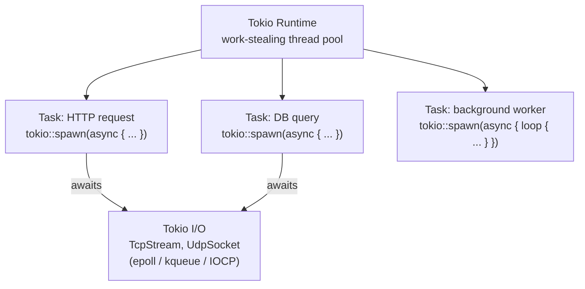

# Async & Tokio

## Category
Rust, Async, Tokio, Futures, Concurrency

## Context

Rust's async model is based on **zero-cost `Future`s**. An `async fn` returns a `Future` — a state machine generated at compile time that drives itself to completion when polled. **Tokio** is the dominant async runtime: it provides an M:N thread pool, async I/O, timers, channels, and task spawning.

| Concept | Description |
|---------|-------------|
| `async fn` / `.await` | Write async code in synchronous style |
| `Future` | A lazy computation — does nothing until `.await`ed or polled |
| Tokio runtime | Drives futures; manages I/O event loop and thread pool |
| `tokio::spawn` | Spawn a task (like a goroutine); returns `JoinHandle` |
| `tokio::sync` | Async-aware channels (`mpsc`, `broadcast`, `oneshot`) and locks |
| `tokio::select!` | Wait on multiple futures; proceed on whichever completes first |
| `tokio::time` | `sleep`, `timeout`, `interval` |

### Tokio runtime flavours

| Flavour | Use case |
|---------|---------|
| Multi-thread (default) | I/O-bound services with many concurrent tasks |
| Current-thread | Single-threaded; `!Send` futures; WASM |

---

## Pros

- Zero-cost async: the generated state machine has no heap allocation per `.await` point (in most cases).
- Tokio's work-stealing scheduler saturates all CPU cores for I/O-heavy workloads.
- `tokio::select!` handles fan-in elegantly — listen on a channel and a cancellation signal simultaneously.
- Structured concurrency via `JoinSet` — track spawned tasks and cancel/join them as a group.
- `tokio-util::task::TaskTracker` provides life-cycle management for background worker sets.

---

## Cons

- `async` is viral: calling an `async fn` requires being in an `async` context all the way up to the runtime entry point.
- Futures are `!Send` by default if they hold non-`Send` values across `.await` — `Arc<Mutex<T>>` is needed for sharing.
- Long blocking operations (`std::fs`, heavy CPU work) must run in `tokio::task::spawn_blocking` to avoid starving the async executor.
- Debugging async stack traces is harder — async stack frames show generated state machine internals.
- `tokio::sync::Mutex` is slower than `std::sync::Mutex` for non-contended cases — prefer `std::sync::Mutex` when the guard is not held across `.await`.

---

## Design Diagram



---

## Code Sample

### Tokio runtime entry point

```rust
// src/main.rs
#[tokio::main]
async fn main() -> anyhow::Result<()> {
    tracing_subscriber::fmt::init();

    let pool = sqlx::PgPool::connect(&std::env::var("DATABASE_URL")?).await?;
    let app = crate::handler::router(pool);

    let listener = tokio::net::TcpListener::bind("0.0.0.0:8080").await?;
    tracing::info!("listening on {}", listener.local_addr()?);

    axum::serve(listener, app)
        .with_graceful_shutdown(shutdown_signal())
        .await?;
    Ok(())
}

async fn shutdown_signal() {
    let ctrl_c = async { tokio::signal::ctrl_c().await.expect("ctrl-c handler") };
    #[cfg(unix)]
    let terminate = async {
        tokio::signal::unix::signal(tokio::signal::unix::SignalKind::terminate())
            .expect("SIGTERM handler")
            .recv()
            .await;
    };
    #[cfg(not(unix))]
    let terminate = std::future::pending::<()>();

    tokio::select! {
        _ = ctrl_c => {},
        _ = terminate => {},
    }
}
```

### Spawning tasks and joining results

```rust
use tokio::task::JoinSet;

async fn fetch_all(ids: Vec<OrderId>, repo: Arc<dyn OrderRepo>) -> Vec<Result<Order, OrderError>> {
    let mut set = JoinSet::new();

    for id in ids {
        let repo = Arc::clone(&repo);
        set.spawn(async move { repo.find_by_id(&id).await });
    }

    let mut results = Vec::new();
    while let Some(res) = set.join_next().await {
        results.push(res.expect("task panicked"));
    }
    results
}
```

### select! — race a timeout against a channel

```rust
use tokio::sync::mpsc;
use tokio::time::{timeout, Duration};

async fn process_with_timeout(
    rx: &mut mpsc::Receiver<Job>,
    timeout_secs: u64,
) -> Option<Job> {
    tokio::select! {
        Some(job) = rx.recv() => Some(job),
        _ = tokio::time::sleep(Duration::from_secs(timeout_secs)) => None,
    }
}
```

### Async channels — producer / consumer

```rust
use tokio::sync::mpsc;

async fn run_pipeline() {
    let (tx, mut rx) = mpsc::channel::<Order>(100);  // bounded channel

    // Producer task
    tokio::spawn(async move {
        for i in 0..100 {
            let order = create_order(i);
            tx.send(order).await.expect("receiver dropped");
        }
    });

    // Consumer
    while let Some(order) = rx.recv().await {
        process_order(order).await;
    }
}

// broadcast — fan-out to multiple consumers
use tokio::sync::broadcast;

let (tx, _) = broadcast::channel::<Event>(16);
let mut rx1 = tx.subscribe();
let mut rx2 = tx.subscribe();
tokio::spawn(async move { while let Ok(e) = rx1.recv().await { handle(e).await } });
tokio::spawn(async move { while let Ok(e) = rx2.recv().await { audit(e).await } });
```

### spawn_blocking — run CPU-heavy or blocking std code

```rust
async fn hash_password(password: String) -> anyhow::Result<String> {
    // bcrypt is blocking — must not run on the async executor thread
    tokio::task::spawn_blocking(move || {
        bcrypt::hash(&password, 12).map_err(anyhow::Error::from)
    })
    .await?  // outer ? unwraps JoinError (panic); inner ? unwraps bcrypt::Error
}
```

---

## Related

- [07 — Concurrency](./07-concurrency.md) — `Arc<Mutex<T>>`, `RwLock`, `rayon` for CPU parallelism
- [06 — HTTP Services](./06-http-services.md) — Axum runs on Tokio; all handlers are `async fn`
- [10 — Database Patterns](./10-database-patterns.md) — `sqlx` is fully async, uses Tokio internally
