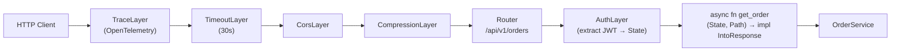

# HTTP Services — Axum

## Category
Rust, HTTP, Axum, REST, Middleware

## Context

**Axum** is the dominant HTTP framework in the Rust ecosystem. It is built on `hyper` + `tower` and integrates naturally with Tokio. **Extractors** declaratively deserialise request parts; **`tower::Layer`** middleware composes cross-cutting concerns.

| Library | Role |
|---------|------|
| `axum` | Router, extractors, response helpers |
| `hyper` | Low-level HTTP/1.1 and HTTP/2 (used by Axum internally) |
| `tower` | Middleware abstraction (`Layer`, `Service`) |
| `tower-http` | Production-ready middleware: `TraceLayer`, `CompressionLayer`, `CorsLayer`, `TimeoutLayer` |
| `serde` + `serde_json` | JSON serialisation / deserialisation |
| `validator` | Struct-level input validation |

---

## Pros

- Axum's extractor system (`Json<T>`, `Path<T>`, `Query<T>`, `State<T>`) removes boilerplate from handlers — each handler declares exactly what it needs.
- `tower::Layer` middleware is composable and reusable across frameworks (Axum, tonic, etc.).
- `IntoResponse` trait on error types integrates domain errors into HTTP responses with zero boilerplate in handlers.
- Graceful shutdown via `axum::serve(...).with_graceful_shutdown(signal)` drains in-flight requests.
- Compile-time handler type checking: wrong extractor types are caught before running.

---

## Cons

- `tower::Layer` is complex — implementing a custom layer requires understanding `tower::Service` and `tower::Layer` traits.
- Shared state (`State<T>`) must be `Clone + Send + Sync + 'static` — wrap in `Arc<T>` for non-`Clone` types.
- Large handler files — consider splitting routes into sub-routers with `Router::merge`.
- Dynamic routing (e.g., plugin-based path registration at runtime) is not a first-class Axum feature.
- `Multipart` form handling requires extra care to avoid file upload size attacks — always set limits.

---

## Design Diagram



---

## Code Sample

### Router setup

```rust
// src/handler/mod.rs
use axum::{Router, routing::{get, post}};
use tower_http::{
    cors::CorsLayer,
    timeout::TimeoutLayer,
    trace::TraceLayer,
    compression::CompressionLayer,
};
use std::{sync::Arc, time::Duration};

pub struct AppState {
    pub order_svc: Arc<dyn OrderService>,
}

pub fn router(state: AppState) -> Router {
    Router::new()
        .route("/api/v1/orders/:id", get(order_handler::get_order))
        .route("/api/v1/orders",     post(order_handler::create_order))
        .layer(
            tower::ServiceBuilder::new()
                .layer(TraceLayer::new_for_http())
                .layer(TimeoutLayer::new(Duration::from_secs(30)))
                .layer(CorsLayer::permissive())
                .layer(CompressionLayer::new()),
        )
        .with_state(Arc::new(state))
}
```

### Handler with extractors

```rust
// src/handler/order.rs
use axum::{
    extract::{Path, State},
    http::StatusCode,
    response::IntoResponse,
    Json,
};
use std::sync::Arc;
use validator::Validate;

use crate::{domain::OrderError, handler::AppState};

pub async fn get_order(
    State(state): State<Arc<AppState>>,
    Path(id): Path<String>,
) -> Result<Json<Order>, OrderError> {
    let order_id = OrderId(id.parse()?);
    let order = state.order_svc.get_order(&order_id).await?;
    Ok(Json(order))
}

#[derive(Debug, serde::Deserialize, Validate)]
pub struct CreateOrderRequest {
    #[validate(length(min = 1))]
    pub customer_id: String,

    #[validate(range(min = 1))]
    pub amount_cents: i64,

    #[validate(length(equal = 3))]
    pub currency: String,
}

pub async fn create_order(
    State(state): State<Arc<AppState>>,
    Json(req): Json<CreateOrderRequest>,
) -> Result<(StatusCode, Json<Order>), OrderError> {
    req.validate().map_err(|e| OrderError::Validation(e.to_string()))?;
    let order = state.order_svc.create_order(req.into()).await?;
    Ok((StatusCode::CREATED, Json(order)))
}
```

### IntoResponse on error type (zero handler boilerplate)

```rust
// src/domain/error.rs
use axum::{http::StatusCode, response::{IntoResponse, Response}, Json};
use serde_json::json;

impl IntoResponse for OrderError {
    fn into_response(self) -> Response {
        let (status, code, message) = match &self {
            OrderError::NotFound { id } =>
                (StatusCode::NOT_FOUND, "NOT_FOUND", format!("order {id} not found")),
            OrderError::Conflict { key } =>
                (StatusCode::CONFLICT, "CONFLICT", format!("duplicate key {key}")),
            OrderError::Validation(msg) =>
                (StatusCode::UNPROCESSABLE_ENTITY, "VALIDATION", msg.clone()),
            OrderError::Database(e) => {
                tracing::error!("database error: {e}");
                (StatusCode::INTERNAL_SERVER_ERROR, "INTERNAL", "internal error".to_string())
            }
            _ => (StatusCode::INTERNAL_SERVER_ERROR, "INTERNAL", "internal error".to_string()),
        };
        (status, Json(json!({ "error": { "code": code, "message": message } }))).into_response()
    }
}
```

### Custom extractor — authenticated principal

```rust
// src/extractor/auth.rs
use axum::{async_trait, extract::FromRequestParts, http::{request::Parts, StatusCode}};

pub struct AuthenticatedUser {
    pub user_id: String,
    pub roles: Vec<String>,
}

#[async_trait]
impl<S: Send + Sync> FromRequestParts<S> for AuthenticatedUser {
    type Rejection = (StatusCode, &'static str);

    async fn from_request_parts(parts: &mut Parts, _state: &S) -> Result<Self, Self::Rejection> {
        let token = parts
            .headers
            .get("Authorization")
            .and_then(|v| v.to_str().ok())
            .and_then(|v| v.strip_prefix("Bearer "))
            .ok_or((StatusCode::UNAUTHORIZED, "missing bearer token"))?;

        verify_jwt(token).map_err(|_| (StatusCode::UNAUTHORIZED, "invalid token"))
    }
}

// Handler uses it automatically:
pub async fn create_order(
    user: AuthenticatedUser,
    State(state): State<Arc<AppState>>,
    Json(req): Json<CreateOrderRequest>,
) -> Result<(StatusCode, Json<Order>), OrderError> { ... }
```

---

## Related

- [05 — Async & Tokio](./05-async-tokio.md) — Axum handlers are async; Tokio is the runtime
- [03 — Error Handling](./03-error-handling.md) — `IntoResponse` on `OrderError` maps domain errors to HTTP status codes
- [10 — Database Patterns](./10-database-patterns.md) — `sqlx::PgPool` injected via `State`
- [15 — Security Patterns](./15-security-patterns.md) — JWT extractor and rate-limiting middleware
