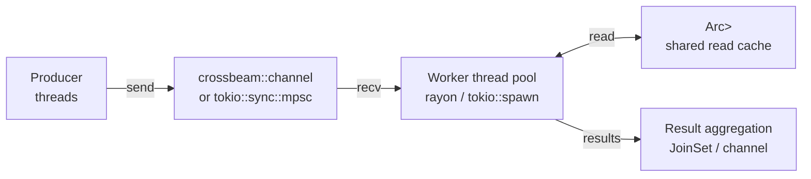

# Concurrency

## Category
Rust, Concurrency, Arc, Mutex, Channels, Rayon

## Context

Rust's ownership and type system enforce **fearless concurrency** at compile time. `Send` and `Sync` marker traits — enforced by the compiler — ensure data is only shared safely across threads. No data race is possible in safe Rust.

| Primitive | Use case |
|-----------|---------|
| `std::thread::spawn` | OS threads — CPU-bound work |
| `Arc<T>` | Shared ownership across threads (atomic reference count) |
| `Arc<Mutex<T>>` | Shared mutable state — exclusive access |
| `Arc<RwLock<T>>` | Shared read-mostly state — multiple readers or one writer |
| `std::sync::mpsc` | Single-producer/multi-consumer channel (standard library) |
| `tokio::sync::mpsc` | Async multi-producer/single-consumer channel |
| `tokio::sync::broadcast` | Async fan-out: one sender, many receivers |
| `rayon` | Data-parallel iteration — `.par_iter()` |
| `crossbeam` | Lock-free queues, channels, scoped threads |

### Send and Sync

- `Send`: a type whose ownership can be moved to another thread.
- `Sync`: a type whose reference (`&T`) can be shared across threads.
- `Arc<T>` is `Send + Sync` when `T: Send + Sync`.
- `Rc<T>` / `RefCell<T>` are **not** `Send` — compile error if you try to move them across threads.

---

## Pros

- Data races are a compile error in safe Rust — the type system enforces exclusive access.
- `rayon` parallelises iterator chains by replacing `.iter()` with `.par_iter()` — near-zero boilerplate.
- `Arc<RwLock<T>>` allows many concurrent readers with no contention — ideal for read-caches.
- `crossbeam::channel` is faster than `std::sync::mpsc` for high-throughput pipelines.
- Scoped threads (`std::thread::scope`) allow borrowing stack data across threads without `Arc`.

---

## Cons

- `Arc<Mutex<T>>` can deadlock if multiple mutexes are acquired in inconsistent order.
- Holding a `MutexGuard` across an `.await` point causes a compile error (guard is not `Send`) — use `tokio::sync::Mutex` or drop the guard before `.await`.
- `rayon` introduces its own global thread pool which conflicts with Tokio's async executor — do not mix `.par_iter()` inside `async fn`; use `tokio::task::spawn_blocking`.
- Lock poisoning: if a thread panics while holding a `Mutex`, the lock is poisoned — subsequent calls return `Err`; handle with `.unwrap_or_else(|e| e.into_inner())`.
- Atomics (`std::sync::atomic`) are fast but require careful ordering — prefer `Mutex` unless profiling shows contention.

---

## Design Diagram



---

## Code Sample

### Shared state with Arc + Mutex

```rust
use std::sync::{Arc, Mutex};
use std::collections::HashMap;

#[derive(Clone)]
pub struct OrderCache {
    inner: Arc<Mutex<HashMap<String, Order>>>,
}

impl OrderCache {
    pub fn new() -> Self {
        Self { inner: Arc::new(Mutex::new(HashMap::new())) }
    }

    pub fn get(&self, id: &str) -> Option<Order> {
        self.inner.lock().unwrap().get(id).cloned()
    }

    pub fn insert(&self, id: String, order: Order) {
        self.inner.lock().unwrap().insert(id, order);
    }
}
```

### Arc + RwLock — read-heavy cache

```rust
use std::sync::{Arc, RwLock};

#[derive(Clone)]
pub struct ConfigCache {
    inner: Arc<RwLock<Config>>,
}

impl ConfigCache {
    pub fn get_feature_flag(&self, key: &str) -> bool {
        // Many concurrent readers — no contention
        self.inner.read().unwrap().feature_flags.get(key).copied().unwrap_or(false)
    }

    pub fn refresh(&self, new_config: Config) {
        // Exclusive write — blocks all readers briefly
        *self.inner.write().unwrap() = new_config;
    }
}
```

### rayon — parallel data processing

```rust
use rayon::prelude::*;

fn process_orders(orders: Vec<Order>) -> Vec<ProcessedOrder> {
    orders
        .into_par_iter()           // parallel iterator — uses rayon's thread pool
        .filter(|o| o.amount > 0)
        .map(|o| process(o))
        .collect()
}

// Parallel sum
let total: i64 = orders.par_iter().map(|o| o.amount).sum();
```

### crossbeam — scoped threads with borrowed data

```rust
use crossbeam::thread;

fn parallel_transform(data: &[Order]) -> Vec<ProcessedOrder> {
    let (tx, rx) = crossbeam::channel::bounded(data.len());

    thread::scope(|s| {
        for chunk in data.chunks(data.len() / 4) {
            let tx = tx.clone();
            s.spawn(move |_| {
                for order in chunk {
                    tx.send(process(order)).unwrap();
                }
            });
        }
    }).unwrap();

    drop(tx);  // Signal no more senders
    rx.iter().collect()
}
```

### tokio::sync::Mutex — async-aware (holds across .await)

```rust
use tokio::sync::Mutex;
use std::sync::Arc;

#[derive(Clone)]
struct RequestLimiter {
    counts: Arc<Mutex<HashMap<String, u32>>>,
}

impl RequestLimiter {
    async fn check_and_increment(&self, key: &str) -> bool {
        let mut counts = self.counts.lock().await;  // async lock — can hold across .await
        let count = counts.entry(key.to_string()).or_insert(0);
        *count += 1;
        *count <= 100
    }
}
```

---

## Related

- [05 — Async & Tokio](./05-async-tokio.md) — async tasks, `JoinSet`, `tokio::sync` channels
- [01 — Ownership & Borrowing](./01-ownership-borrowing.md) — `Send`/`Sync` build on ownership rules
- [14 — Performance & Profiling](./14-performance-profiling.md) — profiling lock contention with `tokio-console` and `perf`
