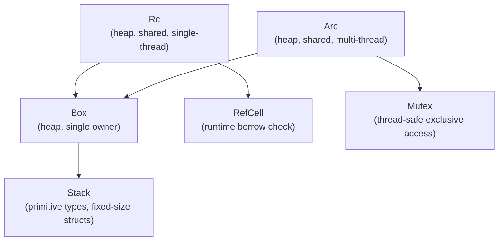

# Memory Management

## Category
Rust, Memory, Box, Rc, Arc, Interior Mutability

## Context

Rust manages memory without a garbage collector. The **ownership system** handles stack-allocated values; **smart pointers** handle heap-allocated data with explicit sharing and mutation rules.

| Smart pointer | Ownership | Thread-safe | Mutability |
|--------------|-----------|-------------|-----------|
| `Box<T>` | Single owner, heap | ✅ (when `T: Send`) | Via exclusive ownership |
| `Rc<T>` | Shared, single-thread | ❌ | Via `RefCell<T>` |
| `Arc<T>` | Shared, multi-thread | ✅ | Via `Mutex<T>` / `RwLock<T>` |
| `Cell<T>` | Single owner | ❌ | Interior mutability (Copy types) |
| `RefCell<T>` | Single owner | ❌ | Runtime-checked borrow |
| `Weak<T>` | Non-owning reference to `Rc`/`Arc` | — | Break reference cycles |

### Interior mutability

Rust normally forbids mutating through shared references. **Interior mutability** types (`Cell`, `RefCell`, `Mutex`, `RwLock`, `AtomicXxx`) allow controlled mutation through `&T` by shifting borrow checking from compile time to either runtime (`RefCell`) or hardware atomics (`Atomic*`).

---

## Pros

- `Box<T>` enables recursive types (`enum Tree { Leaf, Node(Box<Tree>, Box<Tree>) }`) and trait objects (`Box<dyn Trait>`).
- `Arc<T>` reference counting is lock-free (atomic) — increment/decrement without a mutex.
- `RefCell<T>` provides runtime borrow checking — useful for graph-like structures where compile-time borrow tracking is impractical.
- `Weak<T>` breaks reference cycles in graph structures (e.g., parent/child bidirectional links).
- `Cell<T>` allows mutation of `Copy` types through shared references with zero overhead.

---

## Cons

- `RefCell<T>` runtime borrow violations `panic!` instead of being caught at compile time — use in single-threaded contexts with clear borrow discipline.
- `Rc<RefCell<T>>` is verbose and signals a complex ownership model — consider restructuring data ownership instead.
- `Arc<T>` cloning increments a reference count — high-frequency cloning in hot paths adds overhead (prefer borrowing).
- Circular `Arc` references leak memory — use `Weak<T>` for back-references.
- `Box<dyn Trait>` (dynamic dispatch) introduces an indirection — prefer `impl Trait` for single concrete types.

---

## Design Diagram



---

## Code Sample

### Box — heap allocation and recursive types

```rust
// Recursive enum requires Box for known size
#[derive(Debug)]
enum List<T> {
    Cons(T, Box<List<T>>),
    Nil,
}

fn main() {
    let list = List::Cons(1, Box::new(List::Cons(2, Box::new(List::Nil))));
    println!("{list:?}");
}

// Trait object — runtime polymorphism
fn make_processor(use_json: bool) -> Box<dyn Processor> {
    if use_json {
        Box::new(JsonProcessor::new())
    } else {
        Box::new(BinaryProcessor::new())
    }
}
```

### Rc + RefCell — shared mutable single-threaded graph

```rust
use std::rc::Rc;
use std::cell::RefCell;

#[derive(Debug)]
struct Node {
    value: i32,
    children: Vec<Rc<RefCell<Node>>>,
}

fn main() {
    let root = Rc::new(RefCell::new(Node { value: 1, children: vec![] }));
    let child = Rc::new(RefCell::new(Node { value: 2, children: vec![] }));

    // Borrow root mutably to add a child
    root.borrow_mut().children.push(Rc::clone(&child));

    // Borrow root immutably to read
    println!("root: {:?}", root.borrow().value);
}
```

### Arc + weak reference — break cycles

```rust
use std::sync::{Arc, Weak, Mutex};

struct Parent {
    children: Vec<Arc<Child>>,
}

struct Child {
    parent: Weak<Mutex<Parent>>,  // Weak — does not prevent Parent from being dropped
    name: String,
}

impl Child {
    fn visit_parent(&self) {
        if let Some(parent) = self.parent.upgrade() {
            // parent is now a temporary Arc — safe to use
            let p = parent.lock().unwrap();
            println!("child {} has {} siblings", self.name, p.children.len());
        }
        // Arc dropped here — Weak does not keep parent alive
    }
}
```

### Cell — zero-overhead interior mutability for Copy types

```rust
use std::cell::Cell;

struct Counter {
    count: Cell<u32>,   // mutation allowed through &self
}

impl Counter {
    fn increment(&self) { self.count.set(self.count.get() + 1); }
    fn get(&self) -> u32 { self.count.get() }
}
```

### Atomics — lock-free counters

```rust
use std::sync::atomic::{AtomicU64, Ordering};
use std::sync::Arc;

#[derive(Clone)]
struct Metrics {
    requests: Arc<AtomicU64>,
    errors:   Arc<AtomicU64>,
}

impl Metrics {
    pub fn record_request(&self) {
        self.requests.fetch_add(1, Ordering::Relaxed);
    }
    pub fn record_error(&self) {
        self.errors.fetch_add(1, Ordering::Relaxed);
    }
    pub fn request_count(&self) -> u64 {
        self.requests.load(Ordering::Relaxed)
    }
}
```

---

## Related

- [01 — Ownership & Borrowing](./01-ownership-borrowing.md) — smart pointers extend the ownership model
- [07 — Concurrency](./07-concurrency.md) — `Arc<Mutex<T>>` and `Arc<RwLock<T>>` for multi-thread sharing
- [12 — FFI & Unsafe](./12-ffi-unsafe.md) — raw pointers and `unsafe` when interfacing with C memory
