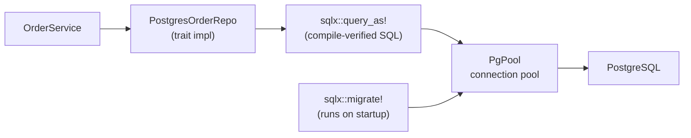

# Database Patterns

## Category
Rust, Database, sqlx, PostgreSQL, Migrations

## Context

**`sqlx`** is the dominant Rust database library — compile-time verified SQL queries, async, and no ORM overhead. **`SeaORM`** provides an active-record ORM if query generation is preferred. Migrations are typically managed with `sqlx migrate` (embedded) or `refinery`.

| Tool | Style | Best for |
|------|-------|---------|
| `sqlx` | Macro-verified raw SQL | Type-safe queries with full SQL control |
| `SeaORM` | Async ORM | CRUD-heavy services; query builder |
| `diesel` | Sync ORM + DSL | Strong type safety; embedded/small footprint |
| `sqlx migrate` | SQL migration files | Embedded migrations running at service startup |

### sqlx compile-time query checking

`sqlx::query!` and `sqlx::query_as!` connect to a real database at **compile time** (or use an offline snapshot via `sqlx prepare`) to verify column names, types, and query syntax — no runtime SQL errors.

```bash
cargo install sqlx-cli
sqlx database create
sqlx migrate run
cargo sqlx prepare   # generate offline query cache (.sqlx/)
```

---

## Pros

- `sqlx::query_as!` maps query results directly to a Rust struct — no manual mapping, verified at compile time.
- `PgPool` is async and maintains a connection pool with configurable min/max connections and health checks.
- `sqlx::Transaction` wraps multiple queries in an ACID transaction and rolls back on `Drop` if not committed.
- Embedded migrations via `sqlx::migrate!("./migrations")` run at startup — no separate migration step in CI.
- `sqlx` supports `LISTEN/NOTIFY` for Postgres pub-sub without a separate message broker.

---

## Cons

- `sqlx::query!` requires a live database or `sqlx prepare` snapshot at compile time — adds CI complexity.
- No query builder — complex dynamic queries (`WHERE` clauses built from optional filters) require string building or `sea-query`.
- `diesel` is synchronous — does not work with Tokio async handlers without `spawn_blocking`.
- `SeaORM` generates verbose SQL for complex joins — inspect generated queries in production.
- Connection pool exhaustion under load causes task queuing — tune `max_connections` and set `acquire_timeout`.

---

## Design Diagram



---

## Code Sample

### PgPool setup

```rust
// src/repository/db.rs
use sqlx::postgres::{PgPool, PgPoolOptions};
use std::time::Duration;

pub async fn create_pool(database_url: &str) -> anyhow::Result<PgPool> {
    let pool = PgPoolOptions::new()
        .max_connections(25)
        .min_connections(5)
        .acquire_timeout(Duration::from_secs(5))
        .idle_timeout(Duration::from_secs(300))
        .max_lifetime(Duration::from_secs(1800))
        .connect(database_url)
        .await?;

    // Run embedded migrations before returning the pool
    sqlx::migrate!("./migrations").run(&pool).await?;

    Ok(pool)
}
```

### sqlx::query_as! — compile-time verified

```rust
// src/repository/order.rs
use sqlx::PgPool;
use crate::domain::{Order, OrderError, OrderId, OrderStatus};

#[derive(sqlx::FromRow)]
struct OrderRow {
    id: uuid::Uuid,
    customer_id: uuid::Uuid,
    amount_cents: i64,
    currency: String,
    status: String,
    created_at: chrono::DateTime<chrono::Utc>,
}

pub struct PostgresOrderRepo {
    pool: PgPool,
}

impl PostgresOrderRepo {
    pub fn new(pool: PgPool) -> Self { Self { pool } }

    pub async fn find_by_id(&self, id: &OrderId) -> Result<Order, OrderError> {
        sqlx::query_as!(
            OrderRow,
            "SELECT id, customer_id, amount_cents, currency, status, created_at
             FROM orders WHERE id = $1",
            id.0
        )
        .fetch_optional(&self.pool)
        .await
        .map_err(OrderError::Database)?
        .ok_or_else(|| OrderError::NotFound { id: id.0.to_string() })
        .map(Order::from)
    }

    pub async fn list_by_customer(
        &self,
        customer_id: &uuid::Uuid,
        limit: i64,
    ) -> Result<Vec<Order>, OrderError> {
        sqlx::query_as!(
            OrderRow,
            "SELECT id, customer_id, amount_cents, currency, status, created_at
             FROM orders WHERE customer_id = $1
             ORDER BY created_at DESC LIMIT $2",
            customer_id,
            limit,
        )
        .fetch_all(&self.pool)
        .await
        .map_err(OrderError::Database)
        .map(|rows| rows.into_iter().map(Order::from).collect())
    }
}
```

### Transaction — atomic multi-step operation

```rust
pub async fn create_order_and_debit(
    pool: &PgPool,
    order: &Order,
    customer_id: &uuid::Uuid,
    amount: i64,
) -> Result<(), OrderError> {
    let mut tx = pool.begin().await.map_err(OrderError::Database)?;

    sqlx::query!(
        "INSERT INTO orders (id, customer_id, amount_cents, currency, status)
         VALUES ($1, $2, $3, $4, 'pending')",
        order.id.0, customer_id, amount, &order.currency
    )
    .execute(&mut *tx)
    .await
    .map_err(OrderError::Database)?;

    sqlx::query!(
        "UPDATE customer_balances SET balance = balance - $1 WHERE customer_id = $2",
        amount, customer_id
    )
    .execute(&mut *tx)
    .await
    .map_err(OrderError::Database)?;

    tx.commit().await.map_err(OrderError::Database)?;
    // If commit is not reached, tx.drop() rolls back automatically
    Ok(())
}
```

### Migration files

```sql
-- migrations/20240101000000_create_orders.sql
CREATE TABLE orders (
    id          UUID PRIMARY KEY,
    customer_id UUID NOT NULL,
    amount_cents BIGINT NOT NULL CHECK (amount_cents > 0),
    currency    CHAR(3) NOT NULL,
    status      TEXT NOT NULL DEFAULT 'pending',
    created_at  TIMESTAMPTZ NOT NULL DEFAULT now()
);

CREATE INDEX idx_orders_customer_id ON orders(customer_id);
CREATE INDEX idx_orders_status ON orders(status) WHERE status NOT IN ('delivered', 'cancelled');
```

```bash
# Generate offline query metadata (for CI without a live DB)
DATABASE_URL=postgres://localhost/mydb cargo sqlx prepare
# Commit .sqlx/ directory to version control
```

---

## Related

- [05 — Async & Tokio](./05-async-tokio.md) — `sqlx` is fully async; `PgPool` is `Clone + Send + Sync`
- [03 — Error Handling](./03-error-handling.md) — `sqlx::Error` mapped to domain `OrderError` via `#[from]`
- [09 — Testing](./09-testing.md) — testcontainers spins up real Postgres for integration tests
