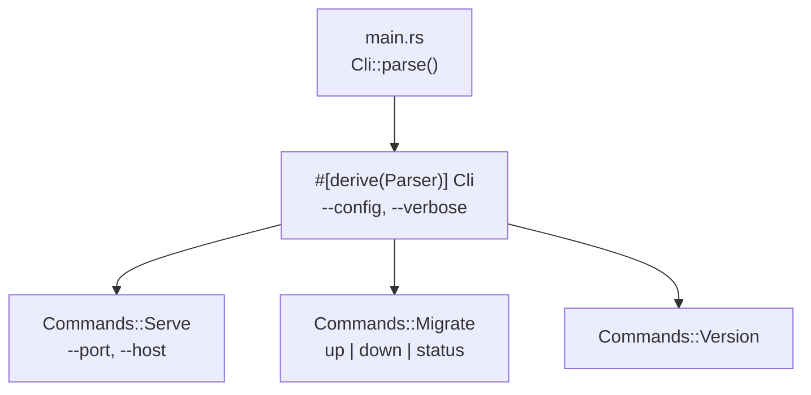

# CLI Tooling

## Category
Rust, CLI, clap, Configuration, TUI

## Context

Rust excels at CLI tools: zero-runtime-dependency static binaries, fast startup, and expressive argument parsing. **`clap`** is the standard for argument parsing; **`indicatif`** for progress bars; **`dialoguer`** for interactive prompts; **`config`** + **`serde`** for layered configuration.

| Library | Purpose |
|---------|---------|
| `clap` (derive API) | Argument parsing, subcommands, shell completion |
| `indicatif` | Progress bars and spinners |
| `dialoguer` | Interactive prompts (select, confirm, input) |
| `console` | Terminal styling, colour, cursor control |
| `config` | Layered configuration (file + env + defaults) |
| `serde` | Deserialise config into typed structs |
| `ratatui` | Full TUI framework (formerly `tui-rs`) |
| `crossterm` | Cross-platform terminal backend for ratatui |

---

## Pros

- `clap` derive API generates a complete CLI (help, usage, validation, shell completion) from a struct.
- Binary size with `strip = true` and `opt-level = "z"` can be under 1 MB for simple tools.
- `cargo install` distributes tools without package managers — `cargo install --git` installs from any git repo.
- Cross-compilation to `x86_64-unknown-linux-musl` produces fully static binaries for Docker scratch images.
- `indicatif` `MultiProgress` handles parallel progress bars without interleaving output.

---

## Cons

- `clap` compile times can be slow for large CLIs — use `clap` feature flags to disable unused features (e.g., `derive`, `env`).
- `config` crate merges layers but does not validate required fields — pair with `serde` validation or `validator`.
- Large subcommand trees require careful organisation — split into modules analogous to Cobra's `cmd/` directory.
- `ratatui` requires an event loop and state management — significant boilerplate for simple UIs.
- Cross-compilation to Windows from macOS requires `mingw-w64` toolchain or cross.

---

## Design Diagram



---

## Code Sample

### clap derive API — command tree

```rust
// src/cli.rs
use clap::{Parser, Subcommand, Args};

#[derive(Parser, Debug)]
#[command(
    name = "mycli",
    version,
    about = "Production service CLI",
    long_about = None,
)]
pub struct Cli {
    /// Path to config file
    #[arg(short, long, default_value = "config.toml")]
    pub config: std::path::PathBuf,

    /// Increase log verbosity
    #[arg(short, long, action = clap::ArgAction::Count)]
    pub verbose: u8,

    #[command(subcommand)]
    pub command: Commands,
}

#[derive(Subcommand, Debug)]
pub enum Commands {
    /// Start the HTTP server
    Serve(ServeArgs),
    /// Run database migrations
    Migrate(MigrateArgs),
    /// Print version and build info
    Version,
}

#[derive(Args, Debug)]
pub struct ServeArgs {
    #[arg(long, default_value = "0.0.0.0")]
    pub host: String,

    #[arg(short, long, default_value_t = 8080, env = "PORT")]
    pub port: u16,
}

#[derive(Args, Debug)]
pub struct MigrateArgs {
    #[command(subcommand)]
    pub direction: MigrateDirection,
}

#[derive(Subcommand, Debug)]
pub enum MigrateDirection {
    Up,
    Down { steps: Option<u32> },
    Status,
}
```

### Layered configuration with config + serde

```rust
// src/config.rs
use serde::Deserialize;
use config::{Config, ConfigError, Environment, File};

#[derive(Debug, Deserialize)]
pub struct AppConfig {
    pub server: ServerConfig,
    pub database: DatabaseConfig,
    pub log_level: String,
}

#[derive(Debug, Deserialize)]
pub struct ServerConfig {
    pub host: String,
    pub port: u16,
}

#[derive(Debug, Deserialize)]
pub struct DatabaseConfig {
    pub url: String,
    pub max_connections: u32,
}

impl AppConfig {
    pub fn load(config_path: &std::path::Path) -> Result<Self, ConfigError> {
        Config::builder()
            // 1. Defaults
            .set_default("log_level", "info")?
            .set_default("server.host", "0.0.0.0")?
            .set_default("server.port", 8080)?
            .set_default("database.max_connections", 10)?
            // 2. Config file (optional)
            .add_source(File::from(config_path).required(false))
            // 3. Environment variables — MYCLI_DATABASE_URL → database.url
            .add_source(Environment::with_prefix("MYCLI").separator("_"))
            .build()?
            .try_deserialize()
    }
}
```

### main.rs — entry point

```rust
// src/main.rs
use clap::Parser;
use tracing_subscriber::{EnvFilter, fmt};

mod cli;
mod config;
mod handler;
mod repository;
mod service;

#[tokio::main]
async fn main() -> anyhow::Result<()> {
    let args = cli::Cli::parse();

    let log_level = match args.verbose {
        0 => "info",
        1 => "debug",
        _ => "trace",
    };
    fmt().with_env_filter(EnvFilter::new(log_level)).init();

    let cfg = config::AppConfig::load(&args.config)?;

    match args.command {
        cli::Commands::Serve(serve_args) => {
            let pool = repository::db::create_pool(&cfg.database.url).await?;
            let app  = handler::router(pool);
            let addr = format!("{}:{}", serve_args.host, serve_args.port);
            let listener = tokio::net::TcpListener::bind(&addr).await?;
            tracing::info!("listening on {addr}");
            axum::serve(listener, app)
                .with_graceful_shutdown(shutdown_signal())
                .await?;
        }
        cli::Commands::Migrate(migrate_args) => {
            let pool = repository::db::create_pool(&cfg.database.url).await?;
            run_migrations(&pool, migrate_args.direction).await?;
        }
        cli::Commands::Version => {
            println!("mycli {}", env!("CARGO_PKG_VERSION"));
        }
    }
    Ok(())
}
```

### indicatif — progress bar

```rust
use indicatif::{ProgressBar, ProgressStyle, MultiProgress};

async fn process_with_progress(items: Vec<Order>) {
    let mp = MultiProgress::new();
    let pb = mp.add(ProgressBar::new(items.len() as u64));
    pb.set_style(
        ProgressStyle::default_bar()
            .template("{spinner:.green} [{elapsed_precise}] [{bar:40.cyan/blue}] {pos}/{len} {msg}")
            .unwrap()
            .progress_chars("#>-"),
    );

    for item in items {
        pb.set_message(format!("processing {}", item.id.0));
        process_order(item).await;
        pb.inc(1);
    }
    pb.finish_with_message("done");
}
```

```bash
# Build a minimal static binary for Docker scratch
cargo build --release --target x86_64-unknown-linux-musl
strip target/x86_64-unknown-linux-musl/release/mycli

# Generate shell completions
mycli --generate=zsh > ~/.zsh/completions/_mycli
```

---

## Related

- [03 — Error Handling](./03-error-handling.md) — `anyhow::Result` in `main` prints full error chains
- [05 — Async & Tokio](./05-async-tokio.md) — `#[tokio::main]` drives the async runtime for subcommands
- [15 — Security Patterns](./15-security-patterns.md) — secrets from environment variables, never from CLI flags
