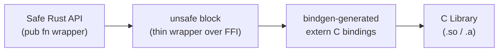

# FFI & Unsafe

## Category
Rust, FFI, Unsafe, C Interop, bindgen, cbindgen

## Context

Rust's `unsafe` keyword unlocks capabilities the borrow checker cannot verify: raw pointer dereferencing, calling C functions, implementing unsafe traits, and accessing mutable statics. **FFI** (Foreign Function Interface) allows Rust to call C libraries and be called from C/C++/Python/Node.js.

| Tool | Purpose |
|------|---------|
| `unsafe {}` block | Opt out of borrow checker for one expression |
| `extern "C"` | Declare a C function or export a Rust function to C |
| `bindgen` | Generate Rust FFI bindings from C headers automatically |
| `cbindgen` | Generate C headers from Rust code (for exposing Rust to C) |
| `cxx` | Type-safe C++/Rust interop (generates bridge code) |
| `PyO3` | Rust ↔ Python interop (expose Rust as a Python module) |
| `napi-rs` | Rust ↔ Node.js native addons |

### The five unsafe superpowers

1. Dereference raw pointers (`*const T`, `*mut T`)
2. Call `unsafe` functions or C functions
3. Access or modify mutable static variables
4. Implement `unsafe` traits (`Send`, `Sync`)
5. Access fields of `union`s

**Rule**: minimise `unsafe` surface. Wrap each `unsafe` block in a safe public API that enforces invariants — callers should never need to write `unsafe`.

---

## Pros

- FFI lets Rust leverage the enormous C/C++ library ecosystem without rewriting code.
- `unsafe` is an explicit, auditable surface — code reviewers and tools (`cargo geiger`) can locate every unsafe block.
- Raw pointers have zero overhead — same performance as C.
- `bindgen` automates binding generation — C headers → Rust extern declarations with no manual work.
- `PyO3` enables exposing compute-heavy Rust code as a Python extension — a common performance optimisation path.

---

## Cons

- `unsafe` code can cause undefined behaviour, memory unsafety, and data races — requires careful auditing.
- C strings (`*const c_char`) and Rust strings (`&str`) are not the same — conversion requires `CStr` / `CString`.
- Memory allocated by C (e.g., `malloc`) must be freed by C, not Rust's allocator — use the C library's cleanup function.
- Null pointer returns from C functions must be checked explicitly — Rust's type system cannot help here.
- `bindgen` may generate unsafe types that require wrapping in a safe Rust API.

---

## Design Diagram



---

## Code Sample

### Calling a C function via extern

```rust
// Link against libm (C math library)
extern "C" {
    fn sqrt(x: f64) -> f64;
    fn abs(x: i32) -> i32;
}

fn safe_sqrt(x: f64) -> Option<f64> {
    if x < 0.0 {
        return None;  // sqrt of negative is undefined
    }
    // SAFETY: x >= 0.0, so sqrt is well-defined and does not return NaN
    Some(unsafe { sqrt(x) })
}
```

### C strings — CStr and CString

```rust
use std::ffi::{CStr, CString};
use std::os::raw::c_char;

extern "C" {
    fn greet(name: *const c_char) -> *const c_char;
}

fn safe_greet(name: &str) -> String {
    // Rust &str → C string (null-terminated, heap-allocated)
    let c_name = CString::new(name).expect("name must not contain null bytes");

    // SAFETY: greet() returns a valid null-terminated string owned by the C library
    let result_ptr = unsafe { greet(c_name.as_ptr()) };

    // SAFETY: result_ptr is non-null and points to a valid C string
    unsafe { CStr::from_ptr(result_ptr) }
        .to_string_lossy()
        .into_owned()
}
```

### bindgen — generate bindings from C header

```c
// include/mylib.h
typedef struct Connection Connection;
Connection* connect(const char* url);
int execute(Connection* conn, const char* query);
void disconnect(Connection* conn);
```

```rust
// build.rs — run bindgen at build time
fn main() {
    println!("cargo:rustc-link-lib=mylib");
    println!("cargo:rerun-if-changed=include/mylib.h");

    bindgen::Builder::default()
        .header("include/mylib.h")
        .parse_callbacks(Box::new(bindgen::CargoCallbacks::new()))
        .generate()
        .expect("bindgen failed")
        .write_to_file(std::path::PathBuf::from(std::env::var("OUT_DIR").unwrap()).join("bindings.rs"))
        .expect("write bindings failed");
}
```

```rust
// src/ffi.rs — safe wrapper over generated bindings
mod bindings {
    include!(concat!(env!("OUT_DIR"), "/bindings.rs"));
}

pub struct Connection(*mut bindings::Connection);

// SAFETY: Connection pointer is only ever accessed through this struct
// which is Send because the underlying C library is thread-safe.
unsafe impl Send for Connection {}

impl Connection {
    pub fn new(url: &str) -> Option<Self> {
        let url = std::ffi::CString::new(url).ok()?;
        // SAFETY: connect returns null on failure; we check before wrapping
        let ptr = unsafe { bindings::connect(url.as_ptr()) };
        if ptr.is_null() { None } else { Some(Connection(ptr)) }
    }

    pub fn execute(&mut self, query: &str) -> Result<(), i32> {
        let q = std::ffi::CString::new(query).unwrap();
        // SAFETY: self.0 is a valid non-null Connection pointer
        let rc = unsafe { bindings::execute(self.0, q.as_ptr()) };
        if rc == 0 { Ok(()) } else { Err(rc) }
    }
}

impl Drop for Connection {
    fn drop(&mut self) {
        // SAFETY: self.0 is non-null; called exactly once via Drop
        unsafe { bindings::disconnect(self.0) }
    }
}
```

### PyO3 — expose Rust as a Python extension

```rust
// src/lib.rs
use pyo3::prelude::*;

#[pyfunction]
fn process_orders(orders: Vec<String>) -> PyResult<Vec<String>> {
    Ok(orders.into_iter().map(|o| format!("processed:{o}")).collect())
}

#[pymodule]
fn mymodule(_py: Python<'_>, m: &PyModule) -> PyResult<()> {
    m.add_function(wrap_pyfunction!(process_orders, m)?)?;
    Ok(())
}
```

```toml
# Cargo.toml
[lib]
crate-type = ["cdylib"]   # Required for Python extension

[dependencies]
pyo3 = { version = "0.21", features = ["extension-module"] }
```

```bash
pip install maturin
maturin develop   # builds and installs into current Python env
python -c "import mymodule; print(mymodule.process_orders(['a','b']))"
```

---

## Related

- [01 — Ownership & Borrowing](./01-ownership-borrowing.md) — raw pointers bypass borrow checker; lifetimes still apply to `&T`
- [08 — Memory Management](./08-memory-management.md) — C-allocated memory must not be freed by Rust's allocator
- [07 — Concurrency](./07-concurrency.md) — `unsafe impl Send` and `unsafe impl Sync` for FFI types
