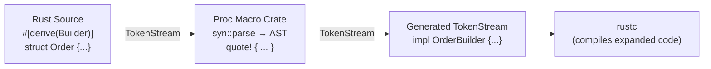

# Macros & Metaprogramming

## Category
Rust, Macros, Metaprogramming, Procedural Macros, syn, quote

## Context

Rust macros operate at compile time and generate code — they are not simple text substitution like C `#define`. There are two families:

| Family | Type | Invocation | Use Case |
|--------|------|-----------|---------|
| Declarative | `macro_rules!` | `my_macro!(…)` | Pattern-matched code generation |
| Procedural | `derive` | `#[derive(MyTrait)]` | Auto-implement traits |
| Procedural | `attribute` | `#[route(GET, "/path")]` | Transform an item |
| Procedural | `function-like` | `sql!("SELECT …")` | Parse custom DSL |

**When to use macros vs alternatives:**

| Need | Prefer |
|------|--------|
| Repeat code for N types | Generics + trait |
| Repeat identical boilerplate per struct | `derive` macro |
| Custom syntax / DSL | Function-like proc macro |
| Feature flags per function | Attribute macro |
| Simple pattern reuse | `macro_rules!` |

Procedural macros live in a **separate crate** with `proc-macro = true`. They operate on `TokenStream` and are typically built with:
- **`syn`** — parse Rust token streams into an AST
- **`quote`** — interpolate values back into token streams

---

## Pros

- Eliminate boilerplate: one `#[derive(Builder)]` replaces 30+ lines of handwritten code.
- Compile-time SQL verification (`sqlx::query!`, `diesel`), regex (`regex` crate with `regex!`), and schema validation.
- Zero runtime cost — all expansion happens during compilation.
- `macro_rules!` is simpler than proc macros for pattern-based repetition.
- `derive` macros compose — multiple can be stacked on one type.

---

## Cons

- Procedural macros require a separate crate and increase compile time.
- Error messages from macros can be hard to read — use `proc_macro_error` or `syn::Error::to_compile_error` for good diagnostics.
- `macro_rules!` hygiene rules are non-obvious; variable capture can surprise you.
- Macros can hide logic — "magic" code that new team members struggle to trace.
- Procedural macros execute arbitrary code at compile time — they are a supply-chain attack surface.

---

## Design Diagram



---

## Code Sample

### Declarative macro — `macro_rules!`

```rust
// Shorthand for creating a HashMap literal (like in other languages)
macro_rules! hashmap {
    // base case: empty
    () => {
        std::collections::HashMap::new()
    };
    // recursive case: key => value, ...
    ($($k:expr => $v:expr),+ $(,)?) => {{
        let mut map = std::collections::HashMap::new();
        $(map.insert($k, $v);)+
        map
    }};
}

fn main() {
    let config = hashmap! {
        "host" => "localhost",
        "port" => "5432",
    };
    println!("{:?}", config);
}
```

### Declarative macro — `vec!`-style with repetition

```rust
// Retry any expression up to N times
macro_rules! retry {
    ($n:expr, $body:expr) => {{
        let mut result = None;
        for attempt in 1..=$n {
            match $body {
                Ok(v) => { result = Some(v); break; }
                Err(e) => {
                    eprintln!("Attempt {attempt}/{} failed: {e}", $n);
                }
            }
        }
        result
    }};
}

// Usage: retry!(3, connect_to_db())
```

### Procedural derive macro — custom `Builder`

```toml
# my-derive/Cargo.toml
[lib]
proc-macro = true

[dependencies]
syn = { version = "2", features = ["full"] }
quote = "1"
proc-macro2 = "1"
```

```rust
// my-derive/src/lib.rs
use proc_macro::TokenStream;
use quote::quote;
use syn::{parse_macro_input, DeriveInput, Data, Fields};

#[proc_macro_derive(Builder)]
pub fn derive_builder(input: TokenStream) -> TokenStream {
    let ast = parse_macro_input!(input as DeriveInput);
    let name = &ast.ident;
    let builder_name = quote::format_ident!("{}Builder", name);

    // Extract named fields
    let fields = match &ast.data {
        Data::Struct(s) => match &s.fields {
            Fields::Named(f) => &f.named,
            _ => panic!("Builder only supports named fields"),
        },
        _ => panic!("Builder only supports structs"),
    };

    let field_names: Vec<_> = fields.iter().map(|f| &f.ident).collect();
    let field_types: Vec<_> = fields.iter().map(|f| &f.ty).collect();

    // Generate: struct OrderBuilder, setter methods, and build()
    let expanded = quote! {
        #[derive(Default)]
        pub struct #builder_name {
            #(#field_names: Option<#field_types>,)*
        }

        impl #builder_name {
            #(
                pub fn #field_names(mut self, val: #field_types) -> Self {
                    self.#field_names = Some(val);
                    self
                }
            )*

            pub fn build(self) -> Result<#name, String> {
                Ok(#name {
                    #(
                        #field_names: self.#field_names
                            .ok_or_else(|| format!("{} is required", stringify!(#field_names)))?,
                    )*
                })
            }
        }
    };

    expanded.into()
}
```

```rust
// src/main.rs — consuming the macro
use my_derive::Builder;

#[derive(Debug, Builder)]
struct Order {
    id: u64,
    customer: String,
    amount: f64,
}

fn main() {
    let order = OrderBuilder::default()
        .id(42)
        .customer("Alice".to_string())
        .amount(199.99)
        .build()
        .unwrap();

    println!("{:?}", order);
}
```

### Attribute macro — Axum-style route registration

```rust
// Attribute macro: transform a function into a registered route handler
#[proc_macro_attribute]
pub fn instrument_handler(attr: TokenStream, item: TokenStream) -> TokenStream {
    let mut func = parse_macro_input!(item as syn::ItemFn);
    let name = func.sig.ident.to_string();

    let body = &func.block;
    func.block = syn::parse_quote! {{
        tracing::info!(handler = #name, "request started");
        let result = (|| async move #body)().await;
        tracing::info!(handler = #name, "request finished");
        result
    }};

    quote! { #func }.into()
}
```

### Function-like macro — compile-time validated config key

```rust
// Function-like proc macro — validates at compile time that a key exists in known_keys()
#[proc_macro]
pub fn config_key(input: TokenStream) -> TokenStream {
    let lit = parse_macro_input!(input as syn::LitStr);
    let key = lit.value();
    let known = ["database_url", "redis_url", "jwt_secret"];

    if !known.contains(&key.as_str()) {
        return syn::Error::new(lit.span(), format!("unknown config key: {key}"))
            .to_compile_error()
            .into();
    }

    quote! { #key }.into()
}

// Usage: let url = config_key!("database_url"); // compiles
// Usage: let url = config_key!("typo_key");     // compile error
```

---

## Related

- [02 — Type System](./02-type-system.md) — builder pattern manually vs derive-generated
- [04 — Traits & Generics](./04-traits-generics.md) — macros vs generics: prefer generics when runtime polymorphism is needed
- [10 — Database Patterns](./10-database-patterns.md) — `sqlx::query!` is a function-like proc macro that verifies SQL at compile time
