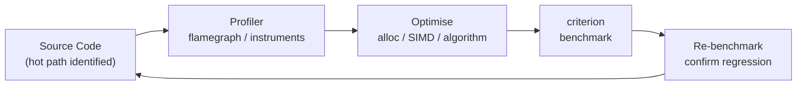

# Performance & Profiling

## Category
Rust, Performance, Profiling, Benchmarking, SIMD, Flamegraph, criterion

## Context

Rust's zero-cost abstractions mean iterators, closures, and generics compile to the same machine code as equivalent C — but that doesn't mean code is automatically fast. Profiling reveals where actual cycles are spent.

| Tool | Platform | What it measures |
|------|---------|-----------------|
| `cargo-flamegraph` | Linux (perf) | CPU time — call graph |
| `cargo-instruments` | macOS (Instruments) | CPU, memory, allocations |
| `heaptrack` / `DHAT` | Linux | Heap allocations per site |
| `criterion` | all | Statistically rigorous microbenchmarks |
| `tokio-console` | all | Async task scheduling, poll times |
| `samply` | macOS / Linux | Firefox Profiler-compatible |

### Optimisation hierarchy (apply in order)

1. **Algorithm** — O(n²) → O(n log n) beats any micro-opt
2. **Memory layout** — cache-friendly struct of arrays vs array of structs
3. **Allocation reduction** — avoid `Box`/`Vec` in hot paths; use `SmallVec`, `tinyvec`, or stack arrays
4. **Parallelism** — `rayon` for CPU-bound; `tokio` for I/O-bound
5. **SIMD** — explicit vectorisation for data-parallel math
6. **Compiler flags** — `target-cpu=native`, LTO, `codegen-units=1`

---

## Pros

- `criterion` gives statistically stable benchmarks with confidence intervals and automatic outlier detection.
- Rust's iterator chains are LLVM-inlined — no loop overhead; profilers confirm this.
- `SmallVec<[T; N]>` eliminates heap allocations for common small-collection cases.
- Profile-guided optimisation (PGO) and link-time optimisation (LTO) are first-class in Cargo.
- `tokio-console` diagnoses async task starvation without modifying application code.

---

## Cons

- `cargo-flamegraph` requires Linux `perf` or macOS `dtrace` (dtrace needs SIP disabled on macOS — prefer `cargo-instruments` or `samply`).
- Benchmarks must prevent dead-code elimination — use `criterion::black_box`.
- SIMD intrinsics are `unsafe` and platform-specific; portable SIMD (`std::simd`) is still nightly-only (2024).
- `LTO = "fat"` dramatically increases link time; use `"thin"` for iterative dev.
- Micro-benchmarks can mislead if tested data doesn't reflect production data distributions.

---

## Design Diagram



---

## Code Sample

### criterion benchmark — baseline and comparison

```rust
// benches/orders.rs
use criterion::{black_box, criterion_group, criterion_main, BenchmarkId, Criterion};

fn process_order_naive(orders: &[u64]) -> u64 {
    orders.iter().sum()
}

fn process_order_simd_hint(orders: &[u64]) -> u64 {
    // Give LLVM a hint to auto-vectorise
    orders.iter().copied().fold(0u64, |acc, x| acc.wrapping_add(x))
}

fn bench_order_processing(c: &mut Criterion) {
    let mut group = c.benchmark_group("order_sum");

    for size in [100, 1_000, 10_000] {
        let data: Vec<u64> = (0..size).collect();

        group.bench_with_input(BenchmarkId::new("naive", size), &data, |b, d| {
            b.iter(|| process_order_naive(black_box(d)));
        });

        group.bench_with_input(BenchmarkId::new("fold", size), &data, |b, d| {
            b.iter(|| process_order_simd_hint(black_box(d)));
        });
    }
    group.finish();
}

criterion_group!(benches, bench_order_processing);
criterion_main!(benches);
```

```toml
# Cargo.toml
[[bench]]
name = "orders"
harness = false

[dev-dependencies]
criterion = { version = "0.5", features = ["html_reports"] }
```

```bash
cargo bench                          # run all benches, generate HTML report
cargo bench -- --save-baseline main  # save a named baseline
cargo bench -- --baseline main       # compare against saved baseline
```

### SmallVec — avoid heap for small collections

```rust
use smallvec::{smallvec, SmallVec};

// Stores up to 8 items on the stack; spills to heap only if larger
fn order_tags(order_id: u64) -> SmallVec<[String; 8]> {
    let mut tags: SmallVec<[String; 8]> = SmallVec::new();
    tags.push(format!("order:{order_id}"));
    tags.push("region:eu".to_string());
    tags
}
```

### Avoiding allocations in hot paths — reuse buffers

```rust
use std::io::Write;

struct OrderSerializer {
    buf: Vec<u8>,  // reused across calls
}

impl OrderSerializer {
    fn new() -> Self {
        Self { buf: Vec::with_capacity(512) }
    }

    fn serialize(&mut self, order_id: u64, amount: f64) -> &[u8] {
        self.buf.clear();  // reset without deallocating
        write!(self.buf, r#"{{"id":{order_id},"amount":{amount}}}"#).unwrap();
        &self.buf
    }
}
```

### Cargo release profile — production build flags

```toml
# Cargo.toml
[profile.release]
opt-level = 3          # maximum optimisation
lto = "thin"           # thin LTO (faster link than "fat", good improvement)
codegen-units = 1      # single codegen unit — more inlining opportunities
strip = "symbols"      # smaller binary (remove debug symbols)
panic = "abort"        # smaller binary, no unwinding overhead

[profile.profiling]
inherits = "release"
debug = true           # keep debug info for flamegraph / instruments
strip = false
```

```bash
# Build with native CPU features (not portable — local dev/benchmarking only)
RUSTFLAGS="-C target-cpu=native" cargo build --release

# Flamegraph on Linux
cargo install cargo-flamegraph
cargo flamegraph --bench orders

# Instruments on macOS (cargo-instruments)
cargo install cargo-instruments
cargo instruments --bench orders -t "Time Profiler"

# Cross-platform — samply (Firefox Profiler output)
cargo install samply
samply record cargo run --release
```

### tokio-console — async task introspection

```toml
[dependencies]
console-subscriber = "0.3"
tokio = { version = "1", features = ["full", "tracing"] }
```

```rust
#[tokio::main]
async fn main() {
    // Must be the first thing — initialise console subscriber
    console_subscriber::init();

    // ... your application code
    tokio::spawn(async { heavy_task().await });
    tokio::spawn(async { another_task().await });

    tokio::signal::ctrl_c().await.unwrap();
}
```

```bash
# Terminal 1: run app
RUST_LOG=info cargo run

# Terminal 2: connect console
cargo install tokio-console
tokio-console                  # connects to 127.0.0.1:6669 by default
```

### Cache-friendly data layout — struct of arrays

```rust
// Array of structs — cache unfriendly when only accessing one field
struct OrderAoS {
    id: u64,
    amount: f64,
    status: u8,
}

// Struct of arrays — cache friendly when batch-processing one field
struct Orders {
    ids:     Vec<u64>,
    amounts: Vec<f64>,
    statuses: Vec<u8>,
}

impl Orders {
    // Iterate only amounts — fits in L1/L2 with no wasted cache lines
    fn total_revenue(&self) -> f64 {
        self.amounts.iter().sum()
    }
}
```

---

## Related

- [05 — Async & Tokio](./05-async-tokio.md) — async task scheduling and spawn_blocking for CPU-bound work
- [07 — Concurrency](./07-concurrency.md) — rayon for data-parallel workloads
- [08 — Memory Management](./08-memory-management.md) — allocator choices and Box/Arc overhead
