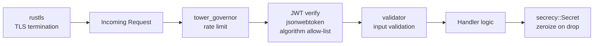

# Security Patterns

## Category
Rust, Security, TLS, JWT, Secrets, Authentication, Input Validation, cargo-audit

## Context

Rust eliminates entire classes of CVEs (buffer overflows, use-after-free, null dereference) through its type system, but application-layer security — secrets handling, authentication, input validation — still requires deliberate design.

| Concern | Crate | What it provides |
|---------|-------|-----------------|
| Secret values | `secrecy` | Wraps sensitive data; redacts from `Debug`/`Display` |
| Memory wiping | `zeroize` | Overwrites memory with zeros on drop |
| TLS | `rustls` + `tokio-rustls` | Pure-Rust TLS, no OpenSSL dependency |
| JWT | `jsonwebtoken` | Sign / verify JWTs with explicit algorithm allow-list |
| Input validation | `validator` | Derive-based field validation with custom rules |
| Constant-time compare | `subtle` | Safe HMAC / token comparison (no timing side-channel) |
| Dependency audit | `cargo-audit` | Scan `Cargo.lock` against RustSec advisory database |
| Rate limiting | `tower_governor` | Token-bucket rate limiting middleware for Tower/Axum |
| Password hashing | `argon2` | Memory-hard password hashing (Argon2id) |

**Security principle**: treat secrets as a distinct type — not as `String`. `secrecy::Secret<String>` prevents secrets from leaking into logs, panic messages, or serialisation accidentally.

---

## Pros

- `rustls` has no dependency on OpenSSL — eliminates Heartbleed-class native library CVEs.
- `secrecy::Secret<T>` makes it a compile-time error to accidentally log a password — `Debug` prints `[REDACTED]`.
- `cargo-audit` integrates into CI: one command flags all dependencies with known CVEs.
- `subtle::ConstantTimeEq` prevents timing attacks on HMAC / token comparisons that would be invisible in a `== ` check.
- `validator` derive macros keep validation co-located with the type definition — no separate validation layer to forget.

---

## Cons

- `rustls` requires certificate management — it does not fall back to system roots by default (add `rustls-native-certs` or `webpki-roots`).
- `jsonwebtoken` validation requires setting `Validation::algorithms` explicitly — the default accepts any algorithm, enable the allow-list.
- `argon2` is intentionally slow — tune parameters (`m_cost`, `t_cost`) for your hardware; too low is insecure, too high causes denial of service.
- `cargo-audit` catches known CVEs but not zero-days or logic bugs in dependencies.
- `zeroize` cannot guarantee zeroing on all platforms/compilers (compiler may optimise out writes to memory it considers unused — use the derive feature to ensure `drop` triggers).

---

## Design Diagram



---

## Code Sample

### secrecy — wrap sensitive values

```rust
use secrecy::{ExposeSecret, Secret};

#[derive(Debug)]   // will print: Secret([REDACTED])
struct AppConfig {
    database_url: Secret<String>,
    jwt_secret:   Secret<String>,
    api_key:      Secret<String>,
}

fn connect(config: &AppConfig) -> String {
    // Must explicitly call .expose_secret() to access the value
    // This is the only place the raw value appears — easy to audit
    let url = config.database_url.expose_secret();
    format!("connecting to {url}")
}

fn load_config() -> AppConfig {
    AppConfig {
        database_url: Secret::new(std::env::var("DATABASE_URL").expect("DATABASE_URL required")),
        jwt_secret:   Secret::new(std::env::var("JWT_SECRET").expect("JWT_SECRET required")),
        api_key:      Secret::new(std::env::var("API_KEY").expect("API_KEY required")),
    }
}
```

### zeroize — wipe memory on drop

```rust
use zeroize::{Zeroize, ZeroizeOnDrop};

#[derive(Zeroize, ZeroizeOnDrop)]
struct SessionKey {
    key_bytes: [u8; 32],
}

impl SessionKey {
    fn new(raw: [u8; 32]) -> Self {
        SessionKey { key_bytes: raw }
    }

    fn sign(&self, data: &[u8]) -> Vec<u8> {
        // Use self.key_bytes for HMAC signing
        hmac_sha256(&self.key_bytes, data)
    }
}

fn hmac_sha256(key: &[u8], _data: &[u8]) -> Vec<u8> {
    // ... real HMAC implementation
    key.to_vec() // placeholder
}
// When SessionKey is dropped, key_bytes is zeroed — not just freed
```

### JWT authentication — explicit algorithm allow-list

```rust
use jsonwebtoken::{decode, encode, Algorithm, DecodingKey, EncodingKey, Header, Validation};
use serde::{Deserialize, Serialize};
use secrecy::{ExposeSecret, Secret};

#[derive(Debug, Serialize, Deserialize)]
struct Claims {
    sub: String,
    exp: usize,
    iat: usize,
}

struct JwtService {
    encoding_key: EncodingKey,
    decoding_key: DecodingKey,
}

impl JwtService {
    fn new(secret: &Secret<String>) -> Self {
        let raw = secret.expose_secret().as_bytes();
        Self {
            encoding_key: EncodingKey::from_secret(raw),
            decoding_key: DecodingKey::from_secret(raw),
        }
    }

    fn issue(&self, subject: &str, ttl_seconds: usize) -> Result<String, jsonwebtoken::errors::Error> {
        let now = std::time::SystemTime::now()
            .duration_since(std::time::UNIX_EPOCH)
            .unwrap()
            .as_secs() as usize;

        let claims = Claims {
            sub: subject.to_owned(),
            iat: now,
            exp: now + ttl_seconds,
        };
        encode(&Header::new(Algorithm::HS256), &claims, &self.encoding_key)
    }

    fn verify(&self, token: &str) -> Result<Claims, jsonwebtoken::errors::Error> {
        let mut validation = Validation::default();
        // CRITICAL: restrict to only the expected algorithm to prevent alg:none attacks
        validation.algorithms = vec![Algorithm::HS256];
        validation.validate_exp = true;

        let data = decode::<Claims>(token, &self.decoding_key, &validation)?;
        Ok(data.claims)
    }
}
```

### Input validation with validator

```rust
use validator::{Validate, ValidationError};
use serde::Deserialize;

fn validate_currency(code: &str) -> Result<(), ValidationError> {
    let valid = ["USD", "EUR", "GBP", "JPY"];
    if valid.contains(&code) { Ok(()) } else { Err(ValidationError::new("invalid_currency")) }
}

#[derive(Debug, Deserialize, Validate)]
struct CreateOrderRequest {
    #[validate(length(min = 1, max = 100))]
    customer_name: String,

    #[validate(range(min = 0.01, max = 1_000_000.0))]
    amount: f64,

    #[validate(custom(function = "validate_currency"))]
    currency: String,

    #[validate(email)]
    contact_email: String,
}

// In Axum handler:
async fn create_order(
    axum::Json(body): axum::Json<CreateOrderRequest>,
) -> Result<axum::Json<serde_json::Value>, (axum::http::StatusCode, String)> {
    body.validate()
        .map_err(|e| (axum::http::StatusCode::UNPROCESSABLE_ENTITY, e.to_string()))?;
    // ... proceed with validated data
    Ok(axum::Json(serde_json::json!({"status": "created"})))
}
```

### Constant-time comparison — prevent timing attacks

```rust
use subtle::ConstantTimeEq;

fn verify_api_key(provided: &str, expected: &str) -> bool {
    // Regular == leaks information about where strings diverge via timing
    // ConstantTimeEq always takes the same time regardless of where bytes differ
    let a = provided.as_bytes();
    let b = expected.as_bytes();

    if a.len() != b.len() {
        // Still run the comparison to avoid length-based timing oracle
        // Use a dummy comparison of fixed length
        let dummy = vec![0u8; a.len()];
        let _ = dummy.as_slice().ct_eq(a);
        return false;
    }

    a.ct_eq(b).into()
}
```

### rustls TLS — no OpenSSL

```toml
[dependencies]
axum = "0.7"
axum-server = { version = "0.6", features = ["tls-rustls"] }
rustls = "0.23"
tokio = { version = "1", features = ["full"] }
```

```rust
use axum::{routing::get, Router};
use axum_server::tls_rustls::RustlsConfig;

#[tokio::main]
async fn main() {
    let config = RustlsConfig::from_pem_file(
        "certs/cert.pem",
        "certs/key.pem",
    )
    .await
    .expect("TLS config failed — check cert/key paths");

    let app = Router::new().route("/", get(|| async { "TLS OK" }));

    println!("Listening on https://0.0.0.0:443");
    axum_server::bind_rustls("0.0.0.0:443".parse().unwrap(), config)
        .serve(app.into_make_service())
        .await
        .unwrap();
}
```

### tower_governor — rate limiting middleware

```toml
[dependencies]
tower_governor = "0.4"
axum = "0.7"
```

```rust
use axum::{routing::get, Router};
use tower_governor::{governor::GovernorConfigBuilder, GovernorLayer};
use std::sync::Arc;

#[tokio::main]
async fn main() {
    // Allow 10 requests per second per IP, burst of 20
    let governor_conf = Arc::new(
        GovernorConfigBuilder::default()
            .per_second(10)
            .burst_size(20)
            .finish()
            .expect("invalid rate limit config"),
    );

    let app = Router::new()
        .route("/api/orders", get(|| async { "orders" }))
        .layer(GovernorLayer { config: governor_conf });

    let listener = tokio::net::TcpListener::bind("0.0.0.0:3000").await.unwrap();
    axum::serve(listener, app).await.unwrap();
}
```

### cargo-audit — CI security scanning

```bash
# Install once
cargo install cargo-audit

# Run in CI — exits non-zero if any advisory found
cargo audit

# Ignore a specific advisory (with justification — document why)
cargo audit --ignore RUSTSEC-2023-0001

# Also check for unmaintained crates
cargo audit --deny warnings
```

```yaml
# .github/workflows/security.yml
- name: Security audit
  run: |
    cargo install cargo-audit --locked
    cargo audit
```

### Argon2 password hashing

```rust
use argon2::{
    password_hash::{rand_core::OsRng, PasswordHash, PasswordHasher, PasswordVerifier, SaltString},
    Argon2,
};
use secrecy::{ExposeSecret, Secret};

fn hash_password(password: &Secret<String>) -> String {
    let salt = SaltString::generate(&mut OsRng);
    let argon2 = Argon2::default();  // Argon2id, m=19456, t=2, p=1

    argon2
        .hash_password(password.expose_secret().as_bytes(), &salt)
        .expect("hashing failed")
        .to_string()
}

fn verify_password(password: &Secret<String>, hash: &str) -> bool {
    let parsed_hash = PasswordHash::new(hash).expect("invalid hash format");
    Argon2::default()
        .verify_password(password.expose_secret().as_bytes(), &parsed_hash)
        .is_ok()
}
```

---

## Related

- [03 — Error Handling](./03-error-handling.md) — never expose internal error detail in public API responses
- [05 — Async & Tokio](./05-async-tokio.md) — spawn_blocking for Argon2 (CPU-heavy, must not block the async executor)
- [06 — HTTP Services](./06-http-services.md) — middleware stack placement: rate limiting before auth, auth before handlers
