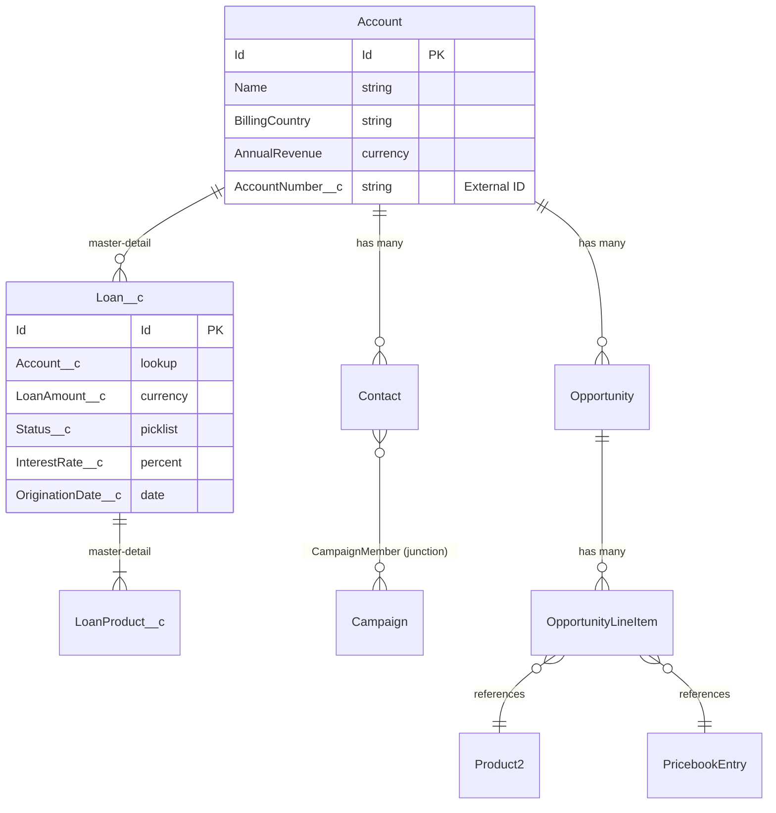

# Platform Architecture & Data Model

## Category

Salesforce — Platform Foundations

## Context

Salesforce is a metadata-driven platform where almost every configurable element — objects, fields, layouts, validations, workflows — is described by **metadata** stored in the org. Understanding the data model and metadata architecture is foundational to designing scalable, maintainable Salesforce solutions.

### Object Types

| Type | Description | Examples |
|------|-------------|---------|
| **Standard Objects** | Salesforce-provided, cannot be deleted | Account, Contact, Opportunity, Case, Lead |
| **Custom Objects** | Org-defined, suffixed with `__c` | `Loan__c`, `Product_Subscription__c` |
| **External Objects** | Map to data outside Salesforce via OData | `ExternalOrder__x` |
| **Big Objects** | High-volume archival objects (billions of rows) | `FieldHistoryArchive__b` |
| **Platform Event Objects** | Event bus messages; suffixed `__e` | `PaymentProcessed__e` |

### Relationship Types

| Relationship | Cardinality | Cascade Delete | Use When |
|-------------|------------|---------------|----------|
| **Lookup** | Many-to-one or one-to-one | No (optional) | Loose coupling; child survives parent deletion |
| **Master-Detail** | Many-to-one | Yes (mandatory) | Child ownership; roll-up summary fields needed |
| **Many-to-Many (Junction)** | M:N via junction object | Both sides | Products on Orders, Contacts on Campaigns |
| **Self-Relationship** | Hierarchical | No | Account hierarchy, territory hierarchy |
| **External Lookup / Indirect Lookup** | To/from external object | No | Connect to external systems |

### Field Types Reference

| Category | Field Types |
|---------|-------------|
| **Text** | Text, Text Area, Long Text Area, Rich Text, Email, Phone, URL |
| **Numeric** | Number, Currency, Percent |
| **Date/Time** | Date, DateTime, Time |
| **Selection** | Picklist, Multi-Select Picklist, Checkbox |
| **Relationship** | Lookup, Master-Detail, External Lookup, Indirect Lookup |
| **Special** | Auto Number, Formula, Roll-Up Summary, Geolocation, Encrypted Text |

### Schema Design Principles

| Principle | Guidance |
|-----------|---------|
| **Denormalise for performance** | SOQL joins (relationship queries) are expensive; consider storing derived values in formula or roll-up fields |
| **Avoid EAV (Entity-Attribute-Value)** | Custom objects with "attribute name / value" patterns break reporting and SOQL |
| **Use Roll-Up Summary fields** | Aggregate child data at the master level without Apex; only available on master-detail |
| **Picklist vs Text** | Always prefer picklist for bounded value sets — enables filtering, validation, and translation |
| **External IDs** | Mark one field per object as `External ID` to support upsert via API and data migration |
| **Namespace planning** | For packages, all custom metadata uses a namespace prefix — plan this before building |

## Pros

- Metadata-driven model means schema changes deploy via configuration, not DDL migrations
- Declarative security (field-level security, sharing rules) works at the schema level without code
- Roll-up summary fields aggregate master-detail child data without Apex triggers
- External IDs enable idempotent upserts — safe for integration and data load patterns
- Formula fields compute values at query time — no denormalisation maintenance overhead

## Cons

- Schema changes (field addition, object creation) count against org limits (hard caps on custom fields per object)
- Changing a field type (e.g., Text → Picklist) requires data migration — not schema evolution
- Master-detail cascade delete is irreversible and can cause unintended mass deletions
- Large numbers of formula fields on a record increase page load time and SOQL CPU cost
- Salesforce does not support true foreign-key constraints — referential integrity is application-enforced

## Design Diagram



## Code Sample

### Apex — Create and relate records programmatically

```apex
// Insert Account (parent)
Account acc = new Account(
    Name = 'Acme Bank',
    BillingCountry = 'GB',
    AnnualRevenue = 50_000_000,
    AccountNumber__c = 'ACME-001'  // External ID for upsert
);
insert acc;

// Insert master-detail child (Loan)
Loan__c loan = new Loan__c(
    Name = 'Mortgage Q1-2026',
    Account__c = acc.Id,
    LoanAmount__c = 250_000,
    Status__c = 'Active',
    InterestRate__c = 3.75,
    OriginationDate__c = Date.today()
);
insert loan;

// Upsert via External ID (safe for integration / data migration)
Account upsertAcc = new Account(
    AccountNumber__c = 'ACME-001',  // match on External ID
    AnnualRevenue = 55_000_000
);
upsert upsertAcc AccountNumber__c;
```

### Apex — Metadata API: describe object and fields dynamically

```apex
public class SchemaInspector {
    public static Map<String, Schema.SObjectField> getFieldMap(String objectApiName) {
        Schema.SObjectType objType = Schema.getGlobalDescribe().get(objectApiName);
        if (objType == null) {
            throw new IllegalArgumentException('Unknown object: ' + objectApiName);
        }
        return objType.getDescribe().fields.getMap();
    }

    public static List<String> getPicklistValues(String objectApiName, String fieldApiName) {
        Schema.DescribeFieldResult fieldDesc =
            getFieldMap(objectApiName).get(fieldApiName).getDescribe();

        List<String> values = new List<String>();
        for (Schema.PicklistEntry entry : fieldDesc.getPicklistValues()) {
            if (entry.isActive()) {
                values.add(entry.getValue());
            }
        }
        return values;
    }
}
```

### JSON — Metadata API: custom object definition (deploy via SFDX)

```json
{
  "fullName": "Loan__c",
  "label": "Loan",
  "pluralLabel": "Loans",
  "nameField": {
    "type": "AutoNumber",
    "label": "Loan Number",
    "displayFormat": "LN-{0000000}"
  },
  "deploymentStatus": "Deployed",
  "sharingModel": "ControlledByParent",
  "fields": [
    {
      "fullName": "LoanAmount__c",
      "label": "Loan Amount",
      "type": "Currency",
      "precision": 18,
      "scale": 2,
      "required": true
    },
    {
      "fullName": "Status__c",
      "label": "Status",
      "type": "Picklist",
      "required": true,
      "valueSet": {
        "restricted": true,
        "valueSetDefinition": {
          "value": [
            { "fullName": "Draft", "default": true },
            { "fullName": "Active" },
            { "fullName": "Closed" },
            { "fullName": "Defaulted" }
          ]
        }
      }
    },
    {
      "fullName": "InterestRate__c",
      "label": "Interest Rate",
      "type": "Percent",
      "precision": 5,
      "scale": 2
    },
    {
      "fullName": "ExternalLoanId__c",
      "label": "External Loan ID",
      "type": "Text",
      "length": 50,
      "externalId": true,
      "unique": true
    }
  ]
}
```

### Shell — SFDX: deploy metadata and describe org schema

```bash
# Push local metadata to scratch org
sf project deploy start --source-dir force-app/main/default/objects

# Describe all objects in the org
sf data query --query "SELECT QualifiedApiName, Label FROM EntityDefinition ORDER BY QualifiedApiName" --use-tooling-api

# Describe fields on an object
sf data query \
  --query "SELECT QualifiedApiName, DataType, IsCustom FROM FieldDefinition WHERE EntityDefinition.QualifiedApiName = 'Loan__c'" \
  --use-tooling-api

# Export object schema to JSON (useful for documentation)
sf schema generate sobject --sobject Loan__c
```

## References

- [Salesforce Object Reference](https://developer.salesforce.com/docs/atlas.en-us.object_reference.meta/object_reference/)
- [Custom Object Overview](https://help.salesforce.com/s/articleView?id=sf.dev_objectcreate_task.htm)
- [Schema Builder](https://help.salesforce.com/s/articleView?id=sf.schema_builder.htm)
- [Metadata API Developer Guide](https://developer.salesforce.com/docs/atlas.en-us.api_meta.meta/api_meta/)
