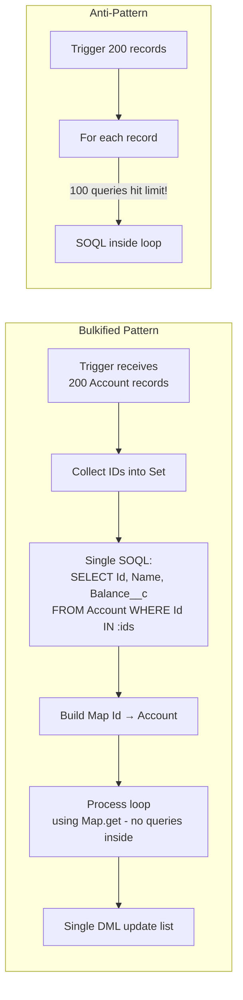

# SOQL & Data Access Patterns

## Category

Salesforce — Development

## Context

**SOQL (Salesforce Object Query Language)** is the primary query language for reading data from Salesforce objects. It is SQL-like but operates on Salesforce's metadata-driven object model. **SOSL (Salesforce Object Search Language)** performs full-text search across multiple objects simultaneously. Because every query counts against governor limits, query design directly impacts governor limit consumption and application correctness.

### SOQL vs SOSL vs Reports API

| Feature | SOQL | SOSL | Reports API |
|---------|------|------|-------------|
| Query scope | Single object (+ relationships) | Multiple objects simultaneously | Report definitions |
| Full-text search | No | Yes (server-side text index) | No |
| Returns | SObject records | Lists of lists per object | Tabular report data |
| Governor limit | 100 queries / 50K rows per tx | 20 SOSL queries | Varies |
| Best for | Structured queries, relationships | Search across Name/Email/Notes | Pre-built analytics |

### Relationship Query Patterns

| Pattern | SOQL Syntax | Use Case |
|---------|-------------|---------|
| **Child-to-parent** | `SELECT Account.Name FROM Contact` | Navigate lookup/master-detail upward |
| **Parent-to-children** | `SELECT (SELECT Name FROM Contacts) FROM Account` | Nested subquery — max 1 level deep |
| **Polymorphic lookup** | `SELECT What.Name, What.Type FROM Task` | `What` / `Who` fields on Activity, Email |
| **Aggregate with GROUP BY** | `SELECT Status__c, COUNT(Id) FROM Loan__c GROUP BY Status__c` | Rollups, dashboards via Apex |

### Query Optimisation Tips

| Anti-pattern | Solution |
|-------------|---------|
| Query inside a loop | Collect IDs, query once outside loop |
| `SELECT *` (all fields) | Only select needed fields — reduces heap |
| Filter on non-indexed fields | Filter on Id, Name, External ID, indexed custom fields |
| No `LIMIT` on large objects | Always add `LIMIT` unless using `Database.QueryLocator` in batch |
| `!= null` filter | Avoid — not selective; use `!= ''` or positive filter instead |
| Deep wildcard `LIKE '%text%'` | Use SOSL for full-text search instead |

## Pros

- Relationship queries navigate parent-child hierarchies in a single round-trip
- `Database.QueryLocator` in Batch Apex bypasses 50K row limit — queries up to 50M rows
- `FOR UPDATE` clause locks records to prevent concurrent modification (optimistic locking)
- Aggregate functions (`COUNT`, `SUM`, `AVG`, `MAX`) reduce data transfer vs fetching all rows
- SOSL searches indexed text fields server-side — far more efficient than SOQL `LIKE '%...'` pattern

## Cons

- Max 100 SOQL queries per synchronous transaction — queries inside loops are critical violations
- No `JOIN` across objects — must use relationship query syntax or multiple queries
- `OFFSET` is limited to 2000 — cannot use traditional offset pagination for large result sets
- Subqueries (parent-to-child) are limited to 1 level of nesting
- `GROUP BY` with `HAVING` cannot reference formula fields or non-aggregatable fields

## Design Diagram



## Code Sample

### Apex — Basic and relationship SOQL patterns

```apex
// Child-to-parent: access Account fields from Contact
List<Contact> contacts = [
    SELECT Id, FirstName, LastName, Email,
           Account.Name, Account.BillingCountry, Account.AnnualRevenue
    FROM Contact
    WHERE Account.BillingCountry = 'GB'
      AND Email != null
    ORDER BY LastName ASC
    LIMIT 200
];

// Parent-to-children: get Account with related Loans
List<Account> accounts = [
    SELECT Id, Name,
        (SELECT Id, Name, LoanAmount__c, Status__c
         FROM Loans__r          -- relationship name (plural + __r)
         WHERE Status__c = 'Active'
         ORDER BY LoanAmount__c DESC
         LIMIT 10)
    FROM Account
    WHERE AnnualRevenue > 1000000
];

for (Account acc : accounts) {
    Decimal total = 0;
    for (Loan__c loan : acc.Loans__r) {
        total += loan.LoanAmount__c;
    }
    System.debug(acc.Name + ' active loan total: ' + total);
}
```

### Apex — Aggregate queries

```apex
// Count and sum by status
AggregateResult[] results = [
    SELECT Status__c, COUNT(Id) loanCount, SUM(LoanAmount__c) totalAmount, AVG(InterestRate__c) avgRate
    FROM Loan__c
    WHERE OriginationDate__c = LAST_N_DAYS:90
    GROUP BY Status__c
    HAVING COUNT(Id) > 5
    ORDER BY SUM(LoanAmount__c) DESC
];

for (AggregateResult ar : results) {
    System.debug(
        'Status: ' + ar.get('Status__c') +
        ' | Count: ' + ar.get('loanCount') +
        ' | Total: ' + ar.get('totalAmount') +
        ' | Avg Rate: ' + ar.get('avgRate')
    );
}

// Alias with GROUP BY ROLLUP
AggregateResult[] rollup = [
    SELECT Account__r.BillingCountry country, Status__c, SUM(LoanAmount__c) total
    FROM Loan__c
    GROUP BY ROLLUP(Account__r.BillingCountry, Status__c)
];
```

### Apex — Dynamic SOQL with bind variables (avoid injection)

```apex
public class LoanRepository {
    // Safe: bind variables are parameterised — no SOQL injection risk
    public static List<Loan__c> findByStatus(
        String status,
        Decimal minAmount,
        Integer maxResults
    ) {
        return [
            SELECT Id, Name, LoanAmount__c, InterestRate__c, Status__c,
                   Account__r.Name, Account__r.BillingCountry
            FROM Loan__c
            WHERE Status__c = :status
              AND LoanAmount__c >= :minAmount
            ORDER BY OriginationDate__c DESC
            LIMIT :maxResults
        ];
    }

    // Dynamic query — whitelist field/object names, never concatenate user input directly
    public static List<SObject> dynamicQuery(
        String objectName,
        List<String> fields,         // validated against schema describe
        String whereClause           // must NOT include user input directly
    ) {
        // Validate object exists
        if (Schema.getGlobalDescribe().get(objectName) == null) {
            throw new IllegalArgumentException('Invalid object: ' + objectName);
        }
        String fieldList = String.join(fields, ', ');
        String query = 'SELECT ' + fieldList + ' FROM ' + objectName;
        if (String.isNotBlank(whereClause)) {
            query += ' WHERE ' + whereClause;
        }
        return Database.query(query);
    }
}
```

### Apex — Cursor-based pagination (bypasses OFFSET 2000 limit)

```apex
// Use QueryLocator for large results — safe for millions of records
public class LoanReportJob implements Database.Batchable<SObject> {
    public Database.QueryLocator start(Database.BatchableContext ctx) {
        // QueryLocator bypasses 50K row governor limit; processes up to 50M rows
        return Database.getQueryLocator([
            SELECT Id, Name, LoanAmount__c, Status__c, Account__r.Name
            FROM Loan__c
            WHERE Status__c IN ('Active', 'Defaulted')
            ORDER BY OriginationDate__c ASC
        ]);
    }

    public void execute(Database.BatchableContext ctx, List<Loan__c> scope) {
        // scope is automatically chunked by batchSize (default 200)
        for (Loan__c loan : scope) {
            // process each loan
        }
    }

    public void finish(Database.BatchableContext ctx) {}
}
```

### Apex — SOSL cross-object full-text search

```apex
// Search Accounts, Contacts, and Loans by a search term
String searchTerm = 'Acme';
List<List<SObject>> searchResults = [
    FIND :searchTerm
    IN ALL FIELDS
    RETURNING
        Account(Id, Name, Phone, BillingCity),
        Contact(Id, FirstName, LastName, Email),
        Loan__c(Id, Name, LoanAmount__c, Status__c)
    LIMIT 50
];

List<Account>  accounts = (List<Account>)  searchResults[0];
List<Contact>  contacts = (List<Contact>)  searchResults[1];
List<Loan__c>  loans    = (List<Loan__c>)  searchResults[2];
```

### Apex — FOR UPDATE locking to prevent concurrent edits

```apex
// Lock records for the duration of the transaction
List<Loan__c> loans = [
    SELECT Id, Status__c, LoanAmount__c
    FROM Loan__c
    WHERE Id IN :loanIds
    FOR UPDATE  // acquires row-level lock — throws QueryException if already locked
];

for (Loan__c loan : loans) {
    if (loan.Status__c == 'Draft') {
        loan.Status__c = 'Active';
    }
}
update loans;
// Lock released at end of transaction
```

## References

- [SOQL and SOSL Reference](https://developer.salesforce.com/docs/atlas.en-us.soql_sosl.meta/soql_sosl/)
- [SOQL Best Practices](https://developer.salesforce.com/docs/atlas.en-us.apexcode.meta/apexcode/langCon_apex_SOQL_best_practices.htm)
- [Query Plan Tool](https://help.salesforce.com/s/articleView?id=sf.code_dev_console_qa_queryplan.htm)
- [SOQL Injection Prevention](https://developer.salesforce.com/docs/atlas.en-us.apexcode.meta/apexcode/apex_security_soql_injection.htm)
