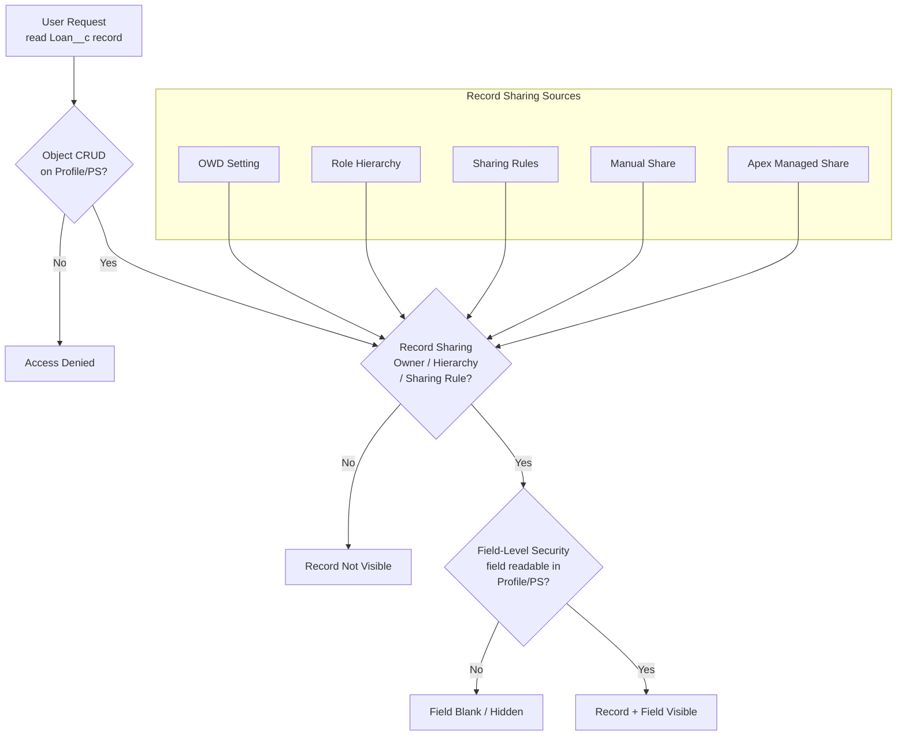

# Salesforce Security Model

## Category

Salesforce — Platform Foundations

## Context

Salesforce enforces a layered, additive security model. Access is **denied by default** and opened through a hierarchy of controls. Understanding the evaluation order is essential — misconfiguration at one layer can silently lock users out or inadvertently expose sensitive data.

### Security Layer Evaluation Order

```
1. Organisation-level (IP whitelisting, login hours, TLS version)
2. Object-level (CRUD — can user see/edit this object at all?)
3. Record-level (which specific records can the user see?)
4. Field-level (which fields on visible records can the user see/edit?)
```

All four gates must be passed for a user to read or write a field on a record.

### Object-Level Access — Profiles vs Permission Sets

| Mechanism | Scope | Best Practice |
|-----------|-------|--------------|
| **Profile** | Baseline capabilities — every user has exactly one | Restrict to minimum needed; use as floor |
| **Permission Set** | Additive permissions granted on top of profile | Grant specific feature access per group |
| **Permission Set Group** | Bundle of permission sets applied together | Role-based packaging (e.g., "Loan Officer PSG") |

### Record-Level Access — Sharing Model

| Layer | Mechanism | Who Configures |
|-------|-----------|---------------|
| **OWD (Organisation-Wide Default)** | Default access for all records of an object | Admin |
| **Role Hierarchy** | Managers see records owned by subordinates automatically | Admin |
| **Sharing Rules** | Rule-based sharing — owner-based or criteria-based | Admin |
| **Manual Sharing** | Record owner shares one record with a user/group | User (if allowed) |
| **Apex Managed Sharing** | Programmatic sharing — `Share` objects via Apex | Developer |
| **Teams** | Account / Opportunity / Case teams | User + Admin |

### OWD Settings

| Setting | Meaning |
|---------|---------|
| **Private** | Only owner and users above in role hierarchy can see the record |
| **Public Read Only** | All users can see; only owner (+ hierarchy) can edit |
| **Public Read/Write** | All users can see and edit |
| **Controlled by Parent** | Master-detail child inherits parent's sharing (most restrictive) |

### Field-Level Security (FLS)

FLS is configured per profile and per permission set per field. A user can have object read access but no FLS access to sensitive fields (e.g., `SSN__c`, `CreditScore__c`). FLS is enforced:
- In Apex when using `WITH SECURITY_ENFORCED` or `Security.stripInaccessible()`
- In LWC via Lightning Data Service automatically
- **Not** automatically enforced in raw Apex DML/SOQL — developer must check explicitly

## Pros

- Additive model — you grant access rather than trying to deny everything explicitly
- Permission Sets enable fine-grained feature rollout without duplicating profiles
- Role hierarchy propagates manager access automatically without manual sharing rules
- Apex Managed Sharing allows complex programmatic access rules impossible with declarative tools
- FLS + `SECURITY_ENFORCED` provides defence-in-depth against accidental data exposure in Apex

## Cons

- Layered model is complex — diagnosing "why can't this user see this record?" requires checking all four layers
- OWD changes require a "sharing recalculation" that can lock the org for hours in large orgs
- Profile proliferation: without discipline, orgs end up with hundreds of near-identical profiles
- FLS is NOT automatically enforced in Apex — developers must explicitly check or use `stripInaccessible`
- Apex Managed Sharing is deleted when OWD is recalculated unless using `rowCause` tokens

## Design Diagram



## Code Sample

### Apex — Enforce FLS with `Security.stripInaccessible`

```apex
// Without FLS check — UNSAFE: returns fields regardless of user permissions
List<Loan__c> unsafeLoans = [
    SELECT Id, Name, CreditScore__c, SSN__c FROM Loan__c LIMIT 100
];

// SAFE: strip fields the running user cannot read before returning to UI
public static List<Loan__c> getLoansForCurrentUser() {
    List<Loan__c> loans = [
        SELECT Id, Name, LoanAmount__c, CreditScore__c, SSN__c, Status__c
        FROM Loan__c
        WHERE OwnerId = :UserInfo.getUserId()
    ];
    // stripInaccessible removes fields not visible to running user
    SObjectAccessDecision decision = Security.stripInaccessible(
        AccessType.READABLE,
        loans
    );
    return (List<Loan__c>) decision.getRecords();
}

// WITH SECURITY_ENFORCED — alternative in SOQL (throws QueryException on FLS violation)
List<Loan__c> secureLoans = [
    SELECT Id, Name, LoanAmount__c
    FROM Loan__c
    WITH SECURITY_ENFORCED
    LIMIT 100
];
```

### Apex — Apex Managed Sharing

```apex
// Grant explicit read access on a Loan__c to a user programmatically
public static void shareLoanWithUser(Id loanId, Id userId) {
    Loan__Share loanShare = new Loan__Share(
        ParentId    = loanId,
        UserOrGroupId = userId,
        AccessLevel = 'Read',
        RowCause    = Schema.Loan__Share.RowCause.Manual  // or custom RowCause
    );
    // Use Database.insert to allow partial success
    Database.SaveResult sr = Database.insert(loanShare, false);
    if (!sr.isSuccess()) {
        for (Database.Error err : sr.getErrors()) {
            // StaleObjectException = share already exists — safe to ignore
            if (err.getStatusCode() != StatusCode.FIELD_FILTER_VALIDATION_EXCEPTION) {
                throw new DmlException(err.getMessage());
            }
        }
    }
}

// Remove explicit share
public static void revokeLoanShare(Id loanId, Id userId) {
    List<Loan__Share> shares = [
        SELECT Id FROM Loan__Share
        WHERE ParentId = :loanId
          AND UserOrGroupId = :userId
          AND RowCause = :Schema.Loan__Share.RowCause.Manual
    ];
    delete shares;
}
```

### Apex — Check object and field permissions at runtime

```apex
public class PermissionChecker {
    public static Boolean canReadField(String objectType, String fieldName) {
        Schema.DescribeFieldResult field =
            Schema.getGlobalDescribe()
                  .get(objectType)
                  .getDescribe()
                  .fields.getMap()
                  .get(fieldName)
                  .getDescribe();
        return field.isAccessible();
    }

    public static Boolean canEditObject(String objectType) {
        return Schema.getGlobalDescribe()
                     .get(objectType)
                     .getDescribe()
                     .isUpdateable();
    }
}
```

### YAML — Permission Set metadata (deploy via SFDX)

```yaml
# force-app/main/default/permissionsets/Loan_Officer.permissionset-meta.xml
<?xml version="1.0" encoding="UTF-8"?>
<PermissionSet xmlns="http://soap.sforce.com/2006/04/metadata">
    <label>Loan Officer</label>
    <hasActivationRequired>false</hasActivationRequired>

    <!-- Object permissions -->
    <objectPermissions>
        <allowCreate>true</allowCreate>
        <allowDelete>false</allowDelete>
        <allowEdit>true</allowEdit>
        <allowRead>true</allowRead>
        <viewAllRecords>false</viewAllRecords>
        <modifyAllRecords>false</modifyAllRecords>
        <object>Loan__c</object>
    </objectPermissions>

    <!-- Field permissions — CreditScore visible; SSN not -->
    <fieldPermissions>
        <editable>true</editable>
        <readable>true</readable>
        <field>Loan__c.LoanAmount__c</field>
    </fieldPermissions>
    <fieldPermissions>
        <editable>false</editable>
        <readable>true</readable>
        <field>Loan__c.CreditScore__c</field>
    </fieldPermissions>
    <!-- SSN__c deliberately omitted — hidden from this permission set -->
</PermissionSet>
```

### Shell — Audit who has access to a field

```bash
# Export permission set field permissions for review
sf data query \
  --query "
    SELECT Parent.Label, Field, PermissionsRead, PermissionsEdit
    FROM FieldPermissions
    WHERE SobjectType = 'Loan__c'
      AND Field = 'Loan__c.SSN__c'
    ORDER BY Parent.Label
  " \
  --result-format csv > ssn-field-access-audit.csv
```

## References

- [Salesforce Security Guide](https://developer.salesforce.com/docs/atlas.en-us.securityImplGuide.meta/securityImplGuide/)
- [Permission Sets and Groups](https://help.salesforce.com/s/articleView?id=sf.perm_sets_overview.htm)
- [Record-Level Access — Sharing Rules](https://help.salesforce.com/s/articleView?id=sf.security_sharing_rules_overview.htm)
- [FLS and `stripInaccessible`](https://developer.salesforce.com/docs/atlas.en-us.apexcode.meta/apexcode/apex_classes_with_security_enforced.htm)
- [Apex Managed Sharing](https://developer.salesforce.com/docs/atlas.en-us.apexcode.meta/apexcode/apex_bulk_sharing_creating_with_apex.htm)
