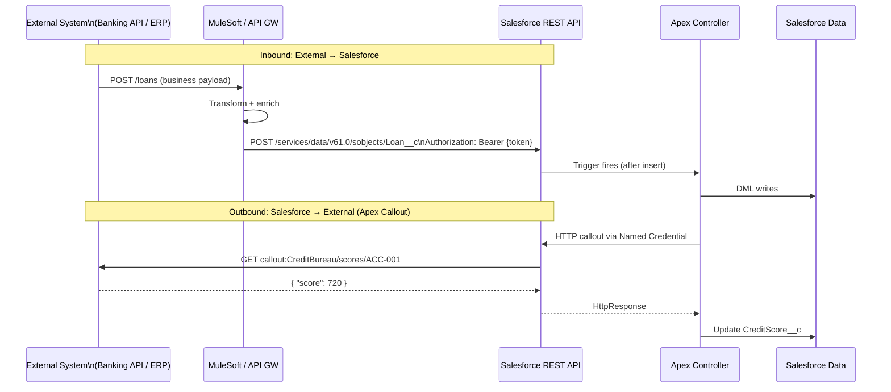

# Integration Patterns

## Category

Salesforce — Integration & Events

## Context

Salesforce sits at the centre of most enterprise CRM architectures and must integrate bidirectionally with ERPs, banking systems, marketing platforms, data warehouses, and portals. Integration patterns fall into three axes: **direction** (inbound vs outbound), **style** (REST vs SOAP vs event-driven), and **volume** (real-time single-record vs bulk).

### Integration Pattern Matrix

| Pattern | Direction | Style | Volume | Use Case |
|---------|-----------|-------|--------|---------|
| **REST API (inbound)** | External → Salesforce | Synchronous | Low–medium | Mobile app, portal, microservice writing CRM data |
| **SOAP API (inbound)** | External → Salesforce | Synchronous | Low | Legacy ERP, B2B XML integrations |
| **Bulk API 2.0 (inbound)** | External → Salesforce | Async batch | High | Nightly data loads, migrations |
| **Apex REST Callout** | Salesforce → External | Synchronous | Low | Trigger-driven lookup, credit check |
| **Outbound Messaging** | Salesforce → External | Async SOAP push | Low–medium | Declarative workflow notifications |
| **Platform Events** | Salesforce ↔ External | Async event bus | Medium | Event-driven; see [Pattern 08](08-platform-events-cdc.md) |
| **Named Credentials + External Services** | Salesforce → External | Sync REST | Low | Declarative callout — no Apex needed |
| **MuleSoft / middleware** | Both | Any | Any | Complex transformations, orchestration |

### OAuth 2.0 Flows for Salesforce

| Flow | Use Case | Token Type |
|------|---------|-----------|
| **Username-Password** | Server-to-server (legacy; avoid if possible) | Access token (no refresh) |
| **JWT Bearer** | Server-to-server; no user interaction | Access token |
| **Web Server (Auth Code)** | User-facing web apps | Access + refresh token |
| **Device Flow** | IoT, CLI tools | Access + refresh token |
| **PKCE (Mobile / SPA)** | Mobile apps, SPAs | Access + refresh token |

### Named Credentials

Named Credentials store endpoint URL, authentication, and optionally per-user authentication — centralising callout config. Apex `callout:NamedCredential` references avoid hardcoding URLs or credentials in code.

## Pros

- REST API with OAuth JWT Bearer enables fully automated server-to-server integration without stored passwords
- Named Credentials + External Services enable declarative callouts from Flow — no Apex required
- Salesforce REST API automatically enforces object/field security based on the OAuth token's user — no manual security check
- Connected Apps with IP restrictions and certificate-pinning reduce attack surface for integrations
- Bulk API 2.0 handles up to 100M records per job — eliminates governor limit concerns for large loads

## Cons

- Salesforce API calls count against org-level **API request limits** (varies by edition — typically 1M/day for Enterprise)
- Async callouts from Apex triggers require `@future` or Queueable — synchronous callouts in triggers are forbidden
- Outbound Messaging is SOAP-based and requires the receiving endpoint to reply with an ACK; no retry control
- OAuth Username-Password flow transmits credentials on every call — avoid in favour of JWT Bearer
- Rate limits on connected apps can be misconfigured — monitor `API_Usage_Meter` events

## Design Diagram



## Code Sample

### Apex — Inbound REST API endpoint (`@RestResource`)

```apex
@RestResource(urlMapping='/loans/*')
global with sharing class LoanRestResource {

    @HttpGet
    global static LoanResponse doGet() {
        RestRequest req = RestContext.request;
        String loanId = req.requestURI.substringAfterLast('/');

        List<Loan__c> loans = [
            SELECT Id, Name, LoanAmount__c, Status__c, InterestRate__c,
                   Account__r.Name
            FROM Loan__c
            WHERE Id = :loanId
            WITH SECURITY_ENFORCED
            LIMIT 1
        ];

        if (loans.isEmpty()) {
            RestContext.response.statusCode = 404;
            return new LoanResponse(null, 'Loan not found');
        }
        return new LoanResponse(loans[0], null);
    }

    @HttpPost
    global static LoanResponse doPost(LoanRequest payload) {
        // Validate required fields
        if (String.isBlank(payload.accountExternalId) || payload.loanAmount == null) {
            RestContext.response.statusCode = 400;
            return new LoanResponse(null, 'accountExternalId and loanAmount are required');
        }

        // Upsert Account by External ID
        Account acc = new Account(ExternalAccountId__c = payload.accountExternalId);
        upsert acc ExternalAccountId__c;

        // Create loan
        Loan__c loan = new Loan__c(
            Account__c     = acc.Id,
            LoanAmount__c  = payload.loanAmount,
            InterestRate__c = payload.interestRate ?? 3.5,
            Status__c      = 'Draft',
            ExternalLoanId__c = payload.externalLoanId
        );
        insert loan;

        RestContext.response.statusCode = 201;
        return new LoanResponse(loan, null);
    }

    global class LoanRequest {
        global String accountExternalId;
        global String externalLoanId;
        global Decimal loanAmount;
        global Decimal interestRate;
    }

    global class LoanResponse {
        global String loanId;
        global String name;
        global String error;
        global LoanResponse(Loan__c loan, String error) {
            this.error = error;
            if (loan != null) {
                this.loanId = loan.Id;
                this.name   = loan.Name;
            }
        }
    }
}
```

### Apex — Outbound callout via Named Credential

```apex
public class CreditBureauService {
    private static final String NAMED_CREDENTIAL = 'callout:CreditBureau';

    public static CreditScoreResult getScore(String externalAccountId) {
        HttpRequest req = new HttpRequest();
        req.setEndpoint(NAMED_CREDENTIAL + '/v2/scores/' + EncodingUtil.urlEncode(externalAccountId, 'UTF-8'));
        req.setMethod('GET');
        req.setHeader('Accept', 'application/json');
        req.setTimeout(10_000);

        HttpResponse res = new Http().send(req);

        if (res.getStatusCode() != 200) {
            throw new CalloutException(
                'Credit bureau returned ' + res.getStatusCode() + ': ' + res.getBody()
            );
        }

        Map<String, Object> body = (Map<String, Object>) JSON.deserializeUntyped(res.getBody());
        return new CreditScoreResult(
            (Integer) body.get('score'),
            (String)  body.get('grade'),
            (String)  body.get('reportId')
        );
    }

    public class CreditScoreResult {
        public Integer score;
        public String  grade;
        public String  reportId;
        public CreditScoreResult(Integer score, String grade, String reportId) {
            this.score    = score;
            this.grade    = grade;
            this.reportId = reportId;
        }
    }
}
```

### TypeScript — External system calling Salesforce REST API with JWT Bearer OAuth

```typescript
import crypto from 'node:crypto';
import qs from 'node:querystring';

interface SalesforceToken {
  access_token: string;
  instance_url: string;
}

async function getSalesforceToken(config: {
  clientId: string;
  username: string;
  privateKey: string;
  audience: string; // https://login.salesforce.com or My Domain
}): Promise<SalesforceToken> {
  const now = Math.floor(Date.now() / 1000);
  const claim = {
    iss: config.clientId,
    sub: config.username,
    aud: config.audience,
    exp: now + 300, // 5 min max
  };

  const header = Buffer.from(JSON.stringify({ alg: 'RS256' })).toString('base64url');
  const payload = Buffer.from(JSON.stringify(claim)).toString('base64url');
  const signingInput = `${header}.${payload}`;

  const sign = crypto.createSign('RSA-SHA256');
  sign.update(signingInput);
  const signature = sign.sign(config.privateKey, 'base64url');
  const jwt = `${signingInput}.${signature}`;

  const response = await fetch(`${config.audience}/services/oauth2/token`, {
    method: 'POST',
    headers: { 'Content-Type': 'application/x-www-form-urlencoded' },
    body: qs.stringify({
      grant_type: 'urn:ietf:params:oauth:grant-type:jwt-bearer',
      assertion: jwt,
    }),
  });

  if (!response.ok) throw new Error(`OAuth failed: ${await response.text()}`);
  return response.json() as Promise<SalesforceToken>;
}

async function upsertLoan(token: SalesforceToken, loan: {
  ExternalLoanId__c: string;
  LoanAmount__c: number;
  Status__c: string;
}): Promise<void> {
  const url =
    `${token.instance_url}/services/data/v61.0/sobjects/Loan__c/ExternalLoanId__c/${encodeURIComponent(loan.ExternalLoanId__c)}`;

  const res = await fetch(url, {
    method: 'PATCH',
    headers: {
      Authorization: `Bearer ${token.access_token}`,
      'Content-Type': 'application/json',
    },
    body: JSON.stringify({ LoanAmount__c: loan.LoanAmount__c, Status__c: loan.Status__c }),
  });

  if (!res.ok && res.status !== 204) {
    throw new Error(`Upsert failed (${res.status}): ${await res.text()}`);
  }
}
```

### XML — Named Credential + External Credential metadata

```xml
<!-- namedCredentials/CreditBureau.namedCredential-meta.xml -->
<?xml version="1.0" encoding="UTF-8"?>
<NamedCredential xmlns="http://soap.sforce.com/2006/04/metadata">
    <label>Credit Bureau</label>
    <name>CreditBureau</name>
    <url>https://api.creditbureau.example.com</url>
    <allowMergeFieldsInBody>false</allowMergeFieldsInBody>
    <allowMergeFieldsInHeader>false</allowMergeFieldsInHeader>
    <generateAuthorizationHeader>true</generateAuthorizationHeader>
    <principalType>NamedUser</principalType>
</NamedCredential>
```

## References

- [Salesforce REST API Developer Guide](https://developer.salesforce.com/docs/atlas.en-us.api_rest.meta/api_rest/)
- [OAuth 2.0 JWT Bearer Flow](https://help.salesforce.com/s/articleView?id=sf.remoteaccess_oauth_jwt_flow.htm)
- [Named Credentials](https://help.salesforce.com/s/articleView?id=sf.named_credentials_about.htm)
- [Apex HTTP Callouts](https://developer.salesforce.com/docs/atlas.en-us.apexcode.meta/apexcode/apex_callouts.htm)
- [Integration Patterns and Best Practices (Architect Guide)](https://architect.salesforce.com/decision-guides/trigger-based-integration)
