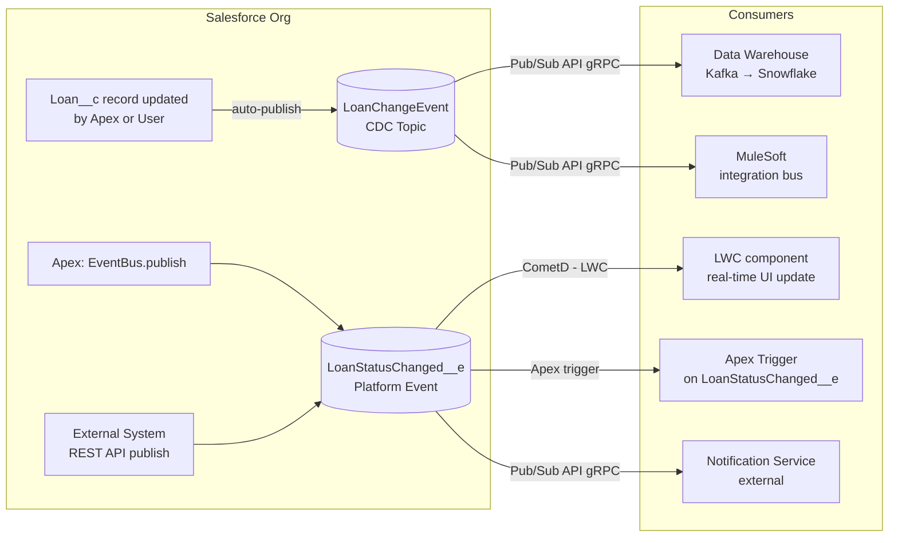

# Platform Events & Change Data Capture

## Category

Salesforce — Integration & Events

## Context

**Platform Events** are Salesforce's native event bus — a publish-subscribe mechanism built on top of Kafka-compatible infrastructure. **Change Data Capture (CDC)** is a specialised platform event type that automatically publishes record change events (create, update, delete, undelete) for any standard or custom object. Both use the **Pub/Sub API** (gRPC-based, introduced in API v54) for high-throughput, low-latency streaming to external systems.

### Platform Events vs CDC vs Outbound Messaging

| Aspect | Platform Events | Change Data Capture | Outbound Messaging |
|--------|----------------|--------------------|--------------------|
| Payload | Custom fields you define | Full record diff (changed fields) | Configurable fields on record |
| Trigger | Any publish call | Record DML (automatic) | Workflow / Process (deprecated) |
| Protocol | Subscribe: CometD, gRPC Pub/Sub API | Same | SOAP push to endpoint |
| Replay | 3 days (High Volume) / 24 hrs (Standard) | 3 days | No replay |
| External pub | Yes (REST API) | No (Salesforce internal only) | N/A |
| Volume | Up to 250K/day (Standard), unlimited (HV) | Based on CDC allocations | Low |

### Platform Event Types

| Type | Delivery | Max Retention | Use Case |
|------|----------|--------------|---------|
| **Standard Platform Event** | At-least-once | 24 hours | General purpose event bus |
| **High Volume Platform Event** | At-least-once | 72 hours | High throughput; external publish via API |

### CDC — Changed Fields in Payload

CDC events include a `ChangeEventHeader` with:
- `changeType`: `CREATE`, `UPDATE`, `DELETE`, `UNDELETE`, `GAP_CREATE`, `GAP_UPDATE`, `GAP_DELETE`, `GAP_UNDELETE`
- `changedFields`: Array of API names of only the fields that changed
- `recordIds`: Array of affected record IDs
- `entityName`: Object API name
- `transactionKey`: Unique ID for the DML transaction
- `commitNumber`: Monotonically increasing replay ID

## Pros

- Decouples producers and consumers — no direct service call; consumer processes asynchronously
- Replay window (up to 72 hours for HV events) enables subscriber recovery after downtime
- CDC captures field-level diffs — consumers receive only changed data, not full record snapshot
- Platform Event triggers in Apex run in their own transaction — isolated from the DML that published
- Pub/Sub API (gRPC) enables high-throughput streaming to external data platforms, eliminating polling

## Cons

- Standard Platform Events limited to 250K events/day per org — plan for High Volume Events if needed
- CDC events respect object-level security but NOT field-level security — FLS is not enforced on CDC payloads
- `GAP_*` change types indicate missed events (replica lag) — consumers must handle full-record re-sync
- Platform Event triggers (`after insert` on `__e` objects) count against the same Apex governor limits
- Pub/Sub API requires gRPC client — not natively available in all languages without a library

## Design Diagram



## Code Sample

### Apex — Define and publish a custom Platform Event

```apex
// Platform Event object: LoanStatusChanged__e with fields:
// LoanId__c (Text), OldStatus__c (Text), NewStatus__c (Text), ChangedBy__c (Text)

public class LoanEventPublisher {
    public static void publishStatusChange(
        Id loanId,
        String oldStatus,
        String newStatus
    ) {
        LoanStatusChanged__e event = new LoanStatusChanged__e(
            LoanId__c    = loanId,
            OldStatus__c = oldStatus,
            NewStatus__c = newStatus,
            ChangedBy__c = UserInfo.getUserId()
        );

        Database.SaveResult result = EventBus.publish(event);

        if (!result.isSuccess()) {
            for (Database.Error err : result.getErrors()) {
                throw new EventBus.RetryableException(
                    'Failed to publish LoanStatusChanged__e: ' + err.getMessage()
                );
            }
        }
    }

    // Bulk publish — more efficient than per-record publish
    public static void publishBulk(List<Loan__c> changedLoans, Map<Id, Loan__c> oldMap) {
        List<LoanStatusChanged__e> events = new List<LoanStatusChanged__e>();
        for (Loan__c loan : changedLoans) {
            Loan__c oldLoan = oldMap.get(loan.Id);
            if (loan.Status__c != oldLoan.Status__c) {
                events.add(new LoanStatusChanged__e(
                    LoanId__c    = loan.Id,
                    OldStatus__c = oldLoan.Status__c,
                    NewStatus__c = loan.Status__c,
                    ChangedBy__c = UserInfo.getUserId()
                ));
            }
        }
        if (!events.isEmpty()) {
            List<Database.SaveResult> results = EventBus.publish(events);
        }
    }
}
```

### Apex — Platform Event trigger subscriber

```apex
// Triggers on Platform Events must be: after insert only
trigger LoanStatusChangedTrigger on LoanStatusChanged__e (after insert) {
    List<Task> tasks = new List<Task>();

    for (LoanStatusChanged__e event : Trigger.new) {
        // Each event runs in its own governor-limit context
        if (event.NewStatus__c == 'Active') {
            tasks.add(new Task(
                Subject      = 'Loan activated — schedule welcome call',
                WhatId       = event.LoanId__c,
                ActivityDate = Date.today().addDays(3),
                Status       = 'Not Started',
                Priority     = 'Normal'
            ));
        }
    }

    if (!tasks.isEmpty()) insert tasks;

    // Set resume checkpoint — events after this replay ID are re-queued on next batch
    EventBus.TriggerContext.currentContext().setResumeCheckpoint(
        Trigger.new[Trigger.new.size() - 1].ReplayId
    );
}
```

### LWC — Subscribe to Platform Event in real time (CometD / empApi)

```javascript
// loanStatusMonitor.js
import { LightningElement, track } from 'lwc';
import { subscribe, unsubscribe, onError } from 'lightning/empApi';

export default class LoanStatusMonitor extends LightningElement {
    @track events = [];
    subscription = null;
    channelName = '/event/LoanStatusChanged__e';

    connectedCallback() {
        onError(error => console.error('EMP API error:', JSON.stringify(error)));
        this.subscribeToChannel();
    }

    async subscribeToChannel() {
        // -1 = latest events only; use a specific ReplayId to replay historical
        this.subscription = await subscribe(this.channelName, -1, (message) => {
            const data = message.data.payload;
            this.events = [
                {
                    id: message.data.event.replayId,
                    loanId: data.LoanId__c,
                    from: data.OldStatus__c,
                    to: data.NewStatus__c,
                    time: new Date().toLocaleTimeString()
                },
                ...this.events.slice(0, 49)   // keep last 50
            ];
        });
    }

    disconnectedCallback() {
        if (this.subscription) unsubscribe(this.subscription);
    }
}
```

### TypeScript — Subscribe to CDC via Pub/Sub API (gRPC)

```typescript
import { PubSubApiClient } from 'salesforce-pubsub-api-client';

const client = new PubSubApiClient({
  authType: 'oauth-client-credentials',
  loginUrl: process.env.SF_LOGIN_URL!,
  clientId: process.env.SF_CLIENT_ID!,
  clientSecret: process.env.SF_CLIENT_SECRET!,
});

await client.connect();

// Subscribe to CDC for Loan__c — receives every field change
const subscription = await client.subscribe('/data/Loan__ChangeEvent', -1, 100);

subscription.on('data', async (event) => {
  const { changeType, changedFields, recordIds } = event.data.ChangeEventHeader;

  console.log(`CDC event: ${changeType} on ${recordIds.join(', ')}`);
  console.log('Changed fields:', changedFields);

  if (changeType === 'UPDATE' && changedFields.includes('Status__c')) {
    // Sync new status to data warehouse
    await syncLoanStatusToWarehouse(recordIds[0], event.data.Status__c);
  }
});

subscription.on('error', (err) => console.error('Subscription error:', err));
```

### XML — Enable CDC for Loan__c object

```xml
<!-- codeSettings/LoanChangeEvent.cdc-meta.xml -->
<?xml version="1.0" encoding="UTF-8"?>
<PlatformEventChannel xmlns="http://soap.sforce.com/2006/04/metadata">
    <channelType>data</channelType>
    <label>Loan Change Event Channel</label>
</PlatformEventChannel>
```

```bash
# Enable CDC for custom object via SFDX
sf data query \
  --query "SELECT EntityName, IsEnabled FROM PlatformEventChannelMember" \
  --use-tooling-api

# Enable via Tooling API
curl -X POST "$SF_INSTANCE_URL/services/data/v61.0/tooling/sobjects/PlatformEventChannelMember" \
  -H "Authorization: Bearer $SF_TOKEN" \
  -H "Content-Type: application/json" \
  -d '{"EventChannel":"0YBXX0000004CpeOAE","SelectedEntity":"Loan__c"}'
```

## References

- [Platform Events Developer Guide](https://developer.salesforce.com/docs/atlas.en-us.platform_events.meta/platform_events/)
- [Change Data Capture Developer Guide](https://developer.salesforce.com/docs/atlas.en-us.change_data_capture.meta/change_data_capture/)
- [Pub/Sub API](https://developer.salesforce.com/docs/platform/pub-sub-api/overview)
- [Lightning EmpApi (LWC)](https://developer.salesforce.com/docs/component-library/bundle/lightning-emp-api)
- [salesforce-pubsub-api-client (Node.js)](https://github.com/pozil/salesforce-pubsub-api-client)
