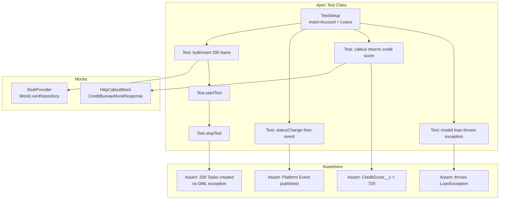

# Testing Strategies

## Category

Salesforce — DevOps & Quality

## Context

Salesforce enforces a **minimum 75% Apex code coverage** threshold for production deployments. But coverage alone does not equal quality — effective Salesforce testing combines Apex unit tests, mock-based isolation tests, LWC Jest component tests, and end-to-end validation in full sandboxes. Testing is the gate between development and deployment.

### Test Pyramid for Salesforce

| Level | Tool | Speed | Fidelity | Gate |
|-------|------|-------|---------|------|
| **Apex Unit** | `@IsTest` classes, `Test.startTest/stopTest` | Fast | Business logic, DML, SOQL | Required — 75% coverage |
| **Apex Mock / Stub** | `StubProvider`, `HttpCalloutMock` | Fast | Isolation of callouts, external deps | Recommended |
| **LWC Unit** | Jest + `@salesforce/sfdx-lwc-jest` | Fast | Component rendering, events | Required for LWC |
| **Integration (Org)** | Apex tests against shared sandbox data | Medium | Real data, full stack | UAT environments |
| **End-to-End** | Selenium / Playwright / Provar | Slow | UI + full business flow | Release gate |

### Apex Test Best Practices

| Practice | Reason |
|---------|--------|
| Use `@TestSetup` for shared data | Runs once per test class; faster than `@BeforeEach` per test |
| Assert specific field values, not just record count | Coverage does not mean correctness |
| Test bulk — always pass 200 records | Validates bulkification and governor limit safety |
| Use `Test.setMock` for callouts | Apex throws exception if callout attempted in test without mock |
| Test negative paths — invalid input, missing records | Real bugs hide in error paths |
| Never rely on existing org data in tests | `SeeAllData=false` is the default and correct setting |

## Pros

- `Test.startTest()` / `Test.stopTest()` resets governor limits — simulate async behaviour (future, batch) in tests
- `StubProvider` interface enables full dependency inversion — test business logic without DML
- LWC Jest runs in Node.js — no org, no scratch org, no waiting; runs in milliseconds
- `HttpCalloutMock` lets Apex callout tests run without real HTTP — deterministic and repeatable
- Apex test results include line-by-line code coverage highlighting in VS Code

## Cons

- 75% coverage threshold can be gamed with coverage-only tests that assert nothing — enforce quality, not just coverage
- Apex tests cannot run in parallel — test suites on large orgs can take 30+ minutes
- `@IsTest(SeeAllData=true)` is dangerous — tests depend on org state, break in different environments
- LWC Jest mocks of Apex wire adapters are manual — must align mock data with real Apex outputs
- End-to-end test tools (Provar, Selenium) are brittle against UI changes and expensive to maintain

## Design Diagram



## Code Sample

### Apex — Test class with `@TestSetup`, bulk test, callout mock

```apex
@IsTest
private class LoanServiceTest {

    @TestSetup
    static void setupData() {
        Account acc = new Account(Name = 'Test Bank', BillingCountry = 'GB');
        insert acc;

        List<Loan__c> loans = new List<Loan__c>();
        for (Integer i = 0; i < 200; i++) {
            loans.add(new Loan__c(
                Account__c    = acc.Id,
                Name          = 'Loan ' + i,
                LoanAmount__c = 10_000 + (i * 100),
                Status__c     = 'Draft',
                InterestRate__c = 3.5
            ));
        }
        insert loans;
    }

    @IsTest
    static void testBulkStatusActivation_createsTasksForHighValue() {
        List<Loan__c> loans = [SELECT Id, LoanAmount__c, Status__c FROM Loan__c];
        Assert.areEqual(200, loans.size(), 'Setup should have created 200 loans');

        for (Loan__c loan : loans) {
            loan.Status__c = 'Active';
        }

        Test.startTest();
        update loans;   // Fires trigger → LoanService → Task insert
        Test.stopTest();

        // High-value loans (> 100K) should have tasks
        List<Task> tasks = [SELECT Id, Subject, WhatId FROM Task];
        Integer expectedHighValue = 0;
        for (Loan__c l : loans) {
            if (l.LoanAmount__c > 100_000) expectedHighValue++;
        }

        Assert.areEqual(expectedHighValue, tasks.size(), 'One task per high-value loan');
        Assert.areEqual('Senior Review Required', tasks[0].Subject);
    }

    @IsTest
    static void testCreditScoreCallout_updatesLoan() {
        Loan__c loan = [SELECT Id, ExternalLoanId__c FROM Loan__c LIMIT 1];

        // Register callout mock
        Test.setMock(HttpCalloutMock.class, new CreditBureauMock(720, 'A'));

        Test.startTest();
        CreditBureauService.CreditScoreResult result =
            CreditBureauService.getScore('EXT-001');
        Test.stopTest();

        Assert.areEqual(720, result.score);
        Assert.areEqual('A', result.grade);
    }

    @IsTest
    static void testInvalidLoanAmount_throwsException() {
        Account acc = [SELECT Id FROM Account LIMIT 1];
        Loan__c badLoan = new Loan__c(
            Account__c    = acc.Id,
            LoanAmount__c = -500,   // invalid
            Status__c     = 'Draft'
        );

        try {
            insert badLoan;
            Assert.fail('Expected DMLException for negative loan amount');
        } catch (DMLException ex) {
            Assert.isTrue(
                ex.getMessage().contains('LoanAmount__c'),
                'Exception should reference the invalid field'
            );
        }
    }
}
```

### Apex — HTTP callout mock

```apex
@IsTest
public class CreditBureauMock implements HttpCalloutMock {
    private Integer score;
    private String grade;

    public CreditBureauMock(Integer score, String grade) {
        this.score = score;
        this.grade = grade;
    }

    public HttpResponse respond(HttpRequest req) {
        Assert.isTrue(req.getEndpoint().contains('/scores/'), 'Unexpected endpoint');
        Assert.areEqual('GET', req.getMethod());

        HttpResponse res = new HttpResponse();
        res.setStatusCode(200);
        res.setHeader('Content-Type', 'application/json');
        res.setBody(JSON.serialize(new Map<String, Object>{
            'score'    => this.score,
            'grade'    => this.grade,
            'reportId' => 'RPT-' + Crypto.getRandomInteger()
        }));
        return res;
    }
}
```

### Apex — Stub provider for dependency injection

```apex
@IsTest
public class MockLoanRepository implements StubProvider {
    private Map<String, Object> returnValues = new Map<String, Object>();

    public MockLoanRepository withReturn(String methodName, Object value) {
        returnValues.put(methodName, value);
        return this;
    }

    public Object handleMethodCall(
        Object stubbedObject,
        String stubbedMethodName,
        Type returnType,
        List<Type> paramTypes,
        List<String> paramNames,
        List<Object> args
    ) {
        if (returnValues.containsKey(stubbedMethodName)) {
            return returnValues.get(stubbedMethodName);
        }
        return null;
    }
}

// Usage in test
@IsTest
static void testServiceWithMockRepo() {
    MockLoanRepository mockRepo = new MockLoanRepository()
        .withReturn('findByStatus', new List<Loan__c>{
            new Loan__c(Name = 'Mock Loan', LoanAmount__c = 500_000, Status__c = 'Active')
        });

    LoanRepository repo = (LoanRepository) Test.createStub(LoanRepository.class, mockRepo);
    LoanService service = new LoanService(repo);

    List<Loan__c> results = service.getActiveHighValueLoans();
    Assert.isFalse(results.isEmpty(), 'Should return mocked loans');
}
```

### JavaScript — LWC Jest test with wire adapter mock

```javascript
// __tests__/loanDashboard.test.js
import { createElement } from 'lwc';
import LoanDashboard from 'c/loanDashboard';
import { registerApexTestWireAdapter } from '@salesforce/sfdx-lwc-jest';
import getActiveLoans from '@salesforce/apex/LoanController.getActiveLoans';

const getActiveLoansAdapter = registerApexTestWireAdapter(getActiveLoans);

const MOCK_LOANS = [
  { Id: '001000000000001', Name: 'LN-001', LoanAmount__c: 250000, Status__c: 'Active' },
  { Id: '001000000000002', Name: 'LN-002', LoanAmount__c: 75000,  Status__c: 'Active' },
];

describe('loanDashboard', () => {
  let element;

  beforeEach(() => {
    element = createElement('c-loan-dashboard', { is: LoanDashboard });
    document.body.appendChild(element);
  });

  afterEach(() => {
    document.body.removeChild(element);
  });

  it('renders loan datatable with wire data', async () => {
    getActiveLoansAdapter.emit(MOCK_LOANS);
    await Promise.resolve();

    const datatable = element.shadowRoot.querySelector('lightning-datatable');
    expect(datatable).not.toBeNull();
    expect(datatable.data).toHaveLength(2);
    expect(datatable.data[0].Name).toBe('LN-001');
  });

  it('shows error message when wire returns error', async () => {
    getActiveLoansAdapter.error({ message: 'No access' });
    await Promise.resolve();

    const error = element.shadowRoot.querySelector('.slds-text-color_error');
    expect(error).not.toBeNull();
  });

  it('dispatches loanselect event on row action', async () => {
    getActiveLoansAdapter.emit(MOCK_LOANS);
    await Promise.resolve();

    const handler = jest.fn();
    element.addEventListener('loanselect', handler);

    const datatable = element.shadowRoot.querySelector('lightning-datatable');
    datatable.dispatchEvent(new CustomEvent('rowaction', {
      detail: { action: { name: 'select' }, row: MOCK_LOANS[0] }
    }));

    expect(handler).toHaveBeenCalled();
  });
});
```

## References

- [Apex Testing Developer Guide](https://developer.salesforce.com/docs/atlas.en-us.apexcode.meta/apexcode/apex_testing.htm)
- [LWC Testing with Jest](https://developer.salesforce.com/docs/component-library/documentation/en/lwc/lwc.unit_testing_using_jest_introduction)
- [HttpCalloutMock](https://developer.salesforce.com/docs/atlas.en-us.apexcode.meta/apexcode/apex_classes_restful_http_testing_httpcalloutmock.htm)
- [StubProvider](https://developer.salesforce.com/docs/atlas.en-us.apexcode.meta/apexcode/apex_testing_stub_api.htm)
- [Code Coverage Best Practices](https://developer.salesforce.com/blogs/2022/05/code-coverage-in-salesforce)
