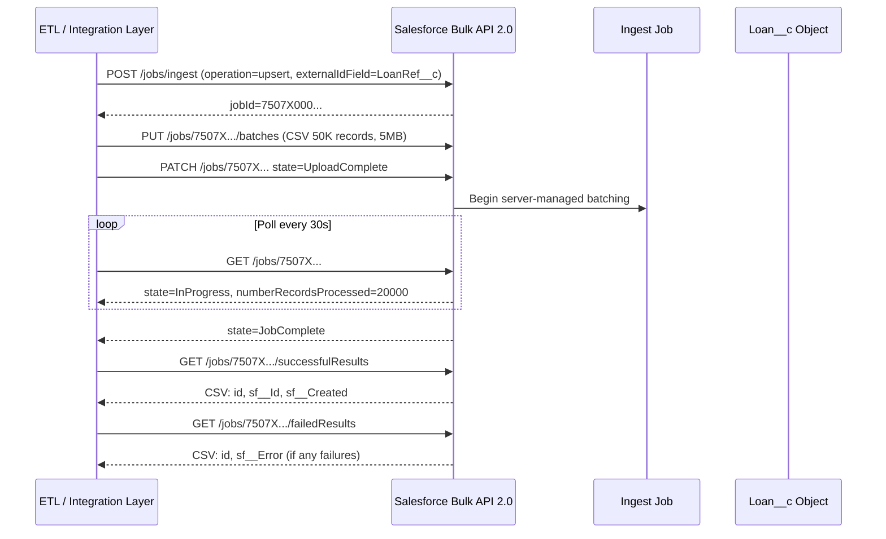

# Bulk API & Large Data Volume Patterns

## Category

Salesforce — Data Engineering

## Context

Salesforce is not designed to process millions of records through standard SOAP/REST API. **Bulk API 2.0** is the correct mechanism for large-scale data operations — it uses an async job model that bypasses single-request limits and processes data in parallel batches of up to 10,000 records per batch server-side.

**Large Data Volume (LDV)** design is equally important — org performance degrades with millions of records if objects lack proper selective indexes, skinny tables, or query filters. LDV is a data modelling and query optimisation discipline.

### Bulk API 2.0 vs 1.0

| Capability | Bulk API 1.0 | Bulk API 2.0 |
|-----------|-------------|-------------|
| Protocol | SOAP-based XML | REST + CSV/JSON |
| Job types | Insert, Update, Delete, Query, Upsert | Same |
| Batch size | Manual (up to 10K records) | Server-managed |
| Result retrieval | Per-batch | Single endpoint |
| PK Chunking | Supported | Query supports automatically |
| Preferred | Legacy integrations | All new development |

### Bulk API 2.0 Job Lifecycle

| Step | API Call | Description |
|------|---------|-------------|
| **1. Create job** | `POST /jobs/ingest` | Specify operation, object, external ID field |
| **2. Upload data** | `PUT /jobs/{jobId}/batches` | Upload CSV chunks (max 100MB / 150M chars per chunk) |
| **3. Close job** | `PATCH /jobs/{jobId}` `state: UploadComplete` | Signal upload is done; processing begins |
| **4. Poll status** | `GET /jobs/{jobId}` until `state: JobComplete` | Wait for completion |
| **5. Get results** | `GET /jobs/{jobId}/successfulResults` | Download successful record IDs |
| **6. Get failures** | `GET /jobs/{jobId}/failedResults` | Download failed records with error messages |

### Large Data Volume Guidelines

| Issue | Root Cause | Solution |
|-------|-----------|---------|
| Slow SOQL on custom object | No selective index on queried field | Ask Salesforce Support to add custom index |
| Full table scan | Non-selective WHERE clause | Use indexed fields + limit result sets |
| Sharing recalculation timeout | OWD change on LDV object | Change OWD during off-peak; use parallel recalculation |
| Lock contention on parent record | Thousands of children updating parent | Defer parent rollup updates; use Apex async |
| Dashboard timeout | Unfiltered `COUNT()` on 10M+ rows | Use CRM Analytics for reporting on LDV objects |

## Pros

- Bulk API 2.0 bypasses per-request limits — processes up to 100M records per 24-hour rolling window
- CSV format is efficient and easy to generate from ETL tools
- Server-managed batching removes the need to split records client-side
- `PK Chunking` for Query jobs divides large result sets using record ID ranges — no `ORDER BY OFFSET` performance penalty
- `Batch Apex` provides DML-based bulk processing inside Salesforce with `Database.QueryLocator` handling up to 50M records

## Cons

- Bulk API is asynchronous — polling adds operational complexity for real-time use cases
- `Bulk API 2.0` does not support `upsert` with relationships resolved in the same job — references must be External IDs
- Skinny table requests require Salesforce Support involvement — cannot be self-configured
- `Batch Apex` is limited to 5 concurrent running batch jobs per org — queue congestion is common
- Binary field types (Blob, Base64) are not supported in Bulk API — must use separate attachments API

## Design Diagram



## Code Sample

### TypeScript — Bulk API 2.0 upsert with polling

```typescript
import axios from 'axios';
import { createReadStream } from 'fs';

const SF_INSTANCE = process.env.SF_INSTANCE_URL!;
const ACCESS_TOKEN = process.env.SF_ACCESS_TOKEN!;

const api = axios.create({
  baseURL: `${SF_INSTANCE}/services/data/v60.0/jobs/ingest`,
  headers: { Authorization: `Bearer ${ACCESS_TOKEN}` },
});

async function bulkUpsertLoans(csvFilePath: string): Promise<void> {
  // 1. Create the ingest job
  const { data: job } = await api.post('/', {
    operation:       'upsert',
    object:          'Loan__c',
    externalIdFieldName: 'LoanRef__c',
    contentType:     'CSV',
    lineEnding:      'LF',
  });
  console.log(`Job created: ${job.id}`);

  // 2. Upload CSV data
  const csvStream = createReadStream(csvFilePath);
  await api.put(`/${job.id}/batches`, csvStream, {
    headers: { 'Content-Type': 'text/csv' },
    maxBodyLength: Infinity,
  });

  // 3. Signal upload is complete
  await api.patch(`/${job.id}`, { state: 'UploadComplete' });

  // 4. Poll until job completes
  const completed = await pollJobUntilDone(job.id);
  console.log(`Processed: ${completed.numberRecordsProcessed}, Failed: ${completed.numberRecordsFailed}`);

  // 5. Retrieve results
  if (completed.numberRecordsFailed > 0) {
    const { data: failures } = await api.get(`/${job.id}/failedResults`, {
      headers: { Accept: 'text/csv' },
    });
    console.error('Failed records:\n', failures.slice(0, 2000)); // first 2KB
  }
}

async function pollJobUntilDone(jobId: string, intervalMs = 30_000): Promise<any> {
  while (true) {
    const { data } = await api.get(`/${jobId}`);
    if (['JobComplete', 'Failed', 'Aborted'].includes(data.state)) return data;
    console.log(`  state=${data.state} processed=${data.numberRecordsProcessed}`);
    await new Promise(r => setTimeout(r, intervalMs));
  }
}
```

### Apex — Batch Apex for large-scale internal processing

```apex
global class LoanInterestAccrualBatch
    implements Database.Batchable<SObject>, Database.Stateful {

    global Integer recordsProcessed = 0;
    global Integer recordsFailed    = 0;

    global Database.QueryLocator start(Database.BatchableContext ctx) {
        // QueryLocator can handle up to 50M records
        return Database.getQueryLocator([
            SELECT Id, LoanAmount__c, InterestRate__c, AccruedInterest__c
            FROM Loan__c
            WHERE Status__c = 'Active'
            AND NextAccrualDate__c <= TODAY
        ]);
    }

    global void execute(Database.BatchableContext ctx, List<Loan__c> scope) {
        List<Loan__c> toUpdate = new List<Loan__c>();
        Date today = Date.today();

        for (Loan__c loan : scope) {
            Decimal daily = (loan.LoanAmount__c * loan.InterestRate__c / 100) / 365;
            toUpdate.add(new Loan__c(
                Id                = loan.Id,
                AccruedInterest__c = (loan.AccruedInterest__c ?? 0) + daily,
                NextAccrualDate__c = today.addDays(1)
            ));
        }

        Database.SaveResult[] results = Database.update(toUpdate, false); // allOrNone=false
        for (Database.SaveResult sr : results) {
            if (sr.isSuccess()) recordsProcessed++;
            else {
                recordsFailed++;
                for (Database.Error e : sr.getErrors()) {
                    System.debug(LoggingLevel.ERROR, 'Update error: ' + e.getMessage());
                }
            }
        }
    }

    global void finish(Database.BatchableContext ctx) {
        AsyncApexJob job = [
            SELECT CompletedDate, NumberOfErrors
            FROM AsyncApexJob
            WHERE Id = :ctx.getJobId()
        ];
        System.debug('Batch complete — processed: ' + recordsProcessed + ' failed: ' + recordsFailed);

        // Send summary notification
        Messaging.SingleEmailMessage email = new Messaging.SingleEmailMessage();
        email.setToAddresses(new List<String>{ 'ops-team@example.com' });
        email.setSubject('LoanInterestAccrualBatch finished');
        email.setPlainTextBody(
            'Processed: ' + recordsProcessed + '\nFailed: ' + recordsFailed
        );
        Messaging.sendEmail(new List<Messaging.SingleEmailMessage>{ email });
    }
}

// Launch from anonymous Apex or scheduler:
// Database.executeBatch(new LoanInterestAccrualBatch(), 2000);
```

### Shell — Bulk API 2.0 via SFDX CLI

```shell
# Export large data set with PK Chunking (auto-enabled for Query jobs)
sf data query bulk \
  --query "SELECT Id, LoanRef__c, LoanAmount__c, Status__c FROM Loan__c WHERE Status__c = 'Active'" \
  --output-file ./output/active-loans.csv \
  --wait 30 \
  --target-org prod

# Upsert from CSV using Bulk API v2
sf data upsert bulk \
  --sobject Loan__c \
  --file ./data/loans-upsert.csv \
  --external-id LoanRef__c \
  --wait 10 \
  --target-org prod

# Delete records using Bulk API
sf data delete bulk \
  --sobject LoanArchive__c \
  --file ./data/loans-to-delete.csv \
  --wait 10 \
  --target-org prod

# Check job status
sf data bulk results \
  --job-id 7507X000000XXXXX \
  --target-org prod
```

## References

- [Bulk API 2.0 Developer Guide](https://developer.salesforce.com/docs/atlas.en-us.api_asynch.meta/api_asynch/asynch_api_intro.htm)
- [Batch Apex](https://developer.salesforce.com/docs/atlas.en-us.apexcode.meta/apexcode/apex_batch_interface.htm)
- [Large Data Volumes in Salesforce](https://developer.salesforce.com/docs/atlas.en-us.salesforce_large_data_volumes_bp.meta/salesforce_large_data_volumes_bp/ldv_deployments_introduction.htm)
- [SFDX Data Commands](https://developer.salesforce.com/docs/atlas.en-us.sfdx_cli_reference.meta/sfdx_cli_reference/cli_reference_data_commands_unified.htm)
