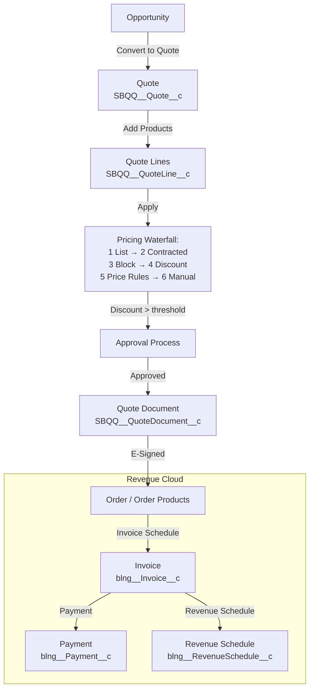

# CPQ & Revenue Cloud

## Category

Salesforce — Commerce & Monetisation

## Context

**Salesforce CPQ** (Configure, Price, Quote) automates the sales quoting process for complex product catalogues with configurable options, pricing rules, and approvals. **Revenue Cloud** (formerly Salesforce Billing) extends CPQ downstream into order management, invoicing, and revenue recognition — creating an end-to-end Lead-to-Cash process.

### CPQ Product Catalogue Hierarchy

| Level | Object | Description |
|-------|--------|-------------|
| **Product** | `Product2` | Base product or service |
| **Price Book Entry** | `PricebookEntry` | Product + currency + list price per price book |
| **Price Rule** | `SBQQ__PriceRule__c` | Conditional logic: if [condition] then set [field] = [value] |
| **Discount Schedule** | `SBQQ__DiscountSchedule__c` | Volume-based discount tiers |
| **Product Option** | `SBQQ__ProductOption__c` | Child products bundled with a parent |
| **Product Feature** | `SBQQ__Feature__c` | Groups options with min/max selection rules |
| **Configuration Attribute** | `SBQQ__ConfigurationAttribute__c` | Shared attribute across bundle options |

### CPQ Pricing Waterfall

| Step | Source | Description |
|------|--------|-------------|
| **1. List Price** | `PricebookEntry` | Starting price from the active price book |
| **2. Contracted Price** | `SBQQ__ContractedPrice__c` | Customer-specific override (wins over list) |
| **3. Block Pricing** | `SBQQ__BlockPrice__c` | Flat price per quantity range |
| **4. Discount Schedule** | `SBQQ__DiscountSchedule__c` | Volume or term discount |
| **5. Price Rule** | `SBQQ__PriceRule__c` | Custom conditional pricing logic |
| **6. Manual Discount** | Quote Line field | Sales rep enters; subject to approval thresholds |
| **7. Additional Discount** | Quote-level field | Additional % off net price; triggers approval |

### CPQ vs Revenue Cloud Scope

| Capability | Salesforce CPQ | Revenue Cloud |
|-----------|---------------|--------------|
| Product configuration | ✅ | ✅ |
| Quoting & approvals | ✅ | ✅ |
| Contract creation | ✅ | ✅ |
| Order management | Limited | ✅ |
| Invoicing | ❌ | ✅ |
| Payments | ❌ | ✅ (+ Stripe/Adyen via adapters) |
| Revenue recognition | ❌ | ✅ (ASC 606 / IFRS 15) |
| Subscription management | ✅ (Amendments, Renewals) | ✅ + Evergreen |

## Pros

- CPQ eliminates manual quoting errors — pricing rules and validation are enforced declaratively
- Amendment and renewal automation dramatically reduces sales rep effort on subscription products
- Revenue Cloud supports complex revenue recognition schedules natively — avoids custom-built finance logic
- Product bundles with features and options handle highly configurable product catalogues
- Output documents (quotes, order forms) are auto-generated from quote data via SBQQ templates

## Cons

- CPQ introduces significant managed package metadata — understanding the object model has a steep learning curve
- Heavy price rule configurations can cause long quote calculation times (10–30s) on large quotes
- Revenue Cloud revenue recognition configuration is complex — requires a certified Revenue Cloud implementation partner
- CPQ is a managed package (SBQQ namespace) — all customisations must avoid modifying managed objects directly
- Test coverage for CPQ tests requires special CPQ test data setup helpers (`SBQQ.PackageContext`)

## Design Diagram



## Code Sample

### Apex — CPQ quote calculation trigger via QuoteAPI

```apex
// Invoke CPQ's pricing engine programmatically from Apex
// Used when quote lines need re-calculation after external changes
public class CpqQuoteCalculationService {

    public static void recalculateQuote(Id quoteId) {
        // Retrieve quote with all required fields for CPQ calculator
        SBQQ__Quote__c quote = [
            SELECT SBQQ__PricebookId__c, SBQQ__CustomerDiscount__c,
                   SBQQ__AdditionalDiscount__c, SBQQ__PartnerDiscount__c
            FROM SBQQ__Quote__c
            WHERE Id = :quoteId
        ];

        // CPQ's QuoteCalculator API — available in CPQ v230+
        SBQQ.QuoteAPI.calculate(quoteId);
    }

    // Create a contracted price override for a specific account
    public static SBQQ__ContractedPrice__c createContractedPrice(
        Id accountId, Id productId, Decimal price, Date effectiveEnd
    ) {
        return new SBQQ__ContractedPrice__c(
            SBQQ__Account__c        = accountId,
            SBQQ__Product__c        = productId,
            SBQQ__Price__c          = price,
            SBQQ__EffectiveDateEnd__c = effectiveEnd
        );
    }

    // Trigger an amendment from an existing contract
    public static Id amendContract(Id contractId) {
        // Creates a new quote in Amendment context
        Id quoteId = SBQQ.ContractAPI.amend(contractId);
        return quoteId;
    }

    // Trigger a renewal quote from an existing contract
    public static Id renewContract(Id contractId) {
        Id renewalQuoteId = SBQQ.ContractAPI.renew(new List<Id>{ contractId });
        return renewalQuoteId;
    }
}
```

### Apex — Revenue Cloud: create invoice from order

```apex
public class RevenueCloudInvoiceService {

    // Create an invoice run to bill all active orders in a billing period
    public static Id createInvoiceRun(Date targetDate) {
        blng__InvoiceRun__c invoiceRun = new blng__InvoiceRun__c(
            blng__InvoiceDate__c    = targetDate,
            blng__PostedDate__c     = targetDate,
            blng__TargetDate__c     = targetDate,
            blng__InvoiceRunStatus__c = 'Pending'
        );
        insert invoiceRun;

        // Enqueue processing
        blng.InvoiceRunAPI.run(invoiceRun.Id);
        return invoiceRun.Id;
    }

    // Apply a payment to a specific invoice
    public static void applyPayment(Id invoiceId, Decimal amount, String referenceNumber) {
        blng__Payment__c payment = new blng__Payment__c(
            blng__Invoice__c          = invoiceId,
            blng__PaymentAmount__c    = amount,
            blng__PaymentStatus__c    = 'Posted',
            blng__ReferenceNumber__c  = referenceNumber,
            blng__PaymentDate__c      = Date.today(),
            blng__PaymentType__c      = 'Bank Transfer'
        );
        insert payment;
    }
}
```

### JSON — CPQ Product configuration (Metadata API representation)

```json
{
  "Product2": {
    "Name": "Enterprise Lending Platform",
    "ProductCode": "ELP-001",
    "IsActive": true,
    "SBQQ__SubscriptionType__c": "Renewable",
    "SBQQ__SubscriptionTerm__c": 12,
    "SBQQ__BillingFrequency__c": "Annual",
    "SBQQ__BillingType__c": "Advance",
    "SBQQ__PricingMethod__c": "List"
  },
  "PricebookEntry": {
    "UnitPrice": 120000.00,
    "IsActive": true,
    "UseStandardPrice": false,
    "Pricebook2": "Standard Price Book"
  },
  "SBQQ__DiscountSchedule__c": {
    "Name": "Volume Tier — Lending Platform",
    "SBQQ__Type__c": "Range",
    "SBQQ__Unit__c": "Percent",
    "Tiers": [
      { "SBQQ__LowerBound__c": 1,   "SBQQ__UpperBound__c": 5,  "SBQQ__Discount__c": 0  },
      { "SBQQ__LowerBound__c": 6,   "SBQQ__UpperBound__c": 20, "SBQQ__Discount__c": 10 },
      { "SBQQ__LowerBound__c": 21,  "SBQQ__UpperBound__c": null, "SBQQ__Discount__c": 20 }
    ]
  }
}
```

### Shell — CPQ managed package install and config

```shell
# Install CPQ managed package into scratch org
sf package install \
  --package "04t5Y000001XXXXX" \
  --target-org scratch \
  --wait 30

# Install Revenue Cloud (Billing) managed package
sf package install \
  --package "04t5Y000001YYYYY" \
  --target-org scratch \
  --wait 30

# Assign CPQ platform permission set to integration user
sf org assign permset \
  --name "SBQQ__SteelBrickCPQAdministrator" \
  --target-org scratch

# Set CPQ settings via Anonymous Apex (required post-install)
sf apex run --file ./scripts/cpq-setup.apex --target-org scratch
```

## References

- [Salesforce CPQ Developer Guide](https://developer.salesforce.com/docs/atlas.en-us.cpq_api_dev.meta/cpq_api_dev/cpq_dev_api_intro.htm)
- [Revenue Cloud Implementation Guide](https://help.salesforce.com/s/articleView?id=sf.blng_implementation_guide.htm)
- [CPQ Pricing Methods](https://help.salesforce.com/s/articleView?id=sf.cpq_pricing.htm)
- [SBQQ Namespace Reference](https://developer.salesforce.com/docs/atlas.en-us.cpq_api_dev.meta/cpq_api_dev/cpq_dev_namespace_reference.htm)
- [CPQ & Billing Unlocked Package GA announcement](https://developer.salesforce.com/blogs/2023/07/cpq-unlocked-package)
