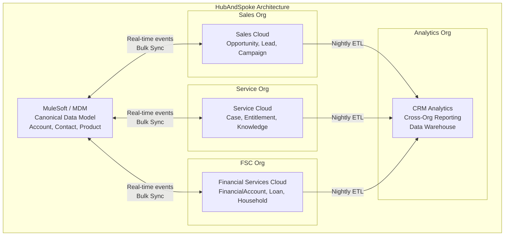

# Multi-Org Strategy

## Category

Salesforce — Architecture

## Context

Large enterprises often operate multiple Salesforce orgs for compliance, geographic, or business unit reasons. **Multi-org strategy** is the architectural decision of whether to consolidate into a single org or maintain multiple orgs, and how to connect them when they coexist.

### Single Org vs Multi-Org Trade-offs

| Dimension | Single Org | Multi-Org |
|-----------|-----------|----------|
| **Data visibility** | Unified 360-degree view | Siloed; requires integration for cross-org reporting |
| **Customisation conflicts** | Shared metadata — teams compete for the same namespace | Full isolation — each team owns their org |
| **Compliance / Data residency** | Harder — all data in one region | Cleaner — separate orgs in separate AWS regions |
| **Licensing cost** | One pool of licences | Separate licence pools per org |
| **Integration complexity** | Internal (Apex, Flow) | External (API, Platform Events, MuleSoft, S2S) |
| **Release coordination** | One deployment train | Independent deployment per org |
| **Upgrade/maintenance** | One Salesforce seasonal update | Multiple orgs to test and validate each release |

### Multi-Org Topologies

| Pattern | Shape | When to Use |
|---------|-------|------------|
| **Hub and Spoke** | One central Experience/Data org + N operational orgs | Reporting, customer 360, shared master data |
| **Autonomous Orgs** | Independent orgs — no cross-org data | Different business units with no shared customer data |
| **Tiered / Layered** | Global org → Regional orgs with data sync | Global enterprise with regional data residency requirements |
| **Integration Hub** | External MDM (e.g. MuleSoft) as the sync layer | Brownfield landscape; existing integration platform pre-dates SF |

### Cross-Org Integration Options

| Mechanism | Protocol | Typical Use |
|-----------|---------|------------|
| **Salesforce-to-Salesforce (S2S)** | Native Salesforce push subscription | Simple unidirectional sync of standard objects |
| **Platform Events** | Salesforce pub/sub across org boundary via external subscriber | Near-real-time event replication |
| **REST API / Bulk API** | HTTP | Bulk data sync jobs |
| **MuleSoft / Anypoint** | Any | Full canonical model; bi-directional complex sync |
| **Cross-Org Canvas** | Salesforce Canvas | Embed UI of one org in another |
| **External Objects + OData** | OData 4.0 | Read-only access to remote org data without data replication |

## Pros

- Multi-org is the only architecture that provides true isolation for security, compliance, and data residency requirements (e.g. GDPR, DPDPA, financial institutions with separate regulated entities)
- Independent deployment cycles remove the risk of one team's release blocking another's
- Separate orgs allow different editions and features (e.g. one org on FSC, another on Sales Cloud)
- **Experience Cloud** with an External Object (OData) connector provides a read-only unified view without full data replication

## Cons

- Multi-org requires a dedicated integration layer — ETL or an ESB/iPaaS — which adds cost and operational overhead
- Cross-org data consistency (eventual consistency) is inherently harder to guarantee than within-org transactions
- Deduplication and MDM (Master Data Management) become mandatory for shared entities like Account and Contact
- Reporting across org boundaries requires a data warehouse — Salesforce reports and dashboards do not natively span multiple orgs
- Testing integration flows requires coordination between sandbox environments of multiple orgs

## Design Diagram



## Code Sample

### Apex — Cross-org REST callout (Org A → Org B via Named Credential)

```apex
// In Org A: call a REST endpoint on Org B
// Named Credential "OrgB" stores the JWT Bearer token auth for Org B
public class CrossOrgAccountSync {

    public class SyncResult {
        public String accountId;
        public Boolean success;
        public String error;
    }

    public static SyncResult upsertAccountInOrgB(Account acc) {
        Map<String, Object> payload = new Map<String, Object>{
            'externalId' => acc.GlobalAccountId__c,
            'name'       => acc.Name,
            'phone'      => acc.Phone,
            'industry'   => acc.Industry,
            'type'       => acc.Type
        };

        HttpRequest req = new HttpRequest();
        req.setEndpoint('callout:OrgB/services/apexrest/accounts/sync');
        req.setMethod('POST');
        req.setHeader('Content-Type', 'application/json');
        req.setBody(JSON.serialize(payload));
        req.setTimeout(30_000);

        HttpResponse res = new Http().send(req);

        SyncResult result = new SyncResult();
        result.accountId = acc.Id;

        if (res.getStatusCode() == 200 || res.getStatusCode() == 201) {
            result.success = true;
        } else {
            result.success = false;
            result.error = 'HTTP ' + res.getStatusCode() + ': ' + res.getBody();
            System.debug(LoggingLevel.ERROR, 'CrossOrg sync failed: ' + result.error);
        }
        return result;
    }
}
```

### Apex — Org B: receive and upsert the inbound record

```apex
@RestResource(urlMapping='/accounts/sync/*')
global class CrossOrgAccountReceiver {

    global class AccountPayload {
        public String externalId;
        public String name;
        public String phone;
        public String industry;
        public String type;
    }

    @HttpPost
    global static void receiveAccount() {
        RestRequest req = RestContext.request;
        RestResponse res = RestContext.response;

        try {
            AccountPayload payload = (AccountPayload) JSON.deserialize(
                req.requestBody.toString(), AccountPayload.class
            );

            Account acc = new Account(
                GlobalAccountId__c = payload.externalId,
                Name               = payload.name,
                Phone              = payload.phone,
                Industry           = payload.industry,
                Type               = payload.type
            );

            // Upsert by external ID to support both insert and update
            Database.UpsertResult result = Database.upsert(acc, Account.GlobalAccountId__c, false);

            res.statusCode = result.isCreated() ? 201 : 200;
            res.responseBody = Blob.valueOf(JSON.serialize(new Map<String, Object>{
                'id'      => result.getId(),
                'created' => result.isCreated()
            }));
        } catch (Exception ex) {
            res.statusCode = 500;
            res.responseBody = Blob.valueOf(JSON.serialize(new Map<String, String>{
                'error' => ex.getMessage()
            }));
        }
    }
}
```

### YAML — GitHub Actions: deploy to multiple orgs in parallel stages

```yaml
name: Multi-Org Deploy

on:
  push:
    branches: [main]

jobs:
  deploy-sales-org:
    name: Deploy → Sales Org
    runs-on: ubuntu-latest
    environment: sales-prod
    steps:
      - uses: actions/checkout@v4
      - uses: salesforcecli/github-action@v1.5.0
        with:
          command: sf project deploy start
          flags: >-
            --source-dir force-app/sales
            --target-org sales-prod
            --wait 30
        env:
          SF_SFDX_JWT_KEY:   ${{ secrets.SALES_JWT_KEY }}
          SF_CLIENT_ID:      ${{ secrets.SALES_CLIENT_ID }}
          SF_INSTANCE_URL:   ${{ secrets.SALES_INSTANCE_URL }}
          SF_USERNAME:       ${{ secrets.SALES_USERNAME }}

  deploy-service-org:
    name: Deploy → Service Org
    runs-on: ubuntu-latest
    environment: service-prod
    steps:
      - uses: actions/checkout@v4
      - uses: salesforcecli/github-action@v1.5.0
        with:
          command: sf project deploy start
          flags: >-
            --source-dir force-app/service
            --target-org service-prod
            --wait 30
        env:
          SF_SFDX_JWT_KEY:   ${{ secrets.SERVICE_JWT_KEY }}
          SF_CLIENT_ID:      ${{ secrets.SERVICE_CLIENT_ID }}
          SF_INSTANCE_URL:   ${{ secrets.SERVICE_INSTANCE_URL }}
          SF_USERNAME:       ${{ secrets.SERVICE_USERNAME }}
```

### Shell — Use SFDX to migrate metadata from one org to another

```shell
# Retrieve all custom metadata from Source Org
sf project retrieve start \
  --metadata "CustomObject,CustomField,ApexClass,FlowDefinition" \
  --target-org source-sandbox \
  --output-dir ./tmp/migration

# Deploy to Target Org
sf project deploy start \
  --source-dir ./tmp/migration \
  --target-org target-sandbox \
  --test-level RunLocalTests \
  --wait 60

# Validate (check-only) before committing to production
sf project deploy start \
  --source-dir ./tmp/migration \
  --target-org prod \
  --dry-run \
  --test-level RunAllTestsInOrg \
  --wait 120
```

## References

- [Salesforce-to-Salesforce Overview](https://help.salesforce.com/s/articleView?id=sf.business_network_connect_overview.htm)
- [Multi-Org Architecture Considerations](https://architect.salesforce.com/decision-guides/multi-org)
- [MuleSoft Salesforce Connector](https://docs.mulesoft.com/salesforce-connector/latest/)
- [External Data Sources and OData](https://help.salesforce.com/s/articleView?id=sf.external_data_sources_overview.htm)
- [Salesforce Data Residency Options](https://www.salesforce.com/products/platform/data-residency/)
