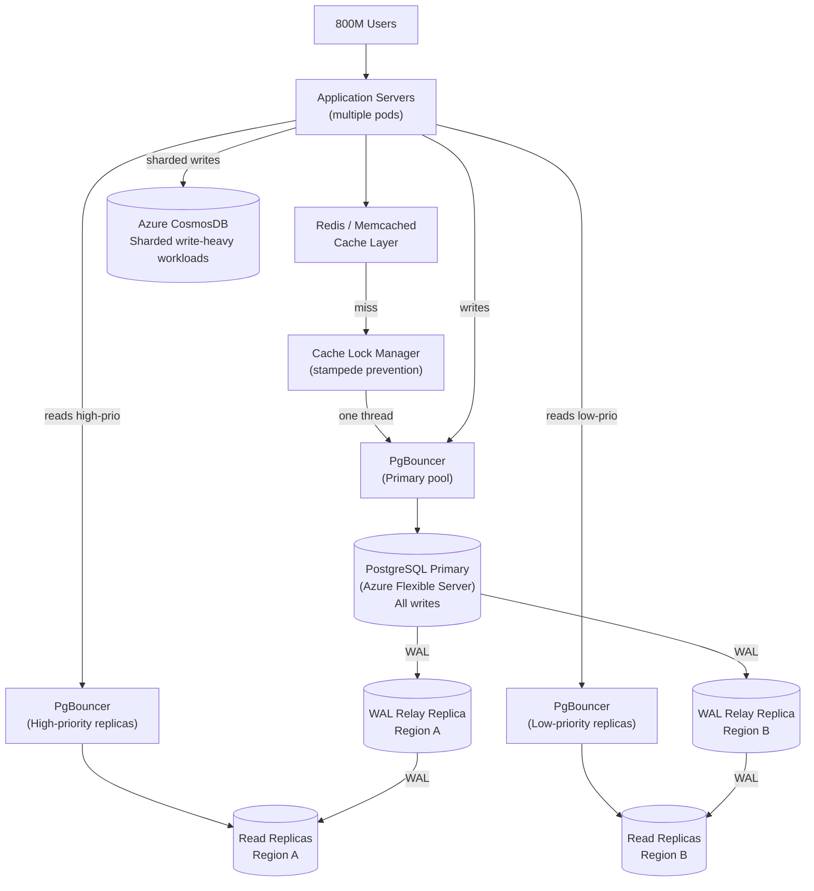

# OpenAI — Scaling PostgreSQL to 800 Million ChatGPT Users

## Category

Scaling, Database, PostgreSQL, Connection Pooling, Caching, Read Replicas

## Scale at the Time

| Metric | Value |
|--------|-------|
| Users | 800 million (ChatGPT) |
| Database load growth | 10× in 12 months |
| Read replicas | ~50 across multiple geographic regions |
| Target availability | 99.999% (five nines) |
| P99 client latency | Low double-digit milliseconds |
| Architecture | Single primary PostgreSQL + read replicas (no sharding) |

---

## Initial Architecture

A single-primary Azure PostgreSQL Flexible Server instance handling all writes. Read replicas offloaded read traffic. Standard application-layer caching (Redis/Memcached) reduced database read pressure. This architecture is common at early scale and served OpenAI well — but several latent failure modes became critical as scale grew.

```
Internet → Application Servers → Primary PostgreSQL (all writes)
                               → Read Replicas (offloaded reads)
                               → Redis Cache (hit first)
```

---

## The Problem

Three recurring failure patterns eventually caused high-severity incidents (SEVs):

### 1. The Vicious Retry Cycle
An upstream event (cache failure, new feature launch, expensive join spike) caused a sudden load surge on PostgreSQL. Latency rose → requests timed out → the application retried → retries amplified the load further → service degraded or went down.

### 2. MVCC Write Amplification
PostgreSQL's multi-version concurrency control (MVCC) copies the entire row on every UPDATE, even if only one column changes. Under heavy write load this causes:
- **Write amplification**: more I/O than the logical change requires
- **Dead tuple accumulation**: old row versions must be vacuumed
- **Table and index bloat**: autovacuum struggles to keep up
- **Read amplification**: sequential scans traverse dead tuples to reach live versions

### 3. Connection Exhaustion
Azure PostgreSQL has a per-instance connection limit (5,000). During traffic spikes, applications opened connections faster than they could be closed, triggering "too many connections" errors that cascaded into retry storms.

### 4. Cache Miss Storm
A caching-layer failure caused a burst of cache misses — all requests that previously hit the cache suddenly hit PostgreSQL simultaneously, saturating CPU and triggering the vicious retry cycle.

### 5. WAL Fan-Out Bottleneck
The primary must stream Write-Ahead Log (WAL) data to every replica. With ~50 replicas, the primary had to ship WAL 50 times, consuming network bandwidth and CPU.

---

## The Solution

### S1. PgBouncer Connection Pooling

Deployed PgBouncer as a proxy layer in front of each PostgreSQL instance, running in **transaction pooling mode** (a client can share a backend connection across transactions).

Results:
- Average connection setup time dropped from **50 ms to 5 ms**
- Maximum effective number of clients multiplied by the pool multiplier (connection limit ÷ pool size)
- Connection storms no longer reached PostgreSQL directly

Each read replica has its own Kubernetes deployment of PgBouncer pods, sitting behind a Kubernetes Service that load-balances across pods.

### S2. Cache Locking (Cache Stampede Prevention)

When multiple requests simultaneously miss on the same cache key, only **one request** acquires a lock and fetches from PostgreSQL. All others wait for the cache repopulation.

```python
def get_with_lock(cache, db, key, ttl):
    value = cache.get(key)
    if value:
        return value                         # cache hit

    lock_key = f"lock:{key}"
    acquired = cache.set(lock_key, "1", nx=True, ex=5)  # try atomic lock

    if acquired:
        try:
            value = db.fetch(key)            # only one thread hits the DB
            cache.set(key, value, ex=ttl)
        finally:
            cache.delete(lock_key)
        return value
    else:
        # Wait briefly then re-read; the lock holder will populate cache
        time.sleep(0.05)
        return cache.get(key) or db.fetch(key)
```

### S3. Query Optimization — Break Multi-Table Joins

Identified and eliminated expensive queries such as one that joined 12 tables. Spikes in this query were responsible for past SEVs.

Key rules adopted:
- Avoid complex multi-table joins in OLTP paths; move join logic to the application layer
- Review all ORM-generated SQL — ORMs frequently produce N+1 queries and implicit joins
- Set `idle_in_transaction_session_timeout` to kill long-running idle transactions that block autovacuum

```sql
-- PostgreSQL instance-level safeguards
ALTER SYSTEM SET idle_in_transaction_session_timeout = '30s';
ALTER SYSTEM SET statement_timeout = '10s';          -- for OLTP queries
SELECT pg_reload_conf();
```

### S4. Workload Isolation (Noisy Neighbour Prevention)

Split database requests into **priority tiers** routed to dedicated replica sets:
- **High priority** (user-facing, low latency): routed to isolated replicas
- **Low priority** (analytics, backfills, background jobs): routed to separate replicas

A slow or expensive query from one product no longer affects another product's replica pool.

```
Application
  ├── High-priority requests → Replica Pool A (user API)
  ├── Low-priority requests  → Replica Pool B (analytics, batch)
  └── Write requests         → Primary
```

### S5. Write Volume Reduction

- Migrated shardable write-heavy workloads to **Azure CosmosDB** (sharded)
- No new tables allowed on the main PostgreSQL deployment; new workloads default to CosmosDB
- Fixed application bugs causing **redundant writes** (duplicate inserts, unnecessary UPDATEs)
- Introduced **lazy writes** to smooth spikes — buffer small writes and flush in batches
- Applied **strict rate limits during backfills** to prevent write pressure during data migrations

### S6. Rate Limiting at Multiple Layers

Applied rate limiting at the application layer, PgBouncer connection pooler, and query level:
- Per-endpoint rate limits prevent a single endpoint from flooding the database
- ORM-level query blocking: when a specific query digest is identified as dangerous, it can be dropped at the ORM layer without a deployment
- Exponential backoff with jitter on retries: `sleep = min(base * 2^attempt, cap) + random_jitter()`

### S7. Online Schema Management

Enforced rules:
- Schema changes limited to lightweight DDL only (add/drop columns that do not trigger table rewrites)
- **5-second hard timeout** on all schema changes
- Index creation/drop done `CONCURRENTLY` only
- No new tables on the PostgreSQL deployment
- Backfills rate-limited and spread over days/weeks, not hours

### S8. Cascading Replication (in progress)

With ~50 replicas, each receiving WAL directly from the primary, network and CPU pressure on the primary grows linearly. The solution: **intermediate relay replicas** that stream WAL to downstream replicas, removing the primary from the fan-out path.

```
Primary → Relay Replica A → Replica 1, 2, 3, 4, 5 (region A)
        → Relay Replica B → Replica 6, 7, 8, 9, 10 (region B)
```

---

## Key Learnings

1. **Single-primary can scale further than expected** if you aggressively offload reads to replicas and minimise primary write load
2. **Connection pooling must sit in front of every database** — not optional at scale; PgBouncer in transaction mode multiplies connection capacity by the pool factor
3. **Cache stampede is a design requirement, not a corner case** — every high-read system must implement lock-or-lease logic for cache misses
4. **Retries without backoff cause the outage to continue** — implement exponential backoff + jitter; set a maximum retry budget per request
5. **ORM-generated SQL must be reviewed** — ORMs produce suboptimal queries silently; a 12-table join can take down a service
6. **Workload isolation prevents noisy-neighbour cascades** — route priority tiers to separate database instances; don't share pools across unrelated workloads
7. **Schema changes must be online** — enforce a zero-downtime DDL policy from day one; retrofitting it is painful
8. **Write-heavy workloads are different from read-heavy** — MVCC makes PostgreSQL less suited for high write throughput; shard or move write-heavy workloads to a system designed for them

---

## Architecture Diagram



---

## Code / Config

### PgBouncer configuration

```ini
[databases]
chatgpt_primary = host=primary.postgres.azure.com port=5432 dbname=chatgpt
chatgpt_replica = host=replica-a.postgres.azure.com port=5432 dbname=chatgpt

[pgbouncer]
pool_mode = transaction          ; share connections across transactions
max_client_conn = 50000          ; clients that can connect to PgBouncer
default_pool_size = 100          ; backend connections per database/user pair
min_pool_size = 10
reserve_pool_size = 20
reserve_pool_timeout = 3
server_idle_timeout = 600        ; close idle backend connections after 10 min
client_idle_timeout = 60         ; disconnect idle clients after 60 s
idle_transaction_timeout = 30    ; kill transactions idle for > 30 s
listen_port = 5432
listen_addr = *
auth_type = scram-sha-256
log_connections = 0              ; disable in high-QPS environments
log_disconnections = 0
```

### Retry with exponential backoff and jitter (TypeScript)

```typescript
async function withRetry<T>(
  fn: () => Promise<T>,
  options: { maxAttempts: number; baseMs: number; capMs: number }
): Promise<T> {
  const { maxAttempts, baseMs, capMs } = options;

  for (let attempt = 1; attempt <= maxAttempts; attempt++) {
    try {
      return await fn();
    } catch (err) {
      if (attempt === maxAttempts) throw err;

      const exponential = Math.min(baseMs * Math.pow(2, attempt - 1), capMs);
      const jitter = Math.random() * exponential * 0.5;          // ±25% jitter
      const delay = Math.floor(exponential + jitter);

      console.warn(`Attempt ${attempt} failed; retrying in ${delay}ms`, err);
      await new Promise((r) => setTimeout(r, delay));
    }
  }
  throw new Error('Max attempts reached');
}

// Usage
const result = await withRetry(
  () => db.query('SELECT * FROM users WHERE id = $1', [userId]),
  { maxAttempts: 3, baseMs: 100, capMs: 3000 }
);
```

### PostgreSQL autovacuum tuning for high-write tables

```sql
-- Tune autovacuum for a high-write table to run more aggressively
ALTER TABLE messages SET (
  autovacuum_vacuum_scale_factor     = 0.01,   -- vacuum when 1% of rows are dead (default 20%)
  autovacuum_analyze_scale_factor    = 0.005,
  autovacuum_vacuum_cost_delay       = 2,      -- ms; lower = more aggressive I/O
  autovacuum_vacuum_cost_limit       = 1000    -- higher = more work per autovacuum round
);

-- Monitor dead tuple accumulation
SELECT
  schemaname,
  relname,
  n_dead_tup,
  n_live_tup,
  round(100.0 * n_dead_tup / NULLIF(n_live_tup + n_dead_tup, 0), 2) AS dead_pct,
  last_autovacuum
FROM pg_stat_user_tables
ORDER BY n_dead_tup DESC
LIMIT 20;
```

---

## References

- [OpenAI Engineering — Scaling PostgreSQL to 800M Users](https://openai.com/index/scaling-postgresql/) (January 2026)
- [The Part of PostgreSQL We Hate the Most — Pavlo & Zhang (CMU)](https://www.cs.cmu.edu/~pavlo/blog/2023/04/the-part-of-postgresql-we-hate-the-most.html)
- [PgBouncer Documentation](https://www.pgbouncer.org/config.html)
- [Azure PostgreSQL Flexible Server — Cascading Replication](https://www.postgresql.org/docs/current/warm-standby.html#CASCADING-REPLICATION)
- [PostgreSQL Wiki — Autovacuum Tuning](https://wiki.postgresql.org/wiki/Autovacuum)
