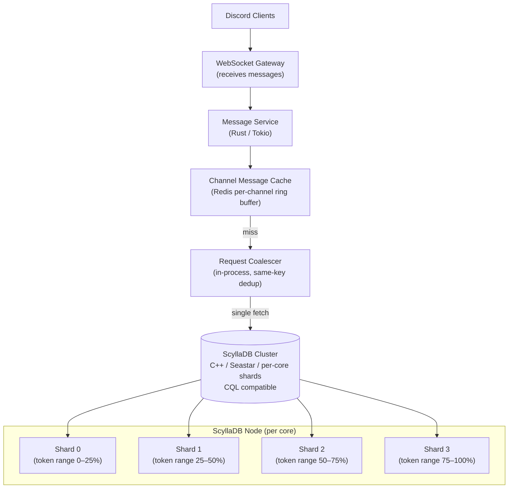

# Discord — Scaling to Billions of Messages with ScyllaDB

## Category

Scaling, Database, NoSQL, Cassandra, ScyllaDB, Rust, Message Storage

## Scale at the Time

| Metric | Value |
|--------|-------|
| Messages stored | Billions (trillions by 2023) |
| Daily active users | 19+ million |
| Peak message rate | Millions per minute |
| Servers (guilds) | 19+ million voice and text servers |
| Storage engine (before) | Apache Cassandra |
| Storage engine (after) | ScyllaDB |
| Service language (before) | Python |
| Service language (after) | Rust |

---

## Initial Architecture

Discord chose Apache Cassandra in 2015 for message storage because it offered:
- Linear write scalability across nodes
- Multi-datacenter replication
- Familiar Cassandra Query Language (CQL)
- Wide-column row model that maps naturally to chronological message timelines

The schema used the Discord server channel as the partition key, with message ID (Snowflake — time-sortable) as the clustering key.

```sql
CREATE TABLE messages (
  channel_id   bigint,
  message_id   bigint,     -- Snowflake: encodes timestamp
  author_id    bigint,
  content      text,
  PRIMARY KEY  (channel_id, message_id)
) WITH CLUSTERING ORDER BY (message_id DESC);
```

---

## The Problem

### 1. Hot Partitions on Large Servers (Guilds)
Discord has a long tail of extremely large public servers (100,000–1,000,000 members). When members of a large server all read the same channel, every read lands on the same Cassandra **partition** (channel_id). That single partition becomes a hot spot: all requests concentrate on the two or three Cassandra nodes that own the partition.

### 2. JVM GC Pauses
Cassandra runs on the JVM. As the heap fills with live data and dead objects (Java's object lifecycle), the Garbage Collector periodically stops the world (or applies concurrent GC pressure). Under Discord's load, GC pauses:
- Introduced unpredictable latency spikes (10–500 ms suddenly)
- Made SLO guarantees hard to maintain
- Caused cascading latency as upstream callers timed out and retried

### 3. Compaction Storm
Cassandra uses LSM (Log-Structured Merge) trees. Write amplification grows if compaction cannot keep pace with writes. During high-write periods (major game launches, events), compaction storms consumed I/O bandwidth, causing read latency to spike simultaneously.

### 4. Maintenance Operations Block Traffic
Cassandra node maintenance (repair, compaction, replacing nodes) negatively impacted live traffic because repair reads data from all replicas and generates significant I/O and network traffic.

### 5. Python Service Latency
The message read service was written in Python (Tornado async framework). CPU-bound operations and Python's GIL limited throughput. Under load, Tornado worker processes could not saturate available I/O capacity.

---

## The Solution

### S1. Migrate from Cassandra to ScyllaDB

ScyllaDB is a Cassandra-compatible database written in C++ (using the Seastar framework) rather than Java:

| Dimension | Cassandra | ScyllaDB |
|-----------|-----------|----------|
| Language | Java (JVM) | C++ |
| GC pauses | Yes (JVM GC) | No (manual/arena memory management) |
| Threading model | JVM threads | Per-shard thread pinned to CPU core via Seastar |
| Shard model | Consistent hashing ring (token ranges) | Per-core shard + per-shard data ownership |
| Compaction | Periodic, shared I/O | Per-shard compaction, no I/O contention across shards |
| CQL compatibility | Native | Full compatibility — drop-in replacement |
| Operational tooling | nodetool | Same CLI API |

Migration was done **without downtime** by:
1. Running ScyllaDB alongside Cassandra in dual-write mode
2. Backfilling historical data into ScyllaDB
3. Gradually shifting read traffic from Cassandra to ScyllaDB
4. Removing Cassandra after full validation

### S2. Rewrite Message Service in Rust

The message read service (responsible for fetching paginated message history) was rewritten from Python to Rust:
- Eliminated GIL — true multi-core parallel processing
- Eliminated Python interpreter overhead for parsing, serialization
- Tokio async runtime with work-stealing: saturates available CPU and I/O
- Memory safety without GC: no pause-the-world moments
- Result: **5× throughput improvement** at the same infrastructure cost

### S3. Last Message ID Cache (Hot Partition Mitigation)

For large popular channels the most common query is "get the last N messages". Discord added an in-memory cache keyed by channel_id that stores the most recent message IDs:
- Cache hit: return messages directly without hitting ScyllaDB
- Cache miss: fetch from ScyllaDB, repopulate cache
- Cache invalidation: on new message write, update the cache entry

This absorbed the majority of read traffic from hot partitions.

### S4. Request Coalescing for Same-Key Concurrent Reads

Multiple simultaneous requests for the same channel_id → message_id range are coalesced into a single ScyllaDB read. The first caller fetches; others wait and receive the same result.

---

## Key Learnings

1. **JVM GC is a scaling ceiling** — for latency-sensitive, high-QPS storage services, JVM GC pauses become a recurring operational problem; consider C++/Rust/Go alternatives early
2. **Hot partitions are an inherent risk in wide-column stores** — if your partition key maps to a naturally popular entity (a celebrity account, a viral server), you will hit hot partitions; mitigate with caching above the storage layer
3. **Cassandra-compatible does not mean Cassandra** — ScyllaDB achieves much higher throughput at lower latency with no operational procedure changes; evaluate it before scaling Cassandra hardware
4. **Schema design is permanent** — Discord's channel_id partition key was correct for write distribution but created hot read partitions; think about both write and read distribution at schema design time
5. **Compaction storms are a production hazard** — tune compaction strategy (TWCS for time-series data) and ensure storage has headroom; compaction cannot be paused once started
6. **Rewriting in a systems language is worth it at scale** — Python/Ruby/Node are excellent until I/O-bound throughput becomes the bottleneck at the per-core level; Rust/Go handle 10–50× more connections per node
7. **Dual-write migration is the safe path** — never attempt a hard-cutover of a database for a live service; dual-write + gradual read traffic shift + monitoring is the proven approach

---

## Architecture Diagram



---

## Code / Config

### ScyllaDB schema for Discord-style message storage

```sql
CREATE KEYSPACE IF NOT EXISTS discord
  WITH replication = {
    'class': 'NetworkTopologyStrategy',
    'us-east1': 3,
    'eu-west1': 3
  };

CREATE TABLE discord.messages (
  channel_id   bigint,
  message_id   bigint,     -- time-sortable Snowflake ID (encodes timestamp + worker + sequence)
  author_id    bigint,
  content      text,
  attachments  list<text>,
  edited_at    timestamp,
  PRIMARY KEY  (channel_id, message_id)
) WITH CLUSTERING ORDER BY (message_id DESC)
  AND compaction = {
    'class': 'TimeWindowCompactionStrategy',
    'compaction_window_unit': 'DAYS',
    'compaction_window_size': 1        -- one SSTable window per day; old windows rarely compacted
  }
  AND gc_grace_seconds = 864000        -- 10 days (with daily repair)
  AND default_time_to_live = 0;        -- messages stored indefinitely
```

### Rust — request coalescing for concurrent channel reads

```rust
use std::collections::HashMap;
use std::sync::Arc;
use tokio::sync::{broadcast, Mutex};

type ChannelId = i64;

#[derive(Clone)]
pub struct MessageCache {
    inflight: Arc<Mutex<HashMap<ChannelId, broadcast::Sender<Vec<Message>>>>>,
}

impl MessageCache {
    pub async fn get_messages(
        &self,
        channel_id: ChannelId,
        db: &ScyllaSession,
    ) -> anyhow::Result<Vec<Message>> {
        // Check in-memory cache first
        if let Some(messages) = self.local_cache.get(&channel_id) {
            return Ok(messages);
        }

        let mut inflight = self.inflight.lock().await;

        // If another task is already fetching this channel, subscribe to it
        if let Some(tx) = inflight.get(&channel_id) {
            let mut rx = tx.subscribe();
            drop(inflight);
            return Ok(rx.recv().await?);
        }

        // This task wins — create the broadcast channel and fetch from DB
        let (tx, _) = broadcast::channel(1);
        inflight.insert(channel_id, tx.clone());
        drop(inflight);

        let messages = db.fetch_messages(channel_id, 50).await?;
        let _ = tx.send(messages.clone());             // broadcast to all waiters

        // Clean up inflight entry
        self.inflight.lock().await.remove(&channel_id);

        Ok(messages)
    }
}
```

### ScyllaDB connection setup (Rust + scylla crate)

```rust
use scylla::{Session, SessionBuilder};

async fn create_session() -> anyhow::Result<Session> {
    SessionBuilder::new()
        .known_node("scylla-node1:9042")
        .known_node("scylla-node2:9042")
        .known_node("scylla-node3:9042")
        .connection_timeout(std::time::Duration::from_secs(5))
        .build()
        .await
        .map_err(Into::into)
}
```

---

## References

- [Discord Engineering — How Discord Stores Trillions of Messages](https://discord.com/blog/how-discord-stores-trillions-of-messages) (2023)
- [Discord Engineering — How Discord Stores Billions of Messages](https://discord.com/blog/how-discord-stores-billions-of-messages) (2017)
- [ScyllaDB Architecture — Seastar Framework](https://www.scylladb.com/product/technology/shard-per-core-architecture/)
- [Cassandra TimeWindowCompactionStrategy](https://cassandra.apache.org/doc/latest/cassandra/operating/compaction/twcs.html)
- [Tokio — Rust Async Runtime](https://tokio.rs/)
