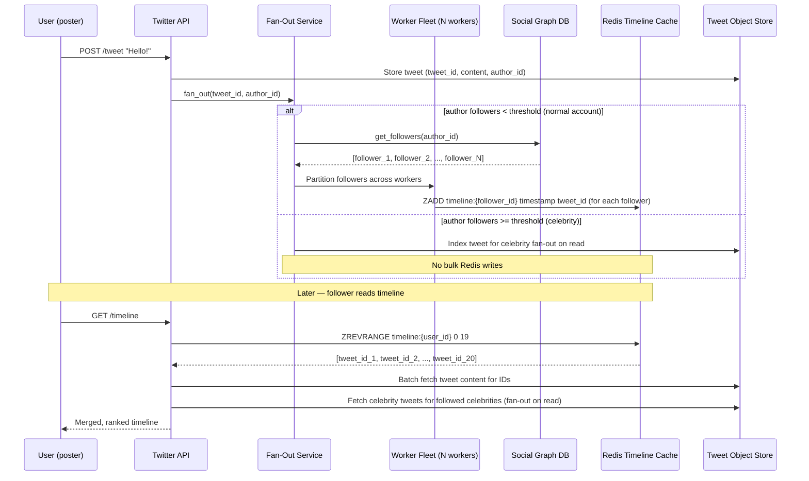

# Twitter — Fan-Out at Scale: Timeline Architecture

## Category

Scaling, Fan-Out, Caching, Social Graph, Feed Architecture, Redis

## Scale at the Time

| Metric | Value |
|--------|-------|
| Daily active users | 238 million (2022) |
| Tweets per day | ~500 million |
| Followers for top accounts | 100–300 million |
| Home timeline read QPS | Tens of millions |
| Fan-out write events per second | Hundreds of millions |
| Cache (Redis) storage for timelines | Multi-terabyte |

---

## Initial Architecture

Twitter's original timeline model was **fan-out on read**: when a user opens their home timeline, the system queries the database for tweets from everyone they follow, merges and sorts them, and returns the result. This is simple to implement but catastrophic at scale.

```
Read Timeline Request
  → Fetch user's follow list (e.g. 1,000 followees)
  → Query tweet table for each followee's recent tweets
  → Merge and sort 1,000 result sets by time
  → Return top 20 tweets
```

For a user following 1,000 accounts, one timeline view required 1,000 database queries. At millions of simultaneous readers, the database collapsed.

---

## The Problem

### 1. Fan-Out on Read is O(N) per Timeline Load
A user following 1,000 accounts triggers 1,000 queries per page load. At Twitter's scale, this was unsustainable even with heavy caching, because:
- Follow counts vary from 10 to 50,000+
- Popular accounts appear in millions of followers' queries, causing massive **read amplification**
- Sorting and merging happens at read time, consuming CPU

### 2. Celebrity (High-Follower) Write Amplification
Twitter switched to **fan-out on write** — on every tweet, pre-compute the timeline for each follower and write the tweet ID into their Redis timeline cache. For most users (e.g. someone with 500 followers), this is manageable: 500 Redis writes per tweet.

For **celebrity accounts** (10M–300M followers), one tweet requires writing to 300 million Redis keys. At typical write throughput, this takes hours — far longer than the tweet's relevance window. During that window, followers see stale timelines.

### 3. Cache Memory Explosion
Pre-computing timelines for all users requires storing up to 800 tweet IDs per user × 238M users in Redis. This is terabytes of data. Users who never open Twitter still have timeline cache entries consuming memory.

### 4. Consistency Under Fan-Out Lag
With fan-out on write, a user who follows a celebrity may not see the celebrity's tweet in their timeline for minutes (during the fan-out). Meanwhile, a direct visit to the celebrity's profile shows the tweet immediately. This inconsistency is visible to users.

---

## The Solution

Twitter settled on a **hybrid fan-out model** that blends fan-out on write for normal accounts and fan-out on read for high-follower accounts.

### S1. Hybrid Fan-Out Architecture

**Rule:** If the tweeting account has fewer than ~N followers (threshold ≈ tens of thousands), use fan-out on write. If the account exceeds the threshold, use fan-out on read at timeline render time.

```
Tweet Posted
  ├── Account has < threshold followers
  │     → Fan-out service writes tweet_id into each follower's Redis timeline cache
  │         (async, via work queue)
  └── Account has ≥ threshold (celebrity)
        → Tweet stored in tweet DB only; no fan-out write

Timeline Read Request
  ├── Fetch user's pre-built Redis timeline (tweet IDs from fan-out-on-write accounts)
  └── Merge with live DB queries for celebrity accounts the user follows
        → Sort, deduplicate, return top 20
```

### S2. Redis Timeline Cache (Tweet ID List)

Each user's timeline is stored in Redis as a sorted set (ZSET), keyed by user_id, scored by tweet timestamp. Only tweet IDs are stored — tweet content is fetched separately from the tweet object store (also cached).

```
key:   timeline:{user_id}
type:  sorted set (ZSET)
score: tweet timestamp (Unix ms) — used for sort/range queries
value: tweet_id (Snowflake)
max:   800 entries per user (sliding window)
TTL:   evicted when user is inactive (LRU eviction policy)
```

This stores only 8 bytes (tweet_id) per entry, keeping memory usage manageable.

### S3. Selective Pre-Computation (Active Users Only)

Twitter only maintains timeline caches for **active users**. Users who have not logged in within a configurable window have their caches evicted. When they next log in, their timeline is computed via fan-out on read for the first load (cold start), then the cache is rebuilt incrementally.

### S4. Out-of-Order Delivery Tolerance

Fan-out on write is asynchronous and distributed across a large worker fleet. Workers process follow-fan-out in parallel by partitioning followers across workers. This means tweets appear in follower timelines with slight delay (milliseconds to seconds). Twitter accepted this as a design trade-off: timelines are **eventually consistent**, not real-time.

### S5. Timeline Service Architecture

The Timeline Service is the read path that merges:
1. Redis timeline cache (pre-computed tweet IDs)
2. Live celebrity tweet lookup (from tweet object store)
3. Promoted content (ads system injection)
4. Algorithmic ranking signal (ML model scores tweet relevance)

These are merged, ranked, and returned as a single timeline response.

---

## Key Learnings

1. **Fan-out on write is the right default for social feeds** — pre-compute at write time so reads are O(1); use Redis sorted sets to store ordered tweet ID lists
2. **High-follower accounts require special treatment** — identify your "celebrity" threshold and switch to fan-out on read above it; do not attempt to pre-fan-out to 300M users
3. **Store IDs, not content, in timeline caches** — store only tweet IDs in the fan-out cache; resolve content separately; this keeps cache memory proportional to follow count, not content size
4. **Inactive users waste cache resources** — evict timeline caches for inactive users and rebuild on re-engagement; accept the first-load latency hit
5. **Eventual consistency is acceptable for social feeds** — users do not expect their timeline to update in real-time; a few seconds of delivery lag is imperceptible
6. **The social graph is the hardest data structure to scale** — follower lists for large accounts require specialised storage and access patterns; don't store them in a general-purpose relational DB
7. **Fan-out queues must be rate-limited for celebrity accounts** — a tweet from a 200M-follower account generates 200M fan-out tasks instantly; these must be queued and processed at a rate that does not overwhelm worker fleets

---

## Architecture Diagram



---

## Code / Config

### Redis timeline operations (TypeScript)

```typescript
import Redis from 'ioredis';

const redis = new Redis({ host: 'timeline-redis', port: 6379 });

const MAX_TIMELINE_SIZE = 800;
const CELEBRITY_FOLLOWER_THRESHOLD = 50_000;

// Fan-out on write: add tweet to follower's timeline cache
async function fanOutTweet(tweetId: bigint, timestamp: number, followerId: bigint): Promise<void> {
  const key = `timeline:${followerId}`;

  await redis.pipeline()
    .zadd(key, timestamp, tweetId.toString())     // add with score = timestamp
    .zremrangebyrank(key, 0, -(MAX_TIMELINE_SIZE + 1))  // trim to max size (keep newest)
    .expire(key, 7 * 24 * 3600)                   // reset TTL on activity
    .exec();
}

// Read timeline: fetch tweet IDs from timeline cache
async function getTimelineTweetIds(userId: bigint, count = 20): Promise<string[]> {
  const key = `timeline:${userId}`;
  // ZREVRANGEBYSCORE: fetch newest tweets first
  return redis.zrevrange(key, 0, count - 1);
}

// Fan-out decision: check if account is a celebrity
async function fanOut(tweetId: bigint, authorId: bigint, followerIds: bigint[]): Promise<void> {
  if (followerIds.length >= CELEBRITY_FOLLOWER_THRESHOLD) {
    // Celebrity: do NOT fan-out to Redis; serve from tweet store at read time
    await indexCelebrityTweet(tweetId, authorId);
    return;
  }

  // Normal account: fan-out to all followers in batches
  const BATCH_SIZE = 100;
  const timestamp = Date.now();

  for (let i = 0; i < followerIds.length; i += BATCH_SIZE) {
    const batch = followerIds.slice(i, i + BATCH_SIZE);
    await Promise.all(batch.map((fId) => fanOutTweet(tweetId, timestamp, fId)));
  }
}

// Merge timeline: combine cache (normal accounts) + live (celebrities)
async function buildTimeline(userId: bigint, followedCelebrities: bigint[]): Promise<Tweet[]> {
  const [cachedIds, celebrityTweets] = await Promise.all([
    getTimelineTweetIds(userId),
    fetchCelebrityTweets(followedCelebrities, 20),   // fan-out on read for celebrities
  ]);

  const cachedTweets = await batchFetchTweets(cachedIds);

  return mergeAndSort([...cachedTweets, ...celebrityTweets])
    .slice(0, 20);
}
```

### Fan-out job queue (worker partitioning)

```typescript
import { Queue, Worker } from 'bullmq';

const fanOutQueue = new Queue('timeline-fan-out', { connection: redis });

// Enqueue fan-out jobs (partitioned by follower ID hash for parallelism)
async function enqueueFanOut(tweetId: string, followerIds: bigint[]): Promise<void> {
  const PARTITION_COUNT = 50; // 50 parallel workers

  const partitions: bigint[][] = Array.from({ length: PARTITION_COUNT }, () => []);
  for (const followerId of followerIds) {
    const partition = Number(followerId % BigInt(PARTITION_COUNT));
    partitions[partition].push(followerId);
  }

  await Promise.all(
    partitions
      .filter((p) => p.length > 0)
      .map((partition, idx) =>
        fanOutQueue.add(
          'fan-out-partition',
          { tweetId, followerIds: partition.map(String) },
          { jobId: `${tweetId}-${idx}` }
        )
      )
  );
}

// Worker processes each partition independently
new Worker('timeline-fan-out', async (job) => {
  const { tweetId, followerIds } = job.data;
  const timestamp = Date.now();
  await Promise.all(
    followerIds.map((id: string) => fanOutTweet(BigInt(tweetId), timestamp, BigInt(id)))
  );
}, { connection: redis, concurrency: 20 });
```

---

## References

- [Twitter Engineering — The Architecture Twitter Uses to Deal with 150M Active Users](https://highscalability.com/the-architecture-twitter-uses-to-deal-with-150m-active-users/) (High Scalability)
- [Twitter Engineering Blog — Timelines at Scale](https://blog.twitter.com/engineering/en_us/a/2013/new-tweets-per-second-record-and-how)
- [InfoQ — Twitter's Timeline Architecture](https://www.infoq.com/presentations/Twitter-Timeline-Architecture/) (presentation)
- [Redis Sorted Sets Documentation](https://redis.io/docs/data-types/sorted-sets/)
- [BullMQ — Job Queue for Node.js](https://docs.bullmq.io/)
