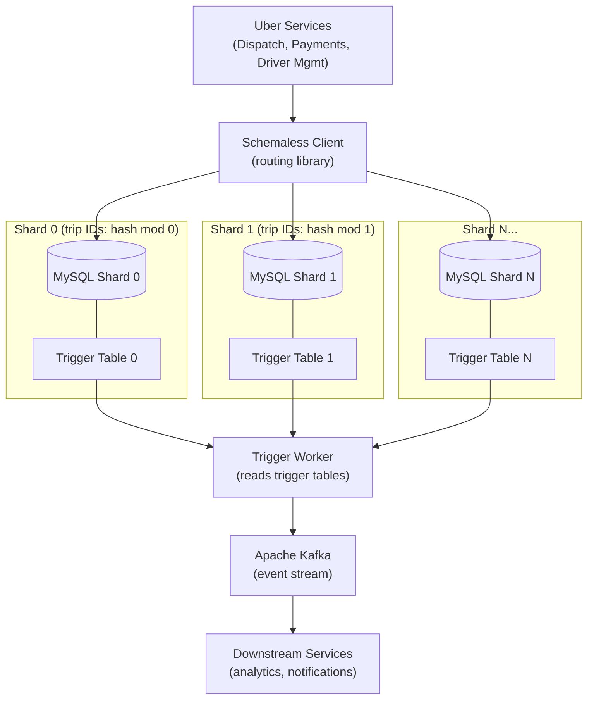

# Uber — From MySQL to Schemaless: Custom Sharded Storage

## Category

Scaling, Database Sharding, MySQL, Distributed Storage, Consistent Hashing, Uber

## Scale at the Time

| Metric | Value |
|--------|-------|
| Cities operating | 400+ (at time of migration) |
| Trips per day | 10M+ |
| Data entities | Trips, drivers, riders, locations, payments |
| Initial architecture | Single MySQL + Python monolith |
| Problem | Single MySQL could not handle write throughput |
| Solution | Schemaless — custom sharded MySQL abstraction layer |

---

## Initial Architecture

Uber started with a single Python monolith backed by a single MySQL database. As Uber expanded from San Francisco to hundreds of cities, the simple design collapsed:

```
Mobile App → Python Monolith (single process) → MySQL (single instance)
```

Every trip write, location update, and payment record flowed through this single database. MySQL is a single-writer system by default — there is no horizontal write scaling without sharding.

---

## The Problem

### 1. MySQL Write Throughput Ceiling
MySQL (InnoDB) with a single primary processes writes sequentially through the binary log. As Uber's trip volume grew, writes per second exceeded what a single primary could safely handle. Adding read replicas helps reads but does nothing for write throughput.

### 2. Schema Migrations in Production
ALTER TABLE on a large MySQL table acquires a metadata lock for the duration of the migration, blocking all writes to that table. For Uber's trips table (billions of rows), a schema change that adds a column takes hours, blocking production traffic.

### 3. Hot Rows and Lock Contention
Frequent updates to the same row (e.g., a driver's status updated every 4 seconds while on a trip) cause InnoDB row-level locking contention. Multiple writers competing for the same row result in lock waits and deadlocks.

### 4. Cross-Service Schema Coupling
All services (dispatch, payment, ETA, driver management) shared tables in the same MySQL database. A schema migration for one service required coordination across all teams. There was no service isolation.

### 5. City-Level Heatspots
When Uber surged in a new city, all trips for that city landed in the same MySQL partitions. City-keyed data created geographic hotspots — a busy New York Friday night could saturate write capacity while other cities were idle.

---

## The Solution

### S1. Schemaless — A Cell-Based Sharded Storage Layer

Uber built **Schemaless** (initially called Mezzanine): a scalable sharded datastore built on top of many MySQL instances. Instead of one MySQL, Schemaless provides:
- A **horizontal sharding layer** that routes writes to one of N MySQL nodes
- A **schema-free cell model** — every row is `(row_key, column_name, ref_key) → value (JSON blob)` instead of a fixed-column schema
- **Immutable append-only semantics** — rows are never updated in-place; a new cell is appended (like event sourcing)
- **Triggers** for change notification (outbox pattern built in)

```
Application
  ↓
Schemaless Client (routing library)
  ↓
[Shard 0 MySQL] [Shard 1 MySQL] [Shard 2 MySQL] ... [Shard N MySQL]
```

### S2. Cell-Based Data Model

```sql
-- All Schemaless tables have this same schema
CREATE TABLE (
  added_id  BIGINT AUTO_INCREMENT,          -- monotonic shard-local ordering ID
  row_key   VARCHAR(64)  NOT NULL,          -- sharding key (e.g. trip_uuid)
  column_key VARCHAR(64)  NOT NULL,         -- logical column name (e.g. "status")
  ref_key   BIGINT       NOT NULL DEFAULT 0,-- version / sub-key
  body      MEDIUMBLOB,                     -- JSON payload
  created_at TIMESTAMP   NOT NULL DEFAULT CURRENT_TIMESTAMP,
  PRIMARY KEY (row_key, column_key, ref_key),
  UNIQUE KEY added_id_key (added_id)
);
```

A "trip" entity is stored as multiple cells:
```
row_key=trip-uuid-123, column_key="status",  ref_key=1 → {"status": "dispatched", "ts": ...}
row_key=trip-uuid-123, column_key="status",  ref_key=2 → {"status": "en_route", "ts": ...}
row_key=trip-uuid-123, column_key="payment", ref_key=1 → {"amount": 12.50, "method": "card"}
```

This allows schema evolution without ALTER TABLE — new "columns" are just new column_key values. Old application code reading column_key="status" continues to work even as new columns are added.

### S3. Consistent Hashing for Shard Routing

The row_key is hashed using consistent hashing to determine the target MySQL shard:

```
shard_index = hash(row_key) mod N_shards
```

Consistent hashing ensures that adding new shards only moves approximately `1/N` of data, rather than rehashing everything.

### S4. No In-Place Updates — Append Only

Schemaless never issues `UPDATE` statements. Instead:
- A new cell with a higher `ref_key` is appended for every state change
- The latest state is always the cell with the highest `ref_key` for a given `(row_key, column_key)` pair
- Historical states are preserved by default (audit log for free)
- This eliminates write-write lock contention on hot rows

### S5. Triggers (Built-In Outbox Pattern)

Schemaless supports **triggers**: when a cell is written, the write is also enqueued in a trigger table on the same MySQL shard. A trigger worker reads from this table and publishes events to downstream consumers (Kafka, HTTP, etc.). Because the trigger is written in the same MySQL transaction as the cell write, it is atomic — no dual-write inconsistency.

### S6. Online Schema Migrations via Schema-Free Model

Because all data is stored as JSON blobs in `body`, adding a new "field" to an entity requires no DDL at all — just start writing cells with the new `column_key`. Removing a field is the same: stop writing it, update readers to tolerate its absence.

The only DDL changes needed are at the Schemaless infrastructure level (adding index tables), which are managed separately from application-level schema evolution.

---

## Key Learnings

1. **Single-primary MySQL has a write throughput ceiling** — plan your sharding strategy before you need it; retrofitting sharding to an existing unsharded schema is extremely painful
2. **The shard key is the most important architectural decision** — choose a key that distributes writes evenly and allows queries to be shard-local; a geographic key creates hotspots
3. **Schema-free storage enables independent service evolution** — when all services share a fixed-schema DB, every schema change requires multi-team coordination; schema-free decouples evolution
4. **Append-only semantics eliminate write-write lock contention** — never UPDATE hot rows; append new versions instead; this is the same principle as CQRS/Event Sourcing applied to storage
5. **Outbox pattern must be atomic with the write** — implement change notification in the same transaction as the data write (trigger table), or accept dual-write inconsistency
6. **Build your abstraction layer above MySQL, not a new database** — Schemaless reused MySQL's proven storage engine, replication, and tooling while adding sharding and schema flexibility; this reduced operational risk significantly
7. **Schema migration tooling must exist before you need it** — at Uber's scale, any table change that requires a lock is unacceptable; online DDL tools (pt-online-schema-change, gh-ost) must be standard practice

---

## Architecture Diagram



---

## Code / Config

### Schemaless-style client routing (TypeScript)

```typescript
import crypto from 'crypto';
import mysql from 'mysql2/promise';

interface Cell {
  rowKey: string;
  columnKey: string;
  refKey: number;
  body: Record<string, unknown>;
}

class SchemalessClient {
  private shards: mysql.Pool[];

  constructor(shardConfigs: mysql.PoolOptions[]) {
    this.shards = shardConfigs.map((config) => mysql.createPool(config));
  }

  private getShardIndex(rowKey: string): number {
    const hash = crypto.createHash('sha256').update(rowKey).digest('hex');
    const hashInt = parseInt(hash.slice(0, 8), 16);
    return hashInt % this.shards.length;
  }

  private getShard(rowKey: string): mysql.Pool {
    return this.shards[this.getShardIndex(rowKey)];
  }

  async writeCell(cell: Cell): Promise<void> {
    const shard = this.getShard(cell.rowKey);
    const conn = await shard.getConnection();
    try {
      await conn.beginTransaction();
      // Append new cell (never UPDATE)
      await conn.execute(
        `INSERT INTO cells (row_key, column_key, ref_key, body, created_at)
         VALUES (?, ?, ?, ?, NOW())
         ON DUPLICATE KEY UPDATE body = VALUES(body)`,
        [cell.rowKey, cell.columnKey, cell.refKey, JSON.stringify(cell.body)]
      );
      // Write trigger for change notification (same transaction = atomic)
      await conn.execute(
        `INSERT INTO triggers (row_key, column_key, ref_key, created_at)
         VALUES (?, ?, ?, NOW())`,
        [cell.rowKey, cell.columnKey, cell.refKey]
      );
      await conn.commit();
    } catch (err) {
      await conn.rollback();
      throw err;
    } finally {
      conn.release();
    }
  }

  async getLatestCell(rowKey: string, columnKey: string): Promise<Cell | null> {
    const shard = this.getShard(rowKey);
    const [rows] = await shard.execute<mysql.RowDataPacket[]>(
      `SELECT row_key, column_key, ref_key, body
       FROM cells
       WHERE row_key = ? AND column_key = ?
       ORDER BY ref_key DESC
       LIMIT 1`,
      [rowKey, columnKey]
    );
    if (rows.length === 0) return null;
    const row = rows[0];
    return {
      rowKey: row.row_key,
      columnKey: row.column_key,
      refKey: row.ref_key,
      body: JSON.parse(row.body),
    };
  }
}

// Usage: append a trip status update
const client = new SchemalessClient([
  { host: 'shard0.mysql.internal', database: 'schemaless' },
  { host: 'shard1.mysql.internal', database: 'schemaless' },
  { host: 'shard2.mysql.internal', database: 'schemaless' },
]);

await client.writeCell({
  rowKey: 'trip-uuid-123',
  columnKey: 'status',
  refKey: Date.now(),
  body: { status: 'completed', fare: 12.50, ended_at: new Date().toISOString() },
});
```

---

## References

- [Uber Engineering — Designing Schemaless, Uber Engineering's Scalable Datastore Using MySQL](https://www.uber.com/blog/schemaless-part-one-mysql-datastore/) (2016)
- [Uber Engineering — The Architecture of Uber's API Gateway and How We Scaled It](https://www.uber.com/blog/api-gateway/)
- [Consistent Hashing and Random Trees — Karger et al.](https://dl.acm.org/doi/10.1145/258533.258660)
- [Percona — pt-online-schema-change](https://docs.percona.com/percona-toolkit/pt-online-schema-change.html)
- [GitHub — gh-ost: Online Schema Migrations for MySQL](https://github.com/github/gh-ost)
