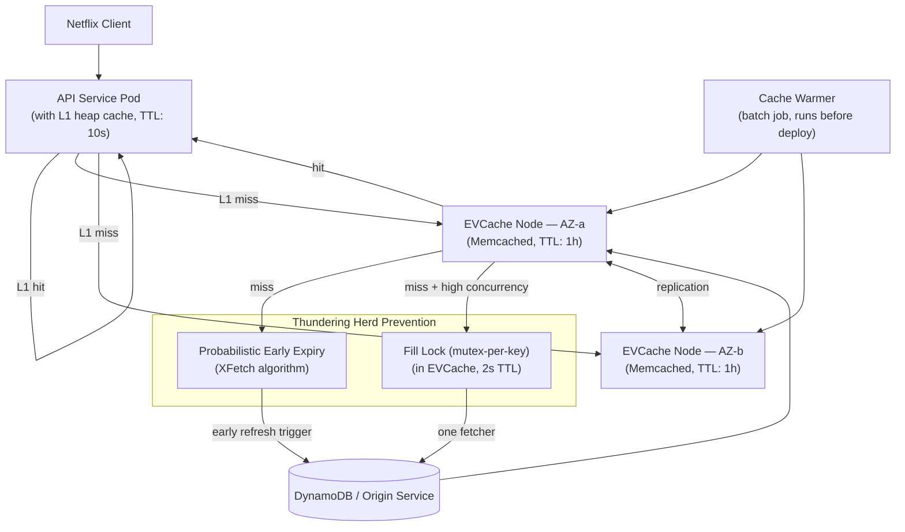

# Netflix — Thundering Herd and EVCache at Scale

## Category

Scaling, Caching, Thundering Herd, Memcached, EVCache, Resilience, CDN-Layer Caching

## Scale at the Time

| Metric | Value |
|--------|-------|
| Subscribers | 230+ million (2023) |
| Content library | 15,000+ titles |
| Simultaneous streams at peak | Millions |
| Microservices | 1,000+ |
| Cache hit rate target | > 99% |
| Cache tier | EVCache (Memcached-based, custom) |

---

## Initial Architecture

Netflix's streaming platform is built on hundreds of microservices. Most customer-facing services — personalisation, metadata, search, rating — are read-heavy and do not need to touch a database on every request. Netflix built **EVCache** (Ephemeral Volatile Cache) as a distributed Memcached-based caching tier deployed across all AWS Availability Zones.

```
Client Request
  → Netflix API Service
    → EVCache (Memcached cluster per AZ, replicated)
      → hit: return cached value
      → miss: fetch from Origin DB, populate cache
```

EVCache is designed for sub-millisecond latency and 99%+ cache hit rates for the most commonly accessed data.

---

## The Problem

### 1. Thundering Herd on Cache Expiry
When a cached value expires (TTL reached), all concurrent requests that miss on that cache key simultaneously attempt to fetch the value from the origin (database or upstream service). The origin receives a burst equal to the number of concurrent requests that were waiting — potentially thousands per second for popular content.

This is called the **thundering herd**, **cache stampede**, or **dogpile effect**:

```
T=0: cache key expires for popular movie metadata
T=1ms: 5,000 simultaneous requests arrive, all miss cache
T=2ms: 5,000 requests hit origin DB/service simultaneously
T=5ms: DB CPU saturates, latency rises
T=10ms: requests time out, clients retry
T=15ms: retry storm → full degradation
```

### 2. Deployment-Triggered Cold Cache
Every Netflix deployment (hundreds per day) may restart a service that maintained a warm in-process cache or local memory cache. On restart, all requests miss the in-process cache and fall through to EVCache (which may also be cold for the restarted service's data). For very large deployments, entire EVCache clusters can be invalidated, triggering a cold start.

### 3. Mass Invalidation Events
Netflix's content metadata changes frequently (new release, metadata correction, rights change). Invalidating the cache for a popular title (e.g., a newly licensed blockbuster) instantly removes a hot cache entry. All subsequent requests simultaneously miss and hit the origin.

### 4. Cross-Region Cache Inconsistency
EVCache replicates data across AWS Availability Zones within a region and (for some data) across regions. During a replication lag or AZ failure, different regions may serve stale data. Netflix must decide between strong consistency (higher latency) and eventual consistency (lower latency, possible stale data delivery).

### 5. Cache Size vs. Hit Rate Trade-Off
For personalisation data (recommendation lists per user), the dataset is O(users) — 230M entries. Caching all personalisation data for all users is economically and operationally infeasible. Only a sliding window of active users' data can be maintained in hot cache.

---

## The Solution

### S1. Probabilistic Early Expiry (PER / XFetch Algorithm)

Instead of expiring a cache value at exactly T=TTL (triggering simultaneous stampede), each reader probabilistically decides to refresh the cache slightly **before** the actual expiry, based on a random function and the fetch time.

```
PER: refresh cache if (now + beta * delta * ln(rand())) > expiry_time
  where:
    delta = time it took to compute/fetch the value last time
    beta  = tuning parameter (default 1.0)
    rand  = uniform random number in [0, 1)
```

This means fast-to-fetch values are refreshed only very slightly early. Slow-to-fetch values (expensive DB queries) are refreshed earlier and more aggressively to prevent expiry under load. Because the decision is probabilistic per-reader, different readers make independent refresh decisions — the thundering herd is dispersed into a gradual, natural refresh.

### S2. Request Coalescing / Mutex-Per-Key

For highly popular keys (top trending movie metadata), EVCache applies a **mutex per cache key**: only one request fetches from the origin on a miss; others wait for the fetched value to be repopulated.

Netflix's implementation uses a short-lived lock:
1. Request A misses cache → acquires a fill lock on the key (stored in EVCache itself with short TTL)
2. Requests B, C, D miss cache → detect fill lock → wait briefly (poll or wait) → read from cache once A repopulates it
3. If A fails → lock expires → next request tries again

### S3. Delta Cache Invalidation (Instead of Full Invalidation)

Instead of invalidating the entire cache entry for a title when metadata changes, Netflix invalidates only the changed fields using a granular invalidation approach:
- Partition metadata into sub-keys by field group
- Invalidate only the sub-keys that changed
- Other fields continue to be served from cache

This reduces the blast radius of any single invalidation event.

### S4. Tiered Caching Strategy

```
Request
  → Level 1: In-process heap cache (sub-millisecond, single JVM, short TTL: seconds)
    miss → Level 2: EVCache (Memcached per-AZ, millisecond, TTL: minutes to hours)
      miss → Level 3: Persistent store (database, DynamoDB, S3)
```

The in-process cache absorbs repeated requests within a single service instance (e.g., all requests in a 10-second window for the same movie ID use one cached result). EVCache absorbs requests across all service instances.

### S5. Sparse Cache Warming on Deployment

Before deploying a new version of a service, Netflix's deployment system pre-warms the EVCache tier for the most popular content (top 1% by request frequency) using offline batch jobs. The warm top cache entries mean the first real requests after deployment hit the warm cache, not the cold origin.

### S6. Fallback to Stale Cache on Origin Failure

When the origin (database or upstream service) is unavailable or slow, EVCache can be configured to serve **stale values** (expired cache entries) rather than returning an error or a thundering-herd-amplifying miss. Stale-while-revalidate pattern:
- Serve the stale cached value immediately
- Trigger an async background refresh
- Return the refreshed value on subsequent requests

---

## Key Learnings

1. **Cache TTL expiry creates a thundering herd — design against it** — use probabilistic early expiration, request coalescing, or stale-while-revalidate to prevent simultaneous stampedes on expiry
2. **Warm your cache before deploying** — cold starts after deployment cause origin overload; pre-warm the top N most popular cache entries before rolling out new service versions
3. **Tiered caching multiplies hit rates at each layer** — an L1 in-process cache absorbs intra-instance repetition before ever reaching EVCache; EVCache absorbs cross-instance before reaching the DB
4. **Invalidate at fine granularity** — full cache invalidation for complex objects (a movie with 50 metadata fields) is wasteful; partition by field group and invalidate only what changed
5. **Serve stale rather than error on origin failure** — for read-heavy workloads, a slightly stale response is far better than an error; configure your cache to return stale entries when origin is unavailable
6. **Multi-AZ cache replication avoids cross-AZ latency** — place EVCache nodes in every AZ; each service pod reads from a local AZ replica rather than making cross-AZ network calls
7. **Cache hit rate > 99% requires understanding the long tail** — the top 1% of content drives 50%+ of requests; knowing your access distribution tells you what TTL and pre-warming strategy to apply

---

## Architecture Diagram



---

## Code / Config

### Probabilistic early expiry (XFetch) in TypeScript

```typescript
interface CacheEntry<T> {
  value: T;
  fetchTimeMs: number;   // how long it took to compute the value
  expiresAt: number;     // Unix timestamp (ms)
}

async function getWithPER<T>(
  cache: Map<string, CacheEntry<T>>,
  key: string,
  fetchFn: () => Promise<T>,
  ttlMs: number,
  beta = 1.0
): Promise<T> {
  const entry = cache.get(key);
  const now = Date.now();

  // Check if we should preemptively refresh (XFetch algorithm)
  const shouldEarlyRefresh = entry
    ? now - beta * entry.fetchTimeMs * Math.log(Math.random()) >= entry.expiresAt
    : true; // no entry = definitely fetch

  if (!shouldEarlyRefresh && entry) {
    return entry.value;  // cache hit, no early refresh needed
  }

  // Fetch fresh value
  const fetchStart = Date.now();
  const value = await fetchFn();
  const fetchTimeMs = Date.now() - fetchStart;

  cache.set(key, {
    value,
    fetchTimeMs,
    expiresAt: Date.now() + ttlMs,
  });

  return value;
}
```

### Stale-while-revalidate with EVCache (Node.js / Memcached)

```typescript
import Memcached from 'memcached';

const memcached = new Memcached('evCache-local-az:11211');

async function getStaleWhileRevalidate<T>(
  key: string,
  fetchFn: () => Promise<T>,
  ttl: number,
  staleTtl: number   // how long to serve stale after expiry
): Promise<T> {
  const staleKey = `stale:${key}`;

  const cached = await memcachedGet<T>(memcached, key);
  if (cached !== null) return cached;

  // Primary key expired — check stale fallback
  const stale = await memcachedGet<T>(memcached, staleKey);

  // Fire async refresh (do not await)
  fetchFn()
    .then((fresh) => {
      memcachedSet(memcached, key, fresh, ttl);
      memcachedSet(memcached, staleKey, fresh, staleTtl);
    })
    .catch((err) => console.error('Background refresh failed', err));

  if (stale !== null) return stale;  // serve stale while refreshing

  // No stale available — must wait for fresh
  return fetchFn();
}

function memcachedGet<T>(client: Memcached, key: string): Promise<T | null> {
  return new Promise((resolve, reject) =>
    client.get(key, (err, data) => (err ? reject(err) : resolve(data ?? null)))
  );
}

function memcachedSet<T>(client: Memcached, key: string, value: T, ttl: number): Promise<void> {
  return new Promise((resolve, reject) =>
    client.set(key, value, ttl, (err) => (err ? reject(err) : resolve()))
  );
}
```

---

## References

- [Netflix Tech Blog — EVCache: Distributed in-memory datastore for Netflix](https://netflixtechblog.com/evcache-distributed-in-memory-datastore-for-netflix-78f22a578ae0) (2012)
- [Netflix Tech Blog — Caching for a Global Netflix](https://netflixtechblog.com/caching-for-a-global-netflix-7bcc457012f1)
- [XFetch Algorithm — Optimal Probabilistic Cache Stampede Prevention](https://cseweb.ucsd.edu/~avattani/papers/cache_stampede.pdf) (Vattani, Chierichetti, Lowenstein)
- [Stale-While-Revalidate RFC 5861](https://datatracker.ietf.org/doc/html/rfc5861)
- [AWS ElastiCache for Memcached](https://docs.aws.amazon.com/AmazonElastiCache/latest/mem-ug/WhatIs.html)
