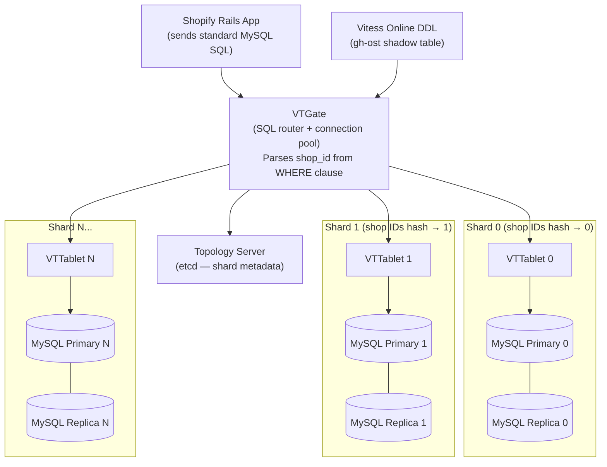

# Shopify — Scaling MySQL with Vitess and Tenant-Based Sharding

## Category

Scaling, Database Sharding, MySQL, Vitess, SaaS, Multi-Tenancy, Online DDL

## Scale at the Time

| Metric | Value |
|--------|-------|
| Merchants | Millions |
| Products in catalogue | Billions |
| Order volume (peak — BFCM 2023) | 61M orders on Black Friday |
| Database | MySQL (single cluster initially) |
| Sharding solution | Vitess |
| Shard key | shop_id (tenant) |
| Peak flash sale throughput | 32,000 requests/second on a single pod |

---

## Initial Architecture

Shopify started as a single Ruby on Rails monolith backed by a single MySQL database. As Shopify grew from a small e-commerce platform to the infrastructure powering millions of merchants, MySQL struggled under:
- Multi-billion row tables (products, orders, line items)
- Concurrent schema migrations requested by multiple teams
- Single-database bottleneck limiting horizontal write scaling
- Black Friday / Cyber Monday (BFCM) peaks that were orders of magnitude above normal load

```
Merchant Request → Rails Monolith → Single MySQL (all tenants)
```

---

## The Problem

### 1. Single-Database Write Bottleneck
All merchants share the same MySQL primary. A viral product launch by one large merchant (e.g., a sneaker drop with 500,000 concurrent buyers in 60 seconds) could saturate MySQL write capacity, degrading all other merchants simultaneously. The "noisy neighbour" problem at the database layer.

### 2. Multi-Billion Row Table Scans
Tables like `orders`, `products`, and `line_items` contained billions of rows. Full table scans (even with indexes) on these tables were extremely slow. Schema migrations (`ALTER TABLE`) on billion-row tables took hours and locked the table.

### 3. Online Schema Change Friction
Because MySQL requires a metadata lock for DDL operations, any `ALTER TABLE` blocked reads and writes for the duration of the migration. At Shopify's table sizes, this was measured in hours. Product teams could not add a column without coordinating a maintenance window.

### 4. Inability to Isolate Tenants
Large merchants (Kylie Cosmetics, Gymshark, Allbirds) with flash sales would consume disproportionate database resources, causing latency for small merchants with zero relation to the flash sale.

### 5. Cross-Tenant Queries
Some Shopify platform features required cross-merchant queries (e.g., analytics dashboards, fraud detection). These grew increasingly expensive as data volume scaled.

---

## The Solution

### S1. Vitess as the MySQL Sharding Layer

Shopify adopted **Vitess** — originally built by YouTube to scale their MySQL at Google. Vitess is a database clustering system that sits between the application and MySQL:

- **VTGate**: SQL query router — parses SQL, determines the correct shard(s), routes the query
- **VTTablet**: Per-MySQL-instance agent — manages connections, implements pooling, handles replication
- **VSchema**: The routing schema — defines which columns are shard keys and how to map row data to shards
- **Online DDL**: Schema migrations run without locking using in-built migration management

```
Application → VTGate (query router) → VTTablet → MySQL shard N
                                     → VTTablet → MySQL shard M
                                     (cross-shard scatter query if needed)
```

### S2. Tenant-Based Sharding (shop_id as Shard Key)

Shopify shards by `shop_id`. Every table has `shop_id` as part of its primary key. Vitess routes all operations for a given `shop_id` to the same MySQL shard.

**Benefits:**
- All merchant data is co-located on one shard → cross-table joins within a merchant are shard-local
- Tenant isolation: a flash sale on shard 3 does not affect shard 7
- Balanced distribution: `shop_id` distributes merchants roughly uniformly across shards by consistent hashing

**Trade-offs:**
- Cross-tenant analytics queries scatter across all shards (expensive)
- Very large merchants may hot-spot a shard (mitigated by splitting oversized shards)

### S3. VSchema Definition

```json
{
  "sharded": true,
  "vindexes": {
    "shop_id_vindex": {
      "type": "hash"
    }
  },
  "tables": {
    "orders": {
      "column_vindexes": [
        { "column": "shop_id", "name": "shop_id_vindex" }
      ]
    },
    "products": {
      "column_vindexes": [
        { "column": "shop_id", "name": "shop_id_vindex" }
      ]
    },
    "line_items": {
      "column_vindexes": [
        { "column": "shop_id", "name": "shop_id_vindex" }
      ]
    }
  }
}
```

With this VSchema, any query containing `WHERE shop_id = ?` is automatically routed to the correct shard without application changes.

### S4. Online DDL via Vitess

Shopify used Vitess's built-in **online DDL** support (backed by `gh-ost` or MySQL's instant DDL internally):

```sql
-- Submit an online DDL migration (non-blocking)
ALTER TABLE orders ADD COLUMN discount_code VARCHAR(100);
-- Vitess executes this asynchronously using shadow table + swap technique
-- Production traffic is not blocked during the migration

-- Check migration status
SHOW VITESS_MIGRATIONS LIKE 'uuid-of-migration';
```

This eliminated the maintenance window requirement for schema changes.

### S5. Pod-Level Flash Sale Isolation

For merchants with known flash sale events, Shopify can temporarily assign a large merchant's `shop_id` range to a **dedicated shard or pod** with additional MySQL read replicas. After the sale ends, traffic routes back to the standard shard. This is the Database-Per-Tenant pattern applied dynamically.

### S6. Connection Pooling at VTGate

VTGate maintains connection pools to each VTTablet, presenting a single connection pool to the application. This provides:
- Application sees one logical MySQL connection pool regardless of shard count
- VTGate multiplexes application connections to the shard-appropriate VTTablet pools
- Connection overhead is absorbed by VTGate, not propagated to MySQL

---

## Key Learnings

1. **Shard by tenant if you are a SaaS product** — `shop_id` is the natural isolation unit for Shopify; sharding by tenant gives you isolation, simplicity, and co-location of related data for free
2. **Vitess makes MySQL sharding operational** — raw MySQL sharding requires extensive application-layer routing logic; Vitess provides a transparent proxy so applications continue to speak standard SQL
3. **Online DDL is a prerequisite, not a nice-to-have** — at billions of rows, any table lock is a production incident; adopt gh-ost or Vitess online DDL before your tables are too large
4. **Connection pooling at the shard router level is mandatory** — as shard count grows, the number of MySQL connections from a naive application grows proportionally; centralise pooling at VTGate
5. **Shard key determines your data access patterns permanently** — the shard key is a one-way door; choosing `shop_id` means cross-merchant queries are expensive by design; ensure your business queries are shard-local
6. **Large tenants still need isolation** — even with tenant sharding, one very large tenant can hot-spot a shard; plan for dynamic shard assignment or dedicated resources for your top-N merchants
7. **Schema migrations on large tables must be tested against production data volume** — a migration that takes 5 minutes on 1M rows takes 8 hours on 1B rows; always benchmark on production-scale data

---

## Architecture Diagram



---

## Code / Config

### MySQL schema with shop_id as partition key

```sql
-- All tables include shop_id as part of compound primary key
-- This ensures Vitess can route queries to the correct shard

CREATE TABLE orders (
  id         BIGINT       NOT NULL,
  shop_id    BIGINT       NOT NULL,          -- shard key
  customer_id BIGINT      NOT NULL,
  total_price DECIMAL(12,2) NOT NULL,
  currency   VARCHAR(3)   NOT NULL DEFAULT 'USD',
  status     ENUM('pending','paid','fulfilled','cancelled') NOT NULL DEFAULT 'pending',
  created_at TIMESTAMP    NOT NULL DEFAULT CURRENT_TIMESTAMP,
  PRIMARY KEY (shop_id, id),                  -- shop_id first = shard-local clustered index
  INDEX idx_status (shop_id, status, created_at)
) ENGINE=InnoDB;

CREATE TABLE line_items (
  id         BIGINT       NOT NULL,
  shop_id    BIGINT       NOT NULL,          -- shard key (must match parent order)
  order_id   BIGINT       NOT NULL,
  product_id BIGINT       NOT NULL,
  quantity   INT          NOT NULL DEFAULT 1,
  unit_price DECIMAL(12,2) NOT NULL,
  PRIMARY KEY (shop_id, id),
  INDEX idx_order (shop_id, order_id)
) ENGINE=InnoDB;
```

### VTGate connection (Go application using standard MySQL driver)

```go
// Application connects to VTGate as if it's a regular MySQL instance
import (
    "database/sql"
    _ "github.com/go-sql-driver/mysql"
)

func newDB() (*sql.DB, error) {
    // VTGate presents a MySQL-compatible interface
    dsn := "app_user:password@tcp(vtgate:3306)/commerce?parseTime=true"
    db, err := sql.Open("mysql", dsn)
    if err != nil {
        return nil, err
    }
    db.SetMaxOpenConns(50)
    db.SetMaxIdleConns(10)
    return db, nil
}

// Query is automatically routed to the correct shard by VTGate
// based on the shop_id in the WHERE clause (per VSchema definition)
func getOrdersByShop(db *sql.DB, shopID int64, limit int) ([]Order, error) {
    rows, err := db.Query(
        `SELECT id, customer_id, total_price, status, created_at
         FROM orders
         WHERE shop_id = ? AND status = 'paid'
         ORDER BY created_at DESC
         LIMIT ?`,
        shopID, limit,
    )
    // VTGate routes to the correct shard — application is unaware of sharding
    ...
}
```

### Vitess online DDL — add column without blocking

```sql
-- Submit migration (returns immediately; runs in background)
SET @@ddl_strategy = 'vitess';
ALTER TABLE orders ADD COLUMN discount_code VARCHAR(100) AFTER total_price;

-- Monitor progress
SELECT migration_uuid, table_name, migration_state, progress
FROM information_schema.vitess_migrations
WHERE migration_state != 'complete'
ORDER BY started_timestamp DESC;

-- Cancel if needed
ALTER VITESS_MIGRATION 'uuid-here' CANCEL;

-- Retry a failed migration
ALTER VITESS_MIGRATION 'uuid-here' RETRY;
```

---

## References

- [Shopify Engineering — Vitess at Shopify](https://shopify.engineering/shopify-mysql-vitess) (2021)
- [Shopify Engineering — Handling Black Friday Traffic](https://shopify.engineering/how-shopify-scales-up-its-infrastructure)
- [Vitess — Horizontal MySQL Sharding](https://vitess.io/docs/)
- [GitHub — gh-ost Online Schema Migrations](https://github.com/github/gh-ost)
- [YouTube Engineering — Vitess Origin Story](https://vitess.io/blog/2015-12-23-vitess-for-the-cloud-part-1/)
