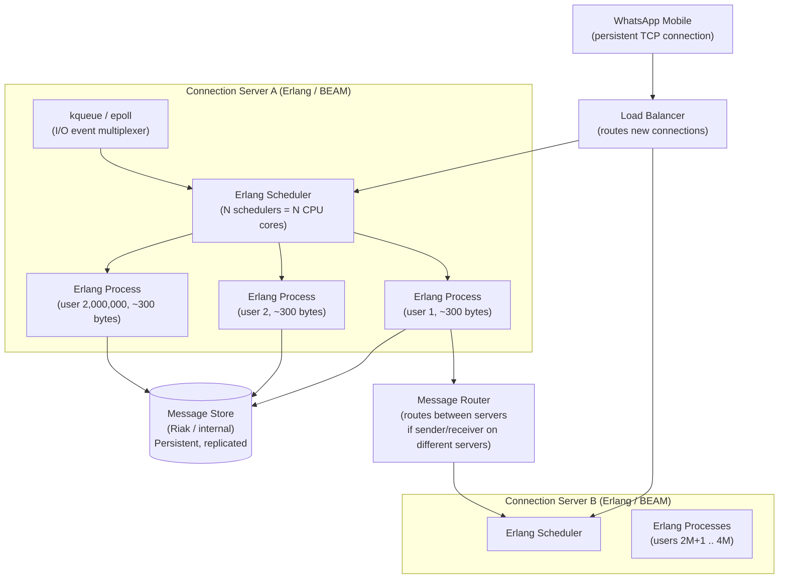

# WhatsApp — 2 Million Concurrent TCP Connections Per Server

## Category

Scaling, Connection Handling, C10k Problem, Erlang, FreeBSD, Lightweight Processes, Networking

## Scale at the Time

| Metric | Value |
|--------|-------|
| Active users | 450M monthly (at time of Facebook acquisition, 2014); 2B+ by 2020 |
| Servers | ~50 servers handling all messaging at acquisition |
| Concurrent TCP connections per server | 2,000,000+ |
| Engineers | 32 (at time of acquisition) |
| Message throughput | Tens of billions per day |

---

## Initial Architecture

WhatsApp chose Erlang and FreeBSD from the beginning, based on the team's prior experience at Yahoo. This was a deliberate, principled choice — not an evolutionary one — driven by a single design goal: maximise the number of concurrent persistent connections per server.

The core problem: each WhatsApp user maintains a **persistent TCP connection** to a WhatsApp server for message delivery. At 450M users, even if only 10% are simultaneously connected, that is 45 million connections that must be maintained. With a naive threading model, one thread per connection, you need 45 million threads — impossible.

```
WhatsApp Mobile Client ←——— persistent TCP connection ———→ WhatsApp Server (Erlang)
```

---

## The Problem

### 1. The C10K Problem (Extended to C2M)
The "C10K" problem (handling 10,000 concurrent connections per server) was considered solved by event-driven I/O architectures (epoll on Linux, kqueue on FreeBSD) in the early 2000s. WhatsApp pushed this to 2,000,000 connections per server — the C2M problem.

The challenge is that each connection represents a user session with state: authentication identity, message queue, delivery receipts, presence information. Holding 2 million user sessions simultaneously requires:
- Efficient per-connection state management (minimal memory per connection)
- Non-blocking I/O (blocking on any one connection must not affect others)
- Lightweight control flow (one logical handler per connection, but not one OS thread)

### 2. Thread-Per-Connection Does Not Scale
A traditional server uses one OS thread per connection:
- OS threads consume 8 MB stack by default on Linux
- 2 million threads × 8 MB = 16 TB RAM — impossible
- OS thread scheduling overhead grows non-linearly with thread count
- Context switch cost dominates CPU time at high thread counts

### 3. Shared Nothing vs. Coordinated State
Presence (online/offline status), delivery receipts, and group membership require coordination between connection handlers. Without a language-level concurrency model, this coordination requires locks, mutexes, or external state stores — all of which introduce contention at scale.

### 4. Memory Fragmentation Under Long-Running Connections
Connections may last hours or days. Over time, heap fragmentation builds up in long-lived processes. Systems with stop-the-world GC (JVM) suffer periodic pauses that affect all connections on the same process simultaneously.

---

## The Solution

### S1. Erlang — Lightweight Process Model

Erlang's fundamental unit of concurrency is the **Erlang process** — not an OS thread. Erlang processes are:
- **Extremely lightweight**: default heap size of ~300 bytes (vs. 8 MB for an OS thread)
- **Independently garbage collected**: each process has its own heap and GC; one process's GC does not pause others
- **Isolated**: no shared memory; processes communicate only via message passing — no locks, no mutexes
- **Pre-emptively scheduled**: the Erlang runtime's scheduler pre-empts processes after a configurable number of reductions (function calls), ensuring fairness across all connections

With 300 bytes per Erlang process, 2 million connections require just ~600 MB for the process overhead — feasible on a modern server.

```erlang
%% Each connection spawns one Erlang process
start_connection(Socket) ->
    spawn(fun() -> connection_loop(Socket) end).

connection_loop(Socket) ->
    receive
        {tcp, Socket, Data} ->
            handle_message(Data),
            connection_loop(Socket);
        {send, Message} ->
            gen_tcp:send(Socket, Message),
            connection_loop(Socket);
        {tcp_closed, Socket} ->
            cleanup()
    end.
```

### S2. FreeBSD + kqueue for Async I/O

WhatsApp chose FreeBSD over Linux at the time because FreeBSD's `kqueue` event notification system had lower overhead than Linux's `epoll` for their specific workload profile. The BEAM (Erlang VM) uses kqueue/epoll under the hood to multiplex I/O events across Erlang schedulers.

Key FreeBSD kernel tuning:
- `kern.maxfiles`: raised to support 2M+ open file descriptors
- `kern.ipc.maxsockbuf`: increase socket buffer sizes for high-throughput connections  
- `net.inet.tcp.keepidle` / `keepintvl` / `keepcnt`: TCP keep-alive tuning to detect and clean up dead connections

### S3. XMPP Over Custom Protocol

WhatsApp originally used XMPP (the open messaging protocol used by Jabber/Google Talk). They modified the XMPP protocol and serialisation format to be more compact over the wire — reducing per-message bytes for mobile networks and reducing parse time on the server.

Over time, WhatsApp moved to a proprietary binary protocol (based on XMPP concepts) that is more efficient for mobile networks with intermittent connectivity.

### S4. Message Persistence Decoupled from Connection Handling

The connection handler process is responsible only for maintaining the TCP connection and delivering messages. Persistence is handled by a separate layer (Mnesia, WhatsApp's internal message store, later migrated to Riak):

```
Connection Process (per user, in-memory) ↔ Message Store (persistent, replicated)
```

This separation means a server restart loses all connection state (users reconnect) but loses no messages (stored separately). The connection layer is stateless (except for the in-flight session), which makes it easy to run across many servers.

### S5. Horizontal Scaling via Stateless Connection Servers

Because connection state is lightweight and message storage is external, adding more connection servers is straightforward. A load balancer routes new connections to any available server. Users reconnect automatically if their server restarts. Each server independently handles millions of connections.

---

## Key Learnings

1. **The right concurrency model matters more than hardware** — Erlang's lightweight process model was the core enabler; 2M connections per server with 32 engineers was possible only because the language handled concurrency correctly at its core
2. **Per-process GC eliminates stop-the-world pauses at scale** — each Erlang process has independent GC; one large user's message queue does not pause all other connections during GC
3. **Shared-nothing concurrency is correct concurrency** — message passing eliminates locks, mutexes, and the deadlocks/race conditions they produce; this is why Erlang processes can be pre-emptively scheduled safely
4. **OS thread count is a hard limit** — building on a thread-per-connection model is a dead end for large-scale connection handling; use an event-driven or language-level lightweight process model from the start
5. **Kernel tuning is mandatory at extreme scale** — default OS limits (file descriptors, socket buffers, TCP keep-alive) are set for conservative server configurations; extreme connection counts require explicit kernel parameter tuning
6. **Separate connection handling from persistence** — connection handling is ephemeral (reconnect on restart); persistence is durable; these are different operational concerns and should be in different components
7. **Small team × right technology = massive scale** — 32 engineers operated global infrastructure for 450M users because the technology choices (Erlang, FreeBSD) aligned with the problem; choosing the wrong abstraction forces you to hire around it

---

## Architecture Diagram



---

## Code / Config

### Erlang gen_server for connection handling

```erlang
-module(whatsapp_conn).
-behaviour(gen_server).

-export([start_link/1, send/2]).
-export([init/1, handle_call/3, handle_cast/2, handle_info/2, terminate/2]).

-record(state, {
    socket    :: gen_tcp:socket(),
    user_id   :: binary(),
    recv_buf  :: binary()
}).

start_link(Socket) ->
    gen_server:start_link(?MODULE, [Socket], []).

send(Pid, Message) ->
    gen_server:cast(Pid, {send, Message}).

init([Socket]) ->
    %% Each connection uses ~300 bytes of heap initially
    %% gen_tcp:controlling_process/2 assigns ownership to this process
    ok = inet:setopts(Socket, [{active, once}, {packet, raw}, binary]),
    {ok, #state{socket=Socket, recv_buf = <<>>}}.

handle_info({tcp, Socket, Data}, State = #state{socket=Socket, recv_buf=Buf}) ->
    NewBuf = <<Buf/binary, Data/binary>>,
    {Messages, Rest} = parse_messages(NewBuf),
    lists:foreach(fun dispatch/1, Messages),
    inet:setopts(Socket, [{active, once}]),   % re-arm for next packet
    {noreply, State#state{recv_buf=Rest}};

handle_info({tcp_closed, Socket}, State = #state{socket=Socket}) ->
    {stop, normal, State};

handle_cast({send, Message}, State = #state{socket=Socket}) ->
    Encoded = encode_message(Message),
    gen_tcp:send(Socket, Encoded),
    {noreply, State}.

terminate(_Reason, #state{socket=Socket}) ->
    gen_tcp:close(Socket).
```

### FreeBSD kernel tuning for 2M connections (/etc/sysctl.conf)

```conf
# Maximum open file descriptors (each TCP connection = 1 fd)
kern.maxfiles=4000000
kern.maxfilesperproc=2000000

# TCP keep-alive: detect dead connections after 60s idle (not 2 hours default)
net.inet.tcp.keepidle=60000      # ms before first keep-alive probe
net.inet.tcp.keepintvl=10000     # ms between probes
net.inet.tcp.keepcnt=3           # probes before declaring dead

# Socket buffer sizes
kern.ipc.maxsockbuf=16777216     # 16 MB max socket buffer

# TCP_NODELAY (disable Nagle) for low-latency messaging
net.inet.tcp.delayed_ack=0

# Increase ephemeral port range for outgoing connections
net.inet.ip.portrange.first=1024
net.inet.ip.portrange.last=65535
```

### BEAM VM launch flags (erlang.config)

```bash
# Launch BEAM with tuned settings for high-connection workload
erl \
  +P 10000000 \          # max Erlang processes (default 262,144)
  +Q 65536 \             # max async I/O threads  
  +K true \              # enable kernel poll (epoll/kqueue)
  +A 128 \               # async thread pool size
  +sbt db \              # scheduler bind type: processor bind
  -env ERL_MAX_ETS_TABLES 100000 \
  -s whatsapp_app start
```

---

## References

- [WhatsApp Engineering — 1 Million is So 2011 (2 million connections per server)](https://blog.whatsapp.com/1-million-is-so-2011) (2012)
- [High Scalability — How WhatsApp Grew to Nearly 500 Million Users](https://highscalability.com/how-whatsapp-grew-to-nearly-500-million-users-11-engineers-a/)
- [Erlang — The BEAM Virtual Machine](https://www.erlang.org/doc/system/beambook.html)
- [The C10K Problem — Dan Kegel](http://www.kegel.com/c10k.html)
- [FreeBSD kqueue documentation](https://www.freebsd.org/cgi/man.cgi?query=kqueue)
