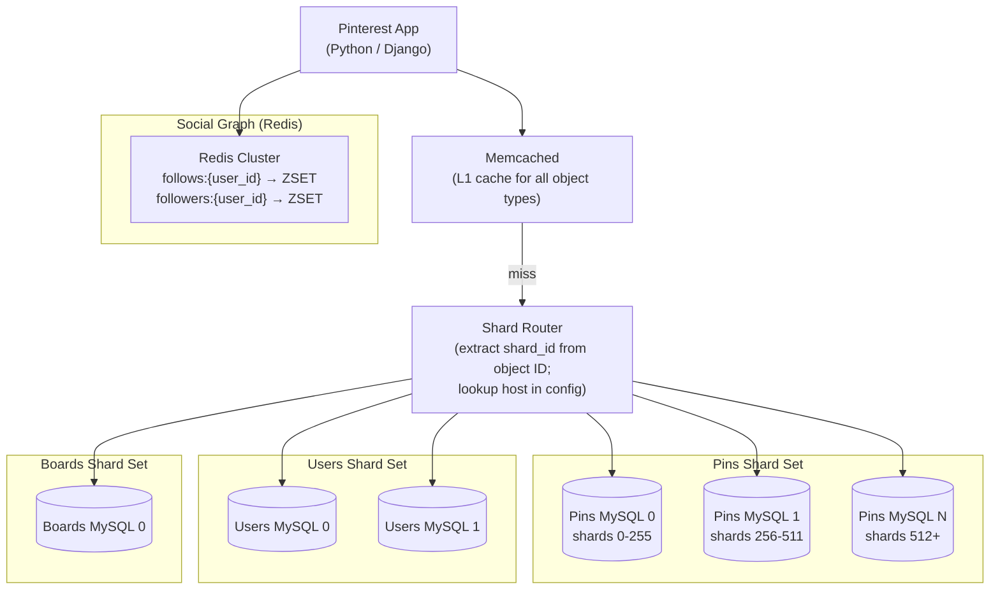

# Pinterest — Sharding Everything from 200M Objects to Billions

## Category

Scaling, Database Sharding, MySQL, Redis, Distributed ID Generation, Consistent Hashing, Early Scaling

## Scale at the Time

| Metric | Value |
|--------|-------|
| Objects (pins, boards, users, follows) | 250M+ at time of re-architecture |
| Growth rate | Doubling every 6–8 weeks (early 2012) |
| Initial database | Single MySQL + Memcached |
| Engineers at time of re-arch | ~20 |
| Solution | Sharded MySQL + Redis + distributed ID scheme |

---

## Initial Architecture

Pinterest launched in 2010 on a simple stack: one MySQL database, one web server, one Memcached instance on a single Amazon EC2 node. As user growth exploded (one of the fastest-growing web services in history), this single-node architecture became untenable.

```
Browser → Single Web Server → MySQL (all data) → Memcached (simple cache)
```

When Pinterest began sharding, they had ~250 million objects and needed to shard without downtime while the platform was growing faster than they could architect.

---

## The Problem

### 1. Outgrowing a Single MySQL in 6 Weeks
Pinterest's data growth rate meant that any architectural solution became outdated before implementation was complete. Traditional approaches (master-slave replication, vertical scaling) could not keep pace.

### 2. The "Big Table" Problem
Tables like `pins` and `follows` grew to hundreds of millions of rows. Read replicas helped with SELECT throughput, but the single MySQL primary was the bottleneck for all writes. Even with SSD storage and maximum IO, one primary cannot handle unbounded write growth.

### 3. No Sharding Strategy in the Initial Schema
Pinterest's original schema was designed for a single database — no shard keys in foreign keys, no distributed ID scheme, relationships expressed as foreign key joins. Retrofitting sharding without migrating all data was impossible without a new ID and data model.

### 4. Global Sequence IDs from MySQL AUTO_INCREMENT
MySQL `AUTO_INCREMENT` primary keys work on a per-table, per-instance basis. With sharding, multiple MySQL instances would generate overlapping IDs for the same entity type — you cannot use AUTO_INCREMENT for global IDs in a sharded system.

### 5. Cold Start — No Time for a Full Rewrite
Pinterest could not afford to stop the service while rewriting. The sharding architecture had to be deployed incrementally, with the old unsharded tables migrated to shards while the service kept running.

---

## The Solution

### S1. Shard Everything — Simple, Predictable Rules

Pinterest chose the simplest possible sharding approach over clever distribution strategies: **shard by object type with a compound shard key embedded in every object ID**.

**No cross-shard joins. No distributed transactions. No scatter-gather.**

Every object type (pins, boards, users, likes, follows) is stored in its own set of shards. Foreign key relationships are not enforced by MySQL — the application manages them.

### S2. 64-Bit Distributed ID Scheme

Every Pinterest object has a globally unique 64-bit ID with shard information encoded in the ID:

```
64-bit Pinterest ID layout:
  Bits 63–38  (26 bits): shard ID      — which shard this object lives on
  Bits 37–16  (22 bits): type ID       — object type (pin=1, board=2, user=3, ...)
  Bits 15–0   (16 bits): local ID      — auto-increment within the shard for this type
```

To find a pin with ID=12345678:
1. Extract shard ID from bits 63–38 → route to that MySQL shard
2. The local ID within the shard is unique within the `(shard, type)` combination

**Advantages:**
- No central coordination needed to generate IDs (shard-local auto-increment)
- Given any object ID, the shard is immediately derivable — no lookup table needed
- IDs encode object type — prevents cross-type ID collisions at the application layer
- IDs are fixed at creation and never change

```python
# Pinterest ID generation
SHARD_ID_BITS = 26
TYPE_ID_BITS  = 22
LOCAL_ID_BITS = 16

def make_pinterest_id(shard_id: int, type_id: int, local_id: int) -> int:
    return (shard_id << (TYPE_ID_BITS + LOCAL_ID_BITS)) \
         | (type_id  << LOCAL_ID_BITS) \
         | local_id

def parse_pinterest_id(pin_id: int) -> dict:
    local_id = pin_id & ((1 << LOCAL_ID_BITS) - 1)
    type_id  = (pin_id >> LOCAL_ID_BITS) & ((1 << TYPE_ID_BITS) - 1)
    shard_id = pin_id >> (TYPE_ID_BITS + LOCAL_ID_BITS)
    return {'shard_id': shard_id, 'type_id': type_id, 'local_id': local_id}
```

### S3. Explicit Shard Routing (No Magic)

Pinterest's application code contains an explicit routing function that maps `(object_type, shard_id)` to a specific MySQL host:

```python
SHARD_COUNT = 4096   # fixed at migration time; room to grow

def get_shard_host(shard_id: int, object_type: str) -> str:
    """Returns the MySQL hostname for a given shard and object type."""
    config = SHARD_CONFIG[shard_id]    # config map from shard ID to host
    return config['host']
```

The shard configuration is a simple dictionary loaded from configuration files — no ZooKeeper, no service discovery, no consistent hashing rings. The simplicity was intentional: fewer moving parts under rapid growth.

### S4. Separate Shards Per Object Type

Pinterest uses different MySQL instances for different object types:
- `users` sharded across shard set A (48 MySQL shards)
- `pins` sharded across shard set B (48 MySQL shards)
- `boards`, `follows`, `likes` each on separate sharded sets

This provides isolation: a viral pin (hot read on the pins shard) does not affect user authentication (different shard set). Each shard set can be scaled independently.

### S5. Redis for Social Graph (Follow Relationships)

Follow relationships (user A follows user B) are inherently bi-directional and frequently read. They are stored in **Redis sorted sets** rather than MySQL:

```
key: follows:{user_id}
type: sorted set
score: timestamp of follow event
value: followed_user_id
```

Redis handles the fan-out problem efficiently: `ZRANGEBYSCORE` retrieves ordered follow relationships in O(log N + M) time. The single-digit millisecond latency of Redis is acceptable for social graph traversals; MySQL join performance on 1B+ follow records is not.

### S6. Incremental Migration — Moving Data Shard by Shard

Pinterest migrated from the single MySQL to shards over weeks:
1. New objects written to sharded MySQL using new ID scheme immediately
2. Background job migrated old objects from legacy MySQL to shards, generating new IDs and writing a forwarding mapping (old ID → new ID)
3. Read path checked forwarding table for old IDs; new IDs routed directly
4. Once all objects migrated, forwarding table retired

---

## Key Learnings

1. **Design your ID scheme before your first production query** — retrofitting distributed IDs to an AUTO_INCREMENT schema is one of the most painful migrations possible; encode shard, type, and local ID in every ID from day one
2. **Shard routing does not need to be clever** — a static configuration file mapping shard ID to MySQL host is simpler, faster, and more debuggable than consistent hashing rings or service discovery for shard routing; YAGNI applies
3. **Separate shard sets per object type provide isolation and independent scaling** — don't put all object types in the same shards; isolate hot objects (pins) from cold objects (user profiles)
4. **Store social graphs in Redis, not MySQL** — bi-directional follow relationships at billions of edges are better served by Redis sorted sets than relational joins; the latency and throughput profiles are fundamentally different
5. **No cross-shard joins** — if your feature requires joining data from two shards, fetch from each shard independently and join in the application layer; don't build cross-shard query infrastructure
6. **Incremental migration beats big-bang** — moving from unsharded to sharded with a forwarding table and parallel writes is slower but maintains 100% availability; a migration window for 250M objects would have been measured in days of downtime
7. **Fix your shard count early and make it large** — Pinterest chose 4096 shards initially; most shards were empty at first, but the fixed shard count meant they never had to re-shard (which is vastly more complex than the initial sharding)

---

## Architecture Diagram



---

## Code / Config

### Pinterest shard routing (TypeScript equivalent)

```typescript
// Shard configuration: maps shard ID to MySQL connection details
const SHARD_CONFIG: Record<number, { host: string; port: number }> = {
  0:    { host: 'pins-mysql-00.internal', port: 3306 },
  1:    { host: 'pins-mysql-00.internal', port: 3307 },
  // ... up to 4095
  255:  { host: 'pins-mysql-00.internal', port: 3560 },
  256:  { host: 'pins-mysql-01.internal', port: 3306 },
};

const SHARD_ID_BITS  = 26;
const TYPE_ID_BITS   = 22;
const LOCAL_ID_BITS  = 16;

function makeId(shardId: number, typeId: number, localId: number): bigint {
  return (BigInt(shardId) << BigInt(TYPE_ID_BITS + LOCAL_ID_BITS))
       | (BigInt(typeId)  << BigInt(LOCAL_ID_BITS))
       | BigInt(localId);
}

function parseId(id: bigint): { shardId: number; typeId: number; localId: number } {
  return {
    shardId: Number(id >> BigInt(TYPE_ID_BITS + LOCAL_ID_BITS)),
    typeId:  Number((id >> BigInt(LOCAL_ID_BITS)) & BigInt((1 << TYPE_ID_BITS) - 1)),
    localId: Number(id & BigInt((1 << LOCAL_ID_BITS) - 1)),
  };
}

function getShardHost(id: bigint): { host: string; port: number } {
  const { shardId } = parseId(id);
  const config = SHARD_CONFIG[shardId];
  if (!config) throw new Error(`Unknown shard: ${shardId}`);
  return config;
}

// Redis social graph operations
import Redis from 'ioredis';
const redis = new Redis({ host: 'social-graph-redis' });

async function followUser(followerId: bigint, followeeId: bigint): Promise<void> {
  const timestamp = Date.now();
  await redis.pipeline()
    .zadd(`follows:${followerId}`, timestamp, followeeId.toString())     // who follower follows
    .zadd(`followers:${followeeId}`, timestamp, followerId.toString())   // who followee is followed by
    .exec();
}

async function getFollowing(userId: bigint, limit = 100): Promise<bigint[]> {
  const ids = await redis.zrevrange(`follows:${userId}`, 0, limit - 1);
  return ids.map(BigInt);
}
```

---

## References

- [Pinterest Engineering — Sharding Pinterest: How We Scaled Our MySQL Fleet](https://medium.com/pinterest-engineering/sharding-pinterest-how-we-scaled-our-mysql-fleet-3f341e96ca6f) (2013)
- [Pinterest Engineering — Building a Follower Model from Scratch](https://medium.com/pinterest-engineering/building-a-follower-model-from-scratch-f5478e9a7b7c)
- [High Scalability — Pinterest Architecture](https://highscalability.com/pinterest-architecture-update-18-million-visitors-10x-growth/)
- [Snowflake ID Generation — Twitter Engineering](https://blog.twitter.com/engineering/en_us/a/2010/announcing-snowflake)
