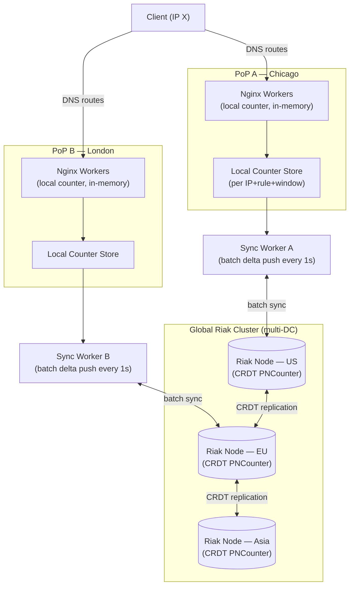

# Cloudflare — Distributed Rate Limiting Across 200+ Edge Nodes

## Category

Scaling, Rate Limiting, Distributed Systems, Edge Networks, Approximate Algorithms, Nginx, Riak

## Scale at the Time

| Metric | Value |
|--------|-------|
| Requests proxied | Trillions per month |
| Edge PoPs (Points of Presence) | 200+ globally |
| Rate limiting rules evaluated | Billions per day |
| Rate limit precision requirement | Approximate (±10% acceptable) |
| Architecture challenge | No global synchronisation affordable at request latency |

---

## Initial Architecture

Cloudflare is a global CDN and DDoS mitigation network. Every HTTP request flows through one of Cloudflare's edge nodes (Points of Presence — PoPs) before reaching the origin server. Customers can define rate limits: "block requests from IP X if it exceeds N requests per minute to this URL pattern."

Early rate limiting was **per-PoP**: each Nginx worker tracked a sliding counter in local memory. This worked for DDoS mitigation (where a single attacker targets a single PoP) but failed for the general case where a client's requests are distributed across multiple PoPs by global DNS load balancing.

```
Client → (global DNS) → PoP A (Cloudflare Chicago) → tracks 5 req/min locally
Client → (global DNS) → PoP B (Cloudflare London)  → tracks 5 req/min locally
Client → (global DNS) → PoP C (Cloudflare Tokyo)   → tracks 5 req/min locally
Total actual rate: 15 req/min (distributed across 3 PoPs)
Per-PoP local counter: 5 req/min (under the limit of 10 req/min!)
```

A client distributing requests across N PoPs could make N× the intended limit.

---

## The Problem

### 1. Per-PoP Rate Counting is Wildly Inaccurate
A single client can bypass any per-PoP rate limit by distributing requests across multiple PoPs. This is not hypothetical — DNS-based load balancing naturally distributes a client's requests globally, depending on which PoP resolves to the lowest latency from the client's ISP.

### 2. Global Coordination is Prohibitively Expensive
The obvious solution — a global distributed counter in a database — is not feasible at Cloudflare's scale:
- Trillions of requests per month = millions per second
- Round-trip to a centralised counter store would add 50–200 ms to every request (unacceptable for a CDN)
- A single counter store cannot handle millions of counter increments per second
- Distributed consensus protocols (Paxos, Raft) add coordination overhead that makes this latency even worse

### 3. Sliding Window vs. Fixed Window Accuracy Trade-Off
**Fixed window** (count requests in the current 1-minute window):
- Simple: `INCR counter; EXPIRE counter 60`
- Problem: allows 2× the intended rate at window boundaries (last second of one window + first second of next window)

**Sliding window** (count requests in the last 60 seconds):
- Accurate: no boundary spike
- Problem: requires per-request timestamps — expensive to compute precisely at scale

### 4. Riak Cluster as Global State

Cloudflare chose Riak (a distributed key-value store based on the Dynamo paper) for cross-PoP state. Riak provides:
- High availability (AP system — available even during network partitions)
- Per-key counters with CRDT (grow-only counters)
- Multi-datacenter replication

But Riak's latency is 10–30 ms for a synchronous read+write, which is too slow to evaluate on every request.

---

## The Solution

### S1. Approximate Sliding Window Algorithm (Two Fixed Windows)

Instead of a true sliding window, Cloudflare approximates it using **two fixed windows and linear interpolation**:

For a 1-minute rate limit:
- Keep counters for the **current minute** window and the **previous minute** window
- Estimate the sliding window count as:

```
current_window_count + previous_window_count × (1 - elapsed_in_current_window / window_size)
```

**Example:**
- Limit: 10 requests/minute
- Current window (started 45 seconds ago): 7 requests
- Previous window (60 seconds): 12 requests
- Sliding estimate: 7 + 12 × (1 - 45/60) = 7 + 12 × 0.25 = 7 + 3 = 10

This approximation is accurate to within a few percent in practice and requires only two counter reads/writes per request evaluation.

### S2. Local Counter + Periodic Synchronisation to Riak

Rather than synchronising with Riak on every request, each PoP:
1. Maintains a **local in-memory counter** per (IP, rule_id, window)
2. Increments the local counter atomically for each request
3. **Periodically batches** local counter deltas and pushes them to Riak (every 1–5 seconds)
4. **Periodically pulls** the global counter from Riak to update the local view

```
Request rate: 100,000 req/sec per PoP
Riak sync rate: 1x per second per (IP, rule) pair
Riak write reduction: 99,999× fewer writes than synchronous approach
```

The local counter provides fast, low-latency evaluation. The Riak counter provides eventual global accuracy. The window between synchronisation cycles is the "accuracy window" — during which a client's global rate is only approximately known.

### S3. Sharded Riak Counters (CRDT GCounter)

Riak's CRDT **PNCounter** (positive-negative counter) is used for rate limit counters:
- Each PoP has a dedicated "slot" in the CRDT counter
- Each PoP increments only its own slot (no write conflicts)
- The total count is the sum of all slots
- Riak replicates the counter to all DCs asynchronously

Because each PoP only writes to its own slot, there are no write-write conflicts — only read-merge operations when computing the total.

### S4. PoP-Local Fast Path, Global Slow Path

Cloudflare implements a **two-tier evaluation**:

**Fast path (local, every request):**
- If local counter clearly under the limit → allow (no Riak lookup)
- If local counter clearly over the limit → block (no Riak lookup)
- If local counter in the "uncertainty zone" (within 20% of the limit) → consult Riak

**This means Riak is queried only for borderline cases**, reducing Riak QPS by orders of magnitude for well-behaved traffic.

### S5. Per-PoP Soft Limit Based on Traffic Share

Because Cloudflare knows approximately what fraction of a client's traffic each PoP handles (from Anycast routing and observed traffic), it can apply a per-PoP soft limit:
- If a client sends 60% of traffic through PoP A and 40% through PoP B
- A global limit of 100 req/min becomes: allow 60 req/min on PoP A, 40 req/min on PoP B
- Local enforcement is accurate without global coordination

This works well in steady state; the synchronisation mechanism covers traffic shifts.

---

## Key Learnings

1. **Exact distributed rate limiting is impractical at scale** — synchronous global coordination adds unacceptable latency; design for approximate accuracy (within 10–15%) using local counters and periodic sync
2. **Two fixed windows approximate a sliding window accurately** — the linear interpolation estimate has ≤10% error, which is acceptable for rate limiting; it requires only two counter reads per evaluation
3. **Batch synchronisation reduces coordination overhead by orders of magnitude** — sync every 1 second instead of every request; accept the accuracy trade-off in exchange for eliminating per-request network round-trips
4. **CRDTs eliminate write conflicts in distributed counters** — CRDT grow-only counters (GCounter or PNCounter) allow each node to increment independently, then merge via max; no coordination needed for increments
5. **Two-tier evaluation (local fast path, remote slow path)** — only query the distributed store when local data is ambiguous (near the limit); most requests are either clearly safe or clearly over the limit
6. **Traffic distribution information enables local enforcement** — if you know what fraction of global traffic each node handles, proportional local limits can replace global coordination entirely for normal traffic patterns
7. **Rate limiting is inherently approximate** — a motivated adversary who knows your rate limit algorithm can exploit the synchronisation window; for security-critical limits (login attempts, payment attempts), accept the latency cost of stronger consistency

---

## Architecture Diagram



---

## Code / Config

### Approximate sliding window in Lua (Nginx/OpenResty)

```lua
-- Approximate sliding window rate limiter using two Redis keys
-- Compatible with OpenResty / nginx lua module

local redis = require "resty.redis"

local function check_rate_limit(ip, limit, window_seconds)
    local red = redis:new()
    red:set_timeouts(100, 100, 100)  -- 100ms connect/send/recv timeout
    red:connect("127.0.0.1", 6379)

    local now = ngx.now()
    local current_window = math.floor(now / window_seconds)
    local previous_window = current_window - 1

    local curr_key = string.format("rl:%s:%d", ip, current_window)
    local prev_key = string.format("rl:%s:%d", ip, previous_window)

    -- Atomic pipeline: increment current window + get both counters
    red:init_pipeline()
    red:incr(curr_key)
    red:expire(curr_key, window_seconds * 2)   -- keep for 2 windows
    red:get(prev_key)
    local results = red:commit_pipeline()

    local curr_count = tonumber(results[1]) or 0
    local prev_count = tonumber(results[3]) or 0

    -- Linear interpolation: weight previous window by how much of current window has elapsed
    local elapsed_fraction = (now % window_seconds) / window_seconds
    local estimated_count  = curr_count + prev_count * (1 - elapsed_fraction)

    red:close()

    if estimated_count > limit then
        return false, estimated_count   -- rate limited
    end
    return true, estimated_count        -- allowed
end

-- Nginx request handler
local ok, count = check_rate_limit(ngx.var.remote_addr, 100, 60)
if not ok then
    ngx.status = 429
    ngx.header["Retry-After"] = "60"
    ngx.header["X-RateLimit-Remaining"] = "0"
    ngx.say('{"error": "rate limit exceeded"}')
    return ngx.exit(429)
end
ngx.header["X-RateLimit-Remaining"] = tostring(100 - count)
```

### CRDT PNCounter concept in TypeScript (for reference)

```typescript
// Simplified PNCounter CRDT: each node increments its own slot
// Merge is component-wise max; total is sum of all merged values

type NodeId = string;
type GCounter = Map<NodeId, number>;

interface PNCounter {
  increments: GCounter;  // positive counter per node
  decrements: GCounter;  // negative counter per node
}

function increment(counter: PNCounter, nodeId: NodeId, amount = 1): void {
  counter.increments.set(nodeId, (counter.increments.get(nodeId) ?? 0) + amount);
}

function value(counter: PNCounter): number {
  let total = 0;
  for (const v of counter.increments.values()) total += v;
  for (const v of counter.decrements.values()) total -= v;
  return total;
}

function merge(a: PNCounter, b: PNCounter): PNCounter {
  const merged: PNCounter = { increments: new Map(), decrements: new Map() };
  const allNodes = new Set([
    ...a.increments.keys(), ...b.increments.keys(),
    ...a.decrements.keys(), ...b.decrements.keys(),
  ]);
  for (const node of allNodes) {
    merged.increments.set(node, Math.max(a.increments.get(node) ?? 0, b.increments.get(node) ?? 0));
    merged.decrements.set(node, Math.max(a.decrements.get(node) ?? 0, b.decrements.get(node) ?? 0));
  }
  return merged;
}

// PoP A processes 50 requests for IP X
const counterA: PNCounter = { increments: new Map(), decrements: new Map() };
increment(counterA, 'pop-a', 50);

// PoP B processes 30 requests for IP X
const counterB: PNCounter = { increments: new Map(), decrements: new Map() };
increment(counterB, 'pop-b', 30);

// Merged global view: total = 80
const global = merge(counterA, counterB);
console.log(value(global)); // 80
```

---

## References

- [Cloudflare Blog — An analysis of Nginx rate limiting algorithm](https://blog.cloudflare.com/counting-things-a-lot-of-different-things/) (2017)
- [Cloudflare Blog — How Cloudflare does Rate Limiting](https://blog.cloudflare.com/cloudflare-customers-now-get-rate-limiting-that-uses-riak/)
- [Riak CRDT Documentation — Counters](https://docs.riak.com/riak/kv/latest/developing/data-types/counters/)
- [Web Concepts — HTTP 429 Too Many Requests (RFC 6585)](https://datatracker.ietf.org/doc/html/rfc6585)
- [Redis — INCR + EXPIRE for rate limiting](https://redis.io/commands/incr/#pattern-rate-limiter)
- [Approximate Sliding Window — Cloudflare Blog](https://blog.cloudflare.com/sliding-window-rate-limiting/)
