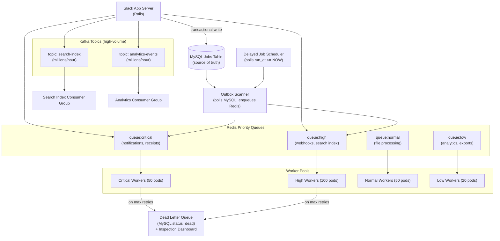

# Slack — Job Queue Evolution: From Redis to Multi-Tier Distributed Queues

## Category

Scaling, Job Queues, Message Processing, Redis, Kafka, Priority Queues, Background Workers

## Scale at the Time

| Metric | Value |
|--------|-------|
| Daily active users | 32.3 million (2023) |
| Workspaces | Millions |
| Messages sent per day | 1 billion+ |
| Job types | Thousands (notifications, search indexing, webhooks, analytics) |
| Job throughput | Millions per hour |
| Latency requirement | Varies: < 1s for notifications; minutes acceptable for analytics |

---

## Initial Architecture

Slack's original job queue was built on **Redis lists**: jobs were pushed to a Redis list, and worker processes consumed from it using `BLPOP` (blocking left-pop). This is a common starting point — Redis is fast, reliable, and simple to operate.

```
Producer (app server)
  → LPUSH job_queue:notifications '{"type":"notify","user":...}'

Consumer (worker fleet)
  → BLPOP job_queue:notifications 30  (block for up to 30s waiting for work)
  → Process notification job
```

---

## The Problem

### 1. No Job Priority
All jobs sit in one FIFO queue. A notification informing a user of a direct message and a background analytics rollup for a quarterly report compete equally for the same workers. When Slack experienced load spikes, high-urgency notifications were delayed because workers were busy processing low-urgency batch jobs.

This is **priority inversion**: low-priority work blocks high-priority work because they share the same queue.

### 2. No Durable Message Storage (Job Loss on Redis Crash)
Redis is in-memory by default. While Redis Append-Only File (AOF) persistence reduces data loss, a Redis crash or network partition between producer and Redis could cause job loss. For critical jobs (webhook deliveries, payments, notifications), losing a job silently was unacceptable.

### 3. No Dead Letter Queue (Silent Job Failure)
When a worker failed to process a job after N retries, the job was discarded. There was no record of failed jobs, no way to inspect failure reasons, and no way to retry or replay them after fixing the underlying bug.

### 4. Worker Pool Saturation Under Load Spikes
All job types share the same worker pool. A sudden burst of one job type (e.g., a viral post generating thousands of notification jobs) saturated all workers. Other job types starved. The worker fleet had no concept of per-type capacity allocation.

### 5. Queue Depth Visibility
With raw Redis lists, monitoring queue depth required a `LLEN queue_name` call — basic, but giving no insight into processing latency per job type, failure rates, or retry distribution. When workers fell behind, there was no early warning.

### 6. Job Scheduling (Delayed Execution)
Some jobs need to run in the future: "send this reminder in 4 hours", "retry this failed webhook after a 5-minute backoff". Redis has no native delayed job support — this required a separate polling mechanism with its own reliability concerns.

---

## The Solution

### S1. Hierarchical Priority Queues

Slack separated jobs into **priority tiers** based on user-facing latency requirements:

| Priority | Queue Name | Examples | SLA |
|----------|-----------|---------|-----|
| Critical | `queue:critical` | Desktop/mobile notifications, message delivery receipts | < 1 second |
| High | `queue:high` | Search indexing, webhook delivery, email | < 10 seconds |
| Normal | `queue:normal` | File processing, emoji caches, user preferences sync | < 60 seconds |
| Low | `queue:low` | Analytics rollups, export jobs, billing reports | Minutes |
| Background | `queue:background` | Data migrations, cleanup, precomputation | Hours |

Workers iterate through queues in priority order: check `critical`, then `high`, then `normal`, etc. A worker never picks from `low` if `critical` or `high` are non-empty.

```ruby
# Worker polling loop (priority order)
PRIORITY_ORDER = %w[critical high normal low background]

def next_job
  PRIORITY_ORDER.each do |priority|
    job = redis.blpop("queue:#{priority}", timeout: 0.1)
    return job if job
  end
  nil
end
```

### S2. Job Durability — Enqueue to MySQL, Execute via Redis

For critical jobs (notifications, webhooks, payments), Slack adopted a **transactional outbox** approach:
1. Write the job to a MySQL `jobs` table inside the same transaction as the triggering business operation
2. A background process reads new jobs from MySQL and enqueues them in Redis
3. Workers consume from Redis (fast path)
4. If Redis is down, the fallback scanner picks up from MySQL directly

This ensures **no job is lost** even if Redis fails — MySQL is the source of truth.

```sql
CREATE TABLE jobs (
  id           BIGINT AUTO_INCREMENT PRIMARY KEY,
  job_type     VARCHAR(64)  NOT NULL,
  priority     VARCHAR(16)  NOT NULL DEFAULT 'normal',
  queue_name   VARCHAR(64)  NOT NULL,
  payload      JSON         NOT NULL,
  status       ENUM('pending','running','completed','failed','dead') NOT NULL DEFAULT 'pending',
  attempts     TINYINT      NOT NULL DEFAULT 0,
  max_attempts TINYINT      NOT NULL DEFAULT 3,
  run_at       DATETIME(3)  NOT NULL DEFAULT CURRENT_TIMESTAMP(3),  -- for delayed jobs
  locked_at    DATETIME(3),
  locked_by    VARCHAR(64),
  failed_at    DATETIME(3),
  last_error   TEXT,
  created_at   DATETIME(3)  NOT NULL DEFAULT CURRENT_TIMESTAMP(3),
  INDEX idx_status_priority (status, priority, run_at),
  INDEX idx_queue  (queue_name, status, run_at)
) ENGINE=InnoDB;
```

### S3. Dead Letter Queue (DLQ) with Inspection UI

Jobs that fail after `max_attempts` retries are moved to `status='dead'` in MySQL (the DLQ). Engineers can:
- Inspect the `last_error` and `payload` for debugging
- Replay dead jobs after deploying a fix: `UPDATE jobs SET status='pending', attempts=0 WHERE status='dead' AND job_type='webhook'`
- Set alerts on `dead` queue depth

### S4. Delayed Jobs via Scheduled Execution

The `run_at` column in the MySQL jobs table enables delayed execution. A scheduler process polls for `status='pending' AND run_at <= NOW()`:

```sql
-- Scheduler query (runs every 100ms)
SELECT id FROM jobs
WHERE status = 'pending'
  AND run_at <= NOW(3)
ORDER BY priority DESC, run_at ASC
LIMIT 100;
```

Matched jobs are enqueued in Redis. This gives exact-scheduled execution without a separate cron system.

### S5. Per-Job-Type Worker Isolation (Kafka for High-Volume Types)

For the highest-volume job types (search indexing: reindex every message on edit; analytics events: millions per hour), Redis queues were replaced with **Apache Kafka**:
- Kafka provides horizontal scaling via partitions
- Consumer groups allow independent scaling of different job type processors
- Kafka's log retention enables replay on consumer failures
- Throughput: Kafka handles millions/second per topic versus Redis's ~100K/second per queue

Critical and high priority user-facing jobs stayed on Redis (lower latency). Bulk/analytics jobs migrated to Kafka (higher throughput, longer retention).

### S6. Metrics and Observability

Every queue stage emits metrics:
- Queue depth per priority tier (alert on > threshold)
- Processing rate per job type
- Failure rate per job type (alert on spike)
- DLQ depth (alert on any new entry in critical queue)
- P99 job processing time per type

---

## Key Learnings

1. **A single FIFO queue for all job types is an anti-pattern** — the first thing a job queue needs is priority tiers; without them, low-urgency work starves high-urgency work under load
2. **Job durability requires a persistent store, not just Redis** — use the transactional outbox pattern: write to MySQL atomically with the triggering operation; use Redis for fast delivery, MySQL as source of truth
3. **DLQ is not optional** — silent job failure is worse than a noisy queue; every queue must have a dead letter mechanism with inspection and replay capability
4. **Delayed jobs via run_at column beat cron schedules** — encoding the execution time as a column in the jobs table is simpler, more reliable, and more observable than coordinating cron expressions
5. **Separate high-volume batch jobs onto Kafka** — user-facing jobs (< 100K/sec) belong in Redis for latency; bulk analytical jobs (>> 100K/sec) belong in Kafka for throughput and replayability
6. **Worker pools must be isolated per job type** — shared worker pools cause one job type's burst to saturate all workers; allocate dedicated worker pools (or concurrency slots) per priority tier
7. **Queue depth and DLQ depth are the most important operational metrics** — alert on queue depth growth (consumers falling behind) and any DLQ entry (processing failure); everything else is secondary

---

## Architecture Diagram



---

## Code / Config

### Job producer with transactional outbox (TypeScript)

```typescript
import { db } from './database';          // MySQL connection
import { redis } from './redis';          // Redis client

type Priority = 'critical' | 'high' | 'normal' | 'low' | 'background';

interface JobDefinition {
  jobType: string;
  priority: Priority;
  payload: Record<string, unknown>;
  runAt?: Date;                           // undefined = run immediately
  maxAttempts?: number;
}

async function enqueueJob(
  job: JobDefinition,
  trx?: DBTransaction               // pass existing transaction for outbox pattern
): Promise<void> {
  const runAt = job.runAt ?? new Date();

  // Write to MySQL — durable, transactional
  await (trx ?? db).query(
    `INSERT INTO jobs (job_type, priority, queue_name, payload, run_at, max_attempts)
     VALUES (?, ?, ?, ?, ?, ?)`,
    [
      job.jobType,
      job.priority,
      `queue:${job.priority}`,
      JSON.stringify(job.payload),
      runAt,
      job.maxAttempts ?? 3,
    ]
  );

  // Also push to Redis for immediate delivery (if no delay)
  if (!job.runAt) {
    await redis.lpush(
      `queue:${job.priority}`,
      JSON.stringify({ jobType: job.jobType, payload: job.payload })
    );
  }
}

// Usage: enqueue inside a business transaction (outbox pattern)
async function sendMessage(senderId: string, channelId: string, text: string): Promise<void> {
  await db.transaction(async (trx) => {
    // Business operation
    await trx.query('INSERT INTO messages (sender_id, channel_id, text) VALUES (?, ?, ?)',
      [senderId, channelId, text]);

    // Job enqueued atomically — will not be lost even if Redis is down
    await enqueueJob({
      jobType: 'send_notification',
      priority: 'critical',
      payload: { senderId, channelId, text },
    }, trx);
  });
}
```

### Priority-aware worker in TypeScript

```typescript
const PRIORITY_ORDER: Priority[] = ['critical', 'high', 'normal', 'low', 'background'];

async function runWorker(): Promise<void> {
  while (true) {
    const job = await pollNextJob();
    if (!job) continue;

    const startTime = Date.now();
    try {
      await processJob(job);
      await markJobCompleted(job.id);
      metrics.histogram('job.processing_time', Date.now() - startTime, { type: job.jobType });
    } catch (err) {
      await handleJobFailure(job, err as Error);
    }
  }
}

async function pollNextJob(): Promise<Job | null> {
  // Try each priority in order; return first available job
  for (const priority of PRIORITY_ORDER) {
    const result = await redis.brpop(`queue:${priority}`, 0.1); // 100ms timeout per queue
    if (result) {
      const [, data] = result;
      return JSON.parse(data) as Job;
    }
  }
  return null;
}

async function handleJobFailure(job: Job, error: Error): Promise<void> {
  const attempts = job.attempts + 1;
  if (attempts >= job.maxAttempts) {
    // Move to DLQ
    await db.query(
      `UPDATE jobs SET status='dead', failed_at=NOW(), last_error=? WHERE id=?`,
      [error.message, job.id]
    );
    metrics.increment('job.dead', { type: job.jobType });
    alerts.trigger(`DLQ entry: ${job.jobType}`, { jobId: job.id, error: error.message });
  } else {
    // Exponential backoff: retry in 30s, 2m, 10m, ...
    const backoffSeconds = Math.pow(5, attempts) * 6;
    const runAt = new Date(Date.now() + backoffSeconds * 1000);
    await db.query(
      `UPDATE jobs SET status='pending', attempts=?, run_at=?, last_error=? WHERE id=?`,
      [attempts, runAt, error.message, job.id]
    );
  }
}
```

---

## References

- [Slack Engineering — Scaling Slack's Job Queue](https://slack.engineering/scaling-slacks-job-queue/) (2017)
- [Slack Engineering — Real-time Messaging at Scale](https://slack.engineering/real-time-messaging/)
- [Sidekiq — Pro Priority Queues](https://github.com/sidekiq/sidekiq/wiki/Pro-Features)
- [Temporal — Durable Workflow Engine](https://temporal.io/) (modern alternative to custom job queues)
- [Martin Fowler — Transactional Outbox Pattern](https://microservices.io/patterns/data/transactional-outbox.html)
- [Apache Kafka Documentation](https://kafka.apache.org/documentation/)
