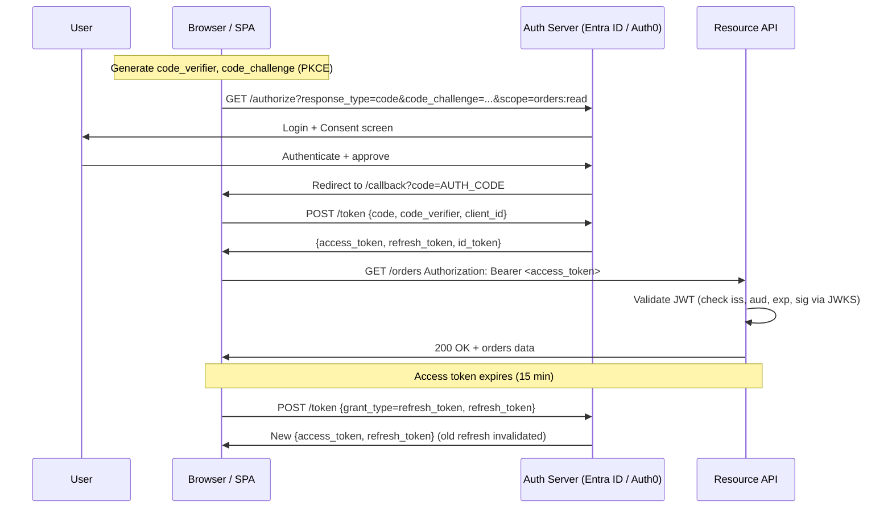

# OAuth 2.0, OIDC & JWT

## Category

Security, Authentication, Authorization, OAuth 2.0, OpenID Connect, JWT, PKCE

## Context

**OAuth 2.0** is the industry-standard protocol for delegated authorisation — it allows an application (client) to obtain limited access to a resource on behalf of a user or another service, without exposing credentials. **OpenID Connect (OIDC)** is an identity layer on top of OAuth 2.0 that provides authentication (who you are) in addition to authorisation (what you can do).

### OAuth 2.0 grant types

| Grant Type                    | When to use                            | Who authenticates       |
| ----------------------------- | -------------------------------------- | ----------------------- |
| **Authorization Code + PKCE** | Web apps, mobile apps, SPAs            | User (browser redirect) |
| **Client Credentials**        | Service-to-service (M2M)               | Client (no user)        |
| **Device Authorization**      | CLI tools, TV apps                     | User (secondary device) |
| **Refresh Token**             | Session extension — any flow with user | Client (silent)         |
| ~~Implicit~~                  | **Deprecated** — never use             | —                       |
| ~~Resource Owner Password~~   | **Deprecated** — never use             | —                       |

### JWT (JSON Web Token) structure

```
Header.Payload.Signature
```

| Part          | Content                                                                     |
| ------------- | --------------------------------------------------------------------------- |
| **Header**    | `alg` (RS256, ES256), `typ`, `kid` (key ID for JWKS lookup)                 |
| **Payload**   | Standard claims: `sub`, `iss`, `aud`, `exp`, `iat`, `jti` + custom claims   |
| **Signature** | Signed by issuer's private key; verified with public key from JWKS endpoint |

### Standard claims (RFC 7519)

| Claim   | Meaning                   | Validation rule                               |
| ------- | ------------------------- | --------------------------------------------- |
| `iss`   | Issuer                    | Must match expected authority                 |
| `aud`   | Audience                  | Must include your API's client ID             |
| `sub`   | Subject (user/service ID) | Non-empty                                     |
| `exp`   | Expiry (Unix timestamp)   | Must be in the future                         |
| `iat`   | Issued at                 | Must not be too far in the past (clock skew)  |
| `jti`   | JWT ID                    | Optional; used for replay prevention          |
| `scope` | Granted scopes            | Must include required scope for the operation |

**PKCE (Proof Key for Code Exchange)**: Prevents authorization code interception attacks in public clients. The client generates a random `code_verifier`, hashes it to `code_challenge`, and sends the challenge in the auth request. The verifier is sent on token exchange — the server confirms they match.

---

## Pros

- **Delegated access without password sharing**: Users grant scoped, time-limited access to third-party apps.
- **Stateless JWT verification**: Resource servers validate tokens locally using cached JWKS public keys — no auth server round-trip per request.
- **Scope-based least privilege**: Clients request only the scopes they need; users see and consent to exactly what is being granted.
- **PKCE eliminates code injection for public clients**: Even if the authorization code is intercepted, it cannot be exchanged without the original `code_verifier`.
- **Token rotation**: Short-lived access tokens (15 min) + long-lived refresh tokens with rotation limit blast radius of stolen tokens.

---

## Cons

- **JWT cannot be invalidated before expiry**: If a token is stolen, it remains valid until `exp`. Mitigate with short expiry + token binding or introspection.
- **Rotation complexity**: Refresh token rotation (rotating on each use) requires atomic swap logic — parallel requests can cause race conditions.
- **Scope creep**: Applications request over-broad scopes for convenience — governance required.
- **JWKS key rotation**: Applications must handle the case where a `kid` is not yet in their local JWKS cache — fetch and retry.
- **`alg: none` vulnerability**: Never accept unsigned tokens — always require specific algorithms (RS256, ES256) and reject `none`.

---

## Design Diagram



---

## Code Sample

### TypeScript — JWT Validation Middleware (resource server)

```typescript
// src/middleware/auth.ts
import { createRemoteJWKSet, jwtVerify, type JWTVerifyResult } from "jose";
import type { Request, Response, NextFunction } from "express";

// Cache JWKS fetcher — fetches and caches public keys from the auth server
// Re-fetches automatically when a new key ID is encountered
const JWKS = createRemoteJWKSet(
  new URL(`${process.env.OIDC_ISSUER}/.well-known/jwks.json`),
  {
    cacheMaxAge: 15 * 60 * 1000, // Cache keys for 15 minutes
    cooldownDuration: 30 * 1000, // Minimum 30s between re-fetches
  },
);

export interface AuthenticatedRequest extends Request {
  auth: {
    sub: string;
    scopes: string[];
    claims: Record<string, unknown>;
  };
}

export async function authenticate(
  req: Request,
  res: Response,
  next: NextFunction,
): Promise<void> {
  const authHeader = req.headers.authorization;

  if (!authHeader?.startsWith("Bearer ")) {
    res
      .status(401)
      .json({
        error: "missing_token",
        error_description: "Authorization header required",
      });
    return;
  }

  const token = authHeader.slice(7);

  let result: JWTVerifyResult;
  try {
    result = await jwtVerify(token, JWKS, {
      issuer: process.env.OIDC_ISSUER, // Validate iss
      audience: process.env.API_AUDIENCE, // Validate aud
      algorithms: ["RS256", "ES256"], // Reject alg:none and symmetric
      clockTolerance: "30s", // Allow 30s clock skew
      maxTokenAge: "1h", // Reject tokens older than 1h
    });
  } catch (err) {
    // Return specific error codes per RFC 6750
    const errMsg = err instanceof Error ? err.message : "invalid_token";
    res.status(401).json({ error: "invalid_token", error_description: errMsg });
    return;
  }

  const { payload } = result;

  // Parse scope claim — can be space-separated string or array
  const scopeValue = payload.scope as string | string[] | undefined;
  const scopes = Array.isArray(scopeValue)
    ? scopeValue
    : (scopeValue?.split(" ") ?? []);

  (req as AuthenticatedRequest).auth = {
    sub: payload.sub!,
    scopes,
    claims: payload as Record<string, unknown>,
  };

  next();
}

// ─── Scope guard middleware factory ───────────────────────────────────────────
export function requireScope(...required: string[]) {
  return (req: Request, res: Response, next: NextFunction): void => {
    const { scopes } = (req as AuthenticatedRequest).auth;
    const hasAll = required.every((s) => scopes.includes(s));

    if (!hasAll) {
      res.status(403).json({
        error: "insufficient_scope",
        error_description: `Required scopes: ${required.join(", ")}`,
      });
      return;
    }

    next();
  };
}

// ─── Usage in routes ──────────────────────────────────────────────────────────
// router.get('/orders', authenticate, requireScope('orders:read'), handler);
// router.post('/orders', authenticate, requireScope('orders:write'), handler);
```

### TypeScript — Authorization Code + PKCE flow (SPA / client)

```typescript
// src/auth/pkce-flow.ts
// PKCE Authorization Code Flow — for SPAs and mobile apps

function generateCodeVerifier(): string {
  const array = new Uint8Array(32);
  crypto.getRandomValues(array);
  return btoa(String.fromCharCode(...array))
    .replace(/\+/g, "-")
    .replace(/\//g, "_")
    .replace(/=/g, "");
}

async function generateCodeChallenge(verifier: string): Promise<string> {
  const encoder = new TextEncoder();
  const data = encoder.encode(verifier);
  const digest = await crypto.subtle.digest("SHA-256", data);
  return btoa(String.fromCharCode(...new Uint8Array(digest)))
    .replace(/\+/g, "-")
    .replace(/\//g, "_")
    .replace(/=/g, "");
}

export async function initiateLogin(): Promise<void> {
  const codeVerifier = generateCodeVerifier();
  const codeChallenge = await generateCodeChallenge(codeVerifier);
  const state = crypto.randomUUID();

  // Store in sessionStorage — not localStorage (slightly shorter-lived)
  sessionStorage.setItem("pkce_verifier", codeVerifier);
  sessionStorage.setItem("oauth_state", state);

  const params = new URLSearchParams({
    response_type: "code",
    client_id: import.meta.env.VITE_CLIENT_ID,
    redirect_uri: `${window.location.origin}/callback`,
    scope: "openid profile email orders:read orders:write",
    state,
    code_challenge: codeChallenge,
    code_challenge_method: "S256",
    // Request refresh token
    prompt: "consent",
    access_type: "offline",
  });

  window.location.href = `${import.meta.env.VITE_OIDC_AUTHORITY}/oauth/authorize?${params}`;
}

export async function handleCallback(): Promise<{
  accessToken: string;
  idToken: string;
}> {
  const params = new URLSearchParams(window.location.search);
  const code = params.get("code");
  const returnedState = params.get("state");
  const error = params.get("error");

  if (error)
    throw new Error(
      `OAuth error: ${error} — ${params.get("error_description")}`,
    );
  if (!code) throw new Error("No authorization code in callback");

  // Validate state — CSRF protection
  const expectedState = sessionStorage.getItem("oauth_state");
  if (returnedState !== expectedState)
    throw new Error("State mismatch — possible CSRF");

  const codeVerifier = sessionStorage.getItem("pkce_verifier");
  if (!codeVerifier) throw new Error("No code verifier found");

  sessionStorage.removeItem("pkce_verifier");
  sessionStorage.removeItem("oauth_state");

  const response = await fetch(
    `${import.meta.env.VITE_OIDC_AUTHORITY}/oauth/token`,
    {
      method: "POST",
      headers: { "Content-Type": "application/x-www-form-urlencoded" },
      body: new URLSearchParams({
        grant_type: "authorization_code",
        code,
        redirect_uri: `${window.location.origin}/callback`,
        client_id: import.meta.env.VITE_CLIENT_ID,
        code_verifier: codeVerifier,
      }),
    },
  );

  if (!response.ok) {
    const err = await response.json();
    throw new Error(`Token exchange failed: ${err.error_description}`);
  }

  const tokens = await response.json();
  return { accessToken: tokens.access_token, idToken: tokens.id_token };
}
```

### TypeScript — Client Credentials (service-to-service)

```typescript
// src/auth/client-credentials.ts
// Machine-to-machine authentication — no user involved

interface TokenCache {
  token: string;
  expiresAt: number;
}

let tokenCache: TokenCache | null = null;

export async function getServiceToken(scope: string): Promise<string> {
  const now = Date.now();

  // Return cached token if still valid (with 60s buffer)
  if (tokenCache && tokenCache.expiresAt - 60_000 > now) {
    return tokenCache.token;
  }

  const response = await fetch(`${process.env.OIDC_ISSUER}/oauth/token`, {
    method: "POST",
    headers: { "Content-Type": "application/x-www-form-urlencoded" },
    body: new URLSearchParams({
      grant_type: "client_credentials",
      client_id: process.env.CLIENT_ID!,
      client_secret: process.env.CLIENT_SECRET!, // Or use mTLS/JWT assertion
      scope,
    }),
  });

  if (!response.ok)
    throw new Error(`Token acquisition failed: ${response.status}`);

  const data = await response.json();

  tokenCache = {
    token: data.access_token,
    expiresAt: now + data.expires_in * 1000,
  };

  return tokenCache.token;
}
```
