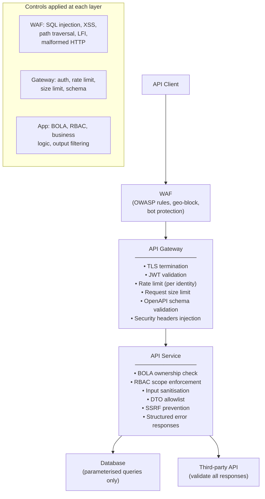

# API Security

## Category
Security, API Security, OWASP API Top 10, Input Validation, Rate Limiting, CORS

## Context

APIs are the primary attack surface of modern applications. The **OWASP API Security Top 10** (2023) defines the most critical API vulnerabilities. Securing APIs requires layering multiple controls — authentication, authorisation, input validation, rate limiting, and output filtering — rather than relying on any single mechanism.

### OWASP API Security Top 10 (2023)

| # | Vulnerability | Description | Mitigation |
|---|--------------|-------------|------------|
| **API1** | Broken Object Level Authorisation (BOLA) | Accessing other users' objects by manipulating IDs | Validate ownership on every request, not just auth |
| **API2** | Broken Authentication | Weak tokens, missing expiry, no brute-force protection | PKCE, short-lived JWTs, rate-limit auth endpoints |
| **API3** | Broken Object Property Level Authorisation | Exposing internal fields (mass assignment / excessive data) | Allowlist response fields; use DTOs, not ORM objects |
| **API4** | Unrestricted Resource Consumption | No limits on request size, rate, or resource use | Rate limiting, request size limits, pagination |
| **API5** | Broken Function Level Authorisation | Admin endpoints accessible to non-admins | Explicit scope/role checks per operation |
| **API6** | Unrestricted Access to Sensitive Business Flows | Scraping, bulk purchase bots, account enumeration | CAPTCHA, velocity checks, business logic rate limits |
| **API7** | Server Side Request Forgery (SSRF) | User-supplied URLs trigger requests to internal services | Allowlist domains; block private IP ranges in outbound |
| **API8** | Security Misconfiguration | Debug endpoints, verbose errors, missing TLS | Disable debug in prod; structured error responses |
| **API9** | Improper Inventory Management | Shadow APIs, stale API versions still reachable | API gateway routing; deprecate and remove old versions |
| **API10** | Unsafe Consumption of APIs | Trusting third-party API responses without validation | Validate and sanitise all third-party data |

### Defence layers

```
Internet → WAF (L7 rules) → API Gateway (auth, rate limit) → API (validation, RBAC) → Database
```

---

## Pros

- **Layered defence**: Each layer independently catches what the previous layer misses — no single point of failure.
- **WAF as first line**: Blocks known attack patterns (SQLi, XSS, path traversal) before requests reach application code.
- **Schema validation at gateway**: Reject malformed requests at the gateway — reduces load on backend and prevents injection.
- **Rate limiting per identity**: Per-user/per-API-key limits mitigate credential stuffing and DDoS without blocking legitimate users.

---

## Cons

- **BOLA is hard to automate**: Object-level ownership checks must be explicit in business logic — cannot be fully handled at gateway.
- **Over-blocking WAF rules**: Strict WAF rules generate false positives on legitimate API payloads (especially with nested JSON).
- **Rate limit bypass**: Attackers rotate IPs or use distributed botnets — IP-based rate limits alone are insufficient.
- **Schema validation maintenance**: OpenAPI schemas must be kept up to date with the API — drift causes false rejections.

---

## Design Diagram



---

## Code Sample

### TypeScript — Express API Security Middleware Stack

```typescript
// src/middleware/security.ts
import express from 'express';
import helmet from 'helmet';
import rateLimit from 'express-rate-limit';
import { body, param, query, validationResult } from 'express-validator';
import type { Request, Response, NextFunction } from 'express';

const app = express();

// ─── 1. Security headers (helmet) ────────────────────────────────────────────
app.use(helmet({
  contentSecurityPolicy: {
    directives: {
      defaultSrc:  ["'self'"],
      scriptSrc:   ["'self'"],
      styleSrc:    ["'self'", "'unsafe-inline'"],   // Remove unsafe-inline if possible
      imgSrc:      ["'self'", 'data:', 'https:'],
      connectSrc:  ["'self'"],
      frameAncestors: ["'none'"],
      upgradeInsecureRequests: [],
    },
  },
  hsts: {
    maxAge:            31536000,
    includeSubDomains: true,
    preload:           true,
  },
  frameguard:          { action: 'deny' },
  noSniff:             true,
  referrerPolicy:      { policy: 'strict-origin-when-cross-origin' },
  crossOriginEmbedderPolicy: false,  // Disable if serving cross-origin resources
}));

// ─── 2. Request size limits ────────────────────────────────────────────────────
app.use(express.json({ limit: '100kb' }));      // Reject payloads > 100KB
app.use(express.urlencoded({ extended: true, limit: '100kb' }));

// ─── 3. CORS — explicit allowlist (not wildcard) ──────────────────────────────
const ALLOWED_ORIGINS = new Set(
  (process.env.CORS_ALLOWED_ORIGINS ?? '').split(',').filter(Boolean),
);

app.use((req, res, next) => {
  const origin = req.headers.origin;

  if (origin && ALLOWED_ORIGINS.has(origin)) {
    res.setHeader('Access-Control-Allow-Origin',      origin);
    res.setHeader('Access-Control-Allow-Methods',     'GET,POST,PUT,DELETE,PATCH');
    res.setHeader('Access-Control-Allow-Headers',     'Authorization,Content-Type,x-correlation-id');
    res.setHeader('Access-Control-Allow-Credentials', 'true');
    res.setHeader('Access-Control-Max-Age',           '86400');  // Cache preflight 24h
  }

  if (req.method === 'OPTIONS') {
    res.sendStatus(204);
    return;
  }

  next();
});

// ─── 4. Global rate limiter — prevent enumeration / DDoS ─────────────────────
const globalLimiter = rateLimit({
  windowMs:  15 * 60 * 1000,   // 15 minutes
  max:        500,              // 500 requests per 15 min per IP
  standardHeaders: 'draft-7',
  legacyHeaders:   false,
  keyGenerator: (req) => {
    // Prefer real IP from trusted proxy header
    return (req.headers['x-forwarded-for'] as string)?.split(',')[0].trim()
      ?? req.ip
      ?? 'unknown';
  },
  skip: (req) => req.path === '/health/live',  // Don't rate-limit health probes
  handler: (req, res) => {
    res.status(429).json({
      error:             'rate_limit_exceeded',
      error_description: 'Too many requests. Please retry after the reset window.',
      retryAfter:        res.getHeader('Retry-After'),
    });
  },
});

// Stricter limiter for auth endpoints
const authLimiter = rateLimit({
  windowMs: 15 * 60 * 1000,
  max:      20,    // Only 20 auth attempts per 15 min
  standardHeaders: 'draft-7',
  legacyHeaders:   false,
});

app.use('/api', globalLimiter);
app.use('/auth', authLimiter);

// ─── 5. Structured error handler — no stack traces in prod ───────────────────
app.use((err: Error, req: Request, res: Response, _next: NextFunction) => {
  const correlationId = req.headers['x-correlation-id'] as string ?? crypto.randomUUID();

  // Log full error internally
  console.error({ correlationId, error: err.message, stack: err.stack });

  // Return minimal info to client — never leak internal details
  res.status(500).json({
    error:          'internal_error',
    correlationId,
    // No err.message, no stack trace in prod
  });
});
```

### TypeScript — BOLA (Broken Object Level Authorisation) Prevention

```typescript
// src/routes/orders.ts
// BOLA: always verify the requesting user OWNS the resource they're accessing

import type { Response } from 'express';
import type { AuthenticatedRequest } from '../middleware/auth.js';
import { getOrderById, type Order } from '../data/orders-repo.js';

export async function getOrder(
  req: AuthenticatedRequest,
  res: Response,
): Promise<void> {
  const { orderId } = req.params;

  // ✅ CORRECT: fetch first, then check ownership
  const order = await getOrderById(orderId);

  if (!order) {
    // ✅ Return 404, not 403 — don't leak existence of other users' resources
    res.status(404).json({ error: 'not_found' });
    return;
  }

  // ✅ Ownership check — compare DB record's owner against token subject
  if (order.customerId !== req.auth.sub) {
    // Admin override — check for elevated scope
    if (!req.auth.scopes.includes('orders:admin')) {
      // ✅ Still 404, not 403 — IDOR enumeration prevention
      res.status(404).json({ error: 'not_found' });
      return;
    }
  }

  // ✅ DTO: return only necessary fields — prevent excessive data exposure (API3)
  res.json(sanitiseOrder(order));
}

// ❌ VULNERABLE pattern — never do this:
// async function getOrderVulnerable(req, res) {
//   const order = await getOrderById(req.params.orderId);
//   res.json(order);  // Missing ownership check — full BOLA vulnerability
// }

function sanitiseOrder(order: Order): Partial<Order> {
  // Allowlist response fields — never spread/return full ORM object
  return {
    id:          order.id,
    status:      order.status,
    totalAmount: order.totalAmount,
    items:       order.items,
    createdAt:   order.createdAt,
    // ❌ Never include: internalNotes, costPrice, fraudScore, etc.
  };
}
```

### TypeScript — Input Validation + SSRF Prevention

```typescript
// src/middleware/validators.ts
import { body, param, query, validationResult } from 'express-validator';
import type { Request, Response, NextFunction } from 'express';

// ─── Validate and handle validation errors ────────────────────────────────────
export function validate(req: Request, res: Response, next: NextFunction): void {
  const errors = validationResult(req);
  if (!errors.isEmpty()) {
    res.status(400).json({
      error:  'validation_error',
      fields: errors.array().map(({ type, msg, ...rest }) => ({ ...rest, message: msg })),
    });
    return;
  }
  next();
}

// ─── Order creation validators ────────────────────────────────────────────────
export const createOrderValidators = [
  body('items')
    .isArray({ min: 1, max: 100 })
    .withMessage('items must be an array of 1-100 elements'),

  body('items.*.productId')
    .isUUID(4)
    .withMessage('productId must be a valid UUIDv4'),

  body('items.*.quantity')
    .isInt({ min: 1, max: 1000 })
    .withMessage('quantity must be between 1 and 1000'),

  body('shippingAddress.postcode')
    .matches(/^[A-Z0-9 ]{3,10}$/)
    .withMessage('Invalid postcode format'),

  // Prevent prototype pollution and injection via object shapes
  body('metadata')
    .optional()
    .isObject()
    .custom((val: unknown) => {
      if (typeof val !== 'object' || val === null) return true;
      const forbidden = ['__proto__', 'constructor', 'prototype'];
      const keys = Object.keys(val as Record<string, unknown>);
      if (keys.some((k) => forbidden.includes(k))) {
        throw new Error('Invalid metadata keys');
      }
      return true;
    }),
];

// ─── SSRF prevention — URL validation for webhook / callback configs ──────────
const PRIVATE_IP_RANGES = [
  /^10\./,
  /^172\.(1[6-9]|2\d|3[01])\./,
  /^192\.168\./,
  /^127\./,
  /^::1$/,
  /^fc00:/,
  /^169\.254\./,     // Link-local
  /^0\./,
  /^metadata\.google\.internal/,    // GCP metadata endpoint
  /^169\.254\.169\.254/,            // Cloud metadata endpoint (AWS/Azure/GCP)
];

export function validateWebhookUrl(url: string): void {
  let parsed: URL;
  try {
    parsed = new URL(url);
  } catch {
    throw new Error('Invalid URL format');
  }

  // Only allow HTTPS
  if (parsed.protocol !== 'https:') {
    throw new Error('Webhook URL must use HTTPS');
  }

  // Block private IP ranges
  const hostname = parsed.hostname;
  if (PRIVATE_IP_RANGES.some((r) => r.test(hostname))) {
    throw new Error('Webhook URL points to a private/internal address');
  }

  // Optionally: resolve hostname and check the resulting IP
  // (DNS rebinding prevention — check at resolution time, not just parse time)
}
```
