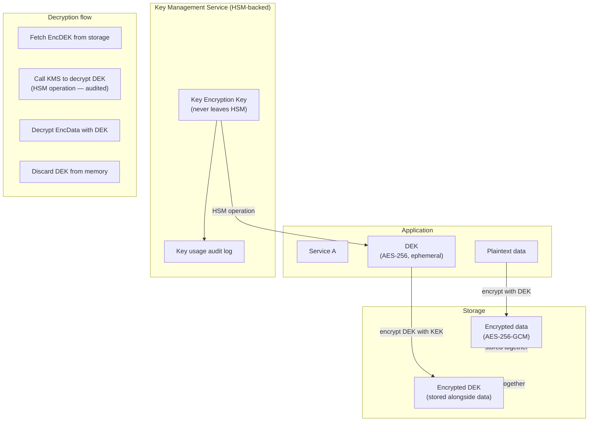

# Encryption Patterns

## Category
Security, Encryption, TLS, Key Management, Envelope Encryption, HSM, Key Rotation

## Context

Encryption is applied at two levels: **in transit** (data moving between systems) and **at rest** (data stored on disk or in databases). A third consideration — **in use** (confidential computing) — protects data during processing, but is less widely deployed.

### Encryption in transit

| Mechanism | Where | Minimum version |
|-----------|-------|----------------|
| **TLS** | All HTTP, gRPC, database, message broker connections | TLS 1.2; prefer TLS 1.3 |
| **mTLS** | Service-to-service authentication + encryption | TLS 1.2+ with client cert validation |
| **Certificate pinning** | Mobile apps to prevent MitM with rogue CAs | Use HPKP backup pins + short expiry |
| **HSTS** | Force browser HTTPS; include in preload list | `max-age=31536000; includeSubDomains; preload` |

### Encryption at rest

| Mechanism | Where | Key control |
|-----------|-------|-------------|
| **Provider-managed keys** | Cloud defaults (S3 SSE-S3, Azure Storage SSE) | Provider manages key lifecycle |
| **Customer-managed keys (CMK)** | KMS / Key Vault backed encryption | Customer controls key in HSM-backed service |
| **Client-side encryption** | Application encrypts before storing | Customer controls key, provider never sees plaintext |
| **Transparent Data Encryption (TDE)** | SQL databases | Provider or customer key |
| **Column-level encryption** | Sensitive fields (PAN, SSN, DOB) | Application key; encrypt before INSERT |

### Envelope encryption

The standard pattern used by AWS KMS, Azure Key Vault, GCP KMS:

```
1. Generate a random Data Encryption Key (DEK) — AES-256
2. Encrypt the plaintext data with the DEK
3. Encrypt the DEK with a Key Encryption Key (KEK) stored in HSM
4. Store: encrypted data + encrypted DEK together
5. To decrypt: call HSM to decrypt DEK → use DEK to decrypt data → discard DEK from memory
```

**Why**: The KEK never leaves the HSM; the DEK is ephemeral — key rotation only requires re-encrypting the small DEK, not all data.

### Key rotation

| Key type | Rotation frequency | Impact on data |
|---------|-------------------|---------------|
| TLS certificate | 90 days (Let's Encrypt) / 1–2 years | No data impact; cert swap via cert-manager |
| Data Encryption Key (DEK) | Per record or per session | Re-encrypt DEK with new KEK on rotation |
| Key Encryption Key (KEK) | Annually or on compromise | Re-encrypt all DEKs; no data re-encryption |
| API keys / shared secrets | 90 days or on staff change | Credential rotation procedures |

---

## Pros

- **Envelope encryption decouples key from data**: Data files can be moved without re-encryption — only the small encrypted DEK travels with the data.
- **HSM-backed KEKs**: Hardware Security Modules provide tamper-proof key storage — keys cannot be exported in plaintext even by cloud provider employees (FIPS 140-2 Level 3).
- **TLS 1.3**: 0-RTT resumption, forward secrecy (ephemeral DH), and removal of weak cipher suites — significant security improvement over TLS 1.2.
- **CMK + key vault audit log**: Full audit trail of every key use — who decrypted what data and when.

---

## Cons

- **CMK key deletion = permanent data loss**: If the KEK is deleted or deactivated, all encrypted data becomes permanently inaccessible — requires key backup procedures.
- **Client-side encryption performance**: Application must handle key fetching from HSM per-operation — adds latency; cache DEKs with short TTL.
- **Certificate rotation at scale**: Hundreds of services each with TLS certs require automation — cert-manager + ACME/Let's Encrypt or internal CA.
- **mTLS complexity**: Client certificate distribution and rotation is operationally complex — service meshes (Istio, Linkerd) automate this but add their own complexity.

---

## Design Diagram



---

## Code Sample

### TypeScript — Envelope Encryption with AWS KMS

```typescript
// src/crypto/envelope-encryption.ts
import {
  KMSClient,
  GenerateDataKeyCommand,
  DecryptCommand,
} from '@aws-sdk/client-kms';

const kms = new KMSClient({ region: process.env.AWS_REGION });
const KEY_ID = process.env.KMS_KEY_ID!;  // CMK ARN or alias

// ─── Encrypt: generate DEK from KMS, encrypt data with DEK ───────────────────
export async function envelopeEncrypt(plaintext: Buffer): Promise<{
  ciphertext:   Buffer;
  encryptedDek: Buffer;
  iv:           Buffer;
}> {
  // 1. Ask KMS to generate a DEK — returns plaintext + encrypted copies
  const { Plaintext: dekPlaintext, CiphertextBlob: encryptedDek } =
    await kms.send(new GenerateDataKeyCommand({
      KeyId:   KEY_ID,
      KeySpec: 'AES_256',
    }));

  if (!dekPlaintext || !encryptedDek) throw new Error('KMS key generation failed');

  // 2. Encrypt plaintext with the DEK using AES-256-GCM
  const iv  = crypto.getRandomValues(new Uint8Array(12));  // 96-bit nonce
  const key = await crypto.subtle.importKey(
    'raw', dekPlaintext, { name: 'AES-GCM' }, false, ['encrypt'],
  );

  const ciphertext = await crypto.subtle.encrypt(
    { name: 'AES-GCM', iv },
    key,
    plaintext,
  );

  // 3. Zero out the plaintext DEK from memory immediately
  dekPlaintext.fill(0);

  return {
    ciphertext:   Buffer.from(ciphertext),
    encryptedDek: Buffer.from(encryptedDek),
    iv:           Buffer.from(iv),
  };
}

// ─── Decrypt: call KMS to decrypt DEK, then decrypt data ─────────────────────
export async function envelopeDecrypt(
  ciphertext:   Buffer,
  encryptedDek: Buffer,
  iv:           Buffer,
): Promise<Buffer> {
  // 1. Call KMS to decrypt the DEK (HSM operation — audited)
  const { Plaintext: dekPlaintext } = await kms.send(
    new DecryptCommand({
      CiphertextBlob: encryptedDek,
      KeyId:          KEY_ID,        // Optional: extra validation
    }),
  );

  if (!dekPlaintext) throw new Error('KMS decryption failed');

  // 2. Decrypt data with the recovered DEK
  const key = await crypto.subtle.importKey(
    'raw', dekPlaintext, { name: 'AES-GCM' }, false, ['decrypt'],
  );

  try {
    const plaintext = await crypto.subtle.decrypt(
      { name: 'AES-GCM', iv },
      key,
      ciphertext,
    );
    return Buffer.from(plaintext);
  } finally {
    // Always zero the DEK from memory after use
    dekPlaintext.fill(0);
  }
}
```

### TypeScript — Field-Level Encryption for PII (column encryption)

```typescript
// src/crypto/field-encryption.ts
// Encrypt sensitive fields before storing in database

import { createCipheriv, createDecipheriv, randomBytes } from 'crypto';

// In production: DEK fetched from KMS envelope — never hardcoded
const DEK = Buffer.from(process.env.FIELD_ENCRYPTION_KEY!, 'hex');

const ALGORITHM = 'aes-256-gcm';
const IV_LENGTH = 12;
const AUTH_TAG_LENGTH = 16;

/**
 * Encrypt a string field.
 * Returns a base64 string: iv(12) + authTag(16) + ciphertext
 */
export function encryptField(plaintext: string): string {
  const iv         = randomBytes(IV_LENGTH);
  const cipher     = createCipheriv(ALGORITHM, DEK, iv);
  const encrypted  = Buffer.concat([cipher.update(plaintext, 'utf8'), cipher.final()]);
  const authTag    = cipher.getAuthTag();

  // Pack: iv + authTag + ciphertext
  return Buffer.concat([iv, authTag, encrypted]).toString('base64');
}

/**
 * Decrypt a previously encrypted field.
 */
export function decryptField(encrypted: string): string {
  const buf      = Buffer.from(encrypted, 'base64');
  const iv       = buf.subarray(0, IV_LENGTH);
  const authTag  = buf.subarray(IV_LENGTH, IV_LENGTH + AUTH_TAG_LENGTH);
  const data     = buf.subarray(IV_LENGTH + AUTH_TAG_LENGTH);

  const decipher = createDecipheriv(ALGORITHM, DEK, iv);
  decipher.setAuthTag(authTag);

  return decipher.update(data).toString('utf8') + decipher.final('utf8');
}

// ─── Usage — encrypt PII before INSERT, decrypt on SELECT ────────────────────
interface UserRecord {
  id:          string;
  email:       string;      // Stored plaintext — used for login lookup
  emailHash:   string;      // HMAC for deduplication without exposing plaintext
  firstName:   string;      // Encrypted at rest
  lastName:    string;      // Encrypted at rest
  dateOfBirth: string;      // Encrypted at rest
  phoneNumber: string;      // Encrypted at rest
}

import { createHmac } from 'crypto';

const HMAC_KEY = Buffer.from(process.env.HMAC_KEY!, 'hex');

function deterministicHash(value: string): string {
  return createHmac('sha256', HMAC_KEY).update(value.toLowerCase()).digest('hex');
}

export function prepareUserForStorage(user: {
  email: string; firstName: string; lastName: string;
  dateOfBirth: string; phoneNumber: string;
}): Omit<UserRecord, 'id'> {
  return {
    email:       user.email.toLowerCase(),          // Plaintext for auth lookup
    emailHash:   deterministicHash(user.email),     // Dedup without scan
    firstName:   encryptField(user.firstName),
    lastName:    encryptField(user.lastName),
    dateOfBirth: encryptField(user.dateOfBirth),
    phoneNumber: encryptField(user.phoneNumber),
  };
}

export function decryptUser(record: UserRecord): UserRecord {
  return {
    ...record,
    firstName:   decryptField(record.firstName),
    lastName:    decryptField(record.lastName),
    dateOfBirth: decryptField(record.dateOfBirth),
    phoneNumber: decryptField(record.phoneNumber),
  };
}
```

### cert-manager — Kubernetes TLS Certificate (ACME / Let's Encrypt)

```yaml
# k8s/certificates/api-tls.yaml

# ClusterIssuer using Let's Encrypt (ACME) with DNS challenge
apiVersion: cert-manager.io/v1
kind: ClusterIssuer
metadata:
  name: letsencrypt-prod
spec:
  acme:
    server: https://acme-v02.api.letsencrypt.org/directory
    email: platform@example.com
    privateKeySecretRef:
      name: letsencrypt-prod-key
    solvers:
      - dns01:
          route53:                  # Or azureDNS / cloudflare
            region: eu-west-1
            hostedZoneID: Z1234567890
---
# Certificate — auto-renewed before expiry
apiVersion: cert-manager.io/v1
kind: Certificate
metadata:
  name: api-tls
  namespace: myapp
spec:
  secretName: api-tls-secret
  issuerRef:
    name:  letsencrypt-prod
    kind:  ClusterIssuer
  dnsNames:
    - api.example.com
    - api-v2.example.com
  duration:    2160h   # 90 days
  renewBefore: 360h    # Renew 15 days before expiry
  privateKey:
    algorithm: ECDSA
    size:      256
    rotationPolicy: Always   # New private key on each renewal
---
# Ingress uses the cert
apiVersion: networking.k8s.io/v1
kind: Ingress
metadata:
  name: api
  namespace: myapp
  annotations:
    kubernetes.io/ingress.class: nginx
    nginx.ingress.kubernetes.io/ssl-redirect: "true"
    nginx.ingress.kubernetes.io/force-ssl-redirect: "true"
spec:
  tls:
    - hosts:
        - api.example.com
      secretName: api-tls-secret
  rules:
    - host: api.example.com
      http:
        paths:
          - path: /
            pathType: Prefix
            backend:
              service:
                name: api-service
                port: { number: 8080 }
```

### Bicep — Azure Key Vault CMK for Storage

```bicep
// infrastructure/bicep/crypto/cmk-storage.bicep

// Customer-managed key: Key Vault key used to encrypt Storage Account
// Application uses data-plane operations as normal — encryption is transparent

resource keyVault 'Microsoft.KeyVault/vaults@2023-07-01' = {
  name: 'myapp-prod-kv'
  location: location
  properties: {
    sku: { family: 'A', name: 'premium' }  // Premium = HSM-backed keys
    tenantId: subscription().tenantId
    enableSoftDelete:          true
    softDeleteRetentionInDays: 90
    enablePurgeProtection:     true     // Cannot delete key vault or keys during retention
    enableRbacAuthorization:   true
    publicNetworkAccess:       'Disabled'
    networkAcls: { defaultAction: 'Deny', bypass: 'AzureServices' }
  }
}

// RSA-4096 key — HSM-protected, exportable: false
resource encryptionKey 'Microsoft.KeyVault/vaults/keys@2023-07-01' = {
  parent: keyVault
  name: 'storage-cmk'
  properties: {
    kty:     'RSA-HSM'
    keySize: 4096
    keyOps:  ['wrapKey', 'unwrapKey']
    attributes: {
      enabled:   true
      exportable: false
    }
    rotationPolicy: {
      lifetimeActions: [
        {
          trigger: { timeBeforeExpiry: 'P30D' }   // Auto-rotate 30 days before expiry
          action:  { type: 'Rotate' }
        }
        {
          trigger: { timeBeforeExpiry: 'P7D' }
          action:  { type: 'Notify' }             // Alert 7 days before expiry
        }
      ]
      attributes: { expiryTime: 'P1Y' }           // Key expires in 1 year
    }
  }
}

// Storage Account using CMK
resource storageAccount 'Microsoft.Storage/storageAccounts@2023-05-01' = {
  name: 'myappproddata'
  location: location
  kind: 'StorageV2'
  sku: { name: 'Standard_GRS' }
  identity: { type: 'SystemAssigned' }  // Used to access Key Vault
  properties: {
    encryption: {
      keySource: 'Microsoft.Keyvault'
      keyvaultproperties: {
        keyvaulturi:   keyVault.properties.vaultUri
        keyname:       encryptionKey.name
        // keyversion: ''  // Leave empty to always use latest version
      }
      requireInfrastructureEncryption: true   // Double encryption
      services: {
        blob: { enabled: true }
        file: { enabled: true }
      }
    }
    allowSharedKeyAccess: false
    publicNetworkAccess: 'Disabled'
    minimumTlsVersion:   'TLS1_3'
  }
}
```
