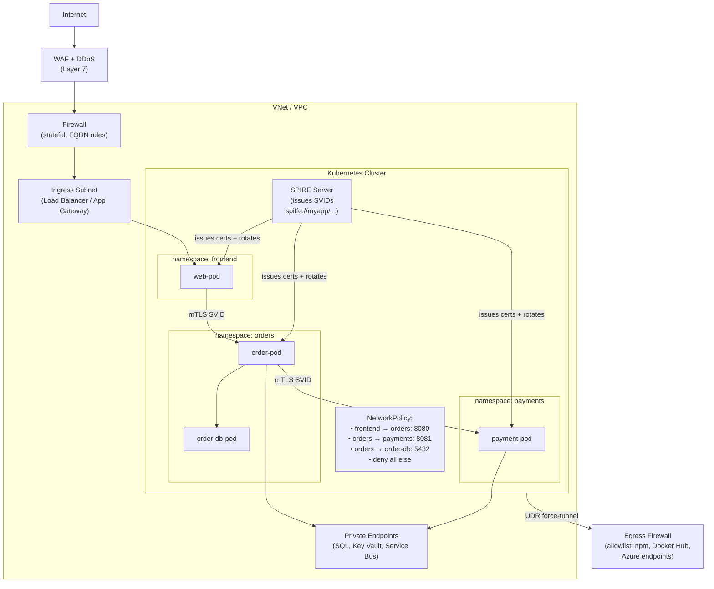

# Network Security & Defence in Depth

## Category
Security, Network Security, mTLS, Service Mesh, Microsegmentation, Network Policies, SPIFFE

## Context

**Network security** treats the network as an untrusted medium — even within a private VNet or Kubernetes cluster. Defence in depth layers multiple controls so that a breach of one layer does not expose everything behind it.

**Perimeter model (legacy)** — everything inside the firewall is trusted. Deprecated because:
- Lateral movement after initial breach is unrestricted.
- Cloud workloads, remote workers, and multi-cloud eliminate a single perimeter.

**Zero-trust network model** — every connection is authenticated and authorised, regardless of source location:
- `Never trust, always verify`.
- Assume breach — contain lateral movement with microsegmentation.
- Verify explicitly — identity, device health, and context at every request.

### Layers of network security

| Layer | Control | Tool |
|-------|---------|------|
| **Perimeter** | Stateful firewall, DDoS protection, WAF | Azure Firewall, AWS Network Firewall, Cloudflare |
| **VNet / VPC** | NSGs, security groups, NACL, subnet isolation | Cloud provider network controls |
| **Kubernetes** | Network Policies (L3/L4), RBAC for services | Calico, Cilium, AWS VPC CNI |
| **Service-to-service** | mTLS authentication + encryption | Istio, Linkerd2, SPIFFE/SPIRE |
| **DNS** | Private DNS zones, split-horizon, DNSSEC | Route 53, Azure Private DNS |
| **Egress** | Explicit allowlist of outbound FQDNs/IPs | Azure Firewall, Squid proxy, `NetworkPolicy` egress |

### mTLS (mutual TLS)

Standard TLS: Client verifies server's certificate. mTLS: **both** client and server present certificates — prevents rogue services from joining the mesh and eliminates credential-based auth between services.

**SPIFFE (Secure Production Identity Framework For Everyone)**:
- Standardised identity for workloads: `spiffe://trust-domain/ns/namespace/sa/service-account`
- Certificates issued by SPIRE (SPIFFE Runtime Environment) or a service mesh
- Short-lived (1–24h) — automatically rotated; no long-lived secrets

---

## Pros

- **mTLS eliminates network-level implicit trust**: Any service without a valid certificate cannot connect — rogue containers or compromised pods can't communicate.
- **Kubernetes NetworkPolicy least privilege**: Pods can only communicate with explicitly allow-listed peers — north/south and east/west traffic controlled.
- **Cilium eBPF**: Network policies enforced at kernel level — lower overhead than iptables; supports L7 HTTP/gRPC policies.
- **Egress allowlisting**: Force all outbound through Firewall — detect and block C2 (command & control) callbacks from compromised workloads.
- **Private Endpoints**: PaaS service traffic stays on private backbone — never traverses public internet.

---

## Cons

- **Service mesh overhead**: Sidecar proxies (Envoy) add CPU + memory overhead per pod (~20–50MB RAM, ~1ms P99 latency).
- **Certificate distribution complexity**: SPIRE or cert-manager must be operational and healthy across all clusters — becomes critical infrastructure.
- **NetworkPolicy default-deny breaks things**: Applying default-deny without mapping all legitimate service dependencies first causes outages — requires thorough traffic analysis first.
- **Cilium L7 policies**: HTTP path/method policies require TLS termination at the CNI — increases complexity for teams unfamiliar with eBPF.

---

## Design Diagram



---

## Code Sample

### Kubernetes — NetworkPolicy (default-deny + explicit allow)

```yaml
# k8s/network-policies/default-deny-all.yaml
# Apply in every namespace — baseline microsegmentation

apiVersion: networking.k8s.io/v1
kind: NetworkPolicy
metadata:
  name: default-deny-all
  namespace: orders
spec:
  podSelector: {}     # Applies to ALL pods in namespace
  policyTypes:
    - Ingress
    - Egress
  # Empty ingress/egress = deny all traffic
---
# Allow orders service to receive from frontend only
apiVersion: networking.k8s.io/v1
kind: NetworkPolicy
metadata:
  name: allow-frontend-to-orders
  namespace: orders
spec:
  podSelector:
    matchLabels:
      app: order-service
  policyTypes:
    - Ingress
  ingress:
    - from:
        - namespaceSelector:
            matchLabels:
              kubernetes.io/metadata.name: frontend
          podSelector:
            matchLabels:
              app: web
      ports:
        - port: 8080
          protocol: TCP
---
# Allow orders to reach payments service
apiVersion: networking.k8s.io/v1
kind: NetworkPolicy
metadata:
  name: allow-orders-to-payments
  namespace: payments
spec:
  podSelector:
    matchLabels:
      app: payment-service
  policyTypes:
    - Ingress
  ingress:
    - from:
        - namespaceSelector:
            matchLabels:
              kubernetes.io/metadata.name: orders
          podSelector:
            matchLabels:
              app: order-service
      ports:
        - port: 8081
          protocol: TCP
---
# Allow orders egress to Private Endpoints (specific CIDR) and DNS
apiVersion: networking.k8s.io/v1
kind: NetworkPolicy
metadata:
  name: allow-orders-egress
  namespace: orders
spec:
  podSelector:
    matchLabels:
      app: order-service
  policyTypes:
    - Egress
  egress:
    - to:
        - ipBlock:
            cidr: 10.1.2.0/24    # Data subnet with Private Endpoints
      ports:
        - port: 1433   # SQL
        - port: 443    # Key Vault, Service Bus
    - to:
        - namespaceSelector: {}   # Allow DNS to kube-dns in any namespace
          podSelector:
            matchLabels:
              k8s-app: kube-dns
      ports:
        - port: 53
          protocol: UDP
        - port: 53
          protocol: TCP
```

### Istio — mTLS PeerAuthentication + AuthorizationPolicy

```yaml
# k8s/istio/mtls-strict.yaml
# Enforce strict mTLS in all namespaces — reject non-mTLS connections

apiVersion: security.istio.io/v1
kind: PeerAuthentication
metadata:
  name: default
  namespace: istio-system    # Applies cluster-wide
spec:
  mtls:
    mode: STRICT    # PERMISSIVE allows plaintext during migration; STRICT blocks it
---
# Namespace-level strict mTLS (belt + suspenders)
apiVersion: security.istio.io/v1
kind: PeerAuthentication
metadata:
  name: namespace-mtls
  namespace: orders
spec:
  mtls:
    mode: STRICT
---
# Authorization: only frontend service account can call order-service
apiVersion: security.istio.io/v1
kind: AuthorizationPolicy
metadata:
  name: order-service-authz
  namespace: orders
spec:
  selector:
    matchLabels:
      app: order-service
  action: ALLOW
  rules:
    - from:
        - source:
            # Principal = SPIFFE URI of the calling workload
            principals:
              - "cluster.local/ns/frontend/sa/web-service-account"
      to:
        - operation:
            methods: ["GET", "POST"]
            paths:   ["/orders*"]
---
# Payment service: only order-service can call it — not web directly
apiVersion: security.istio.io/v1
kind: AuthorizationPolicy
metadata:
  name: payment-service-authz
  namespace: payments
spec:
  selector:
    matchLabels:
      app: payment-service
  action: ALLOW
  rules:
    - from:
        - source:
            principals:
              - "cluster.local/ns/orders/sa/order-service-account"
      to:
        - operation:
            methods: ["POST"]
            paths:   ["/payments*"]
```

### Cilium — L7 HTTP NetworkPolicy (eBPF)

```yaml
# k8s/cilium/l7-policy.yaml
# Cilium CiliumNetworkPolicy for HTTP-aware filtering

apiVersion: cilium.io/v2
kind: CiliumNetworkPolicy
metadata:
  name: order-service-l7
  namespace: orders
spec:
  endpointSelector:
    matchLabels:
      app: order-service
  ingress:
    - fromEndpoints:
        - matchLabels:
            app: web
            k8s:io.kubernetes.pod.namespace: frontend
      toPorts:
        - ports:
            - port: "8080"
              protocol: TCP
          rules:
            http:
              # Only allow specific methods and paths — L7 filtering
              - method: "GET"
                path: "^/orders/[0-9a-f-]+$"
              - method: "POST"
                path: "^/orders$"
              # Deny everything else (DELETE, admin paths, etc.)
  egress:
    - toEndpoints:
        - matchLabels:
            app: payment-service
            k8s:io.kubernetes.pod.namespace: payments
      toPorts:
        - ports:
            - port: "8081"
              protocol: TCP
          rules:
            http:
              - method: "POST"
                path: "^/payments$"
    - toFQDNs:
        - matchName: "myapp-prod-kv.vault.azure.net"
        - matchName: "myapp-prod.servicebus.windows.net"
      toPorts:
        - ports:
            - port: "443"
              protocol: TCP
```

### TypeScript — mTLS Client (Node.js with client certificate)

```typescript
// src/clients/mtls-client.ts
// Service-to-service call with mutual TLS

import https from 'https';
import fs   from 'fs';

// Certificates managed by cert-manager or SPIRE — mounted as files
const agent = new https.Agent({
  cert:               fs.readFileSync('/var/run/secrets/certs/tls.crt'),
  key:                fs.readFileSync('/var/run/secrets/certs/tls.key'),
  ca:                 fs.readFileSync('/var/run/secrets/certs/ca.crt'),
  rejectUnauthorized: true,     // Always verify server cert — never set to false
  minVersion:         'TLSv1.3',
});

export async function callPaymentService(payload: object): Promise<unknown> {
  const res = await fetch('https://payment-service.payments.svc.cluster.local:8081/payments', {
    method: 'POST',
    headers: { 'Content-Type': 'application/json' },
    body: JSON.stringify(payload),
    // @ts-expect-error — Node 18+ fetch accepts agent
    agent,
  });

  if (!res.ok) throw new Error(`Payment service error: ${res.status}`);
  return res.json();
}
```
