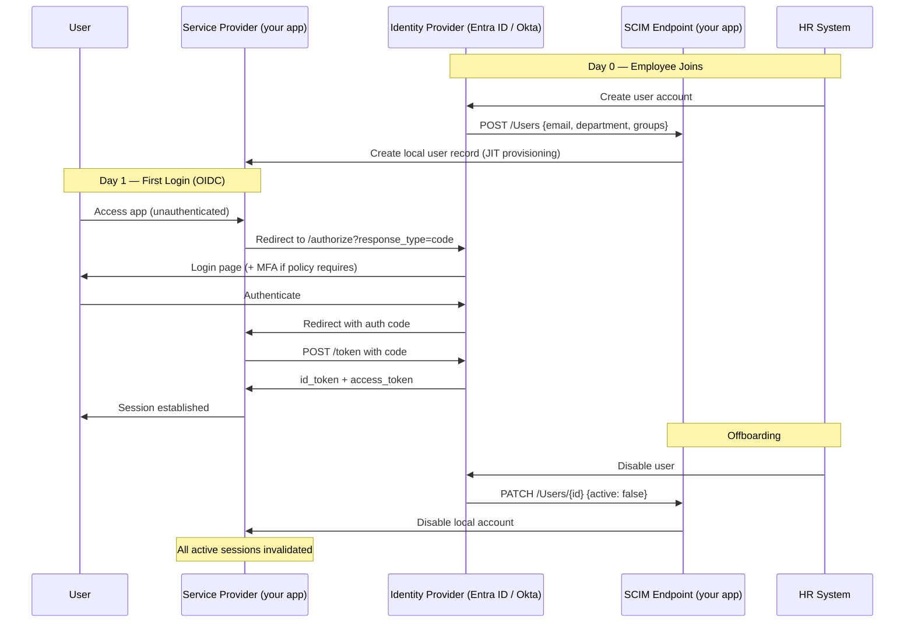

# Identity Federation & SSO

## Category
Security, Identity, SSO, SAML 2.0, OIDC Federation, SCIM, Directory Services

## Context

**Identity Federation** allows users and systems to authenticate once with a trusted identity provider (IdP) and access multiple services (service providers / relying parties) without re-authenticating. It is the technical backbone of Single Sign-On (SSO).

### Federation protocols

| Protocol | Era | Transport | Token format | Primary use |
|----------|-----|-----------|-------------|-------------|
| **SAML 2.0** | 2005 | HTTP redirect + POST | XML assertion | Enterprise SSO to web apps |
| **OpenID Connect** | 2014 | OAuth 2.0 | JWT (ID token) | Modern web/mobile, APIs |
| **WS-Federation** | 2003 | SOAP/HTTP | XML | Legacy Microsoft ecosystems |

Most new integrations use **OIDC**. SAML 2.0 remains prevalent for enterprise SaaS (Salesforce, Workday, ServiceNow) because it predates OIDC.

### SCIM (System for Cross-domain Identity Management)

Automates user provisioning and de-provisioning between IdP and SaaS apps:
- `POST /Users` — create user account when hired
- `PATCH /Users/{id}` — update attributes or disable on team change
- `DELETE /Users/{id}` — remove access on offboarding

Without SCIM: manual account creation / deletion → orphaned accounts → security risk.

### Trust hierarchy

```
Identity Provider (IdP / Authority)
     ↓  issues assertions / tokens
Service Provider (SP / Relying Party)
     ↓  grants access based on claims
Resource (API, Database, File)
```

### Key federation concepts

| Concept | Description |
|---------|-------------|
| **Assertion** | SAML: XML document containing user attributes + AuthnStatement signed by IdP |
| **ID Token** | OIDC: JWT with user identity claims (`sub`, `email`, `name`, groups) |
| **Claims** | Attributes about the user — `email`, `groups`, `department`, custom |
| **Entity ID / Client ID** | Identifier for the SP in federation metadata |
| **Metadata** | XML or JSON document describing IdP endpoints + signing keys |
| **Just-In-Time (JIT) provisioning** | Create local user account on first SSO login — no SCIM required |
| **Trust establishment** | Exchange of signing certificates/keys between IdP and SP |

### Multi-tenant federation (B2B)

Federate with **partner organisations' IdPs** — employees of partners authenticate with their own corporate credentials, but access your application. Common in regulated industries (banks, governments, healthcare).

---

## Pros

- **Single credential for all apps**: Users authenticate once to IdP; all SSO-enabled apps grant access via assertion — no per-app passwords.
- **Centralised offboarding**: Disable account in IdP → access revoked from all federated apps immediately.
- **MFA enforcement at IdP**: MFA required once at IdP login — all downstream apps inherit the security without each implementing MFA.
- **SCIM automation**: Zero-touch provisioning/de-provisioning → no orphaned accounts.
- **Audit trail at IdP**: Single authoritative log of all authentication events across all apps.

---

## Cons

- **IdP becomes single point of failure**: If the IdP is unavailable, users cannot authenticate to any federated app — requires high-availability IdP.
- **SAML complexity**: SAML 2.0 XML assertions are verbose and complex to debug — redirect + POST bindings, XML signatures, replay prevention.
- **Clock skew**: SAML assertions are time-sensitive (5 min default) — NTP sync required on all servers.
- **Attribute mismatch**: IdP sends different attribute names than SP expects — requires attribute mapping or transform rules.
- **Trust establishment overhead**: Each new SP integration requires metadata exchange, certificate exchange, and testing.

---

## Design Diagram



---

## Code Sample

### TypeScript — OIDC SAML Bridge (SP-initiated SAML with Passport)

```typescript
// src/auth/saml-strategy.ts
// SAML 2.0 SP-initiated SSO with passport-saml

import { Strategy as SamlStrategy, type Profile } from '@node-saml/passport-saml';
import passport from 'passport';
import { readFileSync } from 'fs';

export function configureSamlStrategy(): void {
  passport.use('saml', new SamlStrategy(
    {
      // SP settings
      callbackUrl:  `${process.env.BASE_URL}/auth/saml/callback`,
      issuer:       'myapp.example.com',         // SP Entity ID

      // IdP settings (from IdP metadata XML)
      entryPoint:   process.env.SAML_ENTRY_POINT!,   // IdP SSO URL
      idpCert:      process.env.SAML_IDP_CERT!,      // IdP signing cert (PEM)

      // SP signing (optional but recommended)
      privateKey:   readFileSync('/etc/certs/saml-sp.key', 'utf8'),
      publicCert:   readFileSync('/etc/certs/saml-sp.crt', 'utf8'),

      // Security settings
      wantAssertionsSigned:  true,
      wantAuthnResponseSigned: true,
      signatureAlgorithm:    'sha256',
      digestAlgorithm:       'sha256',
      disableRequestedAuthnContext: false,

      // Replay prevention: track assertion IDs in a cache
      validateInResponseTo: 'always',

      // Attribute mapping — IdP sends NameID + attributes
      identifierFormat: 'urn:oasis:names:tc:SAML:1.1:nameid-format:emailAddress',
    },

    // Verify callback — called with the decoded SAML profile
    async (profile: Profile, done) => {
      try {
        // Extract claims from SAML attributes (IdP-specific names)
        const email  = profile.nameID ?? (profile['http://schemas.xmlsoap.org/ws/2005/05/identity/claims/emailaddress'] as string);
        const groups = profile['http://schemas.microsoft.com/ws/2008/06/identity/claims/groups'] as string | string[];

        if (!email) return done(null, false, { message: 'No email in SAML assertion' });

        // Find or JIT-provision local user
        const user = await findOrCreateUser({
          email:  email.toLowerCase(),
          groups: Array.isArray(groups) ? groups : (groups ? [groups] : []),
          source: 'saml',
        });

        done(null, user);
      } catch (err) {
        done(err as Error);
      }
    }
  ));
}

// Initiate SP-initiated SSO
import type { Request, Response } from 'express';

export function samlLogin(req: Request, res: Response): void {
  // Store RelayState to restore post-login destination
  const relayState = req.query.returnTo as string ?? '/';
  passport.authenticate('saml', { additionalParams: { RelayState: relayState } })(req, res);
}

export const samlCallback = passport.authenticate('saml', {
  failureRedirect: '/login?error=saml_failure',
  successRedirect: '/',
});
```

### TypeScript — SCIM 2.0 Endpoint (provisioning receiver)

```typescript
// src/routes/scim.ts
// SCIM 2.0 /Users endpoint — receives provisioning events from IdP

import type { Router, Request, Response } from 'express';
import { createUser, updateUser, deactivateUser, getUserByExternalId } from '../data/users-repo.js';

// SCIM requires Bearer token authentication — validate before all SCIM routes
function scimAuth(req: Request, res: Response, next: Function): void {
  const token = req.headers.authorization?.replace('Bearer ', '');
  if (token !== process.env.SCIM_BEARER_TOKEN) {
    res.status(401).json({ schemas: ['urn:ietf:params:scim:api:messages:2.0:Error'], status: 401 });
    return;
  }
  next();
}

export function registerScimRoutes(router: Router): void {
  router.use('/scim/v2', scimAuth);

  // Create user — triggered when employee is added in IdP
  router.post('/scim/v2/Users', async (req, res) => {
    const { userName, name, emails, groups, active, externalId } = req.body;

    const email = emails?.find((e: { primary: boolean }) => e.primary)?.value ?? userName;

    const user = await createUser({
      externalId,
      email:     email.toLowerCase(),
      firstName: name?.givenName,
      lastName:  name?.familyName,
      groups:    groups?.map((g: { value: string }) => g.value) ?? [],
      active:    active ?? true,
    });

    res.status(201).json({
      schemas:    ['urn:ietf:params:scim:schemas:core:2.0:User'],
      id:         user.id,
      externalId: user.externalId,
      userName:   user.email,
      active:     user.active,
      meta: {
        resourceType: 'User',
        location:     `${process.env.BASE_URL}/scim/v2/Users/${user.id}`,
      },
    });
  });

  // Update / patch user — group changes, name changes, or deactivation
  router.patch('/scim/v2/Users/:id', async (req, res) => {
    const { Operations } = req.body;   // SCIM Patch Operations array

    for (const op of Operations) {
      if (op.op === 'Replace' && op.path === 'active' && op.value === false) {
        // Deactivate — revoke access immediately
        await deactivateUser(req.params.id);
      }
      // Handle other operations: name change, group membership, etc.
    }

    const user = await getUserByExternalId(req.params.id);
    res.json({ schemas: ['urn:ietf:params:scim:schemas:core:2.0:User'], ...user });
  });

  // Delete user — hard delete on permanent offboarding
  router.delete('/scim/v2/Users/:id', async (req, res) => {
    await deactivateUser(req.params.id);   // Prefer soft-delete for audit trail
    res.sendStatus(204);
  });
}
```

### Bicep — Entra ID Application Registration (OIDC SP)

```bicep
// infrastructure/bicep/identity/app-registration.bicep
// Application registrations are Entra ID objects — managed via Graph API or CLI
// Below shows az CLI equivalent for reference

// az ad app create \
//   --display-name "myapp-prod" \
//   --sign-in-audience AzureADMyOrg \
//   --web-redirect-uris "https://myapp.example.com/auth/callback" \
//   --enable-id-token-issuance true \
//   --required-resource-accesses '[
//     {
//       "resourceAppId": "00000003-0000-0000-c000-000000000000",
//       "resourceAccess": [
//         {"id": "e1fe6dd8-ba31-4d61-89e7-88639da4683d", "type": "Scope"},
//         {"id": "37f7f235-527c-4136-accd-4a02d197296e", "type": "Scope"}
//       ]
//     }
//   ]'
//
// az ad app update --id <APP_ID> \
//   --set optionalClaims.idToken='[{"name":"groups","essential":false}]'
//
// # Add group claim for RBAC
// az ad app update --id <APP_ID> \
//   --set groupMembershipClaims=SecurityGroup

// SCIM provisioning — configured in Enterprise Application in Entra ID
// Settings → Provisioning → Automatic
// Provisioning URL: https://myapp.example.com/scim/v2
// Secret token: <SCIM_BEARER_TOKEN from Key Vault>
```
