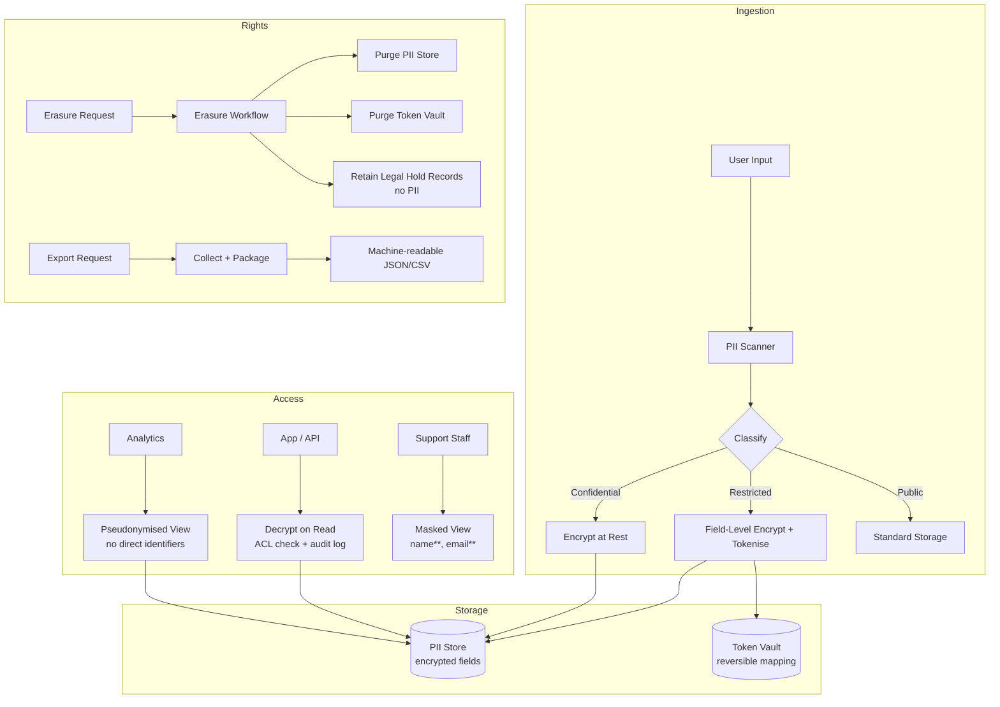

# Data Privacy & PII

## Category
Security, Data Privacy, GDPR, PII, Tokenisation, Pseudonymisation, Consent Management

## Context

**Data privacy** is the discipline of managing personal data lawfully, ethically, and securely. Regulations including **GDPR** (EU), **CCPA** (California), **LGPD** (Brazil), and **PDPA** (Thailand) define obligations around collection, storage, processing, sharing, and deletion of personal data.

### Key definitions

| Term | Meaning |
|------|---------|
| **Personal data** | Any information relating to an identified or identifiable natural person (data subject) |
| **PII (Personally Identifiable Information)** | US-centric term — name, email, SSN, IP address, etc. |
| **Sensitive data** | Special category under GDPR: biometrics, health, race, religion, political opinions, sexual orientation |
| **Pseudonymisation** | Replacing direct identifiers with a reversible token — data is still personal data but less risky |
| **Anonymisation** | Irreversible removal of all identifiers — no longer personal data under GDPR |
| **Data minimisation** | Collect only what is strictly necessary for the stated purpose |
| **Purpose limitation** | Data collected for purpose A must not be used for purpose B without consent |

### GDPR rights (Articles 15–22)

| Right | Obligation on controller |
|-------|--------------------------|
| **Access (Art. 15)** | Provide copy of all personal data held, within 30 days |
| **Rectification (Art. 16)** | Correct inaccurate data on request |
| **Erasure (Art. 17)** — "right to be forgotten" | Delete all personal data unless retention is legally required |
| **Restriction (Art. 18)** | Suspend processing on request while a dispute is resolved |
| **Portability (Art. 20)** | Export data in machine-readable format (CSV, JSON) |
| **Objection (Art. 21)** | Stop processing for direct marketing; honour other objections |

### Data classification tiers

| Tier | Examples | Controls |
|------|----------|---------|
| **Restricted / Special category** | Biometrics, health, payment card, credentials | Encrypt per-field, access log all reads, separate store |
| **Confidential / PII** | Name, email, phone, address, IP, device ID | Encrypt at rest, access control, masked in logs |
| **Internal** | Aggregated analytics, anonymised usage | Standard controls |
| **Public** | Marketing copy, public APIs | No special controls |

### Tokenisation vs Pseudonymisation vs Anonymisation

| Technique | Reversible? | Remains personal data? | Use case |
|-----------|-------------|------------------------|---------|
| **Tokenisation** | Yes (via vault) | Yes | Payment cards (PCI-DSS), SSNs |
| **Pseudonymisation** | Yes (via key) | Yes | Analytics, data sharing |
| **Anonymisation** | No | No (GDPR exemption) | Research, public datasets |
| **Masking / redaction** | No (static) | No (in output) | Logs, support views |

---

## Pros

- **Regulatory compliance**: Satisfy GDPR, CCPA, LGPD — avoid fines up to 4 % of global turnover.
- **Breach impact reduction**: Tokenised/encrypted PII is useless to attackers who exfiltrate it.
- **User trust**: Privacy-by-design builds end-user confidence; a competitive differentiator.
- **Reduced liability**: Minimal data collection = less data to protect = smaller attack surface.
- **Audit readiness**: Documented consent + data lineage = evidence for DPA investigations.

---

## Cons

- **System complexity**: Tokenisation vaults, consent stores, and erasure workflows add infrastructure.
- **Query limitations**: Tokenised or encrypted PII cannot be searched/sorted without auxiliary indexes.
- **Erasure complexity**: Fully erasing PII from backups, event logs, caches, and derived tables is very difficult.
- **Performance overhead**: Per-field encryption and decryption add latency at scale.
- **Third-party data flows**: Sub-processors also must be GDPR-compliant — vendor management burden.

---

## Design Diagram



---

## Code Sample

### TypeScript — PII Classification & Tokenisation

```typescript
// src/privacy/pii-tokeniser.ts

import crypto from 'crypto';
import { kv } from '../data/token-store.js';   // Redis or DB-backed store

const TOKEN_PREFIX = 'pii:';                   // Namespaced to separate from other keys

/**
 * Tokenise a PII value — store encrypted in vault, return opaque token.
 * Same plaintext always produces a different token (random IV).
 */
export async function tokenise(plaintext: string): Promise<string> {
  const token = `${TOKEN_PREFIX}${crypto.randomUUID()}`;   // Opaque token

  // Encrypt plaintext using AES-256-GCM before storing in vault
  const key  = Buffer.from(process.env.TOKEN_VAULT_KEY!, 'hex');  // 32 bytes from KMS-derived key
  const iv   = crypto.randomBytes(12);
  const cipher = crypto.createCipheriv('aes-256-gcm', key, iv);

  const encrypted = Buffer.concat([cipher.update(plaintext, 'utf8'), cipher.final()]);
  const authTag   = cipher.getAuthTag();

  const record = Buffer.concat([iv, authTag, encrypted]).toString('base64');

  await kv.set(token, record, { ttl: 0 });   // No TTL — persisted until erasure

  return token;
}

/**
 * Detokenise — retrieve original PII value.
 * Decryption failure or unknown token returns null.
 */
export async function detokenise(token: string): Promise<string | null> {
  const record = await kv.get(token);
  if (!record) return null;

  const buf     = Buffer.from(record, 'base64');
  const iv      = buf.subarray(0, 12);
  const authTag = buf.subarray(12, 28);
  const encrypted = buf.subarray(28);

  const key     = Buffer.from(process.env.TOKEN_VAULT_KEY!, 'hex');
  const decipher = crypto.createDecipheriv('aes-256-gcm', key, iv);
  decipher.setAuthTag(authTag);

  return Buffer.concat([decipher.update(encrypted), decipher.final()]).toString('utf8');
}

/**
 * Erase all tokens for a user — called during right-to-erasure workflow.
 */
export async function eraseUserTokens(userTokens: string[]): Promise<void> {
  await kv.del(...userTokens);
}
```

### TypeScript — Right-to-Erasure Workflow

```typescript
// src/privacy/erasure-workflow.ts

import { eraseUserTokens } from './pii-tokeniser.js';
import { db } from '../data/db.js';
import { auditLog } from '../observability/audit-logger.js';

export interface ErasureRequest {
  userId: string;
  requestId: string;
  requestedAt: Date;
}

/**
 * GDPR Article 17 — Right to Erasure ("right to be forgotten")
 * Steps:
 *   1. Collect all PII token references for the user
 *   2. Erase encrypted PII from token vault
 *   3. Pseudonymise remaining records (replace PII columns with tombstone values)
 *   4. Record the erasure event (no PII in audit record — only user ID + timestamp)
 *   5. Schedule backup purge (out-of-band, per backup retention policy)
 */
export async function processErasureRequest(req: ErasureRequest): Promise<void> {
  const { userId, requestId } = req;

  // 1. Collect PII tokens for this user
  const tokens = await db.query<{ token: string }[]>(
    'SELECT token FROM user_pii_tokens WHERE user_id = $1',
    [userId]
  );

  // 2. Erase PII from token vault
  await eraseUserTokens(tokens.map(t => t.token));

  // 3. Pseudonymise / tombstone user record — preserve referential integrity
  await db.query(
    `UPDATE users SET
       email      = 'erased-' || id || '@deleted',
       first_name = 'Erased',
       last_name  = 'User',
       phone      = NULL,
       address    = NULL,
       erased_at  = NOW()
     WHERE id = $1`,
    [userId]
  );

  // 4. Remove from derived tables (analytics, search index, etc.)
  await db.query('DELETE FROM user_search_index WHERE user_id = $1', [userId]);
  await db.query('DELETE FROM user_activity_raw WHERE user_id = $1 AND contains_pii = true', [userId]);

  // 5. Audit log — NO PII in the audit record
  await auditLog({
    action:    'USER_ERASURE_COMPLETED',
    subjectId: userId,       // Internal ID only — no name or email
    requestId,
    completedAt: new Date(),
  });

  // 6. Flag for backup purge (async job picks this up)
  await db.query(
    'INSERT INTO backup_purge_queue (user_id, request_id, queued_at) VALUES ($1, $2, NOW())',
    [userId, requestId]
  );
}
```

### TypeScript — Data Export (Portability, Article 20)

```typescript
// src/privacy/data-export.ts

import { detokenise } from './pii-tokeniser.js';
import { db } from '../data/db.js';

export async function exportUserData(userId: string): Promise<object> {
  // Collect all data the application holds about the user
  const [profile, orders, consentHistory, activityLog] = await Promise.all([
    db.queryOne('SELECT * FROM users WHERE id = $1', [userId]),
    db.query('SELECT * FROM orders WHERE user_id = $1', [userId]),
    db.query('SELECT * FROM consent_records WHERE user_id = $1 ORDER BY recorded_at', [userId]),
    db.query('SELECT action, occurred_at FROM user_events WHERE user_id = $1 ORDER BY occurred_at', [userId]),
  ]);

  // Detokenise PII fields for the export
  const exportedProfile = {
    ...profile,
    email:  await detokenise(profile.email_token),
    phone:  profile.phone_token ? await detokenise(profile.phone_token) : null,
  };

  return {
    exportedAt:  new Date().toISOString(),
    dataSubject: {
      id:          userId,
      profile:     exportedProfile,
      orders,
      consentHistory,
      activityLog,
    },
  };
}
```

### TypeScript — Consent Management

```typescript
// src/privacy/consent.ts

import { db } from '../data/db.js';

export type ConsentPurpose =
  | 'marketing_email'
  | 'analytics'
  | 'third_party_sharing'
  | 'profiling';

export async function recordConsent(
  userId: string,
  purpose: ConsentPurpose,
  granted: boolean,
  version: string,         // Policy version they consented to
  ipAddress: string,       // Evidence of consent
): Promise<void> {
  // Store immutable consent record — never UPDATE, only INSERT
  await db.query(
    `INSERT INTO consent_records
       (user_id, purpose, granted, policy_version, ip_address, recorded_at)
     VALUES ($1, $2, $3, $4, $5, NOW())`,
    [userId, purpose, granted, version, ipAddress]
  );
}

export async function hasConsent(userId: string, purpose: ConsentPurpose): Promise<boolean> {
  // Latest consent record for the purpose determines current state
  const record = await db.queryOne<{ granted: boolean }>(
    `SELECT granted FROM consent_records
     WHERE user_id = $1 AND purpose = $2
     ORDER BY recorded_at DESC LIMIT 1`,
    [userId, purpose]
  );
  return record?.granted ?? false;
}
```
