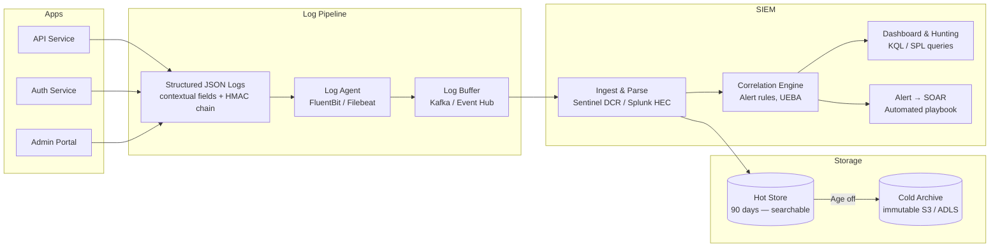

# Security Logging & SIEM

## Category
Security, Logging, Audit Trail, SIEM, Log Integrity, SOC, Splunk, Microsoft Sentinel

## Context

**Security logging** is the systematic recording of security-relevant events — authentication, authorisation decisions, data access, configuration changes, and anomalous activity. **SIEM** (Security Information and Event Management) aggregates, correlates, and analyses logs at scale to detect threats.

### Security logging objectives

| Objective | Description |
|-----------|-------------|
| **Accountability** | Non-repudiation — prove who did what, when |
| **Threat detection** | Real-time correlation across events to detect attacks |
| **Incident investigation** | Forensic timeline reconstruction after a breach |
| **Compliance** | Evidence for PCI-DSS, ISO 27001, SOC 2, GDPR audit |
| **Anomaly detection** | Baseline normal behaviour; alert on deviations |

### What must be logged (OWASP Logging Cheat Sheet)

| Event category | Examples |
|---------------|---------|
| **Authentication** | Login success/failure, MFA pass/fail, password reset, token issuance |
| **Authorisation** | Access granted, access denied, privilege escalation |
| **Data access** | PII records read, sensitive data exported, bulk data queries |
| **Session management** | Session created, expired, invalidated, concurrent session |
| **Admin actions** | Config change, user created/deleted, permission granted |
| **Input validation failures** | Malformed requests, injection attempts, size violations |
| **Application errors** | Exceptions with stack traces (sanitised — no PII/credentials) |
| **Resource changes** | Infrastructure changes, deployment events |

### What must NEVER be logged

- Passwords, hashes, secrets, API keys in plaintext
- Full credit card numbers, SSNs, authentication tokens
- PII beyond the minimum needed for investigation (GDPR)

### Log integrity

Logs are only useful for forensics if they cannot be tampered with. Controls:

| Technique | Description |
|-----------|-------------|
| **Forward secrecy chaining** | Each log entry includes HMAC of previous entry — tampering breaks chain |
| **Write-once storage** | S3 Object Lock, immutable blobs — no overwrite or delete |
| **Shipping to SIEM immediately** | Attacker cannot erase logs already shipped off-host |
| **Signed log bundles** | Periodic signing of log archives with timestamp authority |

### SIEM patterns

| Pattern | Description |
|---------|-------------|
| **Centralised log aggregation** | Fluentd / Logstash → SIEM ingest (Splunk HEC, Sentinel DCR) |
| **Correlation rules** | Alert on N failed logins from same IP within T seconds |
| **UEBA** | User and Entity Behaviour Analytics — ML-based anomaly detection |
| **Alert to SOAR** | Automated playbook triggered by SIEM alert |
| **Threat intelligence feed** | Enrich events with known-bad IPs, domains, hashes |

---

## Pros

- **Forensic capability**: Structured, chained logs enable accurate incident reconstruction.
- **Compliance evidence**: Required by PCI-DSS Req. 10, ISO 27001 A.12.4, SOC 2 CC7.
- **Early threat detection**: Correlation rules catch brute-force, credential stuffing, data exfiltration in near-real-time.
- **Non-repudiation**: Signed, immutable logs prove actions occurred and cannot be denied.
- **Regulatory audit trail**: GDPR requires demonstrating who accessed personal data and when.

---

## Cons

- **High volume**: Security logs can be 10–100× application log volume — storage and ingestion costs.
- **Alert fatigue**: Poorly tuned correlation rules generate excessive false positives.
- **PII in logs**: Risk of logging personal data accidentally — requires log sanitisation layer.
- **SIEM complexity**: Tuning correlation rules, parsing custom log formats, and managing retention requires specialist expertise.
- **Retention vs cost**: Long retention windows (1–7 years for compliance) create significant storage costs.

---

## Design Diagram



---

## Code Sample

### TypeScript — Structured Audit Logger with HMAC Chain

```typescript
// src/observability/audit-logger.ts

import crypto from 'crypto';
import { createWriteStream, type WriteStream } from 'fs';
import path from 'path';

export interface AuditEvent {
  action:      string;             // e.g. 'USER_LOGIN', 'RECORD_READ', 'CONFIG_CHANGE'
  result:      'success' | 'failure' | 'error';
  actorId?:    string;             // userId of the actor (omit for system events)
  actorIp?:    string;             // Source IP (IPv4/6)
  targetType?: string;             // e.g. 'User', 'Order', 'Config'
  targetId?:   string;             // ID of the accessed resource
  detail?:     Record<string, unknown>;  // Extra context — NO secrets or PII
  requestId?:  string;
}

interface AuditRecord extends AuditEvent {
  timestamp:     string;          // ISO 8601
  seq:           number;          // Monotonic sequence number
  prev:          string;          // HMAC of previous entry (chain integrity)
  hmac:          string;          // HMAC of this entry's data
}

export class AuditLogger {
  private seq    = 0;
  private prev   = 'genesis';    // Sentinel for first entry
  private stream: WriteStream;
  private readonly key: Buffer;

  constructor(logPath: string) {
    this.stream = createWriteStream(path.resolve(logPath), { flags: 'a' });
    this.key    = Buffer.from(process.env.AUDIT_HMAC_KEY!, 'hex');  // 32-byte key from KMS
  }

  async log(event: AuditEvent): Promise<void> {
    const seq       = ++this.seq;
    const timestamp = new Date().toISOString();

    // Sanitise detail — remove any keys that look like secrets
    const safeDetail = sanitiseDetail(event.detail);

    const data: Omit<AuditRecord, 'hmac'> = {
      ...event,
      detail:    safeDetail,
      timestamp,
      seq,
      prev:      this.prev,
    };

    // HMAC of current record data — proves this entry hasn't been altered
    const hmac    = crypto.createHmac('sha256', this.key)
                          .update(JSON.stringify(data))
                          .digest('hex');

    const record: AuditRecord = { ...data, hmac };

    // Update chain: next entry's prev = this hmac
    this.prev = hmac;

    // Write as newline-delimited JSON
    await new Promise<void>((resolve, reject) => {
      this.stream.write(JSON.stringify(record) + '\n', err => err ? reject(err) : resolve());
    });
  }
}

/** Strip keys that suggest sensitive content */
function sanitiseDetail(detail?: Record<string, unknown>): Record<string, unknown> | undefined {
  if (!detail) return undefined;
  const REDACT_PATTERN = /password|secret|token|key|credential|card|ssn|cvv/i;
  return Object.fromEntries(
    Object.entries(detail).map(([k, v]) =>
      REDACT_PATTERN.test(k) ? [k, '[REDACTED]'] : [k, v]
    )
  );
}

// Singleton — import and use throughout the application
export const auditLog = new AuditLogger(process.env.AUDIT_LOG_PATH ?? '/var/log/app/audit.ndjson');
```

### TypeScript — SIEM Forwarder (Microsoft Sentinel DCR/DCE)

```typescript
// src/observability/siem-forwarder.ts
// Forwards security events to Microsoft Sentinel via Data Collection Endpoint

import { DefaultAzureCredential } from '@azure/identity';

interface SiemEvent {
  TimeGenerated:  string;
  Action:         string;
  Result:         string;
  ActorId?:       string;
  SourceIp?:      string;
  TargetType?:    string;
  TargetId?:      string;
  RequestId?:     string;
  Seq:            number;
  Hmac:           string;
}

export class SentinelForwarder {
  private readonly credential = new DefaultAzureCredential();
  private readonly dceUrl   = process.env.SENTINEL_DCE_URL!;    // Data Collection Endpoint
  private readonly dcrImmutableId = process.env.SENTINEL_DCR_IMMUTABLE_ID!;
  private readonly streamName     = process.env.SENTINEL_STREAM_NAME!;  // e.g. Custom-SecurityAudit_CL
  private buffer: SiemEvent[] = [];
  private flushTimer?: NodeJS.Timeout;

  constructor() {
    // Flush every 5 seconds or when buffer reaches 500 events
    this.flushTimer = setInterval(() => this.flush(), 5_000);
  }

  enqueue(event: SiemEvent): void {
    this.buffer.push(event);
    if (this.buffer.length >= 500) void this.flush();
  }

  async flush(): Promise<void> {
    if (this.buffer.length === 0) return;

    const batch   = this.buffer.splice(0);
    const token   = await this.credential.getToken('https://monitor.azure.com/.default');

    const url = `${this.dceUrl}/dataCollectionRules/${this.dcrImmutableId}/streams/${this.streamName}?api-version=2023-01-01`;

    const res = await fetch(url, {
      method:  'POST',
      headers: {
        'Content-Type': 'application/json',
        'Authorization': `Bearer ${token.token}`,
      },
      body: JSON.stringify(batch),
    });

    if (!res.ok) {
      // Re-queue on transient failure — in production: dead-letter queue
      this.buffer.unshift(...batch);
      console.error(`SIEM forward failed: ${res.status} ${await res.text()}`);
    }
  }
}
```

### YAML — Fluentbit Log Pipeline (Kubernetes)

```yaml
# infrastructure/kubernetes/logging/fluentbit-config.yaml
apiVersion: v1
kind: ConfigMap
metadata:
  name: fluent-bit-config
  namespace: logging
data:
  fluent-bit.conf: |
    [SERVICE]
        Parsers_File  parsers.conf
        Log_Level     info
        HTTP_Server   On
        HTTP_Port     2020

    # Collect container logs
    [INPUT]
        Name              tail
        Path              /var/log/containers/api-*.log
        Parser            docker
        Tag               kube.*
        Refresh_Interval  5
        Mem_Buf_Limit     50MB

    # Parse nested JSON log field
    [FILTER]
        Name   parser
        Match  kube.*
        Key_Name log
        Parser json_log

    # Drop non-security events before shipping to SIEM to reduce cost
    [FILTER]
        Name   grep
        Match  kube.*
        Regex  action  (USER_LOGIN|RECORD_READ|CONFIG_CHANGE|ACCESS_DENIED|ERASURE)

    # Add Kubernetes metadata (pod, namespace, node)
    [FILTER]
        Name                kubernetes
        Match               kube.*
        Kube_Tag_Prefix     kube.var.log.containers.
        Merge_Log           On
        K8S-Logging.Parser  On

    # Ship to Azure Monitor (Sentinel DCE)
    [OUTPUT]
        Name              azure_logs_ingestion
        Match             kube.*
        client_id         ${AZURE_CLIENT_ID}
        tenant_id         ${AZURE_TENANT_ID}
        data_collection_endpoint ${SENTINEL_DCE_URL}
        dcr_immutable_id  ${SENTINEL_DCR_IMMUTABLE_ID}
        table_name        SecurityAudit_CL
        time_key          TimeGenerated
        compress          gzip
```
