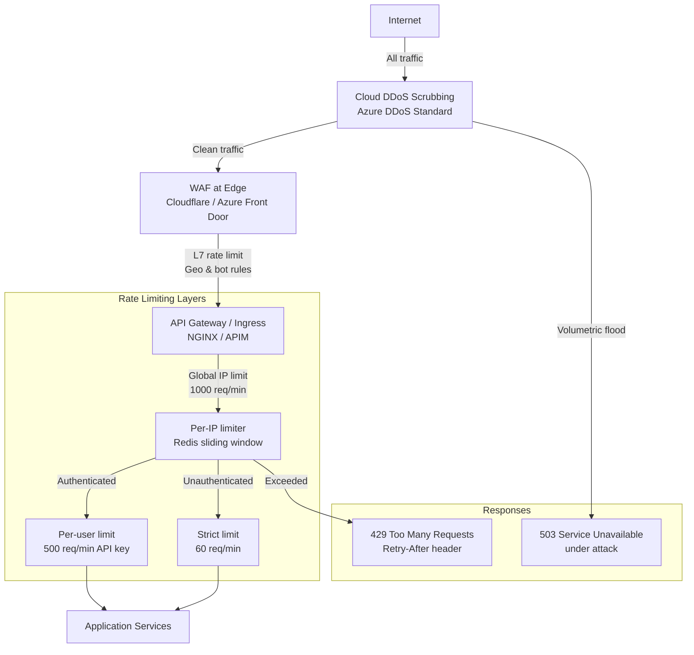

# DDoS & Rate Limiting

## Category
Security, Availability, DDoS, Rate Limiting, WAF, Bot Protection, Traffic Management

## Context

**Distributed Denial of Service (DDoS)** attacks exhaust a system's resources — bandwidth, connections, CPU, or application threads — making it unavailable to legitimate users. **Rate limiting** bounds how many requests a single client can make in a time window, protecting application resources and preventing abuse.

### DDoS classification by OSI layer

| Layer | Attack type | Examples | Mitigation |
|-------|------------|---------|-----------|
| **L3 — Network** | Volumetric flood | ICMP flood, IP fragmentation | Scrubbing centre, anycast routing |
| **L4 — Transport** | Protocol exhaustion | SYN flood, UDP flood | SYN cookies, connection rate limiting |
| **L7 — Application** | Request-based | HTTP flood, Slowloris, DNS query flood | WAF, rate limiting, connection timeouts |

### Rate limiting algorithms

| Algorithm | Description | Pros | Cons |
|-----------|-------------|------|------|
| **Fixed window** | N requests per time window | Simple | Allows 2N at window boundary |
| **Sliding window log** | Track exact timestamps of requests | Accurate | High memory (O(N) per client) |
| **Sliding window counter** | Interpolate between two fixed windows | Low memory, accurate | Slight approximation |
| **Token bucket** | Tokens replenished at fixed rate; burst allowed up to bucket capacity | Allows bursts | Slightly complex |
| **Leaky bucket** | Requests queued and processed at constant rate | Smooth output | Latency added; no burst |

### DDoS protection stack

```
Internet traffic
       │
  [Cloud DDoS Scrubbing]        ← Azure DDoS Standard / AWS Shield / Cloudflare Magic Transit
       │
  [CDN / WAF edge]              ← Cloudflare, Azure Front Door, AWS CloudFront + WAF
       │                           Rules: geo-block, bad bot signatures, rate limit at edge
  [API Gateway / Ingress]       ← NGINX / APIM / Kong — request-level rate limiting
       │
  [Application-level limits]   ← Per-endpoint, per-user, per-IP rate limiting
       │
  [Backend services]
```

### WAF rule categories

| Category | Examples |
|----------|---------|
| **OWASP CRS** | SQLi, XSS, LFI/RFI, RCE signatures |
| **Rate-based rules** | >100 req/5 min from single IP → block temporarily |
| **Geo restriction** | Block countries with no legitimate user base |
| **Bot management** | Challenge suspicious user-agents; block known scrapers |
| **Custom rules** | Block specific paths, payloads, or headers |

---

## Pros

- **Availability protection**: Cloud-level DDoS scrubbing absorbs volumetric attacks without affecting origin.
- **Abuse prevention**: Rate limiting prevents credential stuffing, scraping, and API abuse.
- **Cost protection**: Rate limiting prevents runaway compute/egress charges from abusive traffic.
- **Fair resource distribution**: Limits ensure no single client monopolises shared resources.
- **Edge filtering**: WAF at CDN edge drops malicious traffic before it reaches the origin — zero cost to backend.

---

## Cons

- **Legitimate traffic impacted**: Poorly calibrated limits block genuine users — requires tuning and good error messages.
- **Distributed attack evasion**: L7 DDoS distributed across millions of IPs can bypass per-IP rate limits.
- **CAPTCHA friction**: Challenge-response adds user friction and fails accessibility requirements.
- **IP spoofing / shared egress**: NAT exit nodes or proxies cause multiple users to share an IP — per-IP limits affect groups unfairly.
- **Cost of cloud DDoS protection**: Azure DDoS Standard and AWS Shield Advanced have significant monthly costs.

---

## Design Diagram



---

## Code Sample

### TypeScript — Sliding Window Rate Limiter with Redis

```typescript
// src/middleware/rate-limiter.ts

import type { Request, Response, NextFunction } from 'express';
import { createClient } from 'redis';

const redis = createClient({ url: process.env.REDIS_URL });
await redis.connect();

export interface RateLimitOptions {
  windowMs:   number;   // Time window in milliseconds
  maxRequests: number;  // Max requests allowed in window
  keyFn?:     (req: Request) => string;  // How to identify the client
  skipIf?:    (req: Request) => boolean; // Bypass condition (e.g. internal IPs)
}

/**
 * Sliding window counter rate limiter backed by Redis.
 * Uses two adjacent fixed windows with linear interpolation for accuracy.
 */
export function rateLimiter(options: RateLimitOptions) {
  const {
    windowMs,
    maxRequests,
    keyFn     = defaultKeyFn,
    skipIf    = () => false,
  } = options;

  const windowSeconds = Math.ceil(windowMs / 1000);

  return async function(req: Request, res: Response, next: NextFunction): Promise<void> {
    if (skipIf(req)) { next(); return; }

    const clientKey = keyFn(req);
    const now       = Date.now();
    const windowStart = Math.floor(now / windowMs);   // Current window epoch
    const prevWindowStart = windowStart - 1;

    const currentKey  = `rl:${clientKey}:${windowStart}`;
    const previousKey = `rl:${clientKey}:${prevWindowStart}`;

    // Fetch both window counts in a single round-trip
    const [currentCountStr, previousCountStr] = await redis.mGet([currentKey, previousKey]);

    const currentCount  = parseInt(currentCountStr ?? '0', 10);
    const previousCount = parseInt(previousCountStr ?? '0', 10);

    // Sliding window interpolation — weight previous window by overlap
    const elapsed       = now - windowStart * windowMs;
    const overlapRatio  = 1 - elapsed / windowMs;
    const weightedCount = previousCount * overlapRatio + currentCount;

    if (weightedCount >= maxRequests) {
      // Calculate when the window resets
      const resetAt   = (windowStart + 1) * windowMs;
      const retryAfter = Math.ceil((resetAt - now) / 1000);

      res.set({
        'X-RateLimit-Limit':     String(maxRequests),
        'X-RateLimit-Remaining': '0',
        'X-RateLimit-Reset':     String(resetAt),
        'Retry-After':           String(retryAfter),
      });
      res.status(429).json({ error: 'Too Many Requests', retryAfter });
      return;
    }

    // Increment current window counter — set TTL to 2 windows (~2× window duration)
    await redis
      .multi()
      .incr(currentKey)
      .expire(currentKey, windowSeconds * 2)
      .exec();

    const remaining = Math.max(0, maxRequests - Math.round(weightedCount) - 1);
    res.set({
      'X-RateLimit-Limit':     String(maxRequests),
      'X-RateLimit-Remaining': String(remaining),
      'X-RateLimit-Reset':     String((windowStart + 1) * windowMs),
    });

    next();
  };
}

/** Default: identify by authenticated userId, fall back to IP */
function defaultKeyFn(req: Request): string {
  const userId = (req as Request & { user?: { id: string } }).user?.id;
  if (userId) return `user:${userId}`;
  // X-Forwarded-For when behind proxy — take first (client) IP only
  const xff = req.headers['x-forwarded-for'];
  const ip  = Array.isArray(xff) ? xff[0] : (xff?.split(',')[0] ?? req.socket.remoteAddress ?? 'unknown');
  return `ip:${ip}`;
}

// Pre-configured rate limiters
export const globalLimit = rateLimiter({ windowMs: 60_000, maxRequests: 1_000 });
export const authLimit   = rateLimiter({
  windowMs:    15 * 60_000,   // 15-minute window
  maxRequests: 20,             // Strict: max 20 login attempts per 15 min
  keyFn: req => `auth:${req.body?.username ?? defaultKeyFn(req)}`,
});
export const apiKeyLimit = rateLimiter({ windowMs: 60_000, maxRequests: 500 });
```

### TypeScript — WAF-style Request Inspection Middleware

```typescript
// src/middleware/waf.ts
// Lightweight application-layer request inspection (not a replacement for cloud WAF)

import type { Request, Response, NextFunction } from 'express';

// Patterns for common attack signatures
const SQLI_PATTERN   = /(\b(union|select|insert|update|delete|drop|truncate|exec|execute)\b)|(--|;|\/\*|\*\/)/gi;
const XSS_PATTERN    = /<\s*script|javascript:|on\w+\s*=|<\s*iframe|<\s*object|<\s*embed/gi;
const PATH_TRAVERSAL = /\.\.[/\\]|%2e%2e[%2f%5c]/gi;
const NULL_BYTE      = /\0|%00/g;
const COMMAND_INJECT = /[;&|`$(){}[\]<>]/g;

interface InspectionResult {
  threat: string;
  field:  string;
  value:  string;
}

function inspectValue(value: string, field: string): InspectionResult | null {
  if (SQLI_PATTERN.test(value))    return { threat: 'SQL_INJECTION', field, value: value.slice(0, 50) };
  if (XSS_PATTERN.test(value))     return { threat: 'XSS', field, value: value.slice(0, 50) };
  if (PATH_TRAVERSAL.test(value))  return { threat: 'PATH_TRAVERSAL', field, value: value.slice(0, 50) };
  if (NULL_BYTE.test(value))       return { threat: 'NULL_BYTE', field, value: value.slice(0, 50) };
  return null;
}

export function requestInspection(req: Request, res: Response, next: NextFunction): void {
  const targets: [string, unknown][] = [
    ...Object.entries(req.query),
    ...Object.entries(req.body  ?? {}),
    ...Object.entries(req.params ?? {}),
  ];

  for (const [field, value] of targets) {
    if (typeof value !== 'string') continue;
    const result = inspectValue(value, field);
    if (result) {
      // Log the detection with request context — no full value in production logs
      console.warn({ event: 'WAF_BLOCK', ...result, ip: req.ip, path: req.path, method: req.method });
      res.status(400).json({ error: 'Invalid request' });
      return;
    }
  }

  next();
}
```

### Bicep — Azure DDoS Standard Protection Plan

```bicep
// infrastructure/bicep/network/ddos-protection.bicep

@description('Azure DDoS Standard Protection Plan')
resource ddosProtectionPlan 'Microsoft.Network/ddosProtectionPlans@2023-05-01' = {
  name:     'ddos-protection-plan-prod'
  location: 'westeurope'
  properties: {}
}

// Attach to VNet
resource vnet 'Microsoft.Network/virtualNetworks@2023-05-01' = {
  name:     'vnet-prod'
  location: 'westeurope'
  properties: {
    addressSpace: {
      addressPrefixes: ['10.0.0.0/16']
    }
    // Enable DDoS Standard on the VNet — protects all public IPs in attached subnets
    enableDdosProtection: true
    ddosProtectionPlan: {
      id: ddosProtectionPlan.id
    }
  }
}

// Azure Front Door with WAF policy
resource wafPolicy 'Microsoft.Network/FrontDoorWebApplicationFirewallPolicies@2022-05-01' = {
  name:     'waf-policy-prod'
  location: 'global'
  sku: {
    name: 'Premium_AzureFrontDoor'
  }
  properties: {
    policySettings: {
      enabledState: 'Enabled'
      mode:         'Prevention'    // Detection mode for tuning, Prevention for production
      requestBodyCheck: 'Enabled'
    }
    managedRules: {
      managedRuleSets: [
        {
          ruleSetType:    'Microsoft_DefaultRuleSet'
          ruleSetVersion: '2.1'
          ruleSetAction:  'Block'
        }
        {
          ruleSetType:    'Microsoft_BotManagerRuleSet'
          ruleSetVersion: '1.0'
          ruleSetAction:  'Block'
        }
      ]
    }
    customRules: {
      rules: [
        {
          name:         'RateLimitPerIP'
          priority:     100
          enabledState: 'Enabled'
          ruleType:     'RateLimitRule'
          rateLimitDurationInMinutes: 1
          rateLimitThreshold: 300
          matchConditions: [
            {
              matchVariable:   'RemoteAddr'
              operator:        'IPMatch'
              matchValue:      ['0.0.0.0/0']   // All IPs
              negateCondition: false
            }
          ]
          action: 'Block'
        }
      ]
    }
  }
}
```
