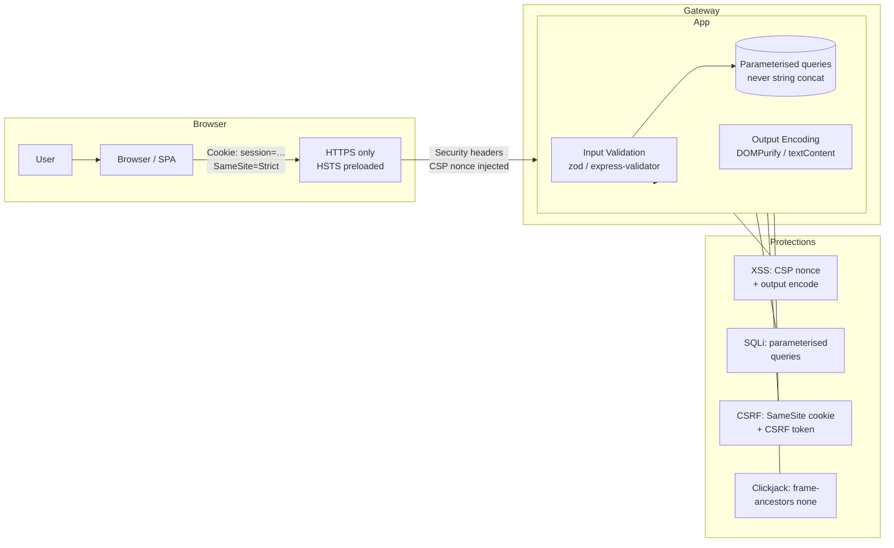

# Web Application Security

## Category
Security, OWASP Top 10, XSS, SQLi, CSRF, CSP, SRI, Secure Headers, Input Validation

## Context

**Web application security** addresses vulnerabilities in the HTTP layer and browser rendering pipeline that attackers exploit to steal data, hijack sessions, or execute malicious code. The **OWASP Top 10 (2021)** is the authoritative reference.

### OWASP Web Application Top 10 (2021)

| Rank | Category | Description | Key mitigations |
|------|----------|-------------|----------------|
| **A01** | Broken Access Control | Escalating privilege, accessing other users' data | Server-side checks, deny by default, IDOR prevention |
| **A02** | Cryptographic Failures | Weak algorithms, plaintext PII, missing TLS | TLS 1.2+, AES-256, bcrypt/Argon2, HSTS |
| **A03** | Injection | SQL, OS, LDAP, XSS, template injection | Parameterised queries, encoding, CSP |
| **A04** | Insecure Design | Missing threat model, no security requirements | Threat modelling, security stories |
| **A05** | Security Misconfiguration | Default creds, verbose errors, exposed admin UIs | IaC hardening, least privilege, security headers |
| **A06** | Vulnerable Components | Outdated deps, unpatched libraries | SCA scanning, SBOM, dependency pinning |
| **A07** | Auth & Session Failures | Weak passwords, session fixation, missing MFA | MFA, secure sessions, credential stuffing detection |
| **A08** | Software & Data Integrity | CI/CD compromise, insecure deserialization | SRI, signed artifacts, SBOM, input validation |
| **A09** | Security Logging Failures | Insufficient logs, no alerting | Comprehensive audit logging, SIEM |
| **A10** | SSRF | Server fetches attacker-controlled URLs | URL allowlist, block private ranges |

### Cross-Site Scripting (XSS)

| Type | Description | Prevention |
|------|-------------|-----------|
| **Reflected** | Payload in URL parameter rendered to page | Output encode, CSP |
| **Stored** | Payload persisted in DB and served to users | Store sanitised, output encode, CSP |
| **DOM-based** | Client-side JS writes attacker-controlled data to DOM | Avoid `innerHTML`; use `textContent`; trusted types |

### Content Security Policy (CSP)

CSP is an HTTP response header instructing the browser which sources are trusted for scripts, styles, images, etc. It is the primary defence against XSS.

```
Content-Security-Policy:
  default-src 'none';
  script-src  'self' 'nonce-{RANDOM}';   ← Nonce per request blocks inline scripts
  style-src   'self' 'nonce-{RANDOM}';
  img-src     'self' data:;
  connect-src 'self' https://api.example.com;
  frame-ancestors 'none';                 ← Blocks clickjacking
  base-uri 'none';
  form-action 'self';
```

### Security headers reference

| Header | Purpose |
|--------|---------|
| `Strict-Transport-Security` | Enforce HTTPS; include subdomains; preload |
| `Content-Security-Policy` | Restrict script/style/media sources — XSS mitigation |
| `X-Frame-Options` | Prevent clickjacking (superseded by CSP `frame-ancestors`) |
| `X-Content-Type-Options: nosniff` | Prevent MIME-type sniffing |
| `Referrer-Policy: strict-origin-when-cross-origin` | Limit referrer info leakage |
| `Permissions-Policy` | Disable unneeded browser APIs (camera, geolocation) |
| `Cross-Origin-Opener-Policy` | Prevent cross-origin window references (Spectre) |
| `Cross-Origin-Resource-Policy` | Prevent cross-origin reads of sensitive resources |

### CSRF protection

Cross-Site Request Forgery causes an authenticated user's browser to submit requests to your application on behalf of an attacker. Mitigations:

1. **SameSite=Strict/Lax cookies** — browser won't send cookies on cross-site requests (primary defence for modern browsers)
2. **CSRF token** — server-generated, per-session or per-form token submitted in header or body; validated server-side
3. **Custom request headers** — fetch API cannot set custom headers cross-origin (CORS pre-flight acts as verification)
4. **Double-submit cookie** — CSRF token in both cookie and request body/header; compare on server

---

## Pros

- **OWASP Top 10 coverage closes the most common attack vectors**: Addressing all 10 significantly reduces exploitable surface.
- **CSP nonces eliminate most XSS risk**: Even if a payload reaches the page, the browser refuses to execute scripts without a valid nonce.
- **SameSite cookies eliminate most CSRF risk**: Modern browsers enforce SameSite=Lax by default.
- **Security headers are zero-cost**: Set once in the framework/gateway; no ongoing development effort.
- **Parameterised queries are a complete SQLi defence**: Properly parameterised queries make SQL injection impossible by construction.

---

## Cons

- **CSP breaks legacy inline scripts**: Migrating large applications to nonce-based CSP requires significant refactoring of inline scripts.
- **OWASP Top 10 is a minimum baseline, not a complete security programme**: Many application-specific threats are not covered.
- **Over-reliance on client-side controls**: Security headers and CSP are browser controls — not effective against server-side vulnerabilities.
- **Strict CSP may block legitimate third-party scripts**: CDN-hosted analytics, chat widgets, etc., need explicit allowlisting.

---

## Design Diagram



---

## Code Sample

### TypeScript — Security Headers Middleware with CSP Nonces

```typescript
// src/middleware/security-headers.ts

import crypto from 'crypto';
import type { Request, Response, NextFunction } from 'express';

declare module 'express-serve-static-core' {
  interface Response {
    locals: { cspNonce: string };
  }
}

export function securityHeaders(req: Request, res: Response, next: NextFunction): void {
  // Generate a fresh cryptographic nonce per request
  const nonce = crypto.randomBytes(16).toString('base64');
  res.locals.cspNonce = nonce;   // Available to template engine: <script nonce="{{cspNonce}}">

  res.setHeader('Strict-Transport-Security', 'max-age=31536000; includeSubDomains; preload');
  res.setHeader('X-Content-Type-Options', 'nosniff');
  res.setHeader('X-Frame-Options', 'DENY');            // Legacy — superseded by CSP below
  res.setHeader('Referrer-Policy', 'strict-origin-when-cross-origin');
  res.setHeader('Permissions-Policy', 'camera=(), microphone=(), geolocation=(), payment=()');
  res.setHeader('Cross-Origin-Opener-Policy', 'same-origin');
  res.setHeader('Cross-Origin-Resource-Policy', 'same-origin');

  // CSP — adjust sources to match your application's CDN and API domains
  res.setHeader('Content-Security-Policy', [
    `default-src 'none'`,
    `script-src 'self' 'nonce-${nonce}'`,             // No unsafe-inline; only nonce-tagged scripts
    `style-src 'self' 'nonce-${nonce}'`,
    `img-src 'self' data: https://cdn.example.com`,
    `font-src 'self'`,
    `connect-src 'self' https://api.example.com`,
    `form-action 'self'`,
    `frame-ancestors 'none'`,                         // Clickjacking prevention
    `base-uri 'none'`,                                // Prevent base-tag injection
    `upgrade-insecure-requests`,
  ].join('; '));

  next();
}
```

### TypeScript — SQL Injection Prevention (Parameterised Queries)

```typescript
// src/data/users-repo.ts
// Demonstrates ONLY parameterised queries — never string concatenation

import { db } from './db.js';

/** SAFE — parameterised query: user input is passed as a value, not concatenated */
export async function findUserByEmail(email: string) {
  return db.queryOne(
    'SELECT id, first_name, last_name FROM users WHERE email = $1 AND active = true',
    [email]                    // Never: `WHERE email = '${email}'`
  );
}

/** SAFE — dynamic column sort with allowlist — only way to safely inject column names */
const SORT_ALLOWLIST = new Set(['created_at', 'last_name', 'email']);

export async function listUsers(sortBy: string, page: number, limit: number) {
  if (!SORT_ALLOWLIST.has(sortBy)) {
    throw new Error(`Invalid sort column: ${sortBy}`);   // Reject unknown column names
  }
  // sortBy is now safe to interpolate because it came from the allowlist
  const offset = (page - 1) * limit;
  return db.query(
    `SELECT id, first_name, last_name, email, created_at
     FROM users
     WHERE active = true
     ORDER BY ${sortBy} ASC
     LIMIT $1 OFFSET $2`,
    [limit, offset]
  );
}
```

### TypeScript — XSS Prevention & Output Sanitisation

```typescript
// src/utils/sanitise.ts
// Server-side: strip HTML before storing in DB
// Client-side: use DOMPurify before rendering untrusted HTML

import { JSDOM } from 'jsdom';
import createDOMPurify from 'dompurify';

const { window } = new JSDOM('');
const DOMPurify  = createDOMPurify(window as unknown as Window);

/**
 * Sanitise HTML that users are allowed to submit (e.g. rich-text editors).
 * Strips all event handlers and dangerous tags — whitelists safe elements only.
 */
export function sanitiseHtml(dirty: string): string {
  return DOMPurify.sanitize(dirty, {
    ALLOWED_TAGS:  ['b', 'i', 'em', 'strong', 'a', 'ul', 'ol', 'li', 'p', 'br'],
    ALLOWED_ATTR:  ['href', 'title'],
    FORCE_BODY:    true,
    RETURN_DOM:    false,
  });
}

/**
 * For contexts where HTML is NOT expected, HTML-encode special characters.
 * Use this when inserting user content into HTML attributes or text nodes.
 */
export function escapeHtml(text: string): string {
  return text
    .replace(/&/g, '&amp;')
    .replace(/</g, '&lt;')
    .replace(/>/g, '&gt;')
    .replace(/"/g, '&quot;')
    .replace(/'/g, '&#x27;');
}
```

### TypeScript — CSRF Protection Middleware

```typescript
// src/middleware/csrf.ts
// Double-submit cookie pattern — compatible with SPA / JWT-based auth flows

import crypto from 'crypto';
import type { Request, Response, NextFunction } from 'express';

const CSRF_COOKIE   = '__Host-csrf';   // __Host- prefix = Secure + no domain + path=/
const CSRF_HEADER   = 'x-csrf-token';
const SAFE_METHODS  = new Set(['GET', 'HEAD', 'OPTIONS']);

/** Generate and set CSRF token on cookie */
export function setCSRFCookie(req: Request, res: Response): string {
  const token = crypto.randomBytes(32).toString('hex');
  res.cookie(CSRF_COOKIE, token, {
    httpOnly:  false,    // Must be readable by JS so SPA can send in header
    secure:    true,
    sameSite:  'strict',
    path:      '/',
  });
  return token;
}

/** Validate CSRF token on state-mutating requests */
export function validateCSRF(req: Request, res: Response, next: NextFunction): void {
  if (SAFE_METHODS.has(req.method)) { next(); return; }

  const cookieToken  = req.cookies[CSRF_COOKIE];
  const headerToken  = req.headers[CSRF_HEADER];

  if (!cookieToken || !headerToken) {
    res.status(403).json({ error: 'CSRF token missing' });
    return;
  }

  // Constant-time comparison prevents timing attacks
  const cookie = Buffer.from(String(cookieToken));
  const header = Buffer.from(String(headerToken));

  if (cookie.length !== header.length || !crypto.timingSafeEqual(cookie, header)) {
    res.status(403).json({ error: 'CSRF token invalid' });
    return;
  }

  next();
}
```

### TypeScript — Subresource Integrity (SRI)

```typescript
// build/generate-sri.ts
// Generate SRI hashes for third-party assets included via CDN

import crypto from 'crypto';
import { readFileSync } from 'fs';

function generateSri(fileContent: Buffer): string {
  const hash = crypto.createHash('sha384').update(fileContent).digest('base64');
  return `sha384-${hash}`;
}

// In HTML template — fetch asset once at build time, embed SRI hash
// <script
//   src="https://cdn.example.com/lib.min.js"
//   integrity="sha384-{SRI_HASH}"
//   crossorigin="anonymous"
// ></script>
//
// Browser verifies hash before executing — protects against CDN compromise.
```
