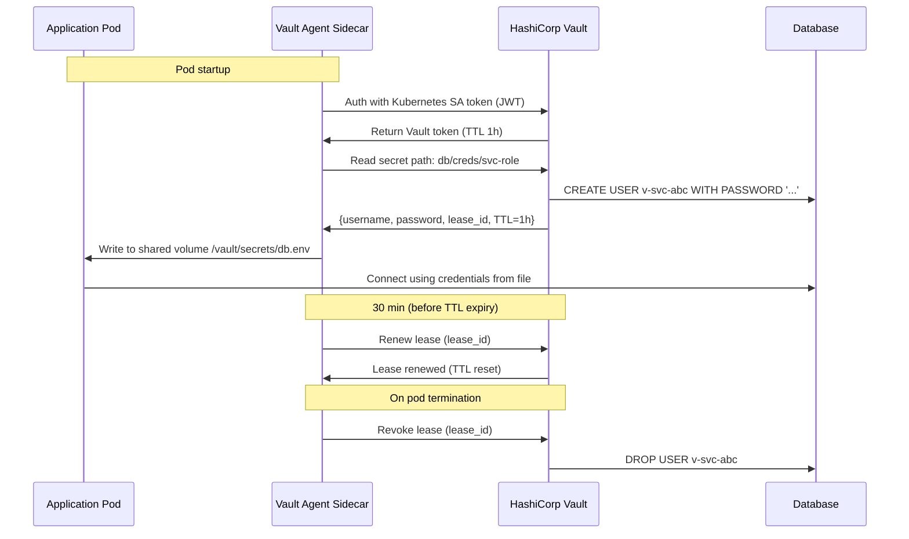

# Secrets Management & Rotation

## Category
Security, Secrets Management, HashiCorp Vault, Azure Key Vault, Secret Rotation, Sidecar Injection

## Context

**Secrets** are credentials that grant access to systems: database passwords, API keys, TLS private keys, service account tokens, and OAuth client secrets. Poor secrets management — hardcoded values, secrets in environment variables or source control, manual rotation — is one of the most common causes of breaches.

### Secrets classification

| Type | Examples | Rotation frequency |
|------|----------|-------------------|
| **Database credentials** | PostgreSQL password, MongoDB URI | Frequent (automated) |
| **API keys** | Third-party service keys, internal API keys | Periodic or on-demand |
| **Certificates / private keys** | TLS certs, mTLS client certs | Before expiry (90-day ACME or shorter) |
| **OAuth client secrets** | IdP client credentials | Periodic or on demand |
| **Encryption keys** | DEKs, KEKs | Per-use (DEK), annual (KEK) |
| **Service account tokens** | Kubernetes SA tokens, AWS IAM temporary creds | Short-lived (auto-renewed) |

### Anti-patterns to avoid

| Anti-pattern | Why it's dangerous |
|-------------|-------------------|
| **Hardcoded secrets in source code** | Git history exposes them permanently — must rotate all affected secrets immediately |
| **Secrets in environment variables** | Visible in process table (`ps auxe`), CI/CD logs, crash dumps |
| **Secrets in container images** | Any pull of the image exposes the secret |
| **Long-lived, manually rotated credentials** | Rotation is missed; compromised credentials live forever |
| **Shared secrets across services** | One compromised service exposes all |

### Secrets management platforms

| Platform | Dynamic secrets | K8s integration | Cloud-native |
|----------|----------------|-----------------|-------------|
| **HashiCorp Vault** | Yes (DB, AWS, PKI, SSH) | Vault Agent sidecar / CSI driver | Self-hosted or HCP |
| **Azure Key Vault** | No (stores static) | CSI driver, Pod Identity, Workload Identity | Azure-native |
| **AWS Secrets Manager** | Yes (RDS rotation) | IRSA + CSI driver | AWS-native |
| **GCP Secret Manager** | No | Workload Identity | GCP-native |

### Dynamic secrets (HashiCorp Vault)

Vault generates short-lived credentials **on demand** for each requesting service, with automatic revocation after TTL. The database never has a long-lived password:

```
Service → Vault (auth with SA token) → Vault → Database (creates temp user/pass)
                                     ↓
             Returns: username=v-svc-pguser-abc123, password=..., TTL=1h
                                     ↓
             After TTL: Vault → Database (drops temp user)
```

### Kubernetes secrets delivery patterns

| Pattern | Description | Security |
|---------|-------------|---------|
| **Native K8s Secret** | `kubectl create secret` — base64 in etcd | Low (etcd must be encrypted) |
| **CSI Secret Store driver** | Mount secrets as files from Vault/Key Vault | High — secret never stored in etcd |
| **Vault Agent sidecar** | Sidecar fetches and renews Vault secrets; writes to shared volume | High — auto-renewal |
| **External Secrets Operator** | Syncs cloud secrets into K8s Secrets | Medium — K8s Secret exists but auto-synced |

---

## Pros

- **Dynamic secrets**: Short-lived credentials limit blast radius — no persistent long-lived passwords.
- **Centralised audit**: Every secret access is logged — full forensic history.
- **Automatic rotation**: Vault + AWS Secrets Manager can rotate credentials automatically, removing human error from rotation.
- **Revocation**: Compromised credentials can be revoked instantly from a central point.
- **No secrets in code or CI logs**: CSI driver / sidecar pattern means secrets never touch environment variables or source.

---

## Cons

- **Vault is a critical dependency**: If Vault is unavailable, services cannot acquire new credentials — HA deployment required.
- **TTL tuning complexity**: Too-short TTLs increase rotation overhead; too-long TTLs widen the compromise window.
- **Secret sprawl**: Without governance, teams create secrets in multiple vaults with overlapping access policies.
- **Migration cost**: Moving from hardcoded/env-var secrets to Vault requires application changes and DevOps investment.
- **Lease renewal logic**: Applications or Vault Agent must renewal leases before TTL expiry — added complexity.

---

## Design Diagram



---

## Code Sample

### TypeScript — Vault Client with Dynamic Database Credentials

```typescript
// src/secrets/vault-client.ts

interface VaultDbCreds {
  username: string;
  password: string;
  leaseId:  string;
  ttl:      number;   // seconds
}

export class VaultClient {
  private readonly baseUrl = process.env.VAULT_ADDR!;
  private token?: string;
  private tokenExpiry = 0;

  /** Authenticate using Kubernetes SA JWT */
  private async authenticate(): Promise<void> {
    if (this.token && Date.now() < this.tokenExpiry - 60_000) return;

    // Kubernetes mounts the SA token at a well-known path
    const jwt = await import('fs').then(fs => fs.readFileSync(
      '/var/run/secrets/kubernetes.io/serviceaccount/token', 'utf8'
    ));

    const res  = await fetch(`${this.baseUrl}/v1/auth/kubernetes/login`, {
      method:  'POST',
      headers: { 'Content-Type': 'application/json' },
      body:    JSON.stringify({ role: process.env.VAULT_ROLE!, jwt }),
    });

    if (!res.ok) throw new Error(`Vault auth failed: ${res.status}`);

    const data  = await res.json() as { auth: { client_token: string; lease_duration: number } };
    this.token  = data.auth.client_token;
    this.tokenExpiry = Date.now() + (data.auth.lease_duration * 1000);
  }

  /** Fetch dynamic database credentials from Vault */
  async getDatabaseCredentials(role: string): Promise<VaultDbCreds> {
    await this.authenticate();

    const res = await fetch(`${this.baseUrl}/v1/database/creds/${role}`, {
      headers: { 'X-Vault-Token': this.token! },
    });

    if (!res.ok) throw new Error(`Failed to get DB credentials: ${res.status}`);

    const data = await res.json() as {
      data:       { username: string; password: string };
      lease_id:   string;
      lease_duration: number;
    };

    return {
      username: data.data.username,
      password: data.data.password,
      leaseId:  data.lease_id,
      ttl:      data.lease_duration,
    };
  }

  /** Renew a lease before it expires */
  async renewLease(leaseId: string): Promise<void> {
    await this.authenticate();
    await fetch(`${this.baseUrl}/v1/sys/leases/renew`, {
      method:  'PUT',
      headers: { 'X-Vault-Token': this.token!, 'Content-Type': 'application/json' },
      body:    JSON.stringify({ lease_id: leaseId }),
    });
  }

  /** Revoke a lease — call on application shutdown */
  async revokeLease(leaseId: string): Promise<void> {
    await this.authenticate();
    await fetch(`${this.baseUrl}/v1/sys/leases/revoke`, {
      method:  'PUT',
      headers: { 'X-Vault-Token': this.token!, 'Content-Type': 'application/json' },
      body:    JSON.stringify({ lease_id: leaseId }),
    });
  }
}
```

### TypeScript — Credential-Aware DB Pool with Auto-Renewal

```typescript
// src/data/managed-pool.ts
// Connection pool that rotates credentials automatically before lease expiry

import { Pool, type PoolConfig } from 'pg';
import { VaultClient } from '../secrets/vault-client.js';

const vault = new VaultClient();

let pool: Pool;
let currentLeaseId: string;
let renewalTimer: NodeJS.Timeout;

export async function initialisePool(): Promise<void> {
  const creds = await vault.getDatabaseCredentials(process.env.VAULT_DB_ROLE!);
  currentLeaseId = creds.leaseId;

  pool = new Pool({
    host:     process.env.DB_HOST,
    port:     parseInt(process.env.DB_PORT ?? '5432'),
    database: process.env.DB_NAME,
    user:     creds.username,
    password: creds.password,
    ssl:      { rejectUnauthorized: true },
    max:      20,
  });

  // Schedule renewal at 75% of TTL
  scheduleRenewal(creds.ttl);
}

function scheduleRenewal(ttlSeconds: number): void {
  const renewAt = ttlSeconds * 0.75 * 1000;
  renewalTimer = setTimeout(async () => {
    try {
      // Renew current lease
      await vault.renewLease(currentLeaseId);
      scheduleRenewal(ttlSeconds);
    } catch {
      // If renew fails, get fresh credentials and replace pool
      await rotateDatabaseCredentials();
    }
  }, renewAt);
}

async function rotateDatabaseCredentials(): Promise<void> {
  const creds   = await vault.getDatabaseCredentials(process.env.VAULT_DB_ROLE!);
  const oldPool = pool;
  const oldLease = currentLeaseId;

  currentLeaseId = creds.leaseId;

  pool = new Pool({
    host:     process.env.DB_HOST,
    port:     parseInt(process.env.DB_PORT ?? '5432'),
    database: process.env.DB_NAME,
    user:     creds.username,
    password: creds.password,
    ssl:      { rejectUnauthorized: true },
    max:      20,
  });

  // Drain old pool before revoking old lease
  await oldPool.end();
  await vault.revokeLease(oldLease);

  scheduleRenewal(creds.ttl);
}

export function getPool(): Pool { return pool; }
```

### YAML — Vault Agent Sidecar Injection

```yaml
# infrastructure/kubernetes/vault-agent-patch.yaml
# Annotation-based Vault Agent sidecar injection (Vault 1.4+ with agent-injector)

apiVersion: apps/v1
kind: Deployment
metadata:
  name: api-service
spec:
  template:
    metadata:
      annotations:
        # Enable Vault Agent sidecar injection
        vault.hashicorp.com/agent-inject:               "true"
        vault.hashicorp.com/role:                       "api-service-role"
        vault.hashicorp.com/agent-pre-populate-only:    "false"  # Keep renewing after init

        # Inject DB credentials as a file
        vault.hashicorp.com/agent-inject-secret-db.env: "database/creds/api-service-role"
        vault.hashicorp.com/agent-inject-template-db.env: |
          {{- with secret "database/creds/api-service-role" -}}
          DB_USERNAME={{ .Data.data.username }}
          DB_PASSWORD={{ .Data.data.password }}
          {{- end }}

        # Inject application secret from KV store
        vault.hashicorp.com/agent-inject-secret-app.env: "secret/data/api-service/prod"
        vault.hashicorp.com/agent-inject-template-app.env: |
          {{- with secret "secret/data/api-service/prod" -}}
          STRIPE_API_KEY={{ .Data.data.stripe_key }}
          SENDGRID_API_KEY={{ .Data.data.sendgrid_key }}
          {{- end }}
    spec:
      serviceAccountName: api-service-sa   # Vault auth uses this SA's JWT
      containers:
        - name: api
          image: myapp/api:latest
          # Application reads secrets from files, NOT environment variables
          command: ["sh", "-c", "source /vault/secrets/db.env && source /vault/secrets/app.env && node dist/server.js"]
```

### Bicep — Azure Key Vault with Rotation Policy

```bicep
// infrastructure/bicep/security/key-vault.bicep

resource keyVault 'Microsoft.KeyVault/vaults@2023-07-01' = {
  name:     'kv-myapp-prod'
  location: resourceGroup().location
  properties: {
    sku: { family: 'A', name: 'premium' }   // premium = HSM-backed keys
    tenantId: subscription().tenantId
    enableSoftDelete:           true
    softDeleteRetentionInDays:  90
    enablePurgeProtection:      true         // Cannot disable soft-delete or purge
    enableRbacAuthorization:    true         // Use Azure RBAC — no access policies
    publicNetworkAccess:        'Disabled'   // Private endpoint only
    networkAcls: {
      defaultAction: 'Deny'
      bypass:        'AzureServices'
    }
  }
}

// Auto-rotate a secret — Key Vault triggers rotation via Event Grid
resource rotationPolicy 'Microsoft.KeyVault/vaults/keys@2023-07-01' = {
  parent: keyVault
  name:   'api-signing-key'
  properties: {
    kty:     'RSA'
    keySize: 4096
    attributes: {
      enabled: true
      exportable: false    // Non-exportable — key never leaves HSM
    }
    rotationPolicy: {
      attributes: {
        expiryTime: 'P1Y'        // Key expires after 1 year
      }
      lifetimeActions: [
        {
          action: { type: 'Rotate' }
          trigger: { timeBeforeExpiry: 'P30D' }   // Auto-rotate 30 days before expiry
        }
        {
          action: { type: 'Notify' }
          trigger: { timeBeforeExpiry: 'P60D' }   // Notify 60 days before expiry
        }
      ]
    }
  }
}
```
