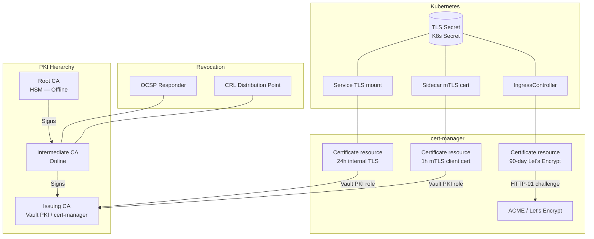

# PKI & Certificate Management

## Category
Security, PKI, TLS, Certificate Authority, cert-manager, ACME, Let's Encrypt, Certificate Rotation

## Context

**Public Key Infrastructure (PKI)** is the system of roles, policies, hardware, software, and procedures for creating, managing, distributing, using, storing, and revoking digital certificates. It underpins TLS, mTLS, code signing, and identity.

### CA hierarchy

```
Root CA (offline — HSM, air-gapped)
    └── Intermediate CA (online — used for signing)
            └── Issuing CA (high-volume — issues leaf certs to services)
                    └── Leaf Certificate (server TLS, client mTLS, code signing)
```

- **Root CA**: Never issues leaf certs directly; only signs Intermediate CA certs. Kept offline in an HSM. If compromised, the entire PKI must be rebuilt.
- **Intermediate CA**: Online, signs Issuing CA certs. Limited scope reduces blast radius of compromise.
- **Issuing CA**: Signs leaf certificates at high volume. Can be managed by cert-manager, Vault PKI, or ADCS.

### Certificate lifecycle

| Phase | Action | Tooling |
|-------|--------|---------|
| **Issuance** | Generate keypair; submit CSR; CA signs cert | cert-manager, Vault PKI, ACME |
| **Distribution** | Mount cert to pod/VM as file or secret | CSI driver, K8s Secret, Vault Agent |
| **Renewal** | Automatic rotation before expiry (typically at 2/3 TTL) | cert-manager `Certificate` resource |
| **Revocation** | Mark cert invalid before expiry | CRL, OCSP stapling |
| **Chain validation** | Client verifies cert chain to trusted root | OS trust store, custom CA bundle |

### Revocation mechanisms

| Mechanism | Description | Latency |
|-----------|-------------|---------|
| **CRL** (Certificate Revocation List) | CA publishes list of revoked serial numbers | Hours (CRL TTL) |
| **OCSP** (Online Certificate Status Protocol) | Real-time status query per cert | Seconds but requires CA availability |
| **OCSP Stapling** | Server fetches OCSP response and staples to TLS handshake | Seconds — no client-to-CA round-trip |

### Let's Encrypt / ACME protocol

- Free, automated, short-lived (90-day) TLS certificates for public domains.
- **Challenge types**: HTTP-01 (server serves file at `/.well-known/acme-challenge/`), DNS-01 (add TXT record), TLS-ALPN-01.
- `cert-manager` issues, renews, and mounts Let's Encrypt certs automatically in Kubernetes clusters.

### Internal vs public CA

| Concern | Public CA (Let's Encrypt, DigiCert) | Internal CA (Vault PKI, ADCS) |
|---------|-------------------------------------|-------------------------------|
| Cost | Free (LE) or paid | Self-managed |
| Trust | Browser/OS trusted | Requires distribution of root cert |
| Automation | ACME protocol | Vault API, GPO, cert-manager |
| mTLS | Limited use | Primary use case |
| Short-lived certs | 90 days (LE) | Minutes to hours (Vault) |

---

## Pros

- **Short-lived certificates from Vault PKI**: Certs can be issued for 1 hour — compromise window is tiny; no revocation needed.
- **cert-manager automates the full lifecycle**: Never manually renew a certificate again.
- **Internal CA enables mTLS for service-to-service**: Services prove identity via client certificates without centralised auth server.
- **OCSP stapling removes CRL check latency**: TLS handshake includes pre-fetched revocation proof — no extra round-trip.
- **Root CA isolation**: Offline root CA means a compromised issuing CA doesn't cascade to total PKI failure.

---

## Cons

- **Certificate rotation requires application restart or hot-reload**: Not all runtimes support live cert reloading.
- **Root CA management is operationally complex**: HSM procurement, ceremony procedures, air-gapped signing ceremonies.
- **Custom CA trust distribution**: All clients (browsers, apps, services) must trust the internal root CA — requires corporate device management.
- **ACME DNS-01 challenge complexity**: Requires DNS provider API integration; internal domains cannot use HTTP-01.
- **Certificate sprawl**: Without centralised inventory, expired certs cause outages — requires a certificate inventory tool.

---

## Design Diagram



---

## Code Sample

### YAML — cert-manager ClusterIssuer (ACME + Let's Encrypt)

```yaml
# infrastructure/kubernetes/cert-manager/cluster-issuer-letsencrypt.yaml
apiVersion: cert-manager.io/v1
kind: ClusterIssuer
metadata:
  name: letsencrypt-prod
spec:
  acme:
    server:  https://acme-v02.api.letsencrypt.org/directory
    email:   platform-security@example.com
    privateKeySecretRef:
      name: letsencrypt-prod-private-key   # Stored in cert-manager namespace
    solvers:
      - http01:
          ingress:
            ingressClassName: nginx
---
# Certificate resource — cert-manager issues and renews automatically
apiVersion: cert-manager.io/v1
kind: Certificate
metadata:
  name: api-tls
  namespace: production
spec:
  secretName:  api-tls-secret    # Kubernetes Secret cert-manager will create/update
  duration:    2160h             # 90 days
  renewBefore: 720h              # Renew 30 days before expiry

  issuerRef:
    name:  letsencrypt-prod
    kind:  ClusterIssuer

  dnsNames:
    - api.example.com
    - www.api.example.com

  privateKey:
    algorithm:   ECDSA
    size:        256
    rotationPolicy: Always       # Generate new keypair on every renewal
```

### YAML — cert-manager Vault PKI Issuer (internal mTLS certs)

```yaml
# infrastructure/kubernetes/cert-manager/vault-issuer.yaml
apiVersion: cert-manager.io/v1
kind: ClusterIssuer
metadata:
  name: vault-pki-issuer
spec:
  vault:
    server:   https://vault.internal.example.com
    path:     pki/sign/internal-services    # Vault PKI role
    auth:
      kubernetes:
        role:             cert-manager-role
        mountPath:        /v1/auth/kubernetes
        serviceAccountRef:
          name: cert-manager
---
# mTLS client certificate — 24h TTL, rotated automatically
apiVersion: cert-manager.io/v1
kind: Certificate
metadata:
  name: payment-service-client-cert
  namespace: production
spec:
  secretName: payment-service-mtls
  duration:   24h
  renewBefore: 8h

  issuerRef:
    name: vault-pki-issuer
    kind: ClusterIssuer

  subject:
    organizations:
      - "example.com"

  privateKey:
    algorithm:      ECDSA
    size:           256
    rotationPolicy: Always

  usages:
    - client auth
    - digital signature

  commonName: payment-service.production.svc.cluster.local
```

### TypeScript — Certificate Hot-Reload for Node.js HTTPS Server

```typescript
// src/server.ts
// Node.js HTTPS server that reloads TLS certificates without restart
// when cert-manager rotates the mounted Kubernetes secret

import https from 'https';
import { readFileSync, watch } from 'fs';
import path from 'path';

const CERT_DIR   = process.env.TLS_CERT_DIR ?? '/etc/certs/tls';
const CERT_PATH  = path.join(CERT_DIR, 'tls.crt');
const KEY_PATH   = path.join(CERT_DIR, 'tls.key');
const CA_PATH    = path.join(CERT_DIR, 'ca.crt');

function loadTlsContext() {
  return {
    cert: readFileSync(CERT_PATH),
    key:  readFileSync(KEY_PATH),
    ca:   readFileSync(CA_PATH),
    requestCert:        true,    // mTLS: require client cert
    rejectUnauthorized: true,
    minVersion: 'TLSv1.3' as const,
  };
}

let tlsOptions = loadTlsContext();

const server = https.createServer(tlsOptions, (req, res) => {
  // Application handler
  res.end('OK');
});

// Hot-reload on certificate file change (cert-manager rotates the symlink)
const watcher = watch(CERT_DIR, (event, filename) => {
  if (filename === 'tls.crt' || filename === 'tls.key') {
    // Small delay to allow both files to be updated
    setTimeout(() => {
      try {
        const nextCtx = loadTlsContext();
        server.setSecureContext(nextCtx);   // Updates TLS context for new connections
        console.info('TLS certificates hot-reloaded');
      } catch (err) {
        console.error('Failed to reload TLS cert — keeping existing cert', err);
      }
    }, 1_000);
  }
});

server.listen(443);
process.on('SIGTERM', () => { watcher.close(); server.close(); });
```

### Vault PKI Setup — Bash

```bash
#!/usr/bin/env bash
# scripts/setup-vault-pki.sh
# Bootstrap Vault PKI secrets engine for internal mTLS certificate issuance

set -euo pipefail

VAULT_ADDR="${VAULT_ADDR:-https://vault.internal.example.com}"

# Enable PKI secrets engine
vault secrets enable -path=pki pki
vault secrets tune -max-lease-ttl=87600h pki   # 10 years max (for root CA cert)

# Generate internal root CA — self-signed
vault write -field=certificate pki/root/generate/internal \
  common_name="example.com Internal Root CA" \
  ttl=87600h \
  key_type=rsa \
  key_bits=4096 \
  > /tmp/root-ca.crt

# Configure CRL and OCSP URLs
vault write pki/config/urls \
  issuing_certificates="${VAULT_ADDR}/v1/pki/ca" \
  crl_distribution_points="${VAULT_ADDR}/v1/pki/crl" \
  ocsp_servers="${VAULT_ADDR}/v1/pki/ocsp"

# Enable intermediate PKI for issuing certs (separate secrets engine)
vault secrets enable -path=pki_int pki
vault secrets tune -max-lease-ttl=43800h pki_int   # 5 years max

# Generate intermediate CSR
vault write -format=json pki_int/intermediate/generate/internal \
  common_name="example.com Intermediate CA" \
  key_type=rsa key_bits=4096 \
  | jq -r '.data.csr' > /tmp/int-ca.csr

# Sign intermediate with root CA
vault write -format=json pki/root/sign-intermediate \
  csr=@/tmp/int-ca.csr \
  format=pem_bundle \
  ttl=43800h \
  | jq -r '.data.certificate' > /tmp/int-ca-signed.crt

vault write pki_int/intermediate/set-signed certificate=@/tmp/int-ca-signed.crt

# Create a role for issuing internal service certs (short TTL)
vault write pki_int/roles/internal-services \
  allowed_domains="svc.cluster.local,internal.example.com" \
  allow_subdomains=true \
  allow_glob_domains=false \
  max_ttl=24h \
  key_type=ec key_bits=256 \
  require_cn=true \
  enforce_hostnames=true \
  allow_ip_sans=false \
  server_flag=true \
  client_flag=true

echo "Vault PKI configured successfully"
```
