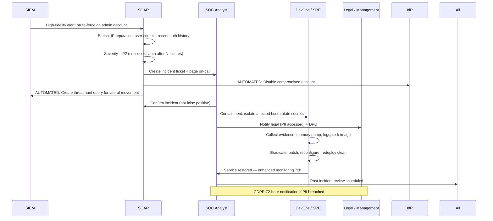

# Security Incident Response

## Category
Security, Incident Response, SOAR, Forensics, Runbooks, IR Lifecycle, Business Continuity

## Context

**Security Incident Response (IR)** is the organised process for detecting, containing, eradicating, recovering from, and learning from security incidents. A well-prepared IR capability minimises breach impact, preserves evidence, and restores services quickly.

### The IR lifecycle (NIST SP 800-61)

```
  Preparation → Detection & Analysis → Containment → Eradication → Recovery → Post-Incident
       ↑                                                                              ↓
       └──────────────────────── Lessons Learned ───────────────────────────────────┘
```

| Phase | Activities | Key artefacts |
|-------|------------|--------------|
| **Preparation** | IR plan, runbooks, tabletop exercises, tooling, contact list | IR plan, playbooks, jump bags |
| **Detection & Analysis** | SIEM alerts, threat hunting, triage, severity classification | Incident ticket, initial IoC list |
| **Containment** | Isolate affected systems, revoke credentials, block attacker IPs | Containment checklist, evidence preservation |
| **Eradication** | Remove malware, patch vulnerability, fix misconfiguration | Eradication confirmation |
| **Recovery** | Restore services, verify integrity, enhanced monitoring | Recovery plan, go-live sign-off |
| **Post-Incident** | Root cause analysis, lessons learned, process improvement | Post-mortem report |

### Incident severity levels

| Severity | Criteria | Response SLA |
|----------|----------|-------------|
| **P1 — Critical** | Active breach, PII exfiltration, ransomware, service down | 15-min response, 1-hour containment |
| **P2 — High** | Successful auth bypass, privilege escalation, compromised credential | 1-hour response, 4-hour containment |
| **P3 — Medium** | Failed attack with sensitive access, anomalous access pattern | 4-hour response, 24-hour investigation |
| **P4 — Low** | Suspicious activity (no confirmed impact), policy violation | Next business day |

### SOAR (Security Orchestration, Automation, and Response)

Automates repetitive IR tasks that would otherwise require manual analyst intervention:
- **Alert enrichment**: Auto-lookup IP reputation, geolocation, user context
- **Triage automation**: Auto-resolve known false positives, auto-escalate high-severity alerts
- **Containment actions**: Disable compromised user account, isolate infected VM, revoke API key
- **Notification**: Page on-call engineer, create JIRA ticket, notify legal/DPO if PII involved

### Forensic evidence preservation (order of volatility)

1. CPU registers and cache
2. Network connections and routing tables
3. Process table and memory
4. Disk image (before any remediation)
5. Log files (forward to SIEM before wiping)
6. Backups and archives

**Golden rule**: Capture evidence before containment actions where possible — isolation can destroy volatile evidence.

---

## Pros

- **Prepares teams before an incident**: Runbooks and tabletop exercises build muscle memory — faster, calmer response under pressure.
- **Limits breach impact**: Rapid containment reduces attacker dwell time — shorter dwell time = less damage.
- **Preserves evidence**: Forensically sound evidence collection enables prosecution and forensic reconstruction.
- **Regulatory compliance**: GDPR Article 33 requires breach notification within 72 hours — IR processes enable this.
- **Continuous improvement**: Post-incident reviews close the vulnerabilities and process gaps that enabled the incident.

---

## Cons

- **Requires significant preparation investment**: IR plan, runbooks, tooling, and training all require sustained effort before any incident.
- **Automation can misfire**: SOAR auto-remediation (e.g., auto-blocking IPs) may block legitimate traffic if alert quality is low.
- **Evidence preservation vs containment tension**: Isolating a system destroys volatile evidence; capturing memory takes time during a live attack.
- **On-call fatigue**: High false-positive alert rate burns out security teams — tuning is essential.
- **Communication overhead**: Incident coordination across security, DevOps, legal, comms, and leadership is difficult under stress.

---

## Design Diagram



---

## Code Sample

### TypeScript — Incident Response Automation (SOAR actions)

```typescript
// src/ir/soar-actions.ts

import { DefaultAzureCredential } from '@azure/identity';
import { GraphServiceClient } from '@microsoft/msgraph-sdk';

interface IncidentContext {
  incidentId:    string;
  severity:      'p1' | 'p2' | 'p3' | 'p4';
  affectedUserId?: string;
  affectedHosts:   string[];
  indicators:      { type: 'ip' | 'domain' | 'hash'; value: string }[];
}

/** Disable a compromised Entra ID user account */
export async function disableCompromisedUser(userId: string, incidentId: string): Promise<void> {
  const credential = new DefaultAzureCredential();
  const client     = GraphServiceClient.init({ authProvider: { getAccessToken: () =>
    credential.getToken('https://graph.microsoft.com/.default').then(t => t.token) }
  });

  await client.users.byUserId(userId).patch({
    accountEnabled: false,
  });

  await auditLog({
    action:    'SOAR_USER_DISABLED',
    result:    'success',
    targetId:  userId,
    detail:    { incidentId, reason: 'Automated IR containment' },
  });
}

/** Revoke all active sessions for a compromised user */
export async function revokeUserSessions(userId: string): Promise<void> {
  const credential = new DefaultAzureCredential();
  const client     = GraphServiceClient.init({ authProvider: { getAccessToken: () =>
    credential.getToken('https://graph.microsoft.com/.default').then(t => t.token) }
  });

  await client.users.byUserId(userId).revokeSignInSessions.post({});
}

/** Block attacker IPs at the WAF / NSG level */
export async function blockIpAddresses(ips: string[], incidentId: string): Promise<void> {
  // Azure: add to NSG deny rule or WAF custom rule
  // This is a simplified illustration — real implementation uses Azure SDK
  const credential = new DefaultAzureCredential();
  const token      = await credential.getToken('https://management.azure.com/.default');

  await fetch(
    `https://management.azure.com/subscriptions/${process.env.AZURE_SUBSCRIPTION_ID}/resourceGroups/${process.env.AZURE_RG}/providers/Microsoft.Network/networkSecurityGroups/${process.env.NSG_NAME}/securityRules/BLOCK_INCIDENT_${incidentId}?api-version=2023-05-01`,
    {
      method:  'PUT',
      headers: {
        'Authorization': `Bearer ${token.token}`,
        'Content-Type':  'application/json',
      },
      body: JSON.stringify({
        properties: {
          priority:                  100,
          direction:                 'Inbound',
          access:                    'Deny',
          protocol:                  '*',
          sourceAddressPrefixes:     ips,
          sourcePortRange:           '*',
          destinationAddressPrefix:  '*',
          destinationPortRange:      '*',
          description:               `Incident ${incidentId} containment`,
        },
      }),
    }
  );
}

/** Create an incident record and page on-call via PagerDuty */
export async function createIncident(ctx: IncidentContext): Promise<string> {
  const res = await fetch('https://events.pagerduty.com/v2/enqueue', {
    method:  'POST',
    headers: {
      'Content-Type': 'application/json',
      'Authorization': `Token token=${process.env.PAGERDUTY_TOKEN}`,
    },
    body: JSON.stringify({
      routing_key:  process.env.PAGERDUTY_ROUTING_KEY,
      event_action: 'trigger',
      dedup_key:    ctx.incidentId,
      payload: {
        summary:   `[${ctx.severity.toUpperCase()}] Security Incident ${ctx.incidentId}`,
        severity:  ctx.severity === 'p1' ? 'critical' : ctx.severity === 'p2' ? 'error' : 'warning',
        source:    'SOAR',
        custom_details: ctx,
      },
    }),
  });

  const data = await res.json() as { dedup_key: string };
  return data.dedup_key;
}

// Stub for audit logger reference
async function auditLog(event: Record<string, unknown>): Promise<void> {
  console.info(JSON.stringify({ ...event, timestamp: new Date().toISOString() }));
}
```

### Bash — Forensic Evidence Collection Script

```bash
#!/usr/bin/env bash
# scripts/ir/collect-evidence.sh
# Collect volatile evidence from a Linux host during an active incident
# IMPORTANT: Run BEFORE any remediation / containment that modifies the host

set -euo pipefail

INCIDENT_ID="${1:?Usage: $0 <INCIDENT_ID>}"
EVIDENCE_DIR="/tmp/ir-evidence-${INCIDENT_ID}-$(date +%Y%m%d-%H%M%S)"
mkdir -p "${EVIDENCE_DIR}"

collect() {
  local label="$1"
  local cmd="$2"
  echo "[+] Collecting: ${label}"
  eval "${cmd}" > "${EVIDENCE_DIR}/${label}.txt" 2>&1 || true
}

# Metadata
echo "${HOSTNAME}" > "${EVIDENCE_DIR}/hostname.txt"
date -u > "${EVIDENCE_DIR}/timestamp-utc.txt"
id >> "${EVIDENCE_DIR}/timestamp-utc.txt"

# Volatile artefacts — collect in order of volatility
collect "ps-full"           "ps auxfwww"
collect "network-connections" "ss -tulnpe"
collect "network-routing"   "ip route show table all"
collect "arp-table"         "arp -na"
collect "active-processes"  "ls -la /proc/*/exe 2>/dev/null | grep -v Permission"
collect "listening-sockets" "lsof -i -n -P"
collect "login-history"     "last -F -n 200"
collect "auth-log"          "tail -n 1000 /var/log/auth.log || tail -n 1000 /var/log/secure"
collect "cron-tabs"         "crontab -l; ls /etc/cron* /var/spool/cron"
collect "startup-services"  "systemctl list-units --type=service --state=active"
collect "env-vars"          "env"
collect "open-files"        "lsof -n"
collect "kernel-modules"    "lsmod"
collect "dmesg"             "dmesg -T | tail -n 500"

# Hash all evidence files for chain-of-custody
find "${EVIDENCE_DIR}" -type f -exec sha256sum {} \; > "${EVIDENCE_DIR}/checksums.sha256"

# Create tamper-evident archive
tar -czf "/tmp/evidence-${INCIDENT_ID}.tar.gz" -C "$(dirname "${EVIDENCE_DIR}")" "$(basename "${EVIDENCE_DIR}")"
sha256sum "/tmp/evidence-${INCIDENT_ID}.tar.gz" > "/tmp/evidence-${INCIDENT_ID}.tar.gz.sha256"

echo "[✓] Evidence archived: /tmp/evidence-${INCIDENT_ID}.tar.gz"
echo "[✓] Checksum: $(cat /tmp/evidence-${INCIDENT_ID}.tar.gz.sha256)"
echo "[!] Upload to secure evidence store immediately"
```

### Markdown — Incident Runbook Template

```markdown
# Runbook: Credential Stuffing / Brute-Force Attack

## Detection criteria
- >50 failed logins within 5 minutes from a single IP (SIEM rule: AUTH_BRUTE_FORCE)
- >500 failed logins within 10 minutes across multiple IPs (distributed)

## Immediate actions (first 15 minutes)
1. [ ] Verify alert is genuine (check SIEM dashboard, confirm spike in auth failures)
2. [ ] Classify severity:
   - Any successful login from attacker IPs → P1 (active breach)
   - Only failures → P2
3. [ ] Page CISO and security lead if P1
4. [ ] SOAR auto-action confirmed? (attacker IPs blocked, 429 rate-limit active)

## Containment (next 45 minutes)
1. [ ] Block attacker IP ranges at WAF / NSG (if not auto-blocked)
2. [ ] Force password reset for all accounts with failed attempts > 10
3. [ ] If any successful auth from attacker IP: disable affected accounts immediately
4. [ ] Enable enhanced auth logging at all ingress points

## Evidence collection
1. [ ] Export SIEM query: all auth events from attacker IPs for past 72h
2. [ ] Pull WAF/access logs from CDN
3. [ ] Archive to incident evidence store: s3://company-ir-evidence/${INCIDENT_ID}/

## Eradication
1. [ ] Validate all attacker IPs are blocked
2. [ ] Confirm CAPTCHA / TOTP MFA enforced for accounts with failed attempts
3. [ ] Verify rate limits are functioning correctly (test from external IP)

## Communication
- GDPR: Were user accounts successfully accessed? → Legal + DPO within 72h
- Status page: Post generic "enhanced security measures" notice if service impact

## Post-incident (72h after closure)
1. [ ] Root cause analysis: how were credentials obtained?
2. [ ] Were credentials in a public breach dump? (Have I Been Pwned API)
3. [ ] Review rate limit thresholds — were they too permissive?
4. [ ] Document and share learnings in monthly security review
```
