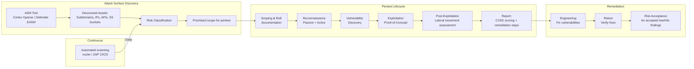

# Penetration Testing & Attack Surface Management

## Category
Security, Penetration Testing, Red Team, Blue Team, Purple Team, Attack Surface Management, CVSS

## Context

**Penetration testing** is authorised, simulated attack activity against a system to identify exploitable vulnerabilities before real attackers do. **Attack Surface Management (ASM)** is the continuous process of discovering, inventorying, and reducing the externally exposed attack surface.

### Testing models

| Model | Description | Perspective |
|-------|-------------|------------|
| **Black box** | Tester has no prior knowledge — simulates external attacker | Realistic external threat |
| **White box** | Full access: source code, architecture diagrams, credentials | Maximum coverage, efficient |
| **Grey box** | Partial knowledge — simulates insider threat or leaky documentation | Balanced — most common |
| **Red team** | Full adversary simulation — stealth, persistence, lateral movement, no held punches | Executive-level risk assessment |
| **Purple team** | Red and blue team collaborate: red attacks, blue defends and learns simultaneously | Capability development |

### Scope and rules of engagement (RoE)

| Element | Description |
|---------|-------------|
| **Scope statement** | Exact IP ranges, domains, APIs, and apps in scope — written authorisation required |
| **Out-of-scope** | Production databases with real PII, third-party systems, DoS |
| **Testing window** | Working hours only, or 24/7 for red team; coordination with on-call |
| **Emergency stop** | Process to halt testing immediately if real damage risk detected |
| **Data handling** | Any captured real data must be deleted; no PII to leave the engagement |

### CVSS v3.1 Severity rating

| Score | Severity | Response SLA |
|-------|---------|-------------|
| 9.0 – 10.0 | **Critical** | Immediate — patch within 24 hours |
| 7.0 – 8.9  | **High**     | Patch within 7 days |
| 4.0 – 6.9  | **Medium**   | Patch within 30 days |
| 0.1 – 3.9  | **Low**      | Patch within 90 days or accept risk |

CVSS metrics: Attack Vector (AV), Attack Complexity (AC), Privileges Required (PR), User Interaction (UI), Scope, Confidentiality/Integrity/Availability impact.

### Bug bounty vs scheduled pentest

| Approach | Description | Cost model |
|----------|-------------|-----------|
| **Scheduled pentest** | Time-boxed engagement with a firm; depth over breadth | Fixed fee |
| **Bug bounty (private)** | Invite selected researchers; lower noise | Pay-per-valid-bug |
| **Bug bounty (public)** | Open to all researchers | Pay-per-valid-bug; high volume |
| **Continuous pentest** | Retained testers access systems continuously | Monthly retainer |

### Key tools (for authorised testing only)

| Category | Tools |
|----------|-------|
| **Reconnaissance** | Shodan, Amass, subfinder, dnsx, httpx |
| **Scanning** | Nmap, Masscan, Nessus, OpenVAS |
| **Web app** | Burp Suite, OWASP ZAP, nuclei, sqlmap |
| **Credential** | Hydra, Medusa, hashcat (post-exploitation) |
| **Framework** | Metasploit, Cobalt Strike (authorised red team) |
| **ASM** | Palo Alto Cortex Xpanse, Microsoft Defender EASM |

---

## Pros

- **Finds real exploitable vulnerabilities**: Unlike SAST/DAST, pentesters chain vulnerabilities to demonstrate actual business impact.
- **Tests defences**: Validates whether detection and response controls work (SIEM alerts, WAF rules, IR procedures).
- **Regulatory requirement**: PCI-DSS Req. 11.4 mandates annual pentests; SOC 2 and ISO 27001 expect regular testing.
- **Prioritises remediation**: CVSS scoring and business impact analysis helps engineering focus limited effort on highest-risk findings.
- **Attack surface visibility**: ASM continuously discovers forgotten subdomains, exposed services, and shadow IT.

---

## Cons

- **Point-in-time snapshot**: A pentest reflects the security posture at engagement time — new code can introduce new vulnerabilities the next day.
- **Scope limitations**: Out-of-scope systems may harbour critical vulnerabilities that go unexamined.
- **Cost**: Skilled penetration testers are expensive; depth of coverage is constrained by budget and time.
- **Disruption risk**: Active exploitation (even authorised) can cause CPU spikes, service crashes, or data corruption if not carefully controlled.
- **False sense of security**: A clean pentest report does not mean the system is secure — only that the tester did not find issues within scope and time.

---

## Design Diagram



---

## Code Sample

### YAML — Automated Security Scan Pipeline (nuclei + ZAP in CI/CD)

```yaml
# .github/workflows/security-scan.yaml
# Automated pentest tooling in CI — runs against a staging environment

name: Security Scan

on:
  schedule:
    - cron: '0 2 * * 1'   # Weekly on Monday at 02:00 UTC
  workflow_dispatch:

jobs:
  nuclei-scan:
    name: Nuclei Vulnerability Scan
    runs-on: ubuntu-latest
    env:
      TARGET_URL: ${{ vars.STAGING_URL }}   # e.g. https://api-staging.example.com

    steps:
      - name: Install nuclei
        run: |
          wget -q https://github.com/projectdiscovery/nuclei/releases/download/v3.2.0/nuclei_3.2.0_linux_amd64.zip
          unzip -q nuclei_3.2.0_linux_amd64.zip
          chmod +x nuclei && sudo mv nuclei /usr/local/bin/

      - name: Update nuclei templates
        run: nuclei -update-templates -silent

      - name: Run nuclei scan
        run: |
          nuclei \
            -u "$TARGET_URL" \
            -t technologies/ \
            -t misconfiguration/ \
            -t cves/ \
            -t exposures/ \
            -severity medium,high,critical \
            -o nuclei-findings.json \
            -json \
            -silent

      - name: Parse findings and fail on critical/high
        run: |
          CRITICAL=$(jq '[.[] | select(.info.severity == "critical")] | length' nuclei-findings.json)
          HIGH=$(jq '[.[] | select(.info.severity == "high")] | length' nuclei-findings.json)
          echo "Critical: ${CRITICAL}, High: ${HIGH}"
          if [[ "${CRITICAL}" -gt 0 || "${HIGH}" -gt 0 ]]; then
            echo "::error::Critical or High vulnerabilities found — review nuclei-findings.json"
            exit 1
          fi

      - name: Upload findings
        uses: actions/upload-artifact@v4
        if: always()
        with:
          name: nuclei-findings
          path: nuclei-findings.json

  zap-scan:
    name: OWASP ZAP API Scan
    runs-on: ubuntu-latest
    needs: nuclei-scan

    steps:
      - uses: actions/checkout@v4

      - name: ZAP API Scan
        uses: zaproxy/action-api-scan@v0.9.0
        with:
          target:    ${{ vars.STAGING_URL }}
          format:    openapi
          docker_name: ghcr.io/zaproxy/zaproxy:stable
          rules_file_name: zap-rules.tsv   # Fine-tune false positives
          fail_action: true                  # Fail pipeline on new Medium+ findings
```

### TypeScript — Attack Surface Inventory Scanner

```typescript
// src/security/attack-surface.ts
// Discover exposed subdomains and check for common misconfigurations

import dns from 'dns/promises';

const COMMON_SUBDOMAINS = [
  'api', 'dev', 'staging', 'admin', 'internal', 'legacy', 'test',
  'vpn', 'mail', 'webmail', 'ftp', 'sftp', 'git', 'jira', 'confluence',
  'jenkins', 'grafana', 'prometheus', 'kibana', 'vault', 'consul',
  'beta', 'demo', 'sandbox', 'backup', 'cdn', 'static', 'assets',
];

interface SubdomainResult {
  subdomain: string;
  resolved:  boolean;
  addresses: string[];
  risk:      'high' | 'medium' | 'low';
}

/**
 * Enumerate subdomains for a given base domain.
 * Use only against domains you own — authorised use only.
 */
export async function enumerateSubdomains(baseDomain: string): Promise<SubdomainResult[]> {
  const results: SubdomainResult[] = [];

  await Promise.allSettled(
    COMMON_SUBDOMAINS.map(async (sub) => {
      const fqdn = `${sub}.${baseDomain}`;
      try {
        const addresses = await dns.resolve4(fqdn);
        const risk = isHighRisk(sub) ? 'high' : 'medium';
        results.push({ subdomain: fqdn, resolved: true, addresses, risk });
      } catch {
        results.push({ subdomain: fqdn, resolved: false, addresses: [], risk: 'low' });
      }
    })
  );

  return results.filter(r => r.resolved);
}

function isHighRisk(subdomain: string): boolean {
  // Internal tools exposed publicly = high risk
  const HIGH_RISK = ['admin', 'internal', 'jenkins', 'grafana', 'kibana',
                     'vault', 'consul', 'prometheus', 'legacy'];
  return HIGH_RISK.includes(subdomain);
}

/** Check for common HTTP misconfigurations */
export async function checkHttpMisconfigurations(url: string): Promise<string[]> {
  const findings: string[] = [];

  const res = await fetch(url, { redirect: 'manual' });

  const headers = res.headers;

  if (!headers.get('Strict-Transport-Security'))   findings.push('Missing HSTS header');
  if (!headers.get('Content-Security-Policy'))      findings.push('Missing Content-Security-Policy');
  if (!headers.get('X-Content-Type-Options'))       findings.push('Missing X-Content-Type-Options');
  if (headers.get('X-Powered-By'))                  findings.push(`X-Powered-By exposed: ${headers.get('X-Powered-By')}`);
  if (headers.get('Server'))                        findings.push(`Server header exposed: ${headers.get('Server')}`);

  // Check for directory listing
  const indexRes = await fetch(`${url}/`);
  const body     = await indexRes.text();
  if (body.includes('Index of /') || body.includes('Directory listing')) {
    findings.push('Directory listing enabled');
  }

  return findings;
}
```

### YAML — Pentest Findings Tracker (GitHub Issues template)

```yaml
# .github/ISSUE_TEMPLATE/pentest-finding.yml
name: Penetration Test Finding
description: Track a finding from an authorised penetration test or bug bounty report
title: "[PENTEST] "
labels: ["security", "pentest-finding"]

body:
  - type: dropdown
    id: severity
    attributes:
      label: CVSS Severity
      options:
        - "Critical (9.0-10.0)"
        - "High (7.0-8.9)"
        - "Medium (4.0-6.9)"
        - "Low (0.1-3.9)"
        - "Informational"
    validations:
      required: true

  - type: input
    id: cvss-score
    attributes:
      label: CVSS Score & Vector
      placeholder: "8.8 / CVSS:3.1/AV:N/AC:L/PR:N/UI:R/S:U/C:H/I:H/A:H"

  - type: textarea
    id: description
    attributes:
      label: Vulnerability Description
      placeholder: "Describe the vulnerability, where it was found, and its potential impact"
    validations:
      required: true

  - type: textarea
    id: steps-to-reproduce
    attributes:
      label: Steps to Reproduce
      placeholder: |
        1. Navigate to /api/v1/...
        2. Modify request parameter X to value Y
        3. Observe response leaks sensitive data Z
    validations:
      required: true

  - type: textarea
    id: remediation
    attributes:
      label: Recommended Remediation
    validations:
      required: true

  - type: input
    id: sla-deadline
    attributes:
      label: Remediation Deadline (based on severity SLA)
      placeholder: "2024-12-01"
```
