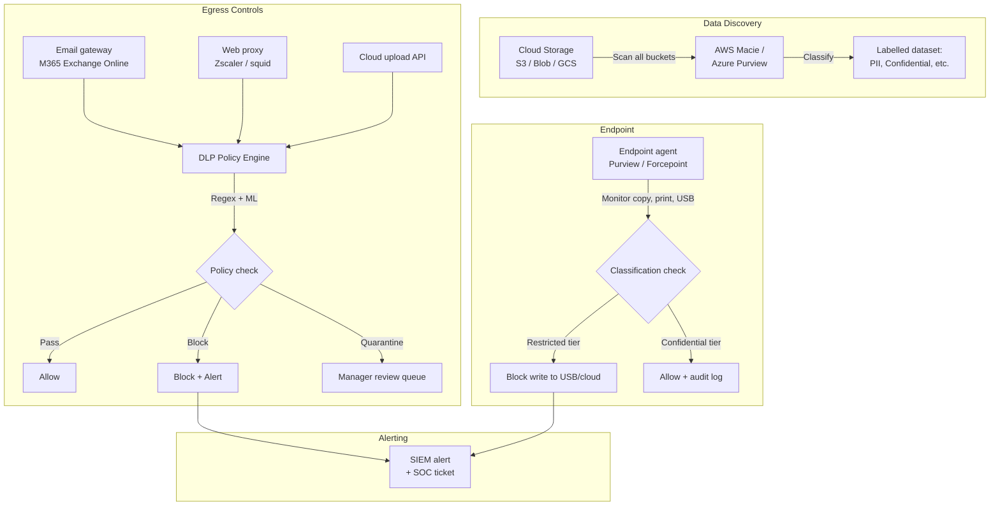

# Data Loss Prevention (DLP)

## Category
Security, DLP, Data Classification, Information Protection, Egress Control, Policy Enforcement

## Context

**Data Loss Prevention (DLP)** is the practice of detecting and preventing unauthorised transmission, storage, or use of sensitive data. DLP operates at endpoints, networks, and cloud services to ensure that classified data does not leave the organisation's control boundary.

### Data classification model

| Tier | Label | Examples | Handling requirements |
|------|-------|---------|----------------------|
| **Tier 0** | Restricted | Credentials, private keys, biometrics, medical records, PCI PAN | Encrypted at rest + transit; access log every read; cannot be emailed or uploaded externally |
| **Tier 1** | Confidential | PII, financial data, M&A data, source code, HR records | Encrypted at rest; need-to-know access; DLP scanning on egress |
| **Tier 2** | Internal | Internal processes, unreleased roadmap, system inventory | Standard access controls; no external sharing without approval |
| **Tier 3** | Public | Marketing materials, public documentation | No restrictions |

### DLP deployment modes

| Mode | What it inspects | Action |
|------|-----------------|--------|
| **Network DLP** | Egress network traffic | Inspect + block/alert data leaving the network |
| **Endpoint DLP** | Files on endpoints (copy, print, USB, email) | Block write to USB; block upload; alert |
| **Cloud DLP API** | Content uploaded to cloud services | Scan and classify; redact or block |
| **Email DLP** | Email attachments and body | Block/quarantine emails with classified content |
| **SaaS DLP** | Files in M365, Google Workspace, Box | Classify, restrict sharing, rights-manage |

### Detection techniques

| Technique | Description | Example |
|-----------|-------------|---------|
| **Regular expressions** | Pattern matching for structured PII | Credit card numbers, SSNs, IBANs, passport numbers |
| **Data fingerprinting** | Hash chunks of known sensitive documents | Detect when fragments of confidential contracts are exfiltrated |
| **Machine learning classification** | ML model classifies content by sensitivity | Classify email as "Confidential — Financial" |
| **Exact data match (EDM)** | Match against indexed database of sensitive values | Detect specific customer SSNs in uploads |
| **Optical Character Recognition (OCR)** | Extract text from images/PDFs for inspection | Detect credit cards photographed and uploaded |

### Cloud DLP services

| Service | Provider | Key features |
|---------|---------|-------------|
| **Microsoft Purview Information Protection** | Azure / M365 | Labelling, DLP policies, endpoint DLP, MCAS integration |
| **Google Cloud DLP API** | GCP | API-callable DLP scanning for 100+ info types |
| **AWS Macie** | AWS | Discovers PII in S3; classification + alerting |
| **Forcepoint DLP** | Third-party | Enterprise network/endpoint/cloud DLP |

---

## Pros

- **Prevents accidental data leakage**: Employees often exfiltrate data accidentally (wrong email recipient, public S3 bucket).
- **Regulatory compliance**: Required under GDPR, PCI-DSS, HIPAA, SOX — evidence of data access controls.
- **Insider threat detection**: Detects both malicious and careless insiders moving sensitive data to personal storage.
- **Visibility into sensitive data flows**: Classification reveals where PII and confidential data actually resides.
- **Rights management integration**: Labels persist with documents, controlling access even after data leaves the organisation.

---

## Cons

- **False positives disrupt workflows**: Overly aggressive DLP blocks legitimate business activities — requires careful policy tuning.
- **Encrypted traffic blind spot**: Network DLP cannot inspect TLS traffic without SSL inspection — which introduces its own risks and latency.
- **Endpoint agent management**: DLP agents on all endpoints require MDM, continuous updates, and performance testing.
- **Cloud DLP scanning cost**: API-based scanning at high volume is expensive — targeted scanning is more practical than scanning all files.
- **Circumvention risk**: Determined insiders can evade DLP through steganography, personal devices, or data transformation.

---

## Design Diagram



---

## Code Sample

### TypeScript — DLP Scanning with Google Cloud DLP API

```typescript
// src/dlp/cloud-dlp-scanner.ts
// Scan user-uploaded content for PII before storing

import { DlpServiceClient } from '@google-cloud/dlp';

const dlp    = new DlpServiceClient();
const project = process.env.GOOGLE_CLOUD_PROJECT!;

export interface DlpScanResult {
  hasSensitiveData: boolean;
  findings: { infoType: string; likelihood: string; snippet: string }[];
}

/**
 * Scan text content for PII and sensitive data before storing.
 * Throws if content contains Restricted-tier data.
 */
export async function scanContent(content: string, context: string): Promise<DlpScanResult> {
  const [response] = await dlp.inspectContent({
    parent: `projects/${project}/locations/global`,
    inspectConfig: {
      infoTypes: [
        { name: 'EMAIL_ADDRESS' },
        { name: 'PHONE_NUMBER' },
        { name: 'CREDIT_CARD_NUMBER' },
        { name: 'US_SOCIAL_SECURITY_NUMBER' },
        { name: 'IBAN_CODE' },
        { name: 'PASSPORT' },
        { name: 'PERSON_NAME' },
        { name: 'DATE_OF_BIRTH' },
        { name: 'IP_ADDRESS' },
      ],
      minLikelihood: 'LIKELY',
      limits: { maxFindingsPerRequest: 20 },
      includeQuote: false,   // Do NOT include matched text in findings — security risk
    },
    item: { value: content },
  });

  const findings = (response.result?.findings ?? []).map(f => ({
    infoType:   f.infoType?.name ?? 'UNKNOWN',
    likelihood: f.likelihood ?? 'UNKNOWN',
    snippet:    '[REDACTED]',   // Never log matched PII
  }));

  // Restricted types block the operation entirely
  const RESTRICTED_TYPES = new Set(['CREDIT_CARD_NUMBER', 'US_SOCIAL_SECURITY_NUMBER', 'PASSPORT']);
  const hasRestricted    = findings.some(f => RESTRICTED_TYPES.has(f.infoType));

  if (hasRestricted) {
    // Audit the attempt
    console.warn(JSON.stringify({
      event:    'DLP_RESTRICTED_DATA_BLOCKED',
      context,
      infoTypes: findings.map(f => f.infoType),
      timestamp: new Date().toISOString(),
    }));
    throw new Error('Upload rejected: document contains restricted data');
  }

  return {
    hasSensitiveData: findings.length > 0,
    findings,
  };
}

/**
 * Redact PII from content (for display in support tools)
 */
export async function redactPii(content: string): Promise<string> {
  const [response] = await dlp.deidentifyContent({
    parent: `projects/${project}/locations/global`,
    deidentifyConfig: {
      infoTypeTransformations: {
        transformations: [
          {
            infoTypes: [
              { name: 'EMAIL_ADDRESS' },
              { name: 'PHONE_NUMBER' },
              { name: 'CREDIT_CARD_NUMBER' },
              { name: 'US_SOCIAL_SECURITY_NUMBER' },
              { name: 'PERSON_NAME' },
            ],
            primitiveTransformation: {
              replaceWithInfoTypeConfig: {},   // Replace with [EMAIL_ADDRESS], [PHONE_NUMBER], etc.
            },
          },
        ],
      },
    },
    inspectConfig: {
      minLikelihood: 'LIKELY',
    },
    item: { value: content },
  });

  return response.item?.value ?? content;
}
```

### TypeScript — Regex-Based PII Detector

```typescript
// src/dlp/pii-detector.ts
// Fast, offline PII detection using regular expressions
// Use for high-throughput, low-latency paths where Cloud DLP API is too slow

export interface PiiMatch {
  type:    string;
  pattern: string;
}

// Patterns are deliberately not capturing groups to avoid extracting real PII values
const PII_PATTERNS: { type: string; regex: RegExp }[] = [
  {
    type:  'CREDIT_CARD',
    regex: /\b(?:4[0-9]{3}|5[1-5][0-9]{2}|3[47][0-9]{2}|3(?:0[0-5]|[68][0-9])[0-9]|6(?:011|5[0-9]{2}))[0-9 -]{8,15}\b/g,
  },
  {
    type:  'US_SSN',
    regex: /\b(?!000|666|9\d{2})\d{3}[-\s](?!00)\d{2}[-\s](?!0000)\d{4}\b/g,
  },
  {
    type:  'IBAN',
    regex: /\b[A-Z]{2}\d{2}[A-Z0-9]{4}\d{7,26}\b/g,
  },
  {
    type:  'EMAIL',
    regex: /\b[a-zA-Z0-9._%+\-]+@[a-zA-Z0-9.\-]+\.[a-zA-Z]{2,}\b/g,
  },
  {
    type:  'UK_NI',
    regex: /\b[A-CEGHJ-PR-TW-Z]{2}\d{6}[A-D]\b/gi,
  },
  {
    type:  'PASSPORT_NUMBER',
    regex: /\b[A-Z]{1,2}[0-9]{6,9}\b/g,
  },
];

export function detectPii(text: string): PiiMatch[] {
  const matches: PiiMatch[] = [];

  for (const { type, regex } of PII_PATTERNS) {
    regex.lastIndex = 0;   // Reset stateful regex
    if (regex.test(text)) {
      matches.push({ type, pattern: regex.source.slice(0, 30) + '...' });
    }
  }

  return matches;
}

/** Mask PII with type label for safe logging */
export function maskPii(text: string): string {
  let masked = text;
  for (const { type, regex } of PII_PATTERNS) {
    regex.lastIndex = 0;
    masked = masked.replace(regex, `[${type}]`);
  }
  return masked;
}
```

### YAML — Microsoft Purview DLP Policy (M365 / SharePoint)

```yaml
# This is a documentation reference — M365 DLP policies are configured
# via Microsoft Purview admin portal or PowerShell (New-DlpCompliancePolicy)

# PowerShell equivalent for creating a DLP policy
# Connect-IPPSSession -UserPrincipalName admin@example.com

# New-DlpCompliancePolicy `
#   -Name "Financial Data Protection" `
#   -ExchangeLocation All `
#   -SharePointLocation All `
#   -OneDriveLocation All `
#   -TeamsLocation All `
#   -Mode Enable

# New-DlpComplianceRule `
#   -Name "Block external sharing of credit card data" `
#   -Policy "Financial Data Protection" `
#   -ContentContainsSensitiveInformation @(
#     @{Name="Credit Card Number"; minCount="1"; minConfidence="85"}
#   ) `
#   -ExceptIfRecipientDomainIs @("example.com", "subsidiary.com") `
#   -BlockAccess $true `
#   -NotifyUser Owner `
#   -NotifyEmailCustomText "This document appears to contain payment card data and cannot be shared externally. Contact security@example.com."

# Policy: Alert only (investigation mode)
# New-DlpComplianceRule `
#   -Name "Alert on SSN in email" `
#   -Policy "Financial Data Protection" `
#   -ContentContainsSensitiveInformation @(
#     @{Name="U.S. Social Security Number (SSN)"; minCount="1"}
#   ) `
#   -GenerateIncidentsReport @("security-dlp@example.com") `
#   -ReportSeverityLevel High
```
