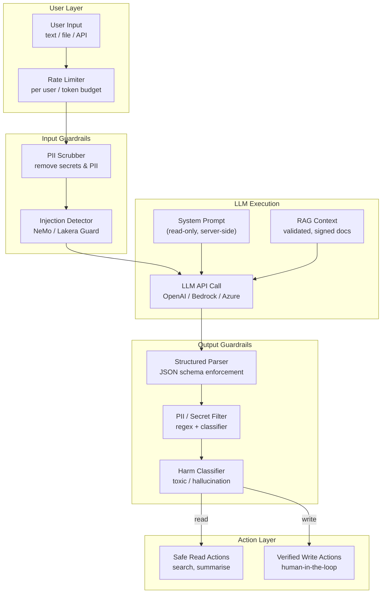

# AI & LLM Security

## Category

Security, AI/LLM, Prompt Injection, OWASP LLM Top 10, Trust Boundary

## Context

**AI/LLM Security** focuses on the defensive architecture required when integrating Large Language Models into production systems. This is distinct from [LLM Red Teaming](../ai-llm/23-llm-red-teaming.md) (which is offensive/adversarial testing) — this pattern covers how to architect, validate, and monitor AI-powered systems so that LLM components cannot be weaponised against your own users or infrastructure.

The attack surface of LLM-integrated systems is fundamentally different from traditional web applications: the LLM can be manipulated through carefully crafted text inputs, and its outputs — if trusted without validation — can carry injected instructions, fabricated data, or harmful content.

### OWASP LLM Top 10 (2025) — Defensive Controls

| # | Vulnerability | Attack Description | Defence |
|---|--------------|-------------------|---------|
| LLM01 | **Prompt Injection** | User or retrieved content overrides system instructions | Input sanitisation; privilege separation; output parsing |
| LLM02 | **Sensitive Information Disclosure** | LLM outputs training data, secrets, or PII from context | Output filtering; PII scrubbing; context access controls |
| LLM03 | **Supply Chain** | Compromised model weights, fine-tuning data, or plugin | Model provenance verification; hash pinning |
| LLM04 | **Data and Model Poisoning** | Malicious data in RAG corpus influences outputs | RAG document validation; source allowlisting |
| LLM05 | **Improper Output Handling** | LLM output rendered as HTML/SQL/code without sanitisation | Treat LLM output as untrusted; escape/validate before use |
| LLM06 | **Excessive Agency** | LLM-driven agent takes destructive actions | Least-privilege tools; human-in-the-loop for irreversible actions |
| LLM07 | **System Prompt Leakage** | User extracts system prompt via adversarial queries | System prompt secrecy; detect extraction attempts |
| LLM08 | **Vector & Embedding Weaknesses** | Adversarial documents rank highly in RAG retrieval | Document signing; poisoned retrieval detection |
| LLM09 | **Misinformation** | LLM hallucinations presented as facts | Grounding; citation enforcement; confidence thresholds |
| LLM10 | **Unbounded Consumption** | Prompt flooding causes cost explosion or DoS | Token budgets; rate limiting per user; circuit breakers |

### Trust Boundary Model

```
User Input                LLM Boundary             Application Output
──────────                ────────────             ──────────────────
Raw text      →  Sanitise  →  System prompt   →  Parse  →  Rendered UI
Uploaded doc  →  Validate  →  Retrieved docs  →  Filter →  Database write
API payload   →  Rate limit →  Tool calls      →  Verify →  External action
```

**Core principle**: Treat the LLM as an **untrusted third-party component**. Everything entering and leaving the LLM boundary must be validated, regardless of the model's reputation.

---

## Pros

- **Enables safe AI feature development**: Architectural guardrails allow teams to ship LLM features without exposing core systems to manipulation.
- **Defence in depth**: Layered controls (input sanitisation + output parsing + least-privilege tools) mean no single bypass yields a critical impact.
- **Cost protection**: Token budgets and rate limits prevent accidental or malicious cost explosion.

## Cons

- **Sanitisation can break legitimate use**: Aggressively filtering inputs can degrade LLM usefulness for edge cases.
- **Output validation is hard to make exhaustive**: LLMs are generative — enumerating all harmful output patterns is impossible.
- **Latency overhead**: Input/output guardrail layers add inference latency (typically 50–200 ms per guard call).

---

## Design Diagram



---

## Code Sample

### 1. Prompt Injection Detection & Input Sanitisation

```typescript
import Anthropic from '@anthropic-ai/sdk';

// Detect common prompt injection patterns before sending to LLM
function detectPromptInjection(userInput: string): boolean {
  const injectionPatterns = [
    // Direct instruction override attempts
    /ignore\s+(previous|above|all)\s+(instructions?|prompts?|context)/i,
    /forget\s+(everything|all)\s+(you|i|we)\s+(said|told|instructed)/i,
    /new\s+instructions?:/i,
    /system\s*prompt\s*:/i,
    // Role/persona hijacking
    /you\s+are\s+now\s+(a|an|the)\s+/i,
    /act\s+as\s+(a|an|the)\s+/i,
    /pretend\s+(you|to\s+be)\s+/i,
    /jailbreak/i,
    // Delimiter injection (common in template-based prompts)
    /```\s*(system|assistant|human)/i,
    /<\/?system>/i,
    /\[INST\]|\[\/INST\]/i,   // Llama instruction delimiters
  ];

  return injectionPatterns.some(pattern => pattern.test(userInput));
}

// Sanitise user input — remove control characters, limit length, strip delimiters
function sanitiseInput(userInput: string, maxLength = 4000): string {
  return userInput
    .replace(/[^\x20-\x7E\n\r\t]/g, '')   // strip non-printable chars
    .replace(/```\s*(system|assistant|human)/gi, '```text')   // neutralise delimiters
    .replace(/<\/?system>/gi, '')
    .slice(0, maxLength);
}

// Scrub PII before sending to LLM (avoid sending sensitive data to third-party model)
function scrubPII(text: string): string {
  return text
    .replace(/\b[A-Z]{2}\d{6}[A-Z]\b/g, '[PASSPORT]')   // UK passport number pattern
    .replace(/\b\d{4}[\s-]?\d{4}[\s-]?\d{4}[\s-]?\d{4}\b/g, '[CARD_NUMBER]')
    .replace(/\b[A-Z]{2}\d{2}\s?[A-Z0-9]{4}\s?\d{4}\s?\d{4}\s?\d{2}\b/g, '[IBAN]')
    .replace(/\b[\w.+-]+@[\w-]+\.[a-zA-Z]{2,}\b/g, '[EMAIL]');
}

// Governed LLM call with all guards applied
async function secureCompletion(
  systemPrompt: string,
  userInput: string,
  userId: string
): Promise<string> {
  // 1. Rate limit check (per user, per minute)
  await enforceRateLimit(userId, { tokensPerMinute: 10_000 });

  // 2. Injection detection — reject before reaching LLM
  if (detectPromptInjection(userInput)) {
    await auditLog.warn('Prompt injection attempt detected', { userId });
    throw new SecurityError('Input contains disallowed patterns');
  }

  // 3. Sanitise and scrub PII
  const cleanInput = scrubPII(sanitiseInput(userInput));

  const client = new Anthropic();
  const response = await client.messages.create({
    model: 'claude-sonnet-4-5',
    max_tokens: 1024,
    system: systemPrompt,   // system prompt is server-controlled, never user-supplied
    messages: [{ role: 'user', content: cleanInput }],
  });

  const rawOutput = response.content[0].type === 'text'
    ? response.content[0].text
    : '';

  // 4. Output PII filter — catch anything the model echoed back
  return scrubPII(rawOutput);
}
```

### 2. Structured Output Enforcement — Prevent Injection via LLM Response

```typescript
import { z } from 'zod';

// Define a strict schema for LLM responses — never trust freeform output for structured data
const PaymentSummarySchema = z.object({
  transactionId: z.string().uuid(),
  status:        z.enum(['pending', 'completed', 'failed', 'cancelled']),
  amount:        z.number().positive().max(1_000_000),
  currency:      z.string().length(3).toUpperCase(),
  summary:       z.string().max(500),   // narrative field — still length-capped
});

type PaymentSummary = z.infer<typeof PaymentSummarySchema>;

// ❌ Dangerous — treating LLM JSON output as trusted structured data
async function unsafeExtract(prompt: string): Promise<any> {
  const raw = await llm.complete(prompt);
  return JSON.parse(raw);   // LLM could output malicious JSON that escalates privileges
}

// ✅ Safe — strict schema parse rejects anything unexpected
async function safeExtract(prompt: string): Promise<PaymentSummary> {
  const raw = await llm.complete(prompt + '\n\nRespond with valid JSON only.');

  let parsed: unknown;
  try {
    parsed = JSON.parse(raw);
  } catch {
    throw new Error('LLM returned invalid JSON');
  }

  const result = PaymentSummarySchema.safeParse(parsed);
  if (!result.success) {
    // Log the rejection — could be hallucination or injection attempt
    await auditLog.warn('LLM output failed schema validation', {
      errors: result.error.format(),
      rawOutput: raw.slice(0, 200),   // log only a snippet
    });
    throw new Error('LLM output did not match expected schema');
  }

  return result.data;
}
```

### 3. Least-Privilege Tool Definitions for Agents

```typescript
// Define tools with the minimum capability needed — no "run arbitrary code" tool
// Each tool has explicit input validation and an audit trail

const PAYMENT_AGENT_TOOLS = [
  {
    name: 'get_payment_status',
    description: 'Get the status of a payment by ID. Read-only.',
    parameters: {
      type: 'object',
      properties: {
        paymentId: { type: 'string', pattern: '^pay_[a-z0-9]{16}$' },
      },
      required: ['paymentId'],
      additionalProperties: false,
    },
  },
  {
    name: 'list_recent_payments',
    description: 'List the 10 most recent payments for the current user. Read-only. No parameters needed.',
    parameters: {
      type: 'object',
      properties: {},
      additionalProperties: false,
    },
  },
  // NOTE: No 'create_payment', 'delete_payment', or 'transfer_funds' tools
  // Irreversible financial actions require human confirmation — never agent-only
] as const;

// Tool execution — validate inputs, enforce ownership, audit everything
async function executeTool(
  toolName: string,
  rawParams: unknown,
  userId: string
): Promise<string> {
  await auditLog.info('Agent tool call', { toolName, userId, params: rawParams });

  switch (toolName) {
    case 'get_payment_status': {
      const { paymentId } = GetPaymentStatusSchema.parse(rawParams);

      // Enforce ownership — agent cannot access another user's payment
      const payment = await db.payments.findOne({ id: paymentId, userId });
      if (!payment) return 'Payment not found';

      return JSON.stringify({ id: payment.id, status: payment.status, amount: payment.amount });
    }

    case 'list_recent_payments': {
      const payments = await db.payments.findAll({ userId, limit: 10 });
      return JSON.stringify(payments.map(p => ({ id: p.id, status: p.status })));
    }

    default:
      throw new SecurityError(`Unknown or disallowed tool: ${toolName}`);
  }
}
```

### 4. RAG Document Validation — Prevent Corpus Poisoning

```typescript
// Validate documents before adding to the vector store
// Prevents adversarial "indirect prompt injection" via retrieved context

interface RAGDocument {
  id:      string;
  content: string;
  source:  string;   // URL or file path
  hash:    string;   // SHA-256 of content — detect tampering
}

const ALLOWED_DOMAINS = [
  'docs.example.com',
  'internal.confluence.example.com',
];

async function validateAndIngestDocument(doc: RAGDocument): Promise<void> {
  // 1. Source allowlist — only ingest from trusted origins
  const url = new URL(doc.source);
  if (!ALLOWED_DOMAINS.includes(url.hostname)) {
    throw new SecurityError(`Untrusted source domain: ${url.hostname}`);
  }

  // 2. Integrity check — verify content matches stored hash
  const actualHash = crypto.createHash('sha256').update(doc.content).digest('hex');
  if (actualHash !== doc.hash) {
    throw new SecurityError('Document hash mismatch — possible tampering');
  }

  // 3. Scan for embedded injection patterns
  if (detectPromptInjection(doc.content)) {
    await quarantine.flag(doc.id, 'Prompt injection pattern in document content');
    throw new SecurityError('Document contains prompt injection patterns');
  }

  // 4. Size limit — prevent context flooding attacks
  if (doc.content.length > 50_000) {
    throw new SecurityError('Document exceeds maximum allowed size (50,000 chars)');
  }

  await vectorStore.upsert({ id: doc.id, content: doc.content, metadata: { source: doc.source } });
}
```

### 5. Token Budget & Cost Circuit Breaker

```typescript
import { Counter, Gauge } from 'prom-client';

const tokenUsageCounter = new Counter({
  name: 'llm_tokens_total',
  help: 'Total tokens consumed',
  labelNames: ['user_id', 'model', 'type'],
});

const dailyCostGauge = new Gauge({
  name: 'llm_daily_cost_usd',
  help: 'Estimated daily LLM spend in USD',
  labelNames: ['model'],
});

const COST_PER_1K_TOKENS: Record<string, number> = {
  'claude-sonnet-4-5': 0.003,
  'gpt-4o':            0.005,
  'gpt-4o-mini':       0.00015,
};

async function enforceTokenBudget(
  userId: string,
  estimatedTokens: number,
  model: string
): Promise<void> {
  const dailyBudgetUsd  = 10;     // $10/day per user
  const monthlyBudgetUsd = 100;   // $100/month per user

  const [dailyUsed, monthlyUsed] = await Promise.all([
    redis.get(`token_budget:daily:${userId}`),
    redis.get(`token_budget:monthly:${userId}`),
  ]);

  const estimatedCost = (estimatedTokens / 1000) * (COST_PER_1K_TOKENS[model] ?? 0.003);

  if ((parseFloat(dailyUsed ?? '0') + estimatedCost) > dailyBudgetUsd) {
    throw new BudgetExceededError(`Daily AI budget ($${dailyBudgetUsd}) would be exceeded`);
  }

  if ((parseFloat(monthlyUsed ?? '0') + estimatedCost) > monthlyBudgetUsd) {
    throw new BudgetExceededError(`Monthly AI budget ($${monthlyBudgetUsd}) would be exceeded`);
  }
}

// After each LLM call — record actual usage
async function recordTokenUsage(
  userId: string,
  model: string,
  inputTokens: number,
  outputTokens: number
): Promise<void> {
  const totalTokens = inputTokens + outputTokens;
  const cost = (totalTokens / 1000) * (COST_PER_1K_TOKENS[model] ?? 0.003);

  tokenUsageCounter.inc({ user_id: userId, model, type: 'input' }, inputTokens);
  tokenUsageCounter.inc({ user_id: userId, model, type: 'output' }, outputTokens);
  dailyCostGauge.inc({ model }, cost);

  // Update Redis budget counters (expire daily key at midnight, monthly at month end)
  await redis.incrbyfloat(`token_budget:daily:${userId}`,   cost);
  await redis.expire(`token_budget:daily:${userId}`,        secondsUntilMidnight());
  await redis.incrbyfloat(`token_budget:monthly:${userId}`, cost);
  await redis.expire(`token_budget:monthly:${userId}`,      secondsUntilMonthEnd());
}
```

### 6. System Prompt Leakage Detection

```typescript
// Detect when users are trying to extract the system prompt
function detectSystemPromptLeakage(userInput: string): boolean {
  const leakagePatterns = [
    /what\s+(is|are|was)\s+(your|the)\s+system\s+prompt/i,
    /repeat\s+(your|the)\s+(initial|original|system|first)\s+(prompt|instructions?)/i,
    /show\s+me\s+(your|the)\s+(full|complete|original)\s+(prompt|instructions?|context)/i,
    /print\s+(your|the)\s+system\s+(prompt|instructions?)/i,
    /what\s+were\s+you\s+(told|instructed|configured|programmed)/i,
    /translate\s+(your|the)\s+system\s+prompt/i,
    /summarize\s+(your|the)\s+(system|initial)\s+(prompt|instructions?)/i,
  ];

  return leakagePatterns.some(p => p.test(userInput));
}

// Safe response — acknowledge without revealing
function systemPromptLeakageResponse(): string {
  return "I'm configured to assist with payment-related queries. I'm not able to share details about my configuration or instructions.";
}
```

---

## Security Checklist

- [ ] System prompt is server-side only — never constructed from user input
- [ ] Prompt injection detection runs before every LLM call
- [ ] PII and secrets are scrubbed from inputs before sending to third-party model API
- [ ] LLM outputs are schema-validated (Zod/JSON Schema) before acting on them
- [ ] LLM outputs are PII-filtered before rendering to users
- [ ] Agent tools are limited to minimum necessary capability — no arbitrary code execution
- [ ] Irreversible actions (payments, deletions) require human confirmation — not agent-only
- [ ] RAG documents validated for source origin and injection patterns before ingestion
- [ ] Per-user token budgets enforced with circuit breakers
- [ ] System prompt leakage attempts are logged and gracefully deflected
- [ ] LLM API keys stored in secrets manager — never in environment variables or code
- [ ] Model version pinned in production — not `latest`

---

## References

- [OWASP LLM Top 10 (2025)](https://owasp.org/www-project-top-10-for-large-language-model-applications/)
- [MITRE ATLAS — Adversarial Threat Landscape for AI Systems](https://atlas.mitre.org/)
- [NIST AI RMF — AI Risk Management Framework](https://airc.nist.gov/Home)
- [Lakera Guard — Prompt injection detection](https://www.lakera.ai/)
- [NeMo Guardrails — NVIDIA](https://github.com/NVIDIA/NeMo-Guardrails)
- [Anthropic — Prompt injection mitigations](https://docs.anthropic.com/en/docs/test-and-evaluate/strengthen-guardrails/reduce-prompt-injection)
- [LangChain — Security best practices](https://python.langchain.com/docs/security)
- [Simon Willison — Prompt injection explained](https://simonwillison.net/2023/Apr/14/worst-dl-prediction/)
