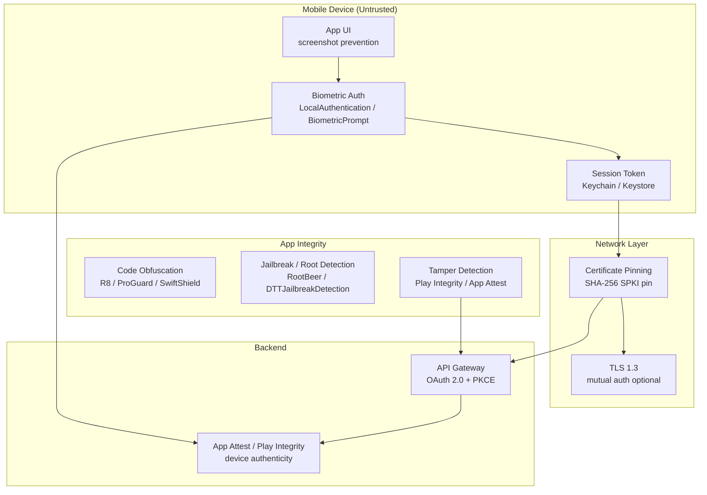

# Mobile Security

## Category

Security, Mobile, OWASP MASVS, iOS, Android, Certificate Pinning

## Context

**Mobile security** addresses the unique threat model of iOS and Android applications — where the device is in the hands of the user (or attacker), the binary is publicly distributable, network traffic is inspectable, and the OS is potentially rooted/jailbroken. Mobile applications handle sensitive data (biometrics, payment cards, session tokens) on a device that may be shared, stolen, or compromised.

The **OWASP Mobile Application Security Verification Standard (MASVS)** is the authoritative framework, with two levels:
- **MASVS-L1** — Standard security; required for all apps
- **MASVS-L2** — Defence in depth; required for banking, healthcare, payment apps

### OWASP MASVS Controls (2024)

| Domain | Control | L1 | L2 |
|--------|---------|----|----|
| **Storage** | No sensitive data in SharedPreferences / NSUserDefaults | ✅ | ✅ |
| **Storage** | No PII in logs | ✅ | ✅ |
| **Storage** | Sensitive data encrypted using Keychain (iOS) / Keystore (Android) | ✅ | ✅ |
| **Storage** | No sensitive data in app screenshots / backgrounding | — | ✅ |
| **Crypto** | No hardcoded keys or credentials | ✅ | ✅ |
| **Crypto** | AES-256 or ChaCha20; no DES, RC4, MD5 | ✅ | ✅ |
| **Auth** | Biometric auth uses device API (LocalAuthentication / BiometricPrompt) | ✅ | ✅ |
| **Auth** | Re-authentication required after background timeout | — | ✅ |
| **Network** | TLS 1.2+ for all network traffic | ✅ | ✅ |
| **Network** | Certificate pinning (or public key pinning) | — | ✅ |
| **Network** | No user-supplied certificates trusted | — | ✅ |
| **Platform** | Exported components minimised; intent permissions declared | ✅ | ✅ |
| **Platform** | IPC uses explicit intents; deeplinks validated | ✅ | ✅ |
| **Code** | Debug symbols stripped in release; no debug flags | ✅ | ✅ |
| **Resilience** | Root/jailbreak detection | — | ✅ |
| **Resilience** | Anti-tampering / repackaging detection | — | ✅ |
| **Resilience** | Anti-debugging | — | ✅ |

### Mobile Threat Model

| Threat | Attack | Mitigation |
|--------|--------|-----------|
| Credential theft | Malware reads SharedPreferences / NSUserDefaults | Keychain/Keystore + biometric gate |
| MitM on device | Proxy (Charles/Burp) on rooted device | Certificate pinning |
| App repackaging | Attacker signs modified APK with new key | Signature verification + Play Integrity API |
| Reverse engineering | Decompile APK/IPA to extract logic/keys | Code obfuscation (R8/ProGuard); no hardcoded keys |
| Shoulder surfing | Screen recording during sensitive ops | Screenshot prevention + field masking |
| Session hijacking | Token extracted from insecure storage | Keystore/Keychain; biometric re-auth |
| Deeplink hijacking | Third-party app registers same URL scheme | `/.well-known/apple-app-site-association` + verified app links |

---

## Pros

- **Keychain / Keystore provides hardware-backed storage**: Private keys never leave the secure enclave — cannot be extracted even on rooted devices.
- **Biometric auth ties session to device owner**: Re-authentication prevents token theft by physical access.
- **Certificate pinning defeats proxy-based MitM**: Attacker cannot intercept TLS even with a trusted CA certificate.
- **Play Integrity API / App Attest**: Cryptographic proof the app is unmodified and running on a genuine Android/iOS device.

## Cons

- **Certificate pinning causes update pain**: Every certificate rotation requires an app update — must overlap pins (serve both old and new).
- **Root/jailbreak detection is an arms race**: Detection can be bypassed by motivated attackers; it adds friction but is not a hard control.
- **Obfuscation slows but does not stop reverse engineering**: Skilled attackers with enough time will deobfuscate.
- **Multi-platform fragmentation**: iOS (Swift/ObjC + Keychain) and Android (Kotlin/Java + Keystore) have different APIs requiring separate implementations.

---

## Design Diagram



---

## Code Sample

### 1. Android — Keystore: Store and Retrieve Token

```kotlin
// Store sensitive token in Android Keystore — hardware-backed, biometric-gated
import android.security.keystore.KeyGenParameterSpec
import android.security.keystore.KeyProperties
import javax.crypto.Cipher
import javax.crypto.KeyGenerator
import javax.crypto.SecretKey
import java.security.KeyStore
import android.util.Base64

object SecureTokenStore {
    private const val KEY_ALIAS     = "payment_session_key"
    private const val KEYSTORE_TYPE = "AndroidKeyStore"
    private const val TRANSFORMATION = "AES/GCM/NoPadding"

    // Generate a hardware-backed AES-256 key (only created once)
    fun generateKey() {
        val keyStore = KeyStore.getInstance(KEYSTORE_TYPE).apply { load(null) }
        if (keyStore.containsAlias(KEY_ALIAS)) return

        val keyGenerator = KeyGenerator.getInstance(KeyProperties.KEY_ALGORITHM_AES, KEYSTORE_TYPE)
        keyGenerator.init(
            KeyGenParameterSpec.Builder(KEY_ALIAS,
                KeyProperties.PURPOSE_ENCRYPT or KeyProperties.PURPOSE_DECRYPT)
                .setBlockModes(KeyProperties.BLOCK_MODE_GCM)
                .setEncryptionPaddings(KeyProperties.ENCRYPTION_PADDING_NONE)
                .setKeySize(256)
                .setUserAuthenticationRequired(true)             // requires biometric
                .setUserAuthenticationValidityDurationSeconds(-1) // every use requires auth
                .setInvalidatedByBiometricEnrollment(true)       // invalidate if fingerprints change
                .build()
        )
        keyGenerator.generateKey()
    }

    // Encrypt token — returns base64(iv + ciphertext)
    fun encryptToken(plaintext: String, cipher: Cipher): String {
        val encrypted = cipher.doFinal(plaintext.toByteArray(Charsets.UTF_8))
        val combined  = cipher.iv + encrypted
        return Base64.encodeToString(combined, Base64.NO_WRAP)
    }

    // Decrypt token
    fun decryptToken(encoded: String, cipher: Cipher): String {
        val combined  = Base64.decode(encoded, Base64.NO_WRAP)
        val iv        = combined.sliceArray(0 until 12)
        val encrypted = combined.sliceArray(12 until combined.size)
        val decrypted = cipher.doFinal(encrypted)
        return String(decrypted, Charsets.UTF_8)
    }

    // Get cipher for encryption (call before BiometricPrompt)
    fun getEncryptCipher(): Cipher {
        val keyStore   = KeyStore.getInstance(KEYSTORE_TYPE).apply { load(null) }
        val secretKey  = keyStore.getKey(KEY_ALIAS, null) as SecretKey
        return Cipher.getInstance(TRANSFORMATION).also { it.init(Cipher.ENCRYPT_MODE, secretKey) }
    }

    fun getDecryptCipher(encodedToken: String): Cipher {
        val iv         = Base64.decode(encodedToken, Base64.NO_WRAP).sliceArray(0 until 12)
        val keyStore   = KeyStore.getInstance(KEYSTORE_TYPE).apply { load(null) }
        val secretKey  = keyStore.getKey(KEY_ALIAS, null) as SecretKey
        val spec       = javax.crypto.spec.GCMParameterSpec(128, iv)
        return Cipher.getInstance(TRANSFORMATION).also { it.init(Cipher.DECRYPT_MODE, secretKey, spec) }
    }
}

// Usage: show BiometricPrompt, then encrypt/decrypt in the callback
fun storeTokenWithBiometric(token: String, activity: FragmentActivity) {
    val cipher = SecureTokenStore.getEncryptCipher()
    val prompt = BiometricPrompt(activity, object : BiometricPrompt.AuthenticationCallback() {
        override fun onAuthenticationSucceeded(result: BiometricPrompt.AuthenticationResult) {
            val authenticatedCipher = result.cryptoObject?.cipher ?: return
            val encrypted = SecureTokenStore.encryptToken(token, authenticatedCipher)
            // Store 'encrypted' in SharedPreferences — ciphertext is safe there
            prefs.edit().putString("session_token", encrypted).apply()
        }
    })
    prompt.authenticate(
        BiometricPrompt.CryptoChallengeInfo.CryptoChallengeInfoBuilder(cipher).build(),
        BiometricManager.Authenticators.BIOMETRIC_STRONG
    )
}
```

### 2. iOS — Keychain: Biometric-Gated Token Storage

```swift
import LocalAuthentication
import Security

struct SecureTokenStore {
    static let service = "com.example.payments"
    static let account = "session_token"

    // Store token in Keychain — requires biometric to retrieve
    static func store(token: String) throws {
        guard let data = token.data(using: .utf8) else { throw KeychainError.encodingFailed }

        // Create access control — require biometrics (or device passcode) on read
        let access = SecAccessControlCreateWithFlags(
            kCFAllocatorDefault,
            kSecAttrAccessibleWhenUnlockedThisDeviceOnly,  // not backed up to iCloud
            [.biometryCurrentSet, .privateKeyUsage],        // biometry invalidated if fingerprints change
            nil
        )!

        let query: [String: Any] = [
            kSecClass as String:             kSecClassGenericPassword,
            kSecAttrService as String:       service,
            kSecAttrAccount as String:       account,
            kSecValueData as String:         data,
            kSecAttrAccessControl as String: access,
        ]

        SecItemDelete(query as CFDictionary)   // delete existing before storing new
        let status = SecItemAdd(query as CFDictionary, nil)
        guard status == errSecSuccess else { throw KeychainError.storeFailed(status) }
    }

    // Retrieve token — triggers Face ID / Touch ID prompt
    static func retrieve(prompt: String = "Authenticate to continue") throws -> String {
        let context = LAContext()
        context.localizedReason = prompt

        let query: [String: Any] = [
            kSecClass as String:            kSecClassGenericPassword,
            kSecAttrService as String:      service,
            kSecAttrAccount as String:      account,
            kSecReturnData as String:       true,
            kSecUseAuthenticationContext as String: context,
            kSecUseOperationPrompt as String: prompt,
        ]

        var result: AnyObject?
        let status = SecItemCopyMatching(query as CFDictionary, &result)
        guard status == errSecSuccess, let data = result as? Data,
              let token = String(data: data, encoding: .utf8)
        else { throw KeychainError.retrieveFailed(status) }

        return token
    }

    // Invalidate on logout
    static func delete() {
        let query: [String: Any] = [
            kSecClass as String:       kSecClassGenericPassword,
            kSecAttrService as String: service,
            kSecAttrAccount as String: account,
        ]
        SecItemDelete(query as CFDictionary)
    }
}
```

### 3. Certificate Pinning — Android OkHttp

```kotlin
import okhttp3.CertificatePinner
import okhttp3.OkHttpClient
import java.util.concurrent.TimeUnit

// SHA-256 hash of the SubjectPublicKeyInfo (SPKI) — NOT the certificate itself
// Pin multiple certificates to allow rotation overlap
// Generate pin: openssl s_client -connect api.example.com:443 | openssl x509 -pubkey -noout |
//   openssl pkey -pubin -outform der | openssl dgst -sha256 -binary | base64
val certificatePinner = CertificatePinner.Builder()
    .add(
        "api.payments.example.com",
        "sha256/AAAAAAAAAAAAAAAAAAAAAAAAAAAAAAAAAAAAAAAAAAA=",   // current cert SPKI
        "sha256/BBBBBBBBBBBBBBBBBBBBBBBBBBBBBBBBBBBBBBBBBBB="    // backup / next cert SPKI
    )
    .add(
        "*.payments.example.com",
        "sha256/AAAAAAAAAAAAAAAAAAAAAAAAAAAAAAAAAAAAAAAAAAA="
    )
    .build()

val client = OkHttpClient.Builder()
    .certificatePinner(certificatePinner)
    .connectTimeout(10, TimeUnit.SECONDS)
    .readTimeout(30, TimeUnit.SECONDS)
    // DO NOT add: .hostnameVerifier { _, _ -> true } — this defeats TLS
    .build()

// Handle pin failure gracefully — report to backend for telemetry
// A large number of pin failures from real users = certificate has been rotated
//   or an active MitM attack is underway
```

### 4. Certificate Pinning — iOS URLSession

```swift
import Foundation
import CryptoKit

class PinnedSessionDelegate: NSObject, URLSessionDelegate {
    // SHA-256 of DER-encoded SubjectPublicKeyInfo (SPKI)
    // Generate: openssl s_client -connect api.example.com:443 2>/dev/null |
    //   openssl x509 -pubkey -noout | openssl pkey -pubin -outform der |
    //   openssl dgst -sha256 -binary | base64
    private let pinnedHashes: Set<String> = [
        "AAAAAAAAAAAAAAAAAAAAAAAAAAAAAAAAAAAAAAAAAAA=",   // current
        "BBBBBBBBBBBBBBBBBBBBBBBBBBBBBBBBBBBBBBBBBBB=",   // backup
    ]

    func urlSession(
        _ session: URLSession,
        didReceive challenge: URLAuthenticationChallenge,
        completionHandler: @escaping (URLSession.AuthChallengeDisposition, URLCredential?) -> Void
    ) {
        guard challenge.protectionSpace.authenticationMethod == NSURLAuthenticationMethodServerTrust,
              let serverTrust = challenge.protectionSpace.serverTrust,
              SecTrustEvaluateWithError(serverTrust, nil)
        else {
            completionHandler(.cancelAuthenticationChallenge, nil)
            return
        }

        // Extract server certificate chain and check SPKI hash
        let certificateCount = SecTrustGetCertificateCount(serverTrust)
        for i in 0..<certificateCount {
            guard let cert = SecTrustGetCertificateAtIndex(serverTrust, i),
                  let spkiHash = extractSPKIHash(from: cert),
                  pinnedHashes.contains(spkiHash)
            else { continue }

            completionHandler(.useCredential, URLCredential(trust: serverTrust))
            return
        }

        // No pin matched — reject connection and report
        reportPinFailure(host: challenge.protectionSpace.host)
        completionHandler(.cancelAuthenticationChallenge, nil)
    }

    private func extractSPKIHash(from certificate: SecCertificate) -> String? {
        guard let publicKey = SecCertificateCopyKey(certificate),
              let keyData   = SecKeyCopyExternalRepresentation(publicKey, nil) as Data?
        else { return nil }

        let hash = SHA256.hash(data: keyData)
        return Data(hash).base64EncodedString()
    }
}
```

### 5. Android — Root Detection

```kotlin
import java.io.File

object RootDetection {
    fun isRooted(): Boolean = checkBuildTags() || checkSuBinary() || checkTestKeys() || checkMagiskPaths()

    private fun checkBuildTags(): Boolean =
        android.os.Build.TAGS?.contains("test-keys") == true

    private fun checkSuBinary(): Boolean {
        val suPaths = listOf(
            "/system/xbin/su", "/system/bin/su", "/sbin/su",
            "/data/local/xbin/su", "/data/local/bin/su", "/data/local/su",
        )
        return suPaths.any { File(it).exists() }
    }

    private fun checkTestKeys(): Boolean {
        val buildTags = android.os.Build.TAGS ?: return false
        return buildTags.contains("test-keys")
    }

    private fun checkMagiskPaths(): Boolean {
        val magiskPaths = listOf("/sbin/.magisk", "/data/adb/magisk", "/data/adb/modules")
        return magiskPaths.any { File(it).exists() }
    }
}

// Use Play Integrity API for stronger (harder to bypass) attestation
import com.google.android.play.core.integrity.IntegrityManagerFactory
import com.google.android.play.core.integrity.IntegrityTokenRequest

fun requestPlayIntegrityToken(context: android.content.Context, nonce: String) {
    val integrityManager = IntegrityManagerFactory.create(context)
    integrityManager
        .requestIntegrityToken(IntegrityTokenRequest.builder().setNonce(nonce).build())
        .addOnSuccessListener { response ->
            // Send response.token() to your backend for server-side verification
            verifyIntegrityTokenOnBackend(response.token())
        }
        .addOnFailureListener { e ->
            // Log and handle — do NOT silently fail and continue
        }
}
```

### 6. Screenshot Prevention & Background Masking

```kotlin
// Android — prevent screenshots on sensitive screens
import android.view.WindowManager

class PaymentActivity : AppCompatActivity() {
    override fun onCreate(savedInstanceState: android.os.Bundle?) {
        super.onCreate(savedInstanceState)
        // Set FLAG_SECURE on the window — prevents screenshots and screen recording
        window.setFlags(
            WindowManager.LayoutParams.FLAG_SECURE,
            WindowManager.LayoutParams.FLAG_SECURE
        )
        setContentView(R.layout.activity_payment)
    }

    // Mask sensitive UI when app goes to background (appears in app switcher)
    override fun onPause() {
        super.onPause()
        window.addFlags(WindowManager.LayoutParams.FLAG_SECURE)
    }

    override fun onResume() {
        super.onResume()
        // Re-require biometric if returning from background after > 5 minutes
        val lastActiveTime = prefs.getLong("last_active", 0L)
        if (System.currentTimeMillis() - lastActiveTime > 5 * 60 * 1000) {
            requireBiometricReauth()
        }
    }
}
```

```swift
// iOS — mask sensitive content when app enters background
class SceneDelegate: UIResponder, UIWindowSceneDelegate {
    var blurView: UIVisualEffectView?

    func sceneWillResignActive(_ scene: UIScene) {
        // Add blur overlay — hides content in app switcher
        guard let window = window else { return }
        let blur = UIVisualEffectView(effect: UIBlurEffect(style: .systemMaterial))
        blur.frame = window.bounds
        blur.autoresizingMask = [.flexibleWidth, .flexibleHeight]
        window.addSubview(blur)
        blurView = blur
    }

    func sceneDidBecomeActive(_ scene: UIScene) {
        blurView?.removeFromSuperview()
        blurView = nil
    }
}
```

### 7. Secure Deep Link Validation

```kotlin
// Android — validate deep links to prevent hijacking
// AndroidManifest.xml should use autoVerify=true for App Links (HTTPS)

// In your Activity/Fragment:
fun handleDeepLink(intent: android.content.Intent) {
    val uri = intent.data ?: return

    // Only allow known schemes and hosts — reject anything unexpected
    val allowedHosts = setOf("payments.example.com", "app.example.com")
    val allowedPaths = setOf("/payment/confirm", "/payment/callback", "/auth/callback")

    if (uri.scheme != "https") {
        android.util.Log.w("DeepLink", "Rejected non-HTTPS deep link: $uri")
        return
    }

    if (uri.host !in allowedHosts) {
        android.util.Log.w("DeepLink", "Rejected untrusted host: ${uri.host}")
        return
    }

    if (uri.path !in allowedPaths) {
        android.util.Log.w("DeepLink", "Rejected unknown path: ${uri.path}")
        return
    }

    // Validate any parameters — never trust raw query params
    val paymentId = uri.getQueryParameter("payment_id")
    if (paymentId == null || !paymentId.matches(Regex("^pay_[a-z0-9]{16}$"))) {
        android.util.Log.w("DeepLink", "Invalid payment_id parameter")
        return
    }

    // Proceed with validated parameters
    loadPaymentDetails(paymentId)
}
```

---

## Security Checklist

### Storage
- [ ] No tokens, passwords, or PII in SharedPreferences (Android) / NSUserDefaults (iOS)
- [ ] Sensitive data in Android Keystore or iOS Keychain with biometric gate
- [ ] No PII written to logs (`android.util.Log` / `NSLog` / `print`)
- [ ] No sensitive data in crash reports (Crashlytics / Firebase Crashlytics — PII filtering enabled)

### Authentication
- [ ] Biometric re-authentication required after background timeout (5–15 min)
- [ ] Session token invalidated on logout — deleted from Keychain/Keystore
- [ ] Play Integrity API (Android) / App Attest (iOS) used for high-value operations

### Network
- [ ] TLS 1.2+ enforced; no HTTP allowed (App Transport Security / Network Security Config)
- [ ] Certificate pinning on all API endpoints with backup pins
- [ ] Certificate rotation plan: overlap old and new pin for at least 30 days

### Application Integrity
- [ ] Release builds: debuggable=false, minifyEnabled=true (Android); no DEBUG scheme / debug symbols stripped (iOS)
- [ ] No hardcoded API keys, secrets, or credentials in source code
- [ ] R8/ProGuard obfuscation (Android) / SwiftShield (iOS) enabled for release
- [ ] Root/jailbreak detection for high-risk flows (banking, payments)

### Platform
- [ ] Screenshot prevention (`FLAG_SECURE`) on sensitive screens
- [ ] Background content masked (blur overlay) on app pause
- [ ] Deep links validated (App Links / Universal Links only — no custom URL schemes for auth flows)
- [ ] Exported components minimised in AndroidManifest.xml

---

## References

- [OWASP MASVS — Mobile Application Security Verification Standard](https://mas.owasp.org/MASVS/)
- [OWASP MASTG — Mobile Application Security Testing Guide](https://mas.owasp.org/MASTG/)
- [Android Security — Best Practices](https://developer.android.com/privacy-and-security/security-tips)
- [Apple — Protecting User Privacy](https://developer.apple.com/documentation/security)
- [Play Integrity API](https://developer.android.com/google/play/integrity)
- [Apple App Attest](https://developer.apple.com/documentation/devicecheck/establishing_your_app_s_integrity)
- [TrustKit — Certificate Pinning for iOS and macOS](https://github.com/datatheorem/TrustKit)
- [RootBeer — Android root detection](https://github.com/scottyab/rootbeer)
