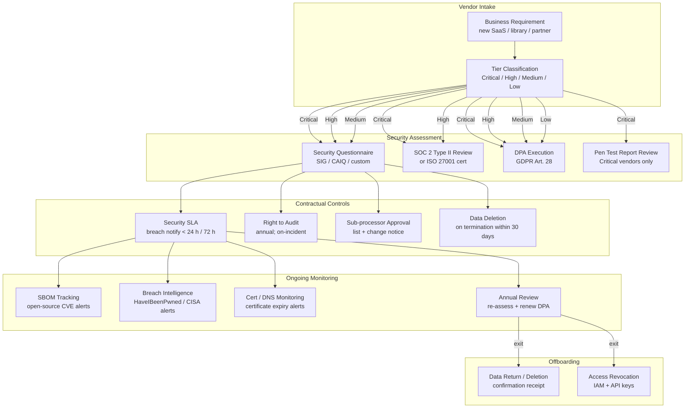

# Third-Party & Vendor Risk Management

## Category

Security, Vendor Risk, Supply Chain, DPA, SOC 2, Third-Party Security

## Context

**Third-party and vendor risk management** governs the security posture of external parties that your organisation relies on — SaaS tools, API providers, open-source libraries, cloud infrastructure, managed services, and outsourced processing. In financial services, a single vendor breach can cascade into a regulatory incident, data exposure, or service outage that affects your customers.

Modern software systems depend on hundreds of third parties. Without systematic assessment and ongoing monitoring, each one is an untested extension of your attack surface.

### Risk Taxonomy

| Category | Examples | Primary Risk |
|----------|---------|-------------|
| **SaaS Processors** | Salesforce, Workday, data analytics platforms | Data processing outside your perimeter |
| **Cloud Providers** | AWS, Azure, GCP | Shared-responsibility model gaps, region outages |
| **Payment / Financial** | Card schemes, open banking APIs, PSPs | PCI-DSS scope, regulatory notification chains |
| **Identity Providers** | Okta, Auth0, Azure AD | Total authentication dependency |
| **CDN / DNS** | Cloudflare, Akamai, Route 53 | Availability; BGP hijack; certificate authority |
| **Communication** | Twilio, SendGrid, Vonage | OTP delivery risk; SMISHING relay |
| **Open Source Libraries** | npm, PyPI, Maven | Dependency confusion, malicious packages, CVEs |
| **Managed Code / AI** | OpenAI, Anthropic, AWS Bedrock | Data sent to external model; prompt injection |
| **Outsourced Development** | SI partners, offshore teams | Code injection, credential theft, insider threat |
| **Physical / Logistics** | Data centres, hardware vendors | Hardware supply chain tampering |

### Vendor Tier Model

| Tier | Criteria | Assessment Depth | Review Frequency |
|------|----------|-----------------|-----------------|
| **Critical** | Processes personal/financial data; single point of failure | Full audit: SOC 2 Type II, DPA, pen test report, questionnaire | Annual + on-change |
| **High** | Has network access to production systems; processes non-sensitive data | SOC 2 or ISO 27001 review + questionnaire | Annual |
| **Medium** | SaaS tool with no production access; staff-only data | Security questionnaire + DPA if personal data | Every 2 years |
| **Low** | No access to company or customer data; productivity tools | Vendor self-certification | At onboarding |

---

## Pros

- **Extends your security controls to third parties**: Contractual obligations and technical controls prevent vendors from becoming weak links.
- **Regulatory compliance**: GDPR Art. 28 (processor DPA), PCI-DSS Req. 12.8, DORA Art. 28–30 all mandate third-party oversight programs.
- **Early warning**: Continuous monitoring (breach notification SLAs, CVE feeds, SBOM tracking) surfaces vendor compromises before they become your incidents.

## Cons

- **Assessment fatigue**: Large vendor inventories are expensive to assess thoroughly — prioritisation (tier model) is essential.
- **Questionnaire theatre**: Self-attested questionnaires are only as reliable as the vendor's honesty — pair with independent evidence (SOC 2 report, pen test summary).
- **Right-to-audit clauses**: Vendors often resist or negotiate away audit rights — ensure contractual requirements are set before onboarding, not after.

---

## Design Diagram



---

## Code Sample

### 1. Vendor Inventory & Tier Classification Schema

```typescript
// vendor-registry.ts — canonical source of truth for all third-party vendors

import { z } from 'zod';

export const VendorTier = z.enum(['critical', 'high', 'medium', 'low']);
export type VendorTier = z.infer<typeof VendorTier>;

export const VendorSchema = z.object({
  id:             z.string().uuid(),
  name:           z.string(),
  tier:           VendorTier,
  dataCategories: z.array(z.enum([
    'personal', 'financial', 'health', 'credentials', 'analytics', 'none',
  ])),
  processingLocation: z.array(z.enum(['EU', 'UK', 'US', 'APAC', 'global'])),
  certifications:    z.array(z.enum(['SOC2T2', 'ISO27001', 'PCI-DSS', 'CSA-STAR', 'FedRAMP'])),
  dpaExecuted:       z.boolean(),
  dpaExpiryDate:     z.string().datetime().nullable(),
  lastAssessedDate:  z.string().datetime(),
  nextReviewDate:    z.string().datetime(),
  breachNotifySlaHours: z.number().int().min(0),  // hours to notify you of a breach
  contacts:          z.object({
    security: z.string().email(),
    legal:    z.string().email(),
  }),
  subProcessors: z.array(z.string()),  // list of approved sub-processors
});

export type Vendor = z.infer<typeof VendorSchema>;

// Determine tier based on risk factors
export function classifyVendorTier(criteria: {
  processesPII:         boolean;
  processesFinancialData: boolean;
  hasProductionAccess:  boolean;
  isSinglePointOfFailure: boolean;
  hasEmployeeDataOnly:  boolean;
}): VendorTier {
  const { processesPII, processesFinancialData, hasProductionAccess, isSinglePointOfFailure } = criteria;

  if (processesFinancialData || (processesPII && hasProductionAccess) || isSinglePointOfFailure) {
    return 'critical';
  }
  if (processesPII || hasProductionAccess) {
    return 'high';
  }
  if (criteria.hasEmployeeDataOnly) {
    return 'medium';
  }
  return 'low';
}
```

### 2. Vendor Security Questionnaire Evaluation

```typescript
// Score a completed vendor security questionnaire
// Based on the SIG (Standardised Information Gathering) questionnaire model

interface QuestionnaireResponse {
  vendorId: string;
  answers:  Record<string, boolean | string | string[]>;
}

interface QuestionnaireResult {
  score:    number;   // 0–100
  findings: Finding[];
  pass:     boolean;
}

interface Finding {
  severity: 'critical' | 'high' | 'medium' | 'low';
  control:  string;
  issue:    string;
}

function evaluateQuestionnaire(response: QuestionnaireResponse): QuestionnaireResult {
  const findings: Finding[] = [];
  let score = 100;

  const a = response.answers;

  // Critical controls — automatic fail
  if (!a['uses_mfa_for_admin'])      findings.push({ severity: 'critical', control: 'AC-2',  issue: 'No MFA for administrative access' });
  if (!a['data_encrypted_at_rest'])  findings.push({ severity: 'critical', control: 'SC-28', issue: 'Customer data not encrypted at rest' });
  if (!a['data_encrypted_in_transit']) findings.push({ severity: 'critical', control: 'SC-8',  issue: 'Data not encrypted in transit' });
  if (!a['security_incident_response_plan']) findings.push({ severity: 'critical', control: 'IR-1', issue: 'No documented incident response plan' });

  // High severity — score deductions
  if (!a['penetration_testing_annual']) { score -= 15; findings.push({ severity: 'high', control: 'CA-8', issue: 'No annual penetration testing' }); }
  if (!a['vulnerability_management_program']) { score -= 10; findings.push({ severity: 'high', control: 'RA-5', issue: 'No vulnerability management program' }); }
  if (!a['background_checks_staff']) { score -= 10; findings.push({ severity: 'high', control: 'PS-3', issue: 'No employee background screening' }); }
  if (!a['soc2_or_iso27001_certified']) { score -= 15; findings.push({ severity: 'high', control: 'CA-1', issue: 'No independent security certification' }); }

  // Medium severity
  if (!a['security_awareness_training']) { score -= 5; findings.push({ severity: 'medium', control: 'AT-2', issue: 'No security awareness training program' }); }
  if (!a['data_retention_policy']) { score -= 5; findings.push({ severity: 'medium', control: 'MP-6', issue: 'No documented data retention policy' }); }

  const criticalCount = findings.filter(f => f.severity === 'critical').length;

  return {
    score: Math.max(0, score),
    findings,
    pass: criticalCount === 0 && score >= 70,
  };
}
```

### 3. Data Processing Agreement (DPA) — Key Clauses Checklist

```typescript
// Validate that a DPA covers all required clauses before vendor onboarding
// Maps to GDPR Article 28 requirements

interface DPAClause {
  id:          string;
  requirement: string;
  required:    'mandatory' | 'recommended';
  gdprRef:     string;
}

const REQUIRED_DPA_CLAUSES: DPAClause[] = [
  { id: 'purpose_limitation',    requirement: 'Process data only on documented, lawful instructions',       required: 'mandatory', gdprRef: 'Art. 28(3)(a)' },
  { id: 'confidentiality',       requirement: 'Staff with data access bound by confidentiality obligations', required: 'mandatory', gdprRef: 'Art. 28(3)(b)' },
  { id: 'security_measures',     requirement: 'Implement appropriate technical and organisational measures', required: 'mandatory', gdprRef: 'Art. 28(3)(c)' },
  { id: 'subprocessor_approval', requirement: 'Prior written consent required before engaging sub-processors',required: 'mandatory', gdprRef: 'Art. 28(2)+(3)(d)' },
  { id: 'data_subject_rights',   requirement: 'Assist with data subject rights (access, erasure, portability)', required: 'mandatory', gdprRef: 'Art. 28(3)(e)' },
  { id: 'deletion_on_termination', requirement: 'Delete or return all personal data on termination within 30 days', required: 'mandatory', gdprRef: 'Art. 28(3)(g)' },
  { id: 'audit_rights',          requirement: 'Right to audit or commission audits of processor',            required: 'mandatory', gdprRef: 'Art. 28(3)(h)' },
  { id: 'breach_notification',   requirement: 'Notify controller within 24 h of becoming aware of breach',  required: 'mandatory', gdprRef: 'Art. 33(2)' },
  { id: 'international_transfers', requirement: 'Standard Contractual Clauses (SCCs) for data outside EEA', required: 'mandatory', gdprRef: 'Art. 46' },
  { id: 'liability',             requirement: 'Processor liable for damages caused by non-compliance',       required: 'mandatory', gdprRef: 'Art. 82' },
  { id: 'record_keeping',        requirement: 'Maintain records of processing activities',                   required: 'recommended', gdprRef: 'Art. 30' },
  { id: 'dpia_assistance',       requirement: 'Assist with Data Protection Impact Assessments',              required: 'recommended', gdprRef: 'Art. 35' },
];

interface DPAReview {
  vendorId:       string;
  clauses:        Record<string, boolean>;  // clauseId → present/absent
}

function validateDPA(review: DPAReview): { valid: boolean; missingMandatory: string[] } {
  const missingMandatory = REQUIRED_DPA_CLAUSES
    .filter(clause => clause.required === 'mandatory' && !review.clauses[clause.id])
    .map(clause => `${clause.id} (${clause.gdprRef}): ${clause.requirement}`);

  return { valid: missingMandatory.length === 0, missingMandatory };
}
```

### 4. SBOM Generation & CVE Monitoring for Open-Source Dependencies

```yaml
# .github/workflows/sbom-and-cve-scan.yml
# Generate SBOM on every release + continuously monitor for new CVEs in dependencies

name: SBOM Generation & Vulnerability Monitoring

on:
  push:
    branches: [main]
  schedule:
    - cron: '0 6 * * 1'   # Every Monday 06:00 UTC — catch new CVEs published over the week
  release:
    types: [published]

jobs:
  sbom-generate:
    name: Generate SBOM
    runs-on: ubuntu-latest
    steps:
      - uses: actions/checkout@v4

      - name: Generate SBOM (CycloneDX)
        uses: CycloneDX/gh-node-module-generatebom@master
        with:
          output: ./sbom.xml

      - name: Upload SBOM as artifact
        uses: actions/upload-artifact@v4
        with:
          name: sbom-cyclonedx
          path: sbom.xml
          retention-days: 90

      - name: Attest SBOM (signed provenance)
        uses: actions/attest-build-provenance@v1
        with:
          subject-path: sbom.xml

  dependency-cve-scan:
    name: CVE Vulnerability Scan
    runs-on: ubuntu-latest
    steps:
      - uses: actions/checkout@v4

      - name: Scan with OSV-Scanner (Google Open Source Vulnerabilities)
        uses: google/osv-scanner-action@v1
        with:
          scan-args: |
            --recursive
            --format json
            --output osv-results.json
            .

      - name: Fail on critical CVEs
        run: |
          CRITICAL=$(jq '[.results[].packages[].vulnerabilities[]
            | select(.database_specific.severity == "CRITICAL")] | length' osv-results.json)
          if [ "$CRITICAL" -gt 0 ]; then
            echo "::error::$CRITICAL critical CVEs found in dependencies"
            exit 1
          fi

      - name: Notify security team on high severity findings
        if: failure()
        uses: slackapi/slack-github-action@v1
        with:
          payload: |
            {
              "text": "🚨 Dependency CVE scan: critical vulnerabilities found in ${{ github.repository }}",
              "attachments": [{
                "color": "danger",
                "text": "Review osv-results.json in GitHub Actions artifacts."
              }]
            }
        env:
          SLACK_WEBHOOK_URL: ${{ secrets.SECURITY_SLACK_WEBHOOK }}
```

### 5. Vendor Breach Notification Automation

```typescript
// Automate vendor breach notification intake and escalation
// Vendors notify via a dedicated security endpoint

import { z } from 'zod';
import type { Request, Response } from 'express';

const BreachNotificationSchema = z.object({
  vendorId:         z.string().uuid(),
  incidentId:       z.string(),
  severity:         z.enum(['critical', 'high', 'medium', 'low']),
  discoveredAt:     z.string().datetime(),
  dataCategories:   z.array(z.enum(['personal', 'financial', 'credentials', 'none'])),
  estimatedRecords: z.number().int().nonnegative().nullable(),
  description:      z.string().max(2000),
  mitigationSteps:  z.string().max(2000),
  contactEmail:     z.string().email(),
});

type BreachNotification = z.infer<typeof BreachNotificationSchema>;

async function handleVendorBreachNotification(req: Request, res: Response): Promise<void> {
  // Authenticate vendor using pre-shared API key — stored in secrets manager
  const apiKey = req.headers['x-vendor-api-key'];
  const vendor  = await db.vendors.findByApiKey(apiKey as string);
  if (!vendor) {
    res.status(401).json({ error: 'Unauthorised' });
    return;
  }

  const parsed = BreachNotificationSchema.safeParse(req.body);
  if (!parsed.success) {
    res.status(400).json({ error: 'Invalid notification payload', details: parsed.error.format() });
    return;
  }

  const notification: BreachNotification = parsed.data;
  const receivedAt = new Date();
  const hoursElapsed = (receivedAt.getTime() - new Date(notification.discoveredAt).getTime()) / 3_600_000;

  // Audit trail
  await db.vendorBreaches.insert({
    ...notification,
    receivedAt:    receivedAt.toISOString(),
    hoursToNotify: hoursElapsed,
    vendorName:    vendor.name,
  });

  // Check SLA compliance
  const slaHours = vendor.breachNotifySlaHours ?? 24;
  const slaBreach = hoursElapsed > slaHours;

  if (slaBreach) {
    await alerting.notify('vendor-breach-sla-missed', {
      vendorName: vendor.name,
      hoursElapsed: Math.round(hoursElapsed),
      slaHours,
    });
  }

  // Escalate based on severity and data categories
  const personalDataInvolved = notification.dataCategories.includes('personal');
  const financialDataInvolved = notification.dataCategories.includes('financial');

  if (notification.severity === 'critical' || financialDataInvolved) {
    await escalate({
      to:      ['ciso@example.com', 'dpo@example.com', 'legal@example.com'],
      subject: `[URGENT] Vendor breach: ${vendor.name}`,
      body:    formatBreachSummary(notification, vendor, hoursElapsed),
    });

    // GDPR 72-hour clock starts — create tracking ticket
    if (personalDataInvolved) {
      await createGDPRNotificationTicket(notification, vendor, receivedAt);
    }
  }

  res.status(202).json({ received: true, incidentReference: `VB-${Date.now()}` });
}
```

### 6. Continuous Vendor Security Monitoring

```typescript
// Periodically re-check vendor health signals — certificate expiry, breach feeds
import nodeFetch from 'node-fetch';
import tls from 'tls';

interface VendorHealthCheck {
  vendorId:              string;
  domain:                string;
  certExpiryDays:        number | null;
  breachIntelHit:        boolean;
  dnssecEnabled:         boolean;
}

async function checkVendorCertificate(domain: string): Promise<number | null> {
  return new Promise((resolve) => {
    const socket = tls.connect(443, domain, { servername: domain }, () => {
      const cert = socket.getPeerCertificate();
      socket.destroy();
      if (!cert?.valid_to) { resolve(null); return; }
      const expiryMs    = new Date(cert.valid_to).getTime() - Date.now();
      const expiryDays  = Math.floor(expiryMs / 86_400_000);
      resolve(expiryDays);
    });
    socket.on('error', () => resolve(null));
  });
}

async function checkHaveIBeenPwned(domain: string, apiKey: string): Promise<boolean> {
  // Check if the vendor domain appears in HIBP breach database
  const res = await nodeFetch(
    `https://haveibeenpwned.com/api/v3/breacheddomain/${encodeURIComponent(domain)}`,
    { headers: { 'hibp-api-key': apiKey, 'user-agent': 'VendorMonitor/1.0' } }
  );
  return res.status === 200;   // 200 = domain found in breaches; 404 = clean
}

async function runVendorHealthChecks(vendors: Array<{ id: string; domain: string }>): Promise<void> {
  const hibpApiKey = await secretsManager.getSecret('hibp-api-key');

  for (const vendor of vendors) {
    const certExpiryDays = await checkVendorCertificate(vendor.domain);
    const breachIntelHit = await checkHaveIBeenPwned(vendor.domain, hibpApiKey);

    // Alert on certificate approaching expiry
    if (certExpiryDays !== null && certExpiryDays < 30) {
      await alerting.notify('vendor-cert-expiring', {
        vendorId: vendor.id,
        domain: vendor.domain,
        daysRemaining: certExpiryDays,
      });
    }

    // Alert on breach intelligence hit
    if (breachIntelHit) {
      await alerting.notify('vendor-breach-intel-hit', {
        vendorId: vendor.id,
        domain: vendor.domain,
      });
    }

    await db.vendorHealthChecks.upsert({
      vendorId: vendor.id,
      checkedAt: new Date().toISOString(),
      certExpiryDays,
      breachIntelHit,
    });
  }
}
```

---

## Regulatory Requirements

| Regulation | Third-Party Requirement | Key Obligation |
|-----------|------------------------|----------------|
| **GDPR** | Art. 28 | Processor DPA required for all vendors processing personal data |
| **PCI-DSS v4** | Req. 12.8 | Inventory, assess, and annually review all third parties in card data scope |
| **DORA (EU)** | Art. 28–30 | ICT third-party risk management; contractual requirements for critical ICT services |
| **UK FCA PS21/3** | SS2/21 | Operational resilience — outsourcing and third-party risk included |
| **NIS2 Directive** | Art. 21(2)(d) | Supply chain security — manage risks posed by suppliers and service providers |
| **ISO 27001:2022** | A.5.19–5.22 | Information security in supplier relationships; supplier agreements; monitoring |

---

## Security Checklist

### Vendor Onboarding
- [ ] Vendor classified into risk tier (Critical / High / Medium / Low)
- [ ] Security questionnaire completed and scored (≥70 required; no critical findings)
- [ ] SOC 2 Type II report reviewed (for Critical/High vendors)
- [ ] DPA executed and all mandatory clauses present (GDPR Art. 28)
- [ ] Sub-processor list reviewed and approved
- [ ] Breach notification SLA contractually defined (≤24 h for Critical vendors)
- [ ] Right-to-audit clause included in contract
- [ ] Data deletion on termination (within 30 days) contractually required
- [ ] Vendor added to vendor registry with review date set

### Ongoing Monitoring
- [ ] Annual review scheduled for Critical and High tier vendors
- [ ] SBOM generated for all open-source dependencies; CVE monitoring active
- [ ] Certificate expiry monitoring active for all vendor domains
- [ ] Breach intelligence feed monitoring configured
- [ ] Vendor API keys scoped to minimum required permissions; rotated annually

### Offboarding
- [ ] All vendor API keys and credentials revoked on contract termination
- [ ] Data deletion confirmation received in writing within contractual deadline
- [ ] Vendor removed from all access control lists and IAM policies
- [ ] Offboarding documented in vendor registry

---

## References

- [GDPR Article 28 — Processor](https://gdpr-info.eu/art-28-gdpr/)
- [PCI-DSS v4.0 — Requirement 12.8 (Third-Party Risk)](https://www.pcisecuritystandards.org/)
- [DORA — Digital Operational Resilience Act (EU 2022/2554)](https://www.eba.europa.eu/regulation-and-policy/digital-operational-resilience-act-dora)
- [NIST SP 800-161 — Cybersecurity Supply Chain Risk Management](https://csrc.nist.gov/publications/detail/sp/800-161/rev-1/final)
- [CycloneDX — SBOM Standard](https://cyclonedx.org/)
- [OSV-Scanner — Open Source Vulnerability Scanner](https://github.com/google/osv-scanner)
- [CAIQ — Consensus Assessments Initiative Questionnaire (CSA)](https://cloudsecurityalliance.org/research/cloud-controls-matrix/)
- [SIG — Standardised Information Gathering (Shared Assessments)](https://sharedassessments.org/sig/)
- [HaveIBeenPwned — Breach intelligence API](https://haveibeenpwned.com/API/v3)
