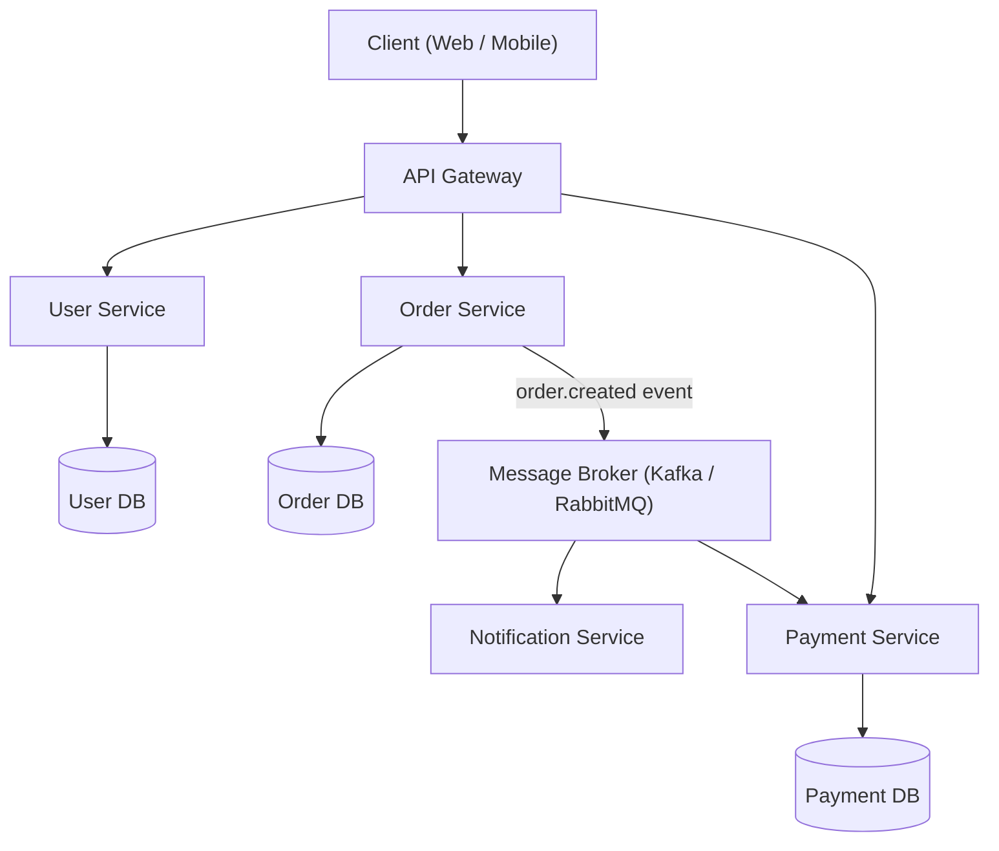

# Microservices Architecture

## Category

Architectural, Scalability, Maintainability

## Context

Microservices is an architectural style that structures an application as a collection of small, independently deployable services. Each service is self-contained, focuses on a single business capability, owns its data, and communicates with other services via well-defined APIs (typically REST, gRPC, or messaging queues).

This pattern emerged as an alternative to monolithic architectures to address problems of large-scale systems that need to be maintained and deployed frequently by independent teams.

---

## Pros

- **Independent deployability**: Each service can be deployed, updated, scaled, and restarted independently without affecting other services.
- **Technology heterogeneity**: Different services can use different programming languages, frameworks, and databases best suited for their needs.
- **Fault isolation**: A failure in one service does not cascade to bring down the entire system.
- **Team autonomy**: Small, cross-functional teams can own and operate individual services independently.
- **Scalability**: Individual services can be scaled horizontally based on demand.
- **Easier maintenance**: Smaller codebases are easier to understand, test, and modify.

---

## Cons

- **Distributed system complexity**: Network latency, partial failures, and data consistency across services add significant complexity.
- **Operational overhead**: Requires robust infrastructure—container orchestration (Kubernetes), service discovery, distributed tracing, centralized logging.
- **Inter-service communication**: Services must handle network failures, retries, and timeouts.
- **Data management**: Each service owns its own database, making joins and cross-service transactions harder.
- **Testing complexity**: Integration and end-to-end testing across multiple services is more difficult.
- **Latency**: Network calls between services are slower than in-process calls.

---

## Design Diagram



---

## Code Sample

### Service A — Order Service (Node.js / Express)

```javascript
// order-service/src/index.js
const express = require("express");
const { Kafka } = require("kafkajs");
const app = express();
app.use(express.json());

const kafka = new Kafka({ brokers: ["kafka:9092"] });
const producer = kafka.producer();

app.post("/orders", async (req, res) => {
  const order = { id: Date.now(), ...req.body, status: "PENDING" };
  // Persist to Order DB (omitted for brevity)
  await producer.send({
    topic: "order.created",
    messages: [{ value: JSON.stringify(order) }],
  });
  res.status(201).json(order);
});

(async () => {
  await producer.connect();
  app.listen(3001, () => console.log("Order Service running on port 3001"));
})();
```

### Service B — Notification Service (Node.js)

```javascript
// notification-service/src/index.js
const { Kafka } = require("kafkajs");

const kafka = new Kafka({ brokers: ["kafka:9092"] });
const consumer = kafka.consumer({ groupId: "notification-group" });

(async () => {
  await consumer.connect();
  await consumer.subscribe({ topic: "order.created", fromBeginning: false });
  await consumer.run({
    eachMessage: async ({ message }) => {
      const order = JSON.parse(message.value.toString());
      console.log(`Sending notification for order: ${order.id}`);
      // Send email / push notification
    },
  });
})();
```

### Docker Compose Skeleton

```yaml
version: "3.8"
services:
  order-service:
    build: ./order-service
    ports: ["3001:3001"]
    environment:
      - KAFKA_BROKER=kafka:9092

  notification-service:
    build: ./notification-service
    environment:
      - KAFKA_BROKER=kafka:9092

  kafka:
    image: confluentinc/cp-kafka:7.5.0
    ports: ["9092:9092"]
```
