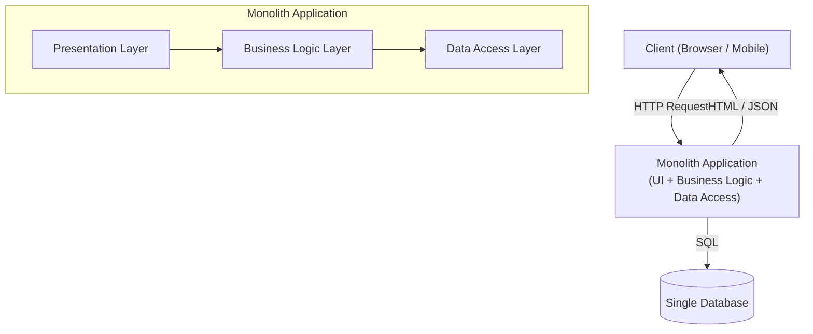

# Monolithic Architecture

## Category
Architectural, Simplicity

## Context

A monolithic architecture packages all application components — UI, business logic, and data access — into a single deployable unit. All modules share the same process and address space, communicating via direct function calls.

Monoliths are the natural starting point for most applications and remain a valid choice for small-to-medium applications or early-stage products where simplicity and development speed matter most.

---

## Pros

- **Simplicity**: Single codebase, single deployment unit, straightforward debugging and testing.
- **Developer experience**: No network overhead for internal calls; easy to run locally.
- **ACID transactions**: All database operations happen in a single transaction context.
- **Performance**: In-process calls are orders of magnitude faster than network calls.
- **Tooling maturity**: Traditional IDE debugging, profiling, and testing tools work seamlessly.
- **Low operational overhead**: One service to deploy, monitor, and maintain.

---

## Cons

- **Scalability limits**: The entire application must be scaled even if only one component is under load.
- **Deployment risk**: Any change requires redeploying the whole application.
- **Technology lock-in**: Committed to one language and framework across the entire system.
- **Growing complexity**: As the application grows, the codebase becomes harder to understand (the "big ball of mud").
- **Team coupling**: Multiple teams working on the same codebase create merge conflicts and coordination overhead.
- **Long build/test cycles**: A large application takes longer to build, test, and deploy.

---

## Design Diagram



---

## Code Sample

### Monolithic Express Application (Node.js)

```typescript
// app.ts — single entry point for the entire application
import express from 'express';
import { Pool } from 'pg';

const app = express();
app.use(express.json());

const db = new Pool({ connectionString: process.env.DATABASE_URL });

interface OrderBody { userId: number; items: Array<{ productId: number; qty: number }>; }
interface PaymentBody { orderId: number; amount: number; }

// --- User Module ---
app.get('/users/:id', async (req, res) => {
  const { rows } = await db.query('SELECT * FROM users WHERE id = $1', [req.params.id]);
  res.json(rows[0] ?? { error: 'Not found' });
});

// --- Order Module ---
app.post('/orders', async (req, res) => {
  const { userId, items } = req.body as OrderBody;
  const client = await db.connect();
  try {
    await client.query('BEGIN');
    const { rows } = await client.query(
      'INSERT INTO orders (user_id, status) VALUES ($1, $2) RETURNING id',
      [userId, 'PENDING'],
    );
    const orderId: number = rows[0].id;
    for (const item of items) {
      await client.query(
        'INSERT INTO order_items (order_id, product_id, qty) VALUES ($1, $2, $3)',
        [orderId, item.productId, item.qty],
      );
    }
    await client.query('COMMIT');
    res.status(201).json({ orderId });
  } catch (err) {
    await client.query('ROLLBACK');
    res.status(500).json({ error: (err as Error).message });
  } finally {
    client.release();
  }
});

// --- Payment Module ---
app.post('/payments', async (req, res) => {
  const { orderId, amount } = req.body as PaymentBody;
  await db.query(
    'INSERT INTO payments (order_id, amount, status) VALUES ($1, $2, $3)',
    [orderId, amount, 'COMPLETED'],
  );
  res.status(201).json({ message: 'Payment recorded' });
});

app.listen(3000, () => console.log('Monolith running on port 3000'));
```

### Dockerfile

```dockerfile
FROM node:20-alpine
WORKDIR /app
COPY package*.json ./
RUN npm ci --production
COPY . .
EXPOSE 3000
CMD ["node", "app.js"]
```

## Related Patterns

- [01 — Microservices](./01-microservices.md) — Decompose when the monolith becomes too complex to scale or change
- [08 — Strangler Fig](./08-strangler-fig.md) — Incremental migration path from monolith to microservices
