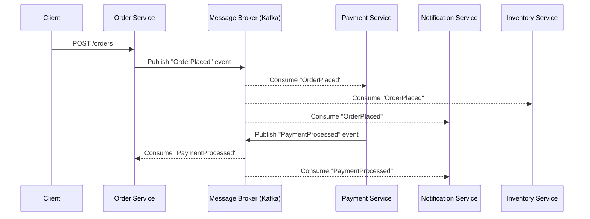

# Event-Driven Architecture (EDA)

## Category
Architectural, Scalability, Decoupling, Asynchronous

## Context

Event-Driven Architecture (EDA) is a design paradigm in which components of a system communicate by producing and consuming **events**. An event represents a significant state change (e.g., "OrderPlaced", "PaymentProcessed"). Producers emit events without knowing who will consume them; consumers subscribe to event streams and react independently.

EDA enables high decoupling, elasticity, and real-time responsiveness. It is commonly implemented using message brokers like Apache Kafka, RabbitMQ, or AWS EventBridge.

---

## Pros

- **Loose coupling**: Producers and consumers are decoupled — neither knows about each other.
- **Scalability**: Consumers can scale independently based on event backlog.
- **Resilience**: If a consumer is unavailable, events are buffered and processed when it recovers.
- **Extensibility**: New consumers can subscribe to existing events without changing producers.
- **Real-time processing**: Enables reactive, real-time data pipelines.
- **Auditability**: Event logs provide a natural audit trail.

---

## Cons

- **Eventual consistency**: The system is eventually consistent — not immediately consistent.
- **Complexity**: Harder to trace the flow of a business process across multiple events and services.
- **Debugging difficulty**: Distributed, asynchronous systems are harder to debug and observe.
- **Event schema evolution**: Changing event schemas without breaking consumers is challenging.
- **Message ordering**: Maintaining strict event ordering at scale requires careful design.
- **Duplicate events**: Consumers must be idempotent to handle event redelivery.

---

## Design Diagram



---

## Code Sample

### Producer — Order Service (Node.js / KafkaJS)

```typescript
// order-service/producer.ts
import { Kafka } from 'kafkajs';

const kafka = new Kafka({ clientId: 'order-service', brokers: ['kafka:9092'] });
const producer = kafka.producer();

interface Order { id: number; [key: string]: unknown; }

export async function publishOrderPlaced(order: Order): Promise<void> {
  await producer.connect();
  await producer.send({
    topic: 'order.placed',
    messages: [
      {
        key: String(order.id),
        value: JSON.stringify({
          eventType: 'OrderPlaced',
          timestamp: new Date().toISOString(),
          payload: order,
        }),
      },
    ],
  });
}
```

### Consumer — Payment Service (Node.js / KafkaJS)

```typescript
// payment-service/consumer.ts
import { Kafka } from 'kafkajs';

const kafka = new Kafka({ clientId: 'payment-service', brokers: ['kafka:9092'] });
const consumer = kafka.consumer({ groupId: 'payment-service-group' });

interface OrderEvent { eventType: string; payload: { id: number } }

declare function publishPaymentProcessed(orderId: number): Promise<void>;

async function startConsumer(): Promise<void> {
  await consumer.connect();
  await consumer.subscribe({ topic: 'order.placed', fromBeginning: false });

  await consumer.run({
    eachMessage: async ({ message }) => {
      const event = JSON.parse(message.value!.toString()) as OrderEvent;
      if (event.eventType === 'OrderPlaced') {
        console.log(`Processing payment for order: ${event.payload.id}`);
        await publishPaymentProcessed(event.payload.id);
      }
    },
  });
}

startConsumer().catch(console.error);
```

### Idempotent Consumer (preventing duplicate processing)

```typescript
// Idempotency guard — use Redis in production
const processedEvents = new Set<string>();

async function eachMessage({ message }: { message: { key: Buffer; value: Buffer | null } }): Promise<void> {
  const eventId = message.key.toString();
  if (processedEvents.has(eventId)) {
    console.log(`Skipping duplicate event: ${eventId}`);
    return;
  }
  processedEvents.add(eventId);
  // Process the event
}
```

## Related Patterns

- [05 — Event Sourcing](./05-event-sourcing.md) — Use the event log itself as the write model
- [04 — CQRS](./04-cqrs.md) — Events drive separate read model projections
- [17 — Publish-Subscribe](./17-publish-subscribe.md) — Fan-out transport mechanism for events
- [16 — Outbox Pattern](./16-outbox-pattern.md) — Guarantee reliable event publication
- [30 — Dead Letter Queue](./30-dead-letter-queue.md) — Handle event processing failures safely
