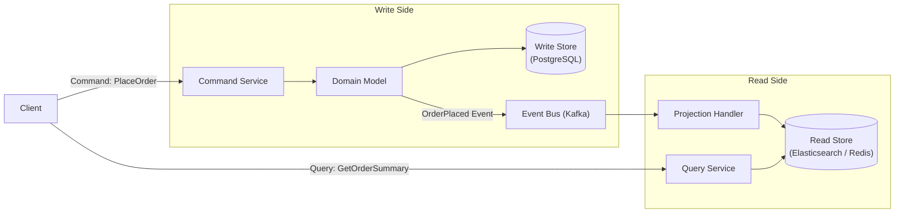

# CQRS — Command Query Responsibility Segregation

## Category
Architectural, Scalability, Performance, Data Management

## Context

CQRS separates the **write model** (Commands — actions that change state) from the **read model** (Queries — actions that return data). Instead of a single model serving both reads and writes, CQRS maintains two distinct models optimized independently.

Commands go through domain logic and write to the write store. The read side is denormalized and optimized for fast reads, typically materialized via projections fed by events. CQRS is often paired with **Event Sourcing** and **Event-Driven Architecture**.

---

## Pros

- **Independent scaling**: Read and write sides can be scaled separately based on load (reads are typically 10–100x more frequent).
- **Optimized read models**: Read models can be pre-computed, denormalized views tailored for specific queries, enabling very fast reads.
- **Separation of concerns**: Simplifies complex domain models by isolating writes (domain logic) from reads (presentation logic).
- **Supports multiple read models**: Same data can power different views (e.g., dashboard, search, reports) as separate projections.
- **Works well with Event Sourcing**: Events from the write side can be projected into multiple read stores.

---

## Cons

- **Increased complexity**: Two models to maintain, synchronize, and deploy.
- **Eventual consistency**: The read model may lag behind the write model.
- **Data duplication**: State is stored in both write and read stores.
- **More infrastructure**: Requires separate databases or at least separate schemas.
- **Learning curve**: Developers unfamiliar with CQRS often struggle with the mental model shift.
- **Overkill for simple CRUD**: Adds unnecessary complexity to simple applications.

---

## Design Diagram



---

## Code Sample

### Command Handler (TypeScript)

```typescript
// commands/place-order.command.ts
export interface PlaceOrderCommand {
  userId: string;
  items: { productId: string; quantity: number }[];
}

// handlers/place-order.handler.ts
import { PlaceOrderCommand } from '../commands/place-order.command';
import { OrderRepository } from '../repositories/order.repository';
import { EventBus } from '../events/event-bus';

export class PlaceOrderHandler {
  constructor(
    private readonly orderRepo: OrderRepository,
    private readonly eventBus: EventBus
  ) {}

  async handle(command: PlaceOrderCommand): Promise<string> {
    const order = Order.create(command.userId, command.items); // Domain logic
    await this.orderRepo.save(order);

    await this.eventBus.publish({
      type: 'OrderPlaced',
      aggregateId: order.id,
      payload: { userId: order.userId, items: order.items },
      timestamp: new Date().toISOString(),
    });

    return order.id;
  }
}
```

### Query Handler (TypeScript)

```typescript
// queries/get-order-summary.query.ts
export interface GetOrderSummaryQuery {
  orderId: string;
}

// handlers/get-order-summary.handler.ts
import { ElasticsearchClient } from '@elastic/elasticsearch';

export class GetOrderSummaryHandler {
  constructor(private readonly esClient: ElasticsearchClient) {}

  async handle(query: GetOrderSummaryQuery): Promise<OrderSummaryView> {
    const result = await this.esClient.get({
      index: 'order-summaries',
      id: query.orderId,
    });
    return result._source as OrderSummaryView;
  }
}
```

### Projection Handler (consuming events to build read model)

```typescript
// projections/order-summary.projection.ts
import { ElasticsearchClient } from '@elastic/elasticsearch';

export class OrderSummaryProjection {
  constructor(private readonly esClient: ElasticsearchClient) {}

  async onOrderPlaced(event: OrderPlacedEvent): Promise<void> {
    await this.esClient.index({
      index: 'order-summaries',
      id: event.aggregateId,
      body: {
        orderId: event.aggregateId,
        userId: event.payload.userId,
        itemCount: event.payload.items.length,
        status: 'PENDING',
        createdAt: event.timestamp,
      },
    });
  }
}
```

### Express Controller — Wiring Commands and Queries

```typescript
// routes/orders.router.ts
import express from 'express';
const router = express.Router();

router.post('/', async (req, res) => {
  const command: PlaceOrderCommand = req.body;
  const orderId = await placeOrderHandler.handle(command);
  res.status(201).json({ orderId });
});

router.get('/:id/summary', async (req, res) => {
  const summary = await getOrderSummaryHandler.handle({ orderId: req.params.id });
  res.json(summary);
});

export default router;
```
